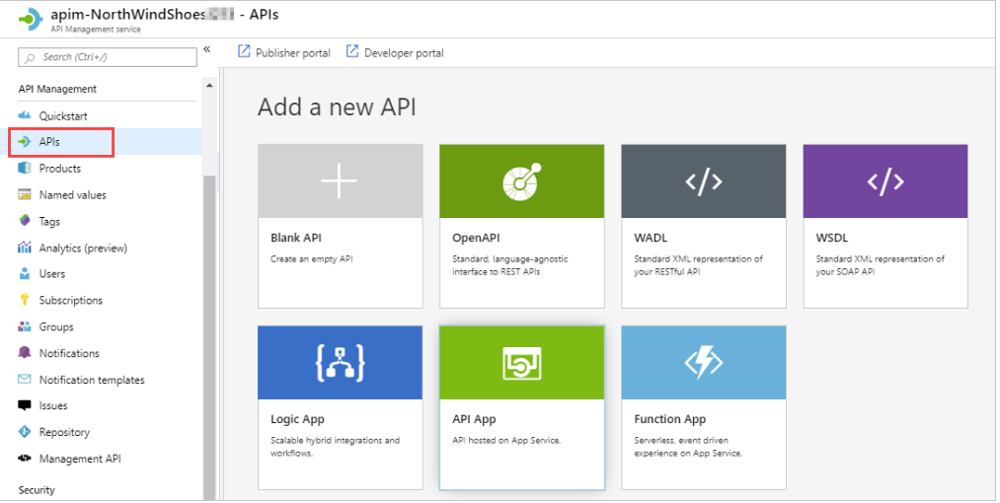
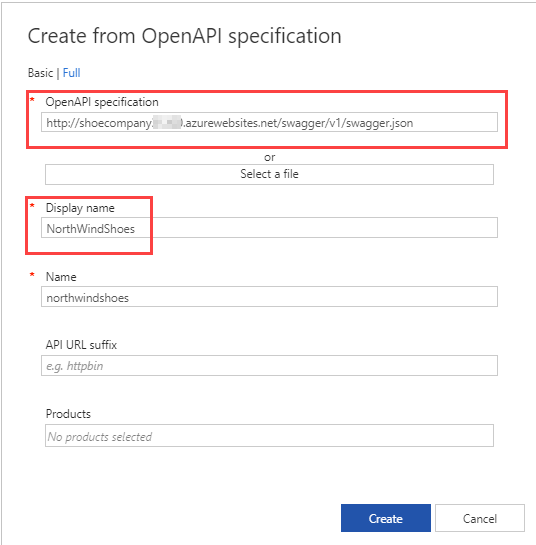
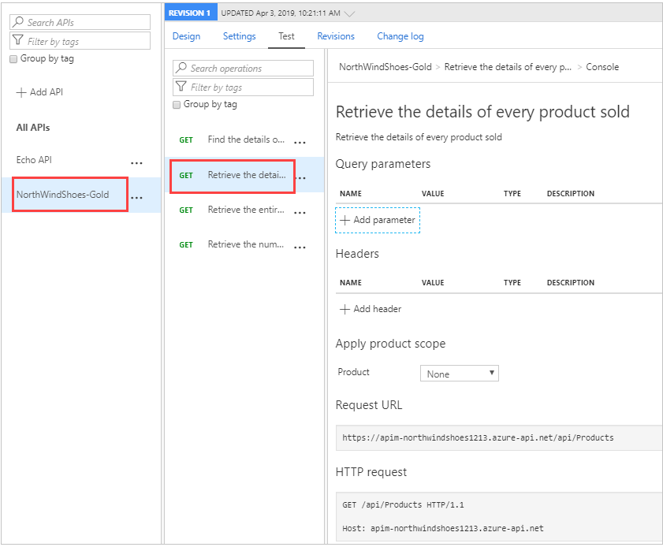
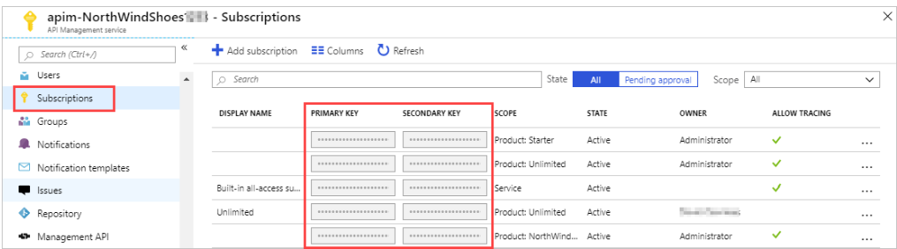

# [Publish and manage your APIs with Azure API Management](https://docs.microsoft.com/en-au/learn/modules/publish-manage-apis-with-azure-api-management/index)
- [Introduction](https://docs.microsoft.com/en-au/learn/modules/publish-manage-apis-with-azure-api-management/1-introduction/)
- [Create an API gateway](https://docs.microsoft.com/en-au/learn/modules/publish-manage-apis-with-azure-api-management/2-create-an-api-gateway/)
  - Azure API management
    - The Azure API management service is hosted in the Azure cloud and is positioned between your APIs and the Internet. An Azure API gateway is an instance of the Azure API management service.
    - An **Azure API gateway** is an instance of the **Azure API management service**.
  - Features
    - **API documentation**. Documentation of APIs enables calling clients to quickly integrate their solutions. API Management allows you to quickly expose the structure of your API to calling clients through modern standards like Open API. You can have more than one version of an API. With multiple versions, you can stage app updates as your consuming apps don't have to use the new version straight away.
    - **Rate limiting access**. If your API could potentially access a large amount of data, its a good idea to limit the rate at which clients can request data. Rate limiting helps maintain optimal response times for every client. API Management let you set rate limits as a whole or for specific individual clients.
    - **Health monitoring**.
    - **Modern formats like JSON**.
    - **Connections to any API**. In many businesses, APIs are located across different countries and use different formats. API Management lets you add all of these disparate APIs into single modern interface.
    - **Analytics**
    - **Security**. Security tools that you can use with Azure API management include OAuth 2.0 user authorization, and integration with Azure Active Directory.
  - Pricing tiers
    - Developer
    - Basic
    - Standard
    - Premium
    - Consumption
  - API management setup
    - The name you use for the gateway must be globally unique within the ***.azure-api.net** namespace.
    - Registering the API makes the API available to consumers at the <gateway>.azure-api.net endpoint.
- [Exercise - Create an API gateway](https://docs.microsoft.com/en-au/learn/modules/publish-manage-apis-with-azure-api-management/3-exercise-create-an-api-gateway/)
  -  API Management provides you with several options for importing APIs.
        |Type|	Details|
        |---|---|
        |Blank API|	You can import an API with a blank API definition. You then manually specify all the required parameters.|
        |**Open API**|	Open API is a specification that documents all the endpoints and operations for RESTful APIs, and all input and output parameters. OpenAPI was originally called **Swagger**.|
        |WADL|	Web Application Description Language is an XML description of HTTP-based web services. It is a simpler format and more lightweight than WSDL.|
        |WSDL|	Web Service Description Language is an XML description of any network service, not just HTTP.|
        |Logic App|	Logic apps are used to orchestrate and automate workflows and integrations with various data sources.|
        |API App|	An API hosted within an API app service in Azure.|
        |Function App|	Serverless code that can be called through triggers.|
    - 
    - 
    - Visualize
      - 
  - Policies
    - Policies provide powerful capabilities to change the behavior of an API through configuration. They exist as a collection of statements that are executed sequentially on the request or response of an API.
  - **Product**
    - A **product is a collection of APIs**. You can assign **APIs to more than one product**.
- [Import and publish an API](https://docs.microsoft.com/en-au/learn/modules/publish-manage-apis-with-azure-api-management/4-import-and-publish-an-api/)
- [Exercise - Import and publish an API](https://docs.microsoft.com/en-au/learn/modules/publish-manage-apis-with-azure-api-management/5-exercise-import-and-publish-an-api/)
- [Call an API with a subscription key](https://docs.microsoft.com/en-au/learn/modules/publish-manage-apis-with-azure-api-management/6-call-an-api-with-a-subscription-key/)
  - A **subscription key** is a unique auto-generated string which needs to be passed through in the **headers of the client request**. 
    - The key is directly related to a subscription which can be scoped to different areas, this gives granular control over permissions and policies. The three main subscription scopes are:
      - All APIs
      - A Single API
      - A product
  - You can regenerate these subscription keys at any time, for example, if you suspect that a key has been shared with unauthorized users.
  - For products where subscriptions are **enabled**, you **must** supply a key when making calls to APIs in that product. 
    - 
  - Call an API with the subscription key
    - Keys can be passed in the request header, or as a query string in the URL.
    - The default header name is `Ocp-Apim-Subscription-Key`, and the default query string is `subscription-key`.
- [Exercise - Call an API with a subscription key](https://docs.microsoft.com/en-au/learn/modules/publish-manage-apis-with-azure-api-management/7-exercise-call-an-api-with-a-subscription-key/)
- [Summary](https://docs.microsoft.com/en-au/learn/modules/publish-manage-apis-with-azure-api-management/8-summary/)
