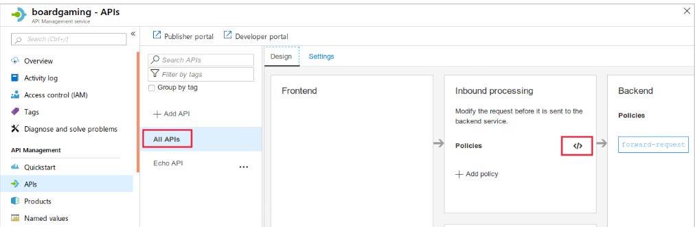
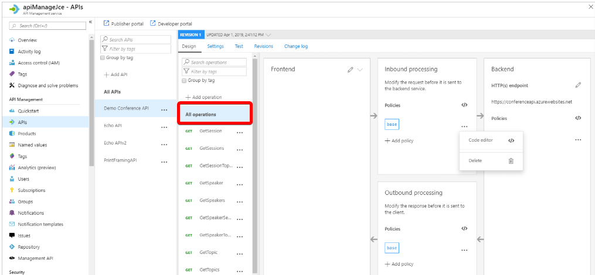
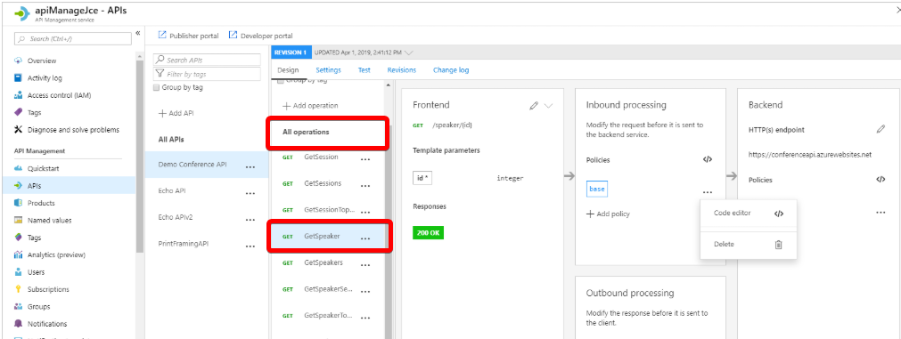
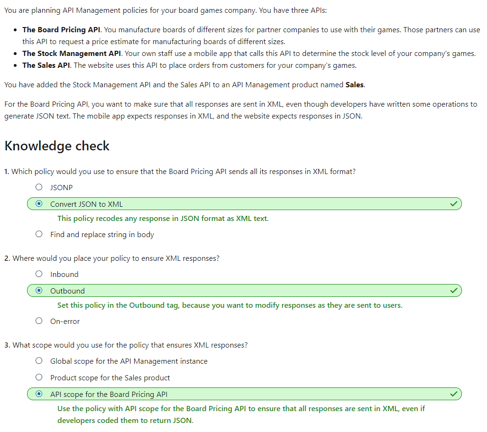

# [Improve the performance of an API by adding a caching policy in Azure API Management](https://docs.microsoft.com/en-au/learn/modules/improve-api-performance-with-apim-caching-policy/index)
- [Introduction](https://docs.microsoft.com/en-au/learn/modules/improve-api-performance-with-apim-caching-policy/1-introduction/)
- [Choose the right API Management policy](https://docs.microsoft.com/en-au/learn/modules/improve-api-performance-with-apim-caching-policy/2-choose-the-right-api-management-policy/)
  - In Azure API Management, administrators can use policies to alter the behavior of APIs through configuration. 
  - When do policies execute?
    - **Inbound**. These policies execute when a request is received from a client.
    - **Backend**. These policies execute before a request is forwarded to a managed API.
    - **Outbound**. These policies execute before a response is sent to a client.
    - **On-Error**. These policies execute when an exception is raised.
  - In the policy XML, there is a separate tag for each of these execution times:
    ```xml
    <policies>
        <inbound>
            <base />
            <check-header name="Authorization" failed-check-httpcode="401" failed-check-error-message="Not authorized" ignore-case="false">
            </check-header>
        </inbound>
        <backend>
            <base />
        </backend>
        <outbound>
            <base />
            <json-to-xml apply="always" consider-accept-header="false" parse-date="false" />
        </outbound>
        <on-error>
            <base />
        </on-error>
    </policies>
    ```
  - Policy Scopes
    - The global policy scope
      - click **APIs** and then click the **All APIS** menu item.
      - 
    - The product policy scope
      - When you manage a **product** in the Azure portal, click the Policies page to bring up the XML policy editor
    - The API policy scope
      - Policies applied at the API scope affect only a single API.
      - 
    - Operation policy scope
      - Policies applied at the operation scope affect only one operation within the API. 
      - 
  - Which order are policies applied in?
    - You can use the `<base />` tag to determine when policies from a higher scope are applied. For example, consider this policy, applied at the API scope:
      ```xml
        <policies>
            <inbound>
                <base />
                <find-and-replace from="game" to="board game" />
            </inbound>
        </policies>
      ```
    - Because the `<base>` tag appears above the `<find-and-replace>` tag, Azure applies policies from the global and product scopes first, and then executes the find-and-replace policy.
  - Policies used for restricting access
    - Check HTTP header
    - Limit call rate by subscription
    - Limit call rate by key
    - Restrict caller IP's
  - Policies for Authentication
    - Authenticate with Basic
      - enable authentication in plain text
    - Authenticate with client certificate
  - Cross domain policies
    - Allow cross-domain calls
    - CORS
    - JSONP 
  - Transformation policies
    - Convert JSON to XML
    - Convert XML to JSON
    - Transform XML
    - Find and replace string in body
    - Mask URLs in content 
    - Set body
    - Set HTTP header
    - Set query string parameter
    - Rewrite URL
  - Advanced policies
    - Control flow
      - For example, if you want to apply a policy only when the response passes a specific test, use the Control flow policy.
    - Forward requestRetry 
      - To control what happens when an action fails, use the Retry policy. Policy statements enclosed in Retry will execute repeated until a condition is met. Execution will repeat at the specified time intervals up until the retry count value is reached.
    - Send one-way request
    - Set variable
- [Knowledge check](https://docs.microsoft.com/en-au/learn/modules/improve-api-performance-with-apim-caching-policy/3-knowledge-check/)
  - 
- [Configure a caching policy](https://docs.microsoft.com/en-au/learn/modules/improve-api-performance-with-apim-caching-policy/4-configure-a-caching-policy/)
  - To set up a cache, you use an outbound policy named `cache-store` to store responses. You also use an inbound policy named `cache-lookup` to check if there is a cached response for the current request. You can see these two policies in the example below:
```xml
<policies>
    <inbound>
        <base />
        <cache-lookup vary-by-developer="false" vary-by-developer-groups="false" downstream-caching-type="none" must-revalidate="true" caching-type="internal" />
    </inbound>
    <backend>
        <base />
    </backend>
    <outbound>
        <cache-store duration="60" />
        <base />
    </outbound>
    </on-error>
        <base />
    </on-error>
</policies>
```
  - It's also possible to store individual values in the cache, instead of a complete response. Use the `cache-store-value` policy to add the value, with an identifying key. Retrieve the value from the cache by using the `cache-lookup-value` policy. If you want to remove a value before it expires, use the `cache-remove-value` policy:
  ```xml
    <policies>
        <inbound>
            <cache-lookup-value key="12345"
                default-value="$0.00"
                variable-name="boardPrice"
                caching-type="internal" />
            <base />
        </inbound>
        <backend>
            <base />
        </backend>
        <outbound>
            <cache-store-value key="12345"
                value="$3.60"
                duration="3600"
                caching-type="internal" />
            <base />
        </outbound>
        </on-error>
            <base />
        </on-error>
    </policies>
  ```
  - Using vary-by tags
    - To modify this default behavior, use the `<vary-by-query-parameter>` element within the `<cache-lookup>` policy:
    ```xml
        <inbound>
            <base />
            <cache-lookup vary-by-developer="false" vary-by-developer-groups="false" downstream-caching-type="none" must-revalidate="true" caching-type="internal">
                <vary-by-query-parameter>partnumber</vary-by-query-parameter>
            </cache-lookup>
        </inbound>
    ```
    - If a header can make a significant difference to a response, use the `<vary-by-header>` tag.
    - Within the `<cache-lookup>` tag, there is also the `vary-by-developer` attribute, which is required to be present and set to false by default. When this attribute is set to true, API Management examines the subscription key supplied with each request. It serves a response from the cache only if it was originally requested with the **same subscription key**.
    - If each user group should see a different response for the same URL, set the `vary-by-developer-group` attribute to true.
  - Using an external cache
    - API Management instances usually have an internal cache, which is used to store prepared responses to requests. However, if you prefer, you can use an external cache instead. One possible external cache system that you can use is the Azure Cache for Redis service.
- [Exercise - Configure a caching policy](https://docs.microsoft.com/en-au/learn/modules/improve-api-performance-with-apim-caching-policy/5-exercise-configure-a-caching-policy/)
- [Summary](https://docs.microsoft.com/en-au/learn/modules/improve-api-performance-with-apim-caching-policy/6-summary/)
  - [What is API Management?](https://docs.microsoft.com/azure/api-management/api-management-key-concepts)
  - [Policies in Azure API Management](https://docs.microsoft.com/azure/api-management/api-management-howto-policies)
  - [How to set or edit Azure API Management policies](https://docs.microsoft.com/azure/api-management/set-edit-policies)
  - [API Management caching policies](https://docs.microsoft.com/azure/api-management/api-management-caching-policies)
  - [Add caching to improve performance in Azure API Management](https://docs.microsoft.com/azure/api-management/api-management-howto-cache)
  - [API Management policies reference index](https://docs.microsoft.com/azure/api-management/api-management-policies)
  - [Use an external Azure Cache for Redis in Azure API Management](https://docs.microsoft.com/azure/api-management/api-management-howto-cache-external)