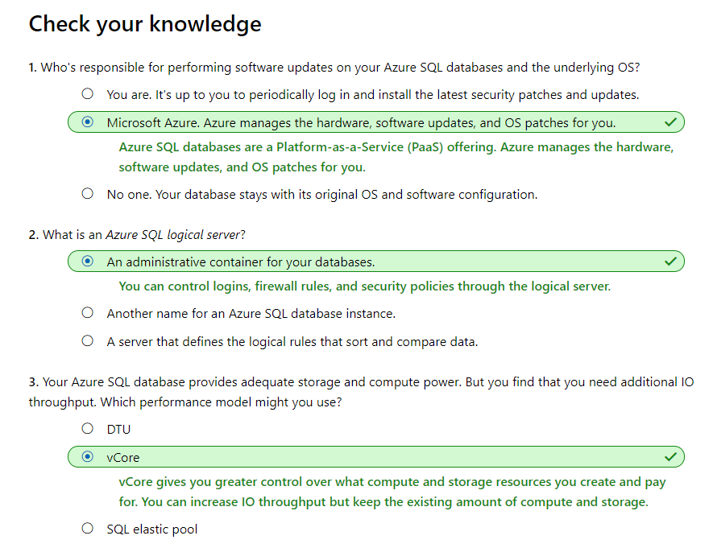

# [Provision an Azure SQL database to store application data](https://docs.microsoft.com/en-au/learn/modules/provision-azure-sql-db/index)

```
https://onedrive.live.com/view.aspx?resid=471B297280878A61%21153&id=documents&wd=target%28Pluralsight.one%7C14086A26-95B0-46E7-B98C-1F6B3B36C424%2FManaging%20Azure%20SQL%20Database%7C97840C13-320B-4B2C-AABC-21F5EA8AC589%2F%29
onenote:https://d.docs.live.net/471b297280878a61/Documents/Kaiqi%20的笔记本/Pluralsight.one#Managing%20Azure%20SQL%20Database&section-id={14086A26-95B0-46E7-B98C-1F6B3B36C424}&page-id={97840C13-320B-4B2C-AABC-21F5EA8AC589}&end
```
- [Introduction](https://docs.microsoft.com/en-au/learn/modules/provision-azure-sql-db/1-introduction)
- [Plan your Azure SQL database](https://docs.microsoft.com/en-au/learn/modules/provision-azure-sql-db/2-plan-your-database)
  - advantages
    - Convenience
      - managed service
    - Cost
    - Scale
    - Security
- [Exercise - Create your Azure SQL database](https://docs.microsoft.com/en-au/learn/modules/provision-azure-sql-db/3-create-your-database)
  - **Azure SQL logical server**
    - Think of a logical server as an **administrative container** for your databases. You can control logins, firewall rules, and security policies through the logical server.
  - Choose performance: **DTUs** versus **vCores**
    - **DTU** stands for Database Transaction Unit, and is a combined measure of compute, storage, and IO resources. Think of the DTU model as a simple, preconfigured purchase option.
    - **vCores** are Virtual cores, which give you greater control over the compute and storage resources that you create and pay for.
      - While the DTU model provides fixed combinations of compute, storage, and IO resources, the vCore model enables you to configure resources independently.
  - **SQL elastic pools**
    - SQL elastic pools relate to eDTUs. They enable you to buy a set of compute and storage resources that are shared among all the databases in the pool. Each database can use the resources they need, within the limits you set, depending on current load.
  - **Collation**
    - Collation refers to the rules that sort and compare data. Collation helps you define sorting rules when case sensitivity, accent marks, and other language characteristics are important.
    - Let's take a moment to consider what the default collation, **SQL_Latin1_General_CP1_CI_AS**, means.
      - Latin1_General refers to the family of Western European languages.
      - CP1 refers to code page 1252, a popular character encoding of the Latin alphabet.
      - CI means that comparisons are case insensitive. For example, "HELLO" compares equally to "hello".
      - AS means that comparisons are accent sensitive. For example, "résumé" doesn't compare equally to "resume".
    - Because you don't have specific requirements around how data is sorted and compared, you choose the default collation.
- [Exercise - Connect to your database and add sample data](https://docs.microsoft.com/en-au/learn/modules/provision-azure-sql-db/4-connect-add-data)
- [Summary and cleanup](https://docs.microsoft.com/en-au/learn/modules/provision-azure-sql-db/5-summary)
  - 