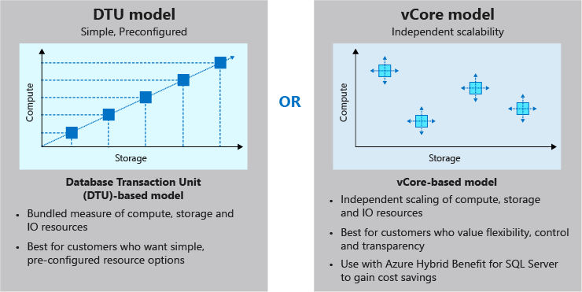
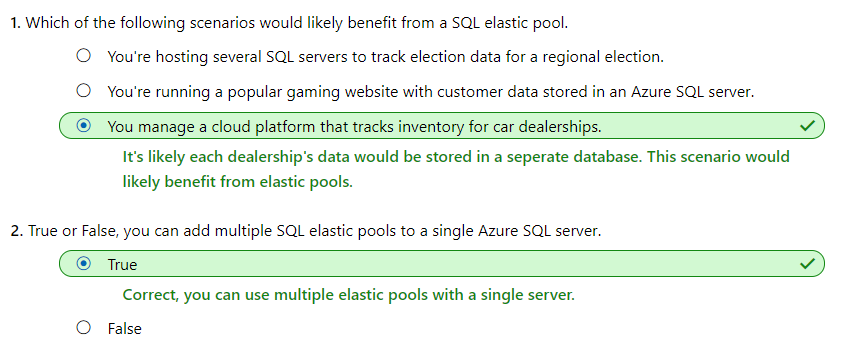

# [Scale multiple Azure SQL Databases with SQL elastic pools](https://docs.microsoft.com/en-au/learn/modules/scale-sql-databases-elastic-pools/index)
- [Introduction](https://docs.microsoft.com/en-au/learn/modules/scale-sql-databases-elastic-pools/1-introduction)
- [Create a SQL elastic pool](https://docs.microsoft.com/en-au/learn/modules/scale-sql-databases-elastic-pools/2-create-elastic-pool)
  - **SQL elastic pools**
    - **SQL elastic pools** are a resource allocation service used to scale and manage the performance and cost of a group of Azure SQL databases. Elastic pools allow you to purchase resources for the group. You set the amount of resources available to the pool, add databases to the pool, and set minimum and maximum resource limits for the databases within the pool.
  - When to use?
    - SQL elastic pools are ideal when you have several SQL databases that have a **low average utilization**, but have **infrequent**, **high utilization spikes**.
  - Create an elastic pool
    - `az sql elastic-pools create`
  - Add databases to an elastic pool
    - `az sql db create --elastic-pool-name`
- [Exercise - Create a SQL elastic pool](https://docs.microsoft.com/en-au/learn/modules/scale-sql-databases-elastic-pools/3-exercise-create-elastic-pool)
- [Manage SQL elastic pools performance and cost](https://docs.microsoft.com/en-au/learn/modules/scale-sql-databases-elastic-pools/4-manage-elastic-pools)
  - DTU-based pricing model
    - A database transaction unit (DTU) is a unit of measurement for the performance of a service tier in Azure and is based on a bundled measure of compute, storage, and IO resources.
    - Compute sizes are expressed in terms of Database Transaction Units (DTUs) for single databases or elastic Database Transaction Units (eDTUs) for elastic pools.
    - If demand exceeds the available resources for your tier for any resource (CPU, storage or IO), **the performance of your database is throttled. **
    - This model is best for customers who want simple, pre-configured resource options available in three tiers: **basic**, **standard**, and **premium**.
  - vCore-based pricing model
    - A virtual core (vCore) represents the logical CPU offered with an option to choose between generations of hardware and physical characteristics of hardware (for example, number of cores, memory, storage size).
    - This model allows you to choose compute, memory, and storage based upon their workload needs within the **general purpose** or **business critical** service tier.
    - 

- [Exercise - Manage SQL elastic pools](https://docs.microsoft.com/en-au/learn/modules/scale-sql-databases-elastic-pools/5-exercise-manage-elastic-pools)
- [Knowledge Check](https://docs.microsoft.com/en-au/learn/modules/scale-sql-databases-elastic-pools/6-knowledge-check)
  - 
- [Summary](https://docs.microsoft.com/en-au/learn/modules/scale-sql-databases-elastic-pools/7-summary)
  - Additional resources
	- [Elastic pools help you manage and scale multiple Azure SQL databases](https://docs.microsoft.com/azure/sql-database/sql-database-elastic-pool)
	- [Choose between the vCore and the DTU purchasing model](https://docs.microsoft.com/azure/sql-database/sql-database-purchase-models)
    - [Azure SQL Database DTU Calculator](https://dtucalculator.azurewebsites.net/)