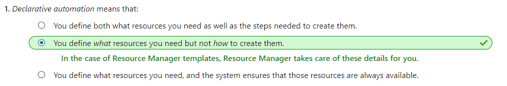
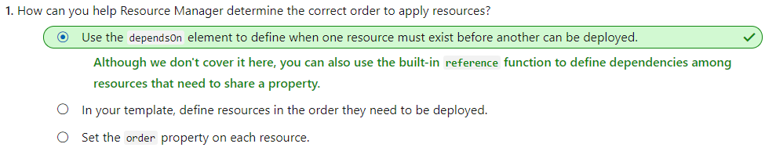
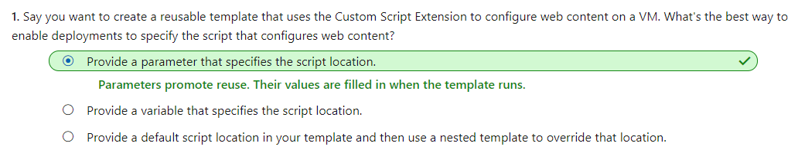

# [Build Azure Resource Manager templates](https://docs.microsoft.com/en-au/learn/modules/build-azure-vm-templates/index)
- [Introduction](https://docs.microsoft.com/en-au/learn/modules/build-azure-vm-templates/1-introduction)
- [Define Azure Resource Manager templates](https://docs.microsoft.com/en-au/learn/modules/build-azure-vm-templates/2-define-templates)
  - What's Azure Resource Manager?
    - Azure Resource Manager is the interface for managing and organizing cloud resources. Think of Resource Manager as a way to deploy cloud resources.
    - Resource Manager is what organizes the resource groups that let you deploy, manage, and delete all of the resources together in a single action.
  - What are Resource Manager templates?
    - A Resource Manager template precisely defines all the Resource Manager resources in a deployment. You can deploy a Resource Manager template into a resource group as a single operation.
    - A Resource Manager template is a JSON file, making it a form of declarative automation.
      - Declarative automation means that you define what resources you need but not how to create them. 
  - Why use Resource Manager templates
    - Templates improve consistency
    - Templates help express complex deployments
    - Templates reduce manual, error-prone tasks
    - Templates are code
    - Templates promote reuse
    - Templates are linkable
  - What's in a Resource Manager template?
    - A Resource Manager template 
      ```json
      {
            "$schema": "http://schema.management.azure.com/schemas/2015-01-01/deploymentTemplate.json#",
            "contentVersion": "",
            "parameters": {  },
            "variables": {  },
            "functions": [  ],
            "resources": [  ],
            "outputs": {  }
        }
      ```
    - Parameters
      ```json
      "parameters": {
            "adminUsername": {
                "type": "string",
                "metadata": {
                "description": "Username for the Virtual Machine."
                }
            },
            "adminPassword": {
                "type": "securestring",
                "metadata": {
                "description": "Password for the Virtual Machine."
                }
            }
        }
      ```

    - Variables
      ```json
      "variables": {
            "nicName": "myVMNic",
            "addressPrefix": "10.0.0.0/16",
            "subnetName": "Subnet",
            "subnetPrefix": "10.0.0.0/24",
            "publicIPAddressName": "myPublicIP",
            "virtualNetworkName": "MyVNET"
        }
      ```
    - Functions
      ```json
      "functions": [
        {
            "namespace": "contoso",
            "members": {
            "uniqueName": {
                "parameters": [
                {
                    "name": "namePrefix",
                    "type": "string"
                }
                ],
                "output": {
                "type": "string",
                "value": "[concat(toLower(parameters('namePrefix')), uniqueString(resourceGroup().id))]"
                }
            }
            }
        }
        ],
      ```
    - Resources
    ```json
    {
        "type": "Microsoft.Network/publicIPAddresses",
        "name": "[variables('publicIPAddressName')]",
        "location": "[parameters('location')]",
        "apiVersion": "2018-08-01",
        "properties": {
            "publicIPAllocationMethod": "Dynamic",
            "dnsSettings": {
            "domainNameLabel": "[parameters('dnsLabelPrefix')]"
            }
        }
    }
    ```
    - Outputs
    ```json
    "outputs": {
        "hostname": {
            "type": "string",
            "value": "[reference(variables('publicIPAddressName')).dnsSettings.fqdn]"
        }
    }
    ```
  - Check your knowledge
    - 
- [Discover Azure Quickstart templates](https://docs.microsoft.com/en-au/learn/modules/build-azure-vm-templates/3-discover-quickstart-templates)
- [Exercise - Deploy a VM using an Azure Quickstart template](https://docs.microsoft.com/en-au/learn/modules/build-azure-vm-templates/4-deploy-a-vm-quickstart-template)
  - Validate and launch the template
    - From Cloud Shell, run `az group deployment validate` to validate the template. validating that the template is syntactically correct.
        ```bash
        az group deployment validate \
            --resource-group [sandbox resource group name] \
            --template-uri "https://raw.githubusercontent.com/Azure/azure-quickstart-templates/master/101-vm-simple-windows/azuredeploy.json" \
            --parameters adminUsername=$USERNAME \
            --parameters adminPassword=$PASSWORD \
            --parameters dnsLabelPrefix=$DNS_LABEL_PREFIX
        ```
    - Run `az group deployment create` to deploy the template.
      ```json
      az group deployment create \
        --name MyDeployment \
        --resource-group [sandbox resource group name] \
        --template-uri "https://raw.githubusercontent.com/Azure/azure-quickstart-templates/master/101-vm-simple-windows/azuredeploy.json" \
        --parameters adminUsername=$USERNAME \
        --parameters adminPassword=$PASSWORD \
        --parameters dnsLabelPrefix=$DNS_LABEL_PREFIX
      ```
- [Add a resource to the template](https://docs.microsoft.com/en-au/learn/modules/build-azure-vm-templates/5-add-a-resource)
  - How do I extend a Resource Manager template?
    - One way to extend your template is to create **multiple templates**, each defining one piece of the system. You then **link** or **nest** them together to build a more complete system. As you create your own templates, you can build a library of smaller, more granular templates and combine them how you need.
    - Another way is to **modify** an existing template to suit your needs. You'll do that in this module because that's often the fastest way to get started writing your own templates.
  - Build the template resource
    - Custom Script Extension resource now looks like this.   
    ```json
        {
            "name": "[concat(variables('vmName'), '/', 'ConfigureIIS')]",
            "type": "Microsoft.Compute/virtualMachines/extensions",
            "apiVersion": "2018-06-01",
            "location": "[parameters('location')]",
            "properties": {
                "publisher": "Microsoft.Compute",
                "type": "CustomScriptExtension",
                "typeHandlerVersion": "1.9",
                "autoUpgradeMinorVersion": true,
                "settings": {
                    "fileUris": [
                        "https://raw.githubusercontent.com/MicrosoftDocs/mslearn-welcome-to-azure/master/configure-iis.ps1"
                    ]
                },
                "protectedSettings": {
                "commandToExecute": "powershell -ExecutionPolicy Unrestricted -File configure-iis.ps1"
                }
            },
            "dependsOn": [
                "[resourceId('Microsoft.Compute/virtualMachines/', variables('vmName'))]"
            ]
        }
    ```
  - Check your knowledge
    - 
- [Exercise - Extend the Quickstart template to deploy a basic web site](https://docs.microsoft.com/en-au/learn/modules/build-azure-vm-templates/6-extend-the-quickstart-template)
- [Summary](https://docs.microsoft.com/en-au/learn/modules/build-azure-vm-templates/7-summary)
  - Check your knowledge
    - 