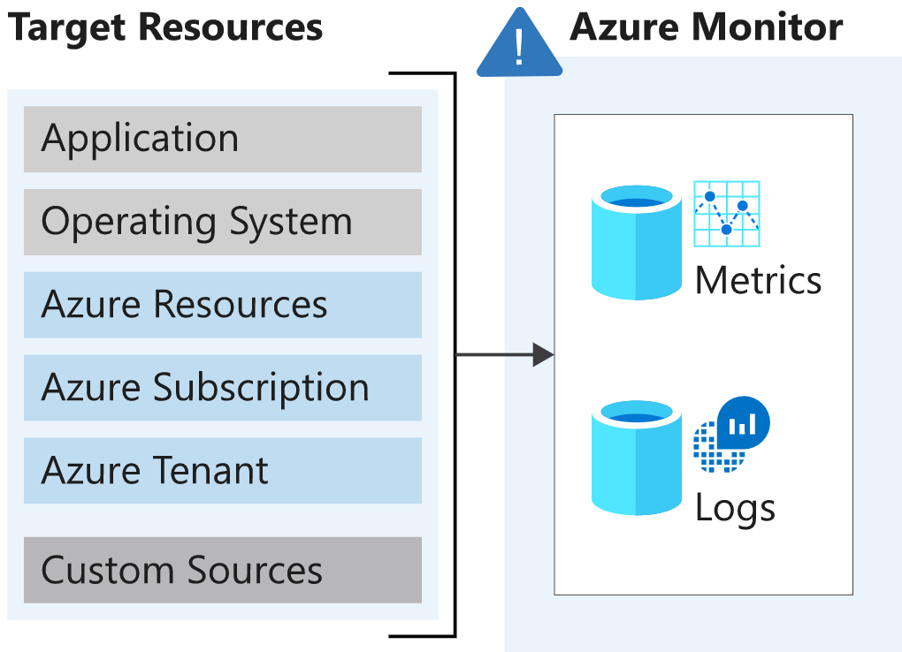
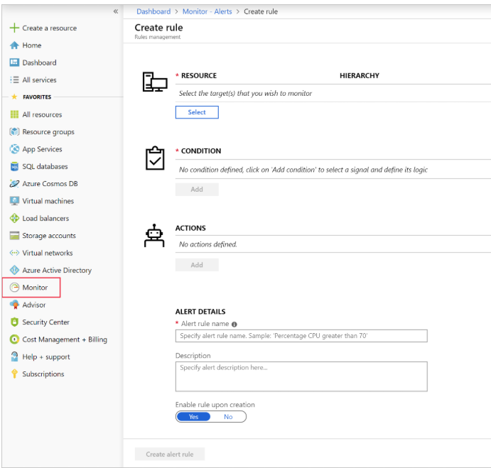
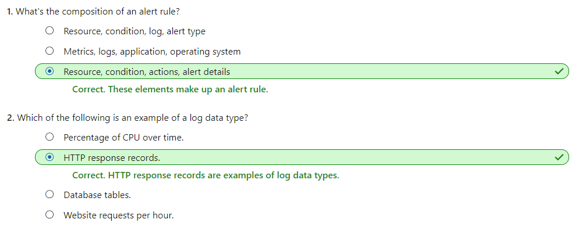
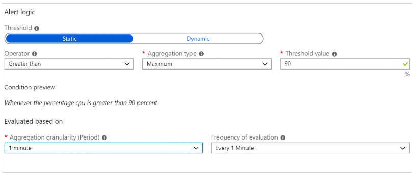
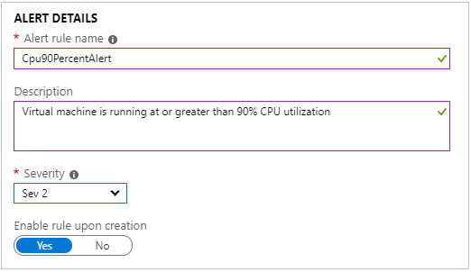
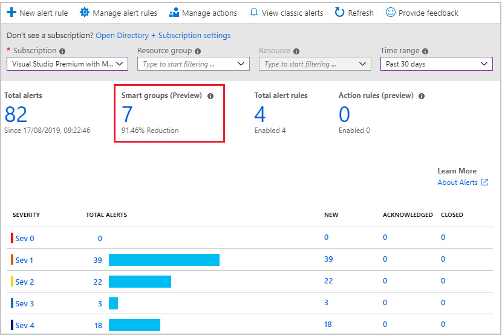
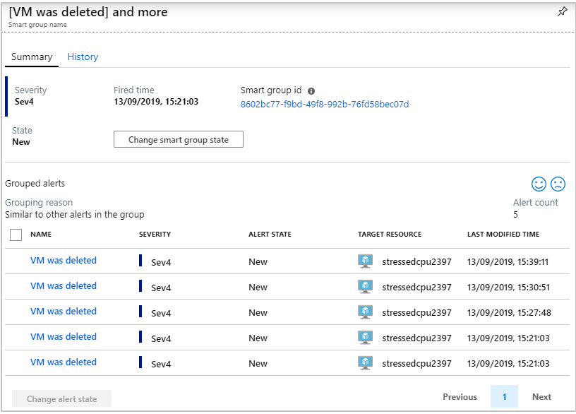
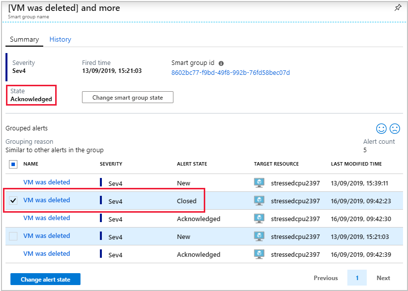
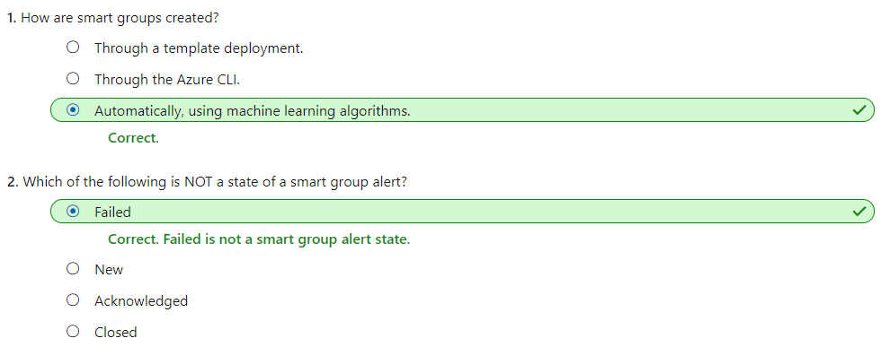

# [Improve incident response with alerting on Azure](https://docs.microsoft.com/en-au/learn/modules/incident-response-with-alerting-on-azure/index)
- [Introduction](https://docs.microsoft.com/en-au/learn/modules/incident-response-with-alerting-on-azure/1-introduction/)
- [Explore the different alert types that Azure Monitor supports](https://docs.microsoft.com/en-au/learn/modules/incident-response-with-alerting-on-azure/2-explore-azure-monitor-alert-types/)
  - A data type will be a metric, a log, or both a metric and a log.
    - The focus for metric-based data types is the numerical time-sensitive values that represent some aspect of the target resource.
    - The focus for log-based data types is the querying of content data held in structured, record-based log files that are relevant to the target resource.
    - 
  - You'll learn about the three signal types that you can use to monitor your environment:
    - **Metric** alerts provide an alert trigger when a specified threshold is exceeded. For example, a metric alert can notify you when CPU usage is greater than 95 percent.
    - **Activity log** alerts notify you when Azure resources change state. For example, an activity log alert can notify you when a resource is deleted.
    - **Log** alerts are based on things written to log files. For example, a log alert can notify you when a web server has returned a number of 404 or 500 responses.
  - The composition of an alert rule remains the same.
    - RESOURCE
      - The **target** resource to be used for the alert rule. It's possible to assign multiple target resources to a single alert rule. The type of resource will define the available signal types.
    - CONDITION
      - The **signal type** to be used to assess the rule. The signal type can be a metric, an activity log, or logs. There are others, but this module doesn't cover them.
      - The **alert logic** applied to the data that's supplied via the signal type. The structure of the alert logic will change depending on the signal type.
    - ACTIONS
      - The **action**, like sending an email, sending an SMS message, or using a webhook.
      - An **action group**, which typically contains a unique set of recipients for the action.
    - ALERT DETAILS
      - An alert name and an **alert description** that should specify the alert's purpose.
      - The severity of the alert if the criteria or logic test evaluates `true`. The five severity levels are:
        - 0: Critical
        - 1: Error
        - 2: Warning
        - 3: Informational
        - 4: Verbose
    - 
    - 
- [Use metric alerts to alert on performance issues in your Azure environment](https://docs.microsoft.com/en-au/learn/modules/incident-response-with-alerting-on-azure/3-metric-alerts/)
  - In Azure Monitor, you can use metric alerts to achieve regular threshold monitoring of Azure resources. Azure Monitor runs metric alert trigger conditions at regular intervals. When the evaluation is true, Azure Monitor sends a notification.
  - Composition of a metric alert
    - You must define the type of statistical analysis to be used with either static or dynamic metric alerts.
    - Using static threshold metric alerts
      - With static metrics, you specify the threshold that will be used to trigger the alert or notification.
    - Using dynamic threshold metric alerts
      - Dynamic metric alerts use machine learning tools that Azure provides to automatically improve the accuracy of the thresholds defined by the initial rule.There's no hard threshold in dynamic metrics.
        - The `look-back` period defines how many previous periods need to be evaluated. For example, if you set the look-back period to 3, then in the example used here, the assessed data range would be 30 minutes (three sets of 10 minutes).
        - The `number of violations` expresses how many times the logic condition has to deviate from the expected behavior before the alert rule fires a notification. In this example, if you set the number of violations to two, the alert would be triggered after two deviations from the calculated threshold.
  - Understanding dimensions
    - Until now, the assessed metric alerts have focused on a single target instance. Azure Monitor supports dimensions, which enable monitoring data to be supplied from **multiple target instances**.
    - You can define the dimensions by naming each target instance specifically. Or you can define the dimensions by using the asterisk (*) wildcard, which will use all available instances.
- [Exercise - Use metric alerts to alert on performance issues in your Azure environment](https://docs.microsoft.com/en-au/learn/modules/incident-response-with-alerting-on-azure/4-exercise-metric-alerts/)
  - 
  - 
  - Create the metric alert through the CLI
    ```bash
    az monitor metrics alert create \
    -n "Cpu80PercentAlert" \
    --resource-group "[sandbox resource group name]" \
    --scopes $VMID \
    --condition "max percentage CPU > 80" \
    --description "Virtual machine is running at or greater than 80% CPU utilization" \
    --evaluation-frequency 1m \
    --window-size 1m \
    --severity 3
    ```
- [Use log alerts to alert on events in your application](https://docs.microsoft.com/en-au/learn/modules/incident-response-with-alerting-on-azure/5-log-alerts/)
  - When to use log alerts
    - Log alerts use **log data** to assess the rule logic and, if necessary, trigger an alert. This data can come from any Azure resource: server logs, application server logs, or application logs.
    - By its nature, log data is historical. So usage is focused on analytics and trends.
  - How log alerts work
    - The first part of a log alert is used to define the **log search rule**. The rule defines **how often it should run**, **the time period under evaluation**, and **the query to be run**.
  - Composition of log search rules
    - Every log alert has an associated search rule. The composition of these rules is:
      - **Log query**: The query that runs every time the alert rule fires.
      - **Time period**: The time range for the query.
      - **Frequency**: How often the query should run.
      - **Threshold**: The trigger point for an alert to be created.
    - Log search results are one of two types, number of records or metric measurement.
      - **Number of records**
        - Consider using the number-of-records type of log search when you're working with an event or event-driven data. Examples are syslog and web app responses.
        - This type of log search returns a single alert when the number of records in a search result reaches or exceeds the value for the number of records (threshold). For example, when the threshold for the search rule is greater or equal to five, the query results have to return five or more rows of data before the alert is triggered.
      - **Metric measurement**
        - Metric measurement logs offer the same basic functionality as metric alert logs.
        - Unlike number-of-records search logs, metric measurement logs require additional criteria to be set:
          - **Aggregate function**: The calculation that will be made against the result data. An example is count or average. The result of the function is called AggregatedValue.
          - **Group field**: A field by which the result will be grouped. This criterion is used in conjunction with the aggregated value. For example, you might specify that you want the average grouped by computer.
          - **Interval**: The time interval by which data is aggregated. For example, if you specify 10 minutes, an alert record is created for each aggregated block of 10 minutes.
          - **Threshold**: A point defined by an aggregated value and the total number of breaches.
        - Consider using this type of alert when you need to add a level of tolerance to the results found. One use for this type of alert is to respond if a particular trend or pattern is found. For example, if the number of breaches is five, and any server in your group exceeds 85 percent CPU utilization more than five times within the given time period, an alert is fired.
- [Use activity log alerts to alert on events within your Azure infrastructure](https://docs.microsoft.com/en-au/learn/modules/incident-response-with-alerting-on-azure/6-activity-log-alerts/)
  - Activity log alerts are designed to work with Azure resources. Typically, you create this type of log to receive notifications when specific changes occur on a resource within your Azure subscription.
    - There are two types of activity log alerts:
      - **Specific operations**: Apply to resources within your Azure subscription and often have a scope with specific resources or a resource group. You use this type when you need to receive an alert that reports a change to an aspect of your subscription. For example, you can receive an alert if a virtual machine is deleted or new roles are assigned to a user.
      - **Service health events**: Include notice of incidents and maintenance of target resources.
        - The only difference is that you no longer need to select a resource, because the alert is for a whole region in Azure. 
    - Like the previous alerts, activity log alerts have their own attributes:
      - **Category**: Administrative, service health, autoscale, policy, or recommendation.
      - **Scope**: Resource level, resource group level, or subscription level.
      - **Resource group**: Where the alert rule is saved.
      - **Resource type**: Namespace for the target of the alert.
      - **Operation name**: Operation name.
      - **Level**: Verbose, informational, warning, error, or critical.
      - **Status**: Started, failed, or succeeded.
      - **Event initiated by**: The email address or Azure Active Directory identifier (known as the "caller") for the user.
- [Exercise - Use activity log alerts to alert on events within your Azure infrastructure](https://docs.microsoft.com/en-au/learn/modules/incident-response-with-alerting-on-azure/7-exercise-activity-log-alerts/)
- [Use smart groups to reduce alert noise in Azure Monitor](https://docs.microsoft.com/en-au/learn/modules/incident-response-with-alerting-on-azure/8-smart-groups/)
  - What are smart groups?
    - **Smart groups** are **an automatic feature of Azure Monitor**. By using machine learning algorithms, Azure Monitor groups together alerts based on repeat occurrence or similarity. Smart groups allow you to address **a group of alerts** instead of each alert separately.
    - The name of the smart group, its taxonomy, is assigned automatically and is the name of the first alert in the group. It's important to assign meaningful names to each alert that you create, because the name of the smart group can't be changed or amended.
    - Think of smart groups as a **dynamic filter** applied to all the alerts in Azure Monitor. The **machine learning algorithm** in Azure Monitor groups together alerts based on information such as historical patterns, similar properties, or structure. 
    - 
    - 
  - Smart group states
    - Smart groups, like regular alerts, have their own state. The state shows the progress of the smart group in the resolution process. Changing the state of a smart group doesn't alter the state of the individual alerts.
    - To change the state, select `Change smart group state`.
      - `New`: The smart group has been created with an aggregation of alerts, but it hasn't yet been addressed.
      - `Acknowledged`: When an administrator starts the resolution process, they change the state to this.
      - `Closed`: When the source of the alert is fixed, the administrator changes the state to this.
    - 
  - 
- [Summary](https://docs.microsoft.com/en-au/learn/modules/incident-response-with-alerting-on-azure/9-summary/)
  - [Azure Monitor](https://docs.microsoft.com/azure/azure-monitor/platform/alerts-overview)
  - [Metric alerts](https://docs.microsoft.com/azure/azure-monitor/platform/alerts-metric-overview)
  - [Log alerts](https://docs.microsoft.com/azure/azure-monitor/platform/alerts-unified-log)
  - [Activity log alerts](https://docs.microsoft.com/azure/azure-monitor/platform/activity-log-alerts)
  - [Smart groups](https://docs.microsoft.com/azure/azure-monitor/platform/alerts-smartgroups-overview)