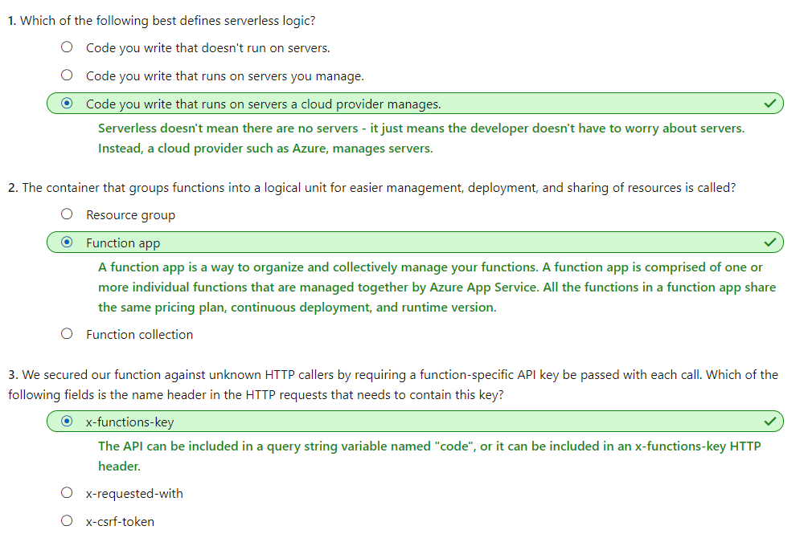

# [Create serverless logic with Azure Functions](https://docs.microsoft.com/en-au/learn/modules/create-serverless-logic-with-azure-functions/index)
- [Introduction](https://docs.microsoft.com/en-au/learn/modules/create-serverless-logic-with-azure-functions/1-introduction)
- [Decide if serverless computing is right for your business needs](https://docs.microsoft.com/en-au/learn/modules/create-serverless-logic-with-azure-functions/2-decide-if-serverless-computing-is-right-for-your-business-need)
- [Exercise - Create a function app in the Azure portal](https://docs.microsoft.com/en-au/learn/modules/create-serverless-logic-with-azure-functions/3-create-an-azure-functions-app-in-the-azure-portal)
  - Function app
    - Functions are hosted in an execution context called a function app. You define function apps to logically group and structure your functions and a compute resource in Azure.
    - When you create a function app, it must be linked to a storage account.
- [Run your code on-demand with Azure Functions](https://docs.microsoft.com/en-au/learn/modules/create-serverless-logic-with-azure-functions/4-creating-and-executing-an-azure-function)
  - Bindings
    - Bindings are a declarative way to connect data and services to your function.
    - Each binding has a direction - your code reads data from input bindings and writes data to output bindings.
    - A sample binding definition
      - This scenario can be implemented using an Azure Queue storage trigger and an Azure Table storage output binding.
      ```json
        {
        "bindings": [
            {
            "name": "order",
            "type": "queueTrigger",
            "direction": "in",
            "queueName": "myqueue-items",
            "connection": "MY_STORAGE_ACCT_APP_SETTING"
            },
            {
            "name": "$return",
            "type": "table",
            "direction": "out",
            "tableName": "outTable",
            "connection": "MY_TABLE_STORAGE_ACCT_APP_SETTING"
            }
        ]
        }
      ```
      - Our JSON configuration specifies that our function will be triggered when a message is added to a queue named myqueue-items. The return value of our function is then written to the outTable table in Azure Table storage.
- [Exercise - Add logic to the function app](https://docs.microsoft.com/en-au/learn/modules/create-serverless-logic-with-azure-functions/5-add-logic-to-the-function-app)
  - Securing HTTP triggers
    - HTTP triggers let you use API keys to block unknown callers by requiring the key to be present on each request. When you create a function, you select the authorization level. 
      - "**Function**" (default), which requires a function-specific API key
        - Need to supply the key when we send the HTTP request. You can either
          - send it as a query string parameter named `code`
          - as an HTTP header (preferred) named `x-functions-key`.
      - "**Admin**" to use a global "master" key
      - "**Anonymous**" to indicate that no key is required
- [Summary](https://docs.microsoft.com/en-au/learn/modules/create-serverless-logic-with-azure-functions/6-summary)
  - 

