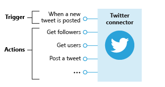
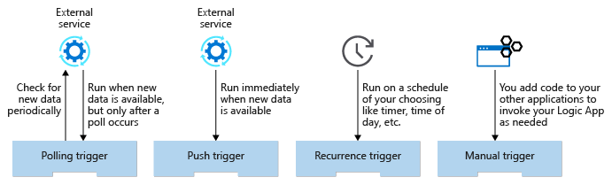
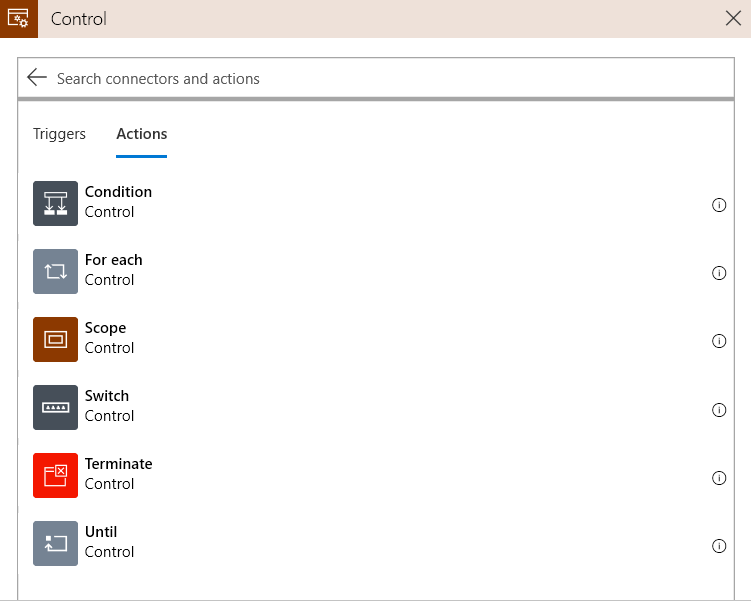

# [Route and process data automatically using Logic Apps](https://docs.microsoft.com/en-au/learn/modules/route-and-process-data-logic-apps/index)
- [Introduction](https://docs.microsoft.com/en-au/learn/modules/route-and-process-data-logic-apps/1-introduction)
    ```
    https://onedrive.live.com/view.aspx?resid=471B297280878A61%21153&id=documents&wd=target%28Pluralsight.one%7C14086A26-95B0-46E7-B98C-1F6B3B36C424%2FAzure%20Logic%20apps%3A%7CD048D3E1-FB05-42E3-9075-B7AC1A0450DF%2F%29
    onenote:https://d.docs.live.net/471b297280878a61/Documents/Kaiqi%20的笔记本/Pluralsight.one#Azure%20Logic%20apps&section-id={14086A26-95B0-46E7-B98C-1F6B3B36C424}&page-id={D048D3E1-FB05-42E3-9075-B7AC1A0450DF}&end
    ```
- [Design Logic Apps for your workflows](https://docs.microsoft.com/en-au/learn/modules/route-and-process-data-logic-apps/2-design-logic-apps-for-your-workflows)
  - Component types
    - A **trigger** is an event that occurs when a specific set of conditions is satisfied. Triggers activate automatically when the conditions are right. For example, when a timer expires or data becomes available. Every Logic App must start with a trigger. In our example, we'll trigger the app when a new tweet mentions our product.
    - An **action** is an operation that executes one of the tasks in your business process. Actions run when a trigger activates or another action completes. Our social-media monitor app has three actions: detect sentiment, insert database row, and send email.
    - **Control actions** are special built-in actions that let you add decisions and loops to your app. Our example will use a control action to branch based on the sentiment score.
  - A group of related triggers and actions are packaged inside a **connector**. Conceptually, you can think of a connector as a component that lets you access an external service.
    - 
- [Detect an external event using a trigger](https://docs.microsoft.com/en-au/learn/modules/route-and-process-data-logic-apps/3-detect-external-event-using-trigger)
  - Trigger types
    - 
    - polling trigger
      - A polling trigger periodically checks an external service for new data.
      - When you create a polling trigger, you set the **Frequency** and an **Interval** to control how often the trigger will run.
    - push trigger
      - A push trigger subscribes to an event offered by the external service to get notified immediately when data is available. 
      - Push triggers are implemented using Webhooks.
  - Trigger parameters and return values
    - **Trigger parameters** let you configure the operation. 
      - The Twitter "When-a-new-tweet-is-posted" trigger has a parameter called **Search text** that it uses to select matching tweets for us.
    - **Trigger return values** are the results of the operation.
      - The Bitbucket connector has a "When a pull request is merged" trigger. The trigger returns an object containing things like the identity of the Repository and the Actor who approved the merge. Most triggers actually return a collection instead of a single object.
- [Exercise - Create the social-media tracker Logic App](https://docs.microsoft.com/en-au/learn/modules/route-and-process-data-logic-apps/4-ex-create-social-media-tracker)
- [Execute an action](https://docs.microsoft.com/en-au/learn/modules/route-and-process-data-logic-apps/5-execute-an-action)
  - Action types
    - Access external services
    - Manipulate data
    - Alter control flow
  - Action parameters and return values
    - Action parameters let you pass values to the operation. 
    - Action return values are the results of the operation.
    - Static vs. dynamic parameters
      - Recall that the tweet we're processing was the return value of the "When-a-new-tweet-is-posted" trigger. This tweet data is packaged inside an object with several fields containing the details of the tweet. **Logic Apps automatically makes this object available throughout the rest of the app**. The Logic Apps Designer gives you a simple GUI to select the fields you're interested in.
- [Exercise - Analyze the content of a tweet](https://docs.microsoft.com/en-au/learn/modules/route-and-process-data-logic-apps/6-ex-analyze-content-of-tweet)
- [Alter control flow using a control action](https://docs.microsoft.com/en-au/learn/modules/route-and-process-data-logic-apps/7-alter-control-flow-using-control-action)
  - Condition action
    - A condition action is an if statement that lets your app do different things based on the data you're processing. It consists of a Boolean expression and two actions. At runtime, the execution engine evaluates the expression and chooses an action based on whether the expression is true or false.
    - Most of the operations are intuitive, but there are two cases worth mentioning:
      - String comparisons are all case sensitive.
      - JSON comparisons use what's called deep equals. This comparison means the equality operators will compare the entire objects, including any descendant tokens inside complex objects.
  - 
- [Exercise - Branch based on tweet sentiment](https://docs.microsoft.com/en-au/learn/modules/route-and-process-data-logic-apps/8-ex-branch-based-on-tweet-sentiment)
- [Summary](https://docs.microsoft.com/en-au/learn/modules/route-and-process-data-logic-apps/9-summary)
