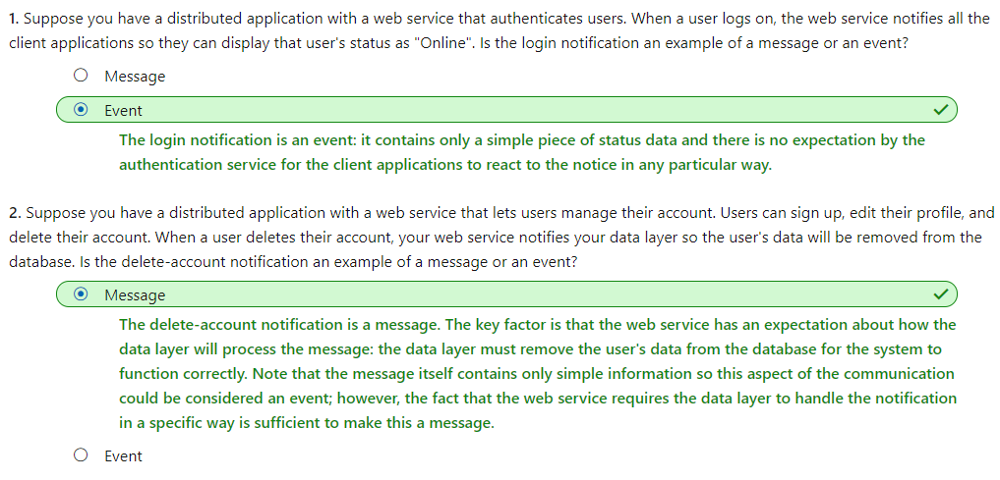
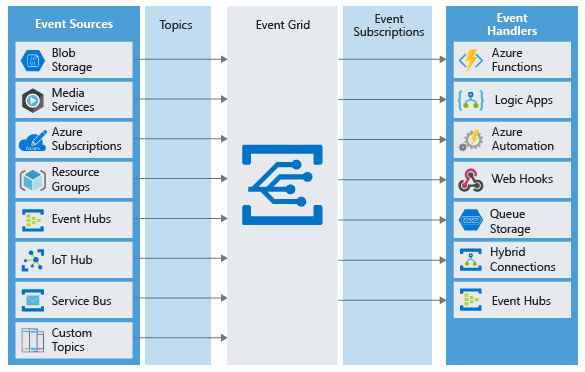
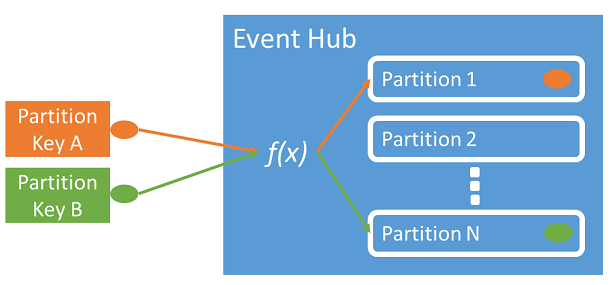
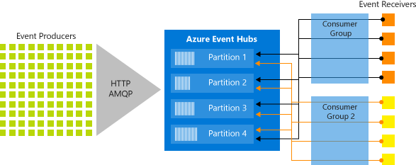

# [Choose a messaging model in Azure to loosely connect your services](https://docs.microsoft.com/en-au/learn/modules/choose-a-messaging-model-in-azure-to-connect-your-services/index)
- [Introduction](https://docs.microsoft.com/en-au/learn/modules/choose-a-messaging-model-in-azure-to-connect-your-services/1-introduction)
    ```
    https://onedrive.live.com/view.aspx?resid=471B297280878A61%21153&id=documents&wd=target%28Pluralsight.one%7C14086A26-95B0-46E7-B98C-1F6B3B36C424%2FConnect%20your%20services%20together%7CFC7A4EF9-E9C4-4D87-A6EE-92A9C9166FBC%2F%29
    onenote:https://d.docs.live.net/471b297280878a61/Documents/Kaiqi%20的笔记本/Pluralsight.one#Connect%20your%20services%20together&section-id={14086A26-95B0-46E7-B98C-1F6B3B36C424}&page-id={FC7A4EF9-E9C4-4D87-A6EE-92A9C9166FBC}&end
    ```
- [Choose whether to use messages or events](https://docs.microsoft.com/en-au/learn/modules/choose-a-messaging-model-in-azure-to-connect-your-services/2-choose-whether-to-use-message-queues-or-events)
  - The first thing to understand about a communication is whether it sends messages or events.
    - **Message**
      - A message contains raw data, produced by one component, that will be consumed by another component.
      - A message contains the data itself, not just a reference to that data.
      - **The sending component expects the message content to be processed in a certain way by the destination component.** The integrity of the overall system may depend on both sender and receiver doing a specific job.
	- **Event**
      - Events are lighter weight than messages, and are most often used for broadcast communications. The components sending the event are known as publishers, and receivers are known as subscribers.
      - Events have the following characteristics:
      	- An event is a lightweight notification that indicates that something happened.
      	- The event may be sent to multiple receivers, or to none at all.
      	- Events are often intended to "fan out," or have a large number of subscribers for each publisher.
      	- The publisher of the event has **no expectation about the action** a receiving component takes.
      	- Some events are discrete units and unrelated to other events.
      Some events are part of a related and ordered series.
    - For each communication, consider the following question: **Does the sending component expect the communication to be processed in a particular way by the destination component**?
    
- [Choose a message-based delivery with queues](https://docs.microsoft.com/en-au/learn/modules/choose-a-messaging-model-in-azure-to-connect-your-services/3-choose-azure-storage-queues)
  - Azure message-based queue solution
    - **Azure Queue Storage**
      - Queue storage is a service that uses Azure Storage to store large numbers of messages that can be securely accessed from anywhere in the world using a simple REST-based interface. Queues can contain millions of messages, limited only by the capacity of the storage account that owns it.
    - **Azure Service Bus**
      - **Azure Service Bus queue**
        - Service Bus is a message broker system intended for enterprise applications. These apps often utilize multiple communication protocols, have different data contracts, higher security requirements, and can include both cloud and on-premises services. Service Bus is built on top of a dedicated messaging infrastructure designed for exactly these scenarios.
      - **Azure Service Bus topics** are like queues, but can have multiple subscribers.
  - Benefits of queues
    - Increased reliability
    - Message delivery guarantees
      - At-Least-Once Delivery
      - At-Most-Once Delivery
      - First-In-First-Out (FIFO)
    - Transactional support
      - Some closely related groups of messages may cause problems when delivery fails for one message in the group.
  - Which service should I choose?
    - Choose **Service Bus Topics** if
      - you need multiple receivers to handle each message
    - Choose **Service Bus queues** if:
      - You need an **At-Most-Once** delivery guarantee.
      - You need a **FIFO** guarantee.
      - You need to group messages into **transactions**.
      - You want to receive messages without polling the queue.
      - You need to provide a role-based access model to the queues.
      - You need to handle messages **larger than** 64 KB but less than 256 KB.
      - Your queue size will **not grow larger than** 80 GB.
      - You would like to be able to publish and consume batches of messages.
    - Choose Queue storage if:
      - You need an audit trail of all messages that pass through the queue.
      - You expect the queue to exceed 80 GB in size.
      - You want to track progress for processing a message inside of the queue.
    - In short
      - Use Storage queues when you want a **simple and easy-to-code** queue system. For more **advanced needs**, use Service Bus queues. If you have **multiple destinations** for a single message, but need queue-like behavior, use topics.
- [Choose Azure Event Grid](https://docs.microsoft.com/en-au/learn/modules/choose-a-messaging-model-in-azure-to-connect-your-services/4-choose-event-grid)
  - **Azure Event Grid**
    - Azure Event Grid is a fully-managed **event** routing service running on top of Azure Service Fabric. Event Grid distributes **events** from different sources, such as Azure Blob storage accounts or Azure Media Services, to different handlers, such as Azure Functions or Webhooks. Event Grid was created to make it easier to build event-based and serverless applications on Azure.
    - **Event Grid supports most Azure services as a publisher or subscriber** and can be used with third-party services. It provides a dynamically scalable, low-cost, messaging system that allows publishers to notify subscribers about a status change. The following illustration shows Azure Event Grid receiving messages from multiple sources and distributing them to event handlers based on subscription.
    - There are several concepts in Azure Event Grid that connect a source to a subscriber:
      - **Events**: What happened.
      - **Event sources**: Where the event took place.
      - **Topics**: The endpoint where publishers send events.
      - **Event subscriptions**: The endpoint or built-in mechanism to route events, sometimes to multiple handlers. Subscriptions are also used by handlers to filter incoming events intelligently.
      - **Event handlers**: The app or service reacting to the event.
      - 
  - **Event**
    - Events are the data messages passing through Event Grid that describe what has taken place. Each event is self-contained, can be up to 64 KB.
    ```json
    [
        {
            "topic": string,
            "subject": string,
            "id": string,
            "eventType": string,
            "eventTime": string,
            "data":{
            object-unique-to-each-publisher
            },
            "dataVersion": string,
            "metadataVersion": string
        }
    ]
    ```
  - **Event sources**
    - **Event sources** are responsible for sending events to Event Grid. Each event source is related to one or more event types.
      - For example, Azure Storage is the event source for blob created events.
    - Azure Event Hub has the concept of an event publisher which is often confused with the event source. A publisher to Event Hub is the user or organization that decides to send events to Event Grid. For example, Microsoft publishes events for several Azure services.
    - Types of event sources
      - Azure Subscriptions and Resource Groups
      - Container registry
      - Event Hub
      - Service Bus
      - Storage accounts
      - Media Services
      - Azure IoT Hub
      - Custom events
  - **Event topics**
    - **Event topics** categorize events into groups. Topics are represented by a public endpoint and are where the event source sends events to.
      - **System topics**
        - System topics are built-in topics provided by Azure services. You don't see system topics in your Azure subscription because the publisher owns the topics, but you can subscribe to them. To subscribe, you provide information about the resource you want to receive events from. As long as you have access to the resource, you can subscribe to its events.
      - **Custom topics**
        - Custom topics are application and third-party topics. When you create or are assigned access to a custom topic, you see that custom topic in your subscription.
  - **Event Subscriptions**
    - **Event Subscriptions** define which events on a topic an event handler wants to receive. A subscription can also filter events by their type or subject, so you can ensure an event handler only receives relevant events.
  - **Event handler**
    - An event handler (sometimes referred to as an event "subscriber") is any component (application or resource) that can receive events from Event Grid. For example, Azure Functions can execute code in response to the new song being added to the Blob storage account. 
      - Event handlers
        - Azure Functions
        - Webhooks
        - Azure Logic Apps
        - Microsoft Flow
  - Should you use Event Grid
    - **Simplicity**: It is straightforward to connect sources to subscribers in Event Grid.
    - **Advanced filtering**: Subscriptions have close control over the events they receive from a topic.
    - **Fan-out**: You can subscribe to an unlimited number of endpoints to the same events and topics.
    - **Reliability**: Event Grid retries event delivery for up to 24 hours for each subscription.
    - **Pay-per-event**: Pay only for the number of events that you transmit.
- [Choose Azure Event Hubs](https://docs.microsoft.com/en-au/learn/modules/choose-a-messaging-model-in-azure-to-connect-your-services/5-choose-azure-event-hubs)
  - **Event Hubs**
    - **Event Hubs** is an intermediary for the **publish-subscribe** communication pattern. Unlike Event Grid, however, **it is optimized for extremely high throughput**, a large number of publishers, security, and resiliency.
    - **Partitions**
      - As Event Hubs receives communications, **it divides them into partitions**. Partitions are buffers into which the communications are saved. Because of the event buffers, events are not completely ephemeral, and an event isn't missed just because a subscriber is busy or even offline. The subscriber can always use the buffer to "catch up." By default, events stay in the buffer for 24 hours before they automatically expire.
      - The buffers are called partitions because the data is divided amongst them. Every event hub has at least two partitions, and each partition has a separate set of subscribers.
      - It is a best practice for publishers to be **unaware of partitions** within the event hub and to only **specify a partition key** (introduced in the next section), or their identity via their SAS token.
      - **Event Hubs ensures that all events sharing a partition key value are delivered in order**, and to the same partition. If partition keys are used with publisher policies, then the identity of the publisher and the value of the partition key must match. Otherwise, an error occurs.
      - **This pattern enables horizontal scale for event processing and provides other stream-focused features that are unavailable in queues and topics.**
      - The number of partitions is specified at creation and must be **between 2 and 32.** The partition count is **not changeable**.
        - The number of partitions in an event hub **directly relates to the number of concurrent readers** you expect to have. You can increase the number of partitions beyond 32 by contacting the Event Hubs team.
      - 
      - We recommend that you balance 1:1 throughput units and partitions to achieve optimal scale.
    - **Capture**
      - Event Hubs can send all your events immediately to Azure Data Lake or Azure Blob storage for inexpensive, permanent persistence.
    - **Authentication**
      - All publishers are authenticated and issued a token. This means Event Hubs can accept events from external devices and mobile apps, without worrying that fraudulent data from pranksters could ruin our analysis.
  - Which service should I choose
    - Choose **Event Hubs** if:
      - You need to support **authenticating** a **large number** of publishers.
      - You need to save a **stream of events to Data Lake or Blob storage**.
      - You need **aggregation** or **analytics** on your event stream.
      - You need **reliable** messaging or resiliency.
      - Event Hubs lets you build a big data pipeline capable of processing millions of events per second with low latency. It can handle data from concurrent sources and route it to a variety of stream-processing infrastructures and analytics services. It enables real-time processing and supports repeated replay of stored raw data.
    - Choose **Event Grid**
      -  if you need a simple event publish-subscribe infrastructure, with trusted publishers
- [Summary](https://docs.microsoft.com/en-au/learn/modules/choose-a-messaging-model-in-azure-to-connect-your-services/6-summary)

```
https://docs.microsoft.com/en-au/learn/modules/implement-message-workflows-with-service-bus/index
https://docs.microsoft.com/en-us/azure/event-hubs/event-hubs-features#partitions
```

- Consumer groups
  - **The publish/subscribe mechanism of Event Hubs is enabled through consumer groups. A consumer group is a view (state, position, or offset) of an entire event hub**. Consumer groups enable multiple consuming applications to each have a **separate view of the event stream**, and to read the stream independently at their own pace and with their own offsets.
  - In a stream processing architecture, **each downstream application equates to a consumer group**. If you want to write event data to long-term storage, then that storage writer application is a consumer group. Complex event processing can then be performed by another, separate consumer group. You can only access partitions through a consumer group. There is always a default consumer group in an event hub, and you can create up to 20 consumer groups for a Standard tier event hub.
  - There can be at most 5 concurrent readers on a partition per consumer group; **however it is recommended that there is only one active receiver on a partition per consumer group**. Within a single partition, each reader receives all of the messages. If you have multiple readers on the same partition, then you process duplicate messages. You need to handle this in your code, which may not be trivial. However, it's a valid approach in some scenarios.
  - 

