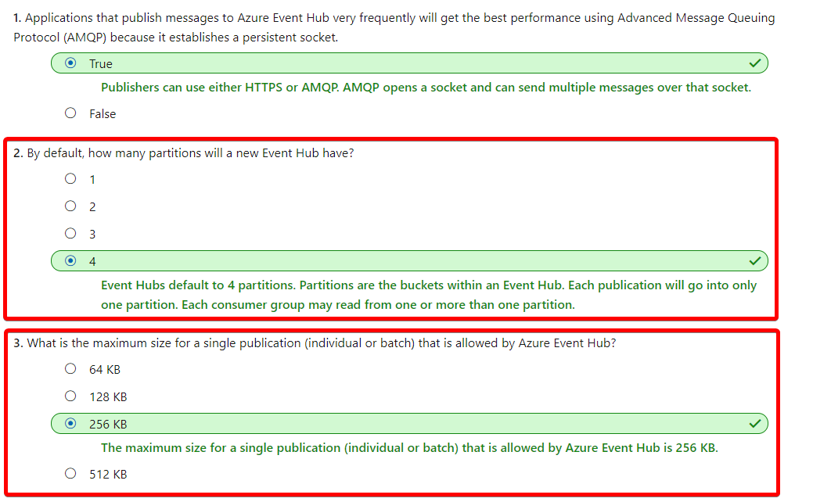

# [Enable reliable messaging for Big Data applications using Azure Event Hubs](https://docs.microsoft.com/en-au/learn/modules/enable-reliable-messaging-for-big-data-apps-using-event-hubs/index)
- [Introduction](https://docs.microsoft.com/en-au/learn/modules/enable-reliable-messaging-for-big-data-apps-using-event-hubs/1-introduction)
- [Create an Event Hub using the Azure CLI](https://docs.microsoft.com/en-au/learn/modules/enable-reliable-messaging-for-big-data-apps-using-event-hubs/2-create-an-event-hub-using-azure-cli)
  - Azure Event Hubs is a cloud-based, event-processing service that's capable of receiving and processing millions of events per second. Event Hubs acts as a front door for an event pipeline, where it receives incoming data and stores it until processing resources are available.
  - An entity that sends data to the Event Hubs is called a **publisher** and an entity that reads data from the Event Hubs is called a **consumer** or a **subscriber**. 
    - For publishers that send data frequently, **AMQP has the better performance**. However, it has a higher initial session overhead, because a persistent bidirectional socket and transport level security (TLS) or SSL/TLS has to be set up first.
  - **Events**
    - An event is a small packet of information (a datagram) that contains a notification. Events can be published individually, or in batches, but a single publication (individual or batch) **can't exceed 256 KB**.
    - Event subscribers are applications that use one of two supported programmatic methods to receive and process events from an Event Hub.
      - EventHubReceiver - A simple method that provides limited management options.
      - EventProcessorHost - An efficient method that we’ll use later in this module.
  - **Consumer groups**
    - **An Event Hub consumer group represents a specific view of an Event Hub data stream.** By using separate consumer groups, multiple subscriber applications can process an event stream independently, and without affecting other applications. However, the use of multiple consumer groups is not a requirement, and for many applications, the single default consumer group is sufficient.
  - **Defining an Event Hubs namespace**
    - **An Event Hubs namespace is a containing entity** for managing one or more Event Hubs.
    - Defining namespace-level settings. 
      - Certain settings such as namespace capacity (configured using **throughput units**), **pricing tier**, and **performance metrics** are defined at the namespace level. These are applicable for all the Event Hubs within that namespace. If you don't define these settings, a default value is used: 1 for capacity and Standard for pricing tier.
      - **You cannot change the throughput unit once you set it.**
    - Selecting a **unique** name for the namespace
  - Configuring a new Event Hub
    - The following parameters are required to create an Event Hub:
      - **Event Hub name** - Event Hub name that is unique within your subscription
      - **Partition Count** - The number of partitions required in an Event Hub (between 2 and 32). This should be directly related to the expected number of concurrent consumers. 
        - This **cannot be changed** after the hub has been created.
      - **Message Retention** - The number of days (between 1 and 7) that messages will remain available, if the data stream needs to be replayed for any reason. If not defined, this defaults to 7.
    - 
- [Exercise - Use the Azure CLI to Create an Event Hub](https://docs.microsoft.com/en-au/learn/modules/enable-reliable-messaging-for-big-data-apps-using-event-hubs/3-exercise-create-an-event-hub-using-azure-cli)
- [Configure applications to send or receive messages through an Event Hub](https://docs.microsoft.com/en-au/learn/modules/enable-reliable-messaging-for-big-data-apps-using-event-hubs/4-configure-applications-to-send-or-receive-messages-through-an-event-hub)
- [Exercise - Configure applications to send or receive messages through an Event Hub](https://docs.microsoft.com/en-au/learn/modules/enable-reliable-messaging-for-big-data-apps-using-event-hubs/5-exercise-configure-applications-to-send-or-receive-messages-through-an-event-hub)
- [Evaluate the performance of the deployed Event Hub using the Azure portal](https://docs.microsoft.com/en-au/learn/modules/enable-reliable-messaging-for-big-data-apps-using-event-hubs/6-evaluate-the-performance-of-the-deployed-event-hub-using-the-azure-portal)
- [Exercise - Evaluate the performance of the deployed Event Hub using the Azure portal](https://docs.microsoft.com/en-au/learn/modules/enable-reliable-messaging-for-big-data-apps-using-event-hubs/7-exercise-evaluate-the-performance-of-the-deployed-event-hub-using-the-azure-portal)
- [Summary](https://docs.microsoft.com/en-au/learn/modules/enable-reliable-messaging-for-big-data-apps-using-event-hubs/8-summary)
    