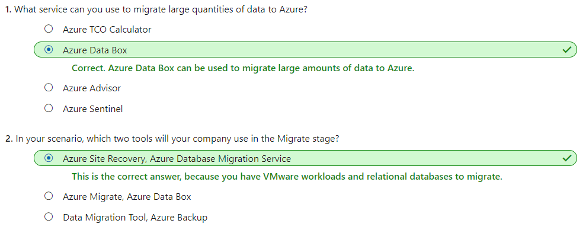
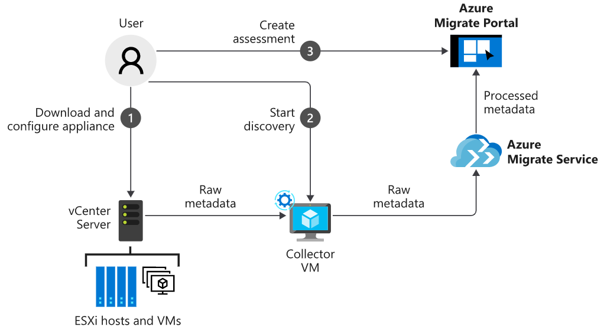
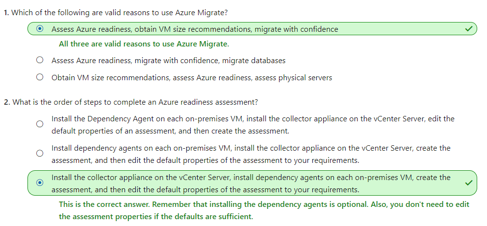
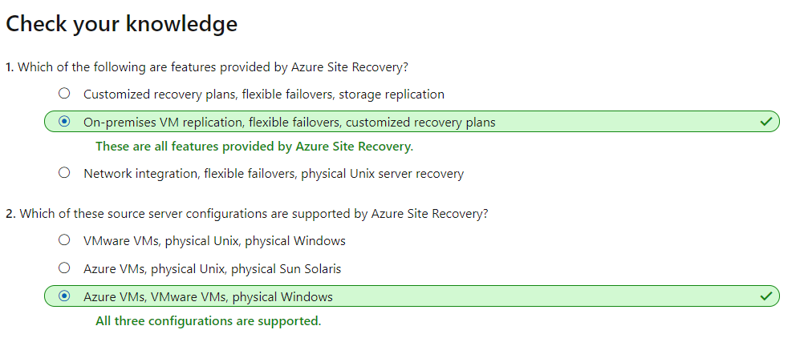
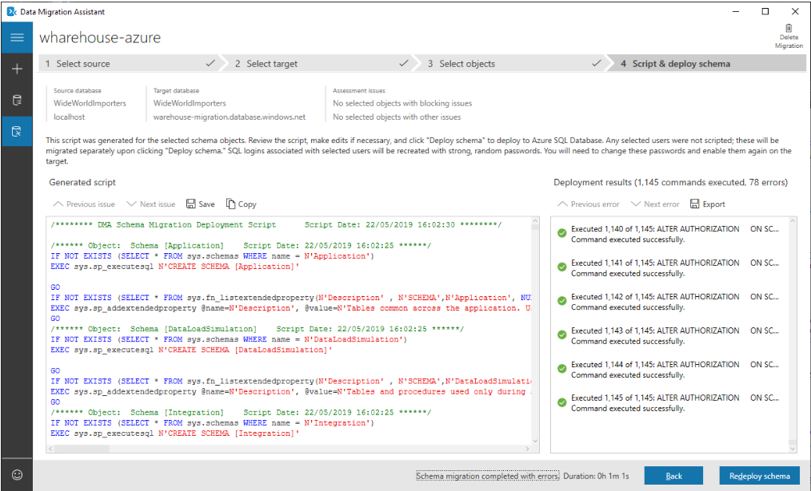
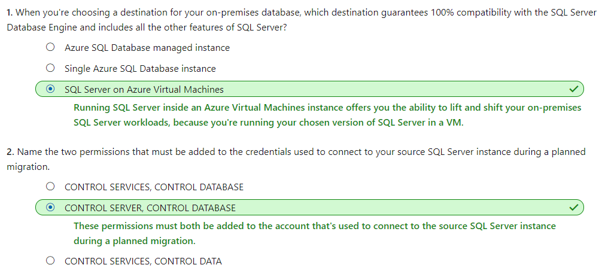

# [Design your migration to Azure](https://docs.microsoft.com/en-au/learn/modules/design-your-migration-to-azure/index)
- [Introduction](https://docs.microsoft.com/en-au/learn/modules/design-your-migration-to-azure/1-introduction/)
- [Plan your Azure migration](https://docs.microsoft.com/en-au/learn/modules/design-your-migration-to-azure/2-plan-your-azure-migration/)
  - Azure migration framework
    - Assess
    - Migration
    - Optimize
    - Monitor
  - **Assess**
    - Start with a full assessment of your current environment.
      - For each application, there are multiple migration options:
        - **Rehost**: Recreate your existing infrastructure in Azure.
        - **Refactor**: Move services running on virtual machines to platform-as-a-service (PaaS) services. 
        - **Rearchitect**: You might be forced to rearchitect some systems so that they can be migrated. Other apps could be changed to become cloud native, or to take advantage of new approaches to software, such as containers or microservices.
        - **Rebuild**: You might need to rebuild software if the cost to rearchitect it is more than that of starting from scratch.
        - **Replace**: While you're reviewing your estate, it's possible you'll find that third-party applications could completely replace your custom applications.
    - Identify tools
      |Service or tool|	Stage	|Use|
      |---|---|---|
      |Azure Migrate|	Assess|	Perform assessment and migration of VMware VMs, Hyper-V VMs, cloud VMs, and physical servers to Azure.|
      |Service Map|	Assess|	Maps communication between application components on Windows or Linux. Helps you identify dependencies when scoping what to migrate.|
      |Azure TCO Calculator	|Assess|	Estimates your monthly running costs in Azure.|
      |Azure Site Recovery|	Migrate|	Moves VMs from on-premises to Azure.|
      |Azure Database Migration Service|	Migrate|	Uses the Data Migration Assistant and the Azure portal to manage the whole process of moving database workloads to Azure.|
      |Azure Data Box|	Migrate|	Efficiently moves large datasets of either offline or online data to Azure.|
      |Data Migration Assistant|	Migrate|	Assesses SQL databases for compatibility, and then migrates the schema and data.|
      |Data Migration Tool|	Migrate|	Migrates existing databases to Azure Cosmos DB.|
      |Azure Cost Management|	Optimize|	Helps you monitor, control, and optimize ongoing Azure costs.|
      |Azure Advisor|	Optimize|	Helps optimize your Azure resources for high availability, performance, and cost.|
      |Azure Monitor|	Monitor|	Enables you to monitor your entire estate's performance. Includes application-health monitoring via enhanced telemetry, and setting up notifications.|
      |Azure Sentinel|	Monitor|	Provides intelligent security analytics for your applications.|
  - **Migrate**
    - Each tool will guide you through the migration. The steps to complete them are covered in later units. At a high level, the steps are:
      - Prepare the source (vCenter Server) and target (Azure) environments.
      - Set up and start the replication between the two.
      - Test that the replication has worked.
      - **Fail over** from the source servers to Azure.
    - For the database migrations, the high-level steps are:
      - Assess your on-premises databases.
      - Migrate the schemas.
      - Create and run an Azure Database Migration Service project to move the data.
      - Monitor the migration.
  - **Optimize**
    - Azure cost management
    - Azure Advisor
  - **Monitor**
    - Azure Monitor
      - Azure Monitor can capture health and performance information from Azure VMs if you install a Log Analytics agent. You can install the agent on machines running either Windows or Linux, and you can then set up alerting and reporting.
    - AzureSentinel
      - Azure Sentinel provides security information and event-management (SIEM) capabilities, along with artificial intelligence to help you protect against, detect, and respond to security events. This information helps security operations (SecOps) teams triage critical alerts and prioritize work effectively.
  - 
- [Assess your environment with Azure Migrate](https://docs.microsoft.com/en-au/learn/modules/design-your-migration-to-azure/3-assess-your-environment/)
  - Azure Migrate helps you **assess your current on-premises workloads**. After the assessment, Azure Migrate makes **recommendations for the size of VM** you'll need to provision.
  - Azure Migrate
    - Free
    - assesses on-premises VMware virtual machines for running in Azure. 
    - performance-based sizing calculations (virtual machine sizing, compute/storage)
    - supports the **visualization of dependencies** for those machines.
    - limitations
      - assesses only **VMware-based** virtual machines. When you use Azure Migrate
      - the assessments it produces are created within a **project**. Each project has a collector appliance that discovers up to **1,500 VMs**.
  - Work with Azure Migrate
    - 
    1. The Azure portal guides you through downloading a collector appliance, which carries out the discovery of VMs in your environment.
    2. Import and spin up the collector appliance, and then complete its configuration to connect it to the **Azure Migrate project**.
    3. The collector uses VMware PowerCLI cmdlets to do agentless data collection on your VMware estate.
         - VM cores, memory, disk sizes, and network adapters
         - performance data like CPU and memory usage, disk IOPS, disk throughput, and network output.
         - To receive and store the collected data, Azure Migrate requires that you open port 443 between your internal network and Azure for
    4. When the data collection is complete, it's pushed to your Azure Migrate project. 
    5. To see dependencies 
       - Azure Migrate will prompt you to install the **Microsoft Monitoring Agent** and **Dependency Agent** on each VM.
         - they collect data like fully qualified domain name (FQDN), OS, IP addresses, MAC addresses, running processes, and incoming and outgoing TCP connections.
    6. Create assessment in Azure portal    
  - 
- [Migrate servers with Azure Site Recovery](https://docs.microsoft.com/en-au/learn/modules/design-your-migration-to-azure/4-migrate-servers/)
  -  Azure Site Recovery is a service that can be used for disaster recovery for on-premises and Azure virtual machines, but can also be used to migrate virtual machines into Azure.
  -  The failover could be an on-premises-to-Azure failover, or a failover from one Azure region to another.
  -  **Preparation and prerequisites**
     -  **Account permissions**: Your Azure account must be either be the administrator account or an account with the permissions to do all of the following:
        -  Create a VM in the selected resource group
        -  Create a VM in the selected virtual network
        -  Write to an Azure storage account
        -  Write to an Azure managed disk
       - **Recovery Services vault**: Create a Recovery Services vault in which to store your virtual machines.
       - **Azure network**: The migrated virtual machines will connect to each other by using a virtual network. Routing and firewall rules should be in place so that the virtual network is reachable from your on-premises network.
  - **Prepare the VMware environment**
    - **Automatic discovery account**: Provide an account with access to VMware servers to discover virtual machines, and orchestrate replication, failover, and failback. This can be a user on the vCenter server or vSphere host with appropriate permissions.
    - **Mobility service account**: Install the Mobility service on each virtual machine. You can do either a push installation from the Azure console or a manual installation. If you use the push installation, the account needs permission to install software on each of the virtual machines.
    - **Connection after migration**: Enable Remote Desktop Protocol (RDP) on each virtual machine, and configure the Windows Firewall appropriately before migration.
    - **Set up the configuration server**: The configuration server coordinates communication between the on-premises environment and Azure. Deploy the Open Virtualization Application (OVA) template to a highly available virtual machine in your VMware environment.
  - **Migrate on-premises VMs to Azure**
    - **Set a protection goal**: For VMware environments, set the goal to on-premises migration to Azure by using the VMware vSphere Hypervisor.
    - **Set up the target environment**: Set the target environment in the Azure portal by selecting the Azure subscription and Resource Manager deployment model you want to use. Select migrating VMware to Azure. Site Recovery will then verify that a valid network exists in Azure, to which the migrated virtual machines will connect.
    - **Create a replication policy**: A replication policy contains settings such as a Recovery Point Objective (RPO) threshold. The policy is associated with the configuration server that has been deployed.
    - **Enable replication**: Enable the replication at the Recovery Service vault level.
      - **Configure the source**:
        - The source is the configuration server.
        - The machine type is virtual machines.
        - The vSphere host is the vCenter Server on-premises.
        - The process server is the configuration server.
      - **Configure the target**: On the target selection:
        - The target is Azure.
        - The subscription is your Azure subscription.
        - The resource group is your target resource group.
        - The network selection is the target network that you want migrated virtual machines to connect to.
        - The subnet is that of the target network.
      - **Select the virtual machines to migrate**.
      - **Configure the properties**: Select the domain account used by the process server to install the Mobility service on the VMware machines. You can cancel the selection for any disks that aren't to be replicated. By default, all the disks used by a virtual machine are migrated.
      - **Select the replication policy**: The replication policy sets the **App-consistent snapshot frequency, RPO threshold,** and the **Recovery point retention period**.
  - Post-migration steps
    - Consider improving the resilience of the migrated machines by:
      - Adding a backup schedule that uses Azure Backup.
      - Replicating the machines to a secondary region.
  - 
- [Migrate databases with Azure Database Migration Service](https://docs.microsoft.com/en-au/learn/modules/design-your-migration-to-azure/5-migrate-databases/)
  - Azure Database Migration Service enables online and offline migrations from multiple database sources to Azure data platforms, all with minimal downtime. The service uses the Microsoft Data Migration Assistant to generate assessment reports. Identified tasks are then performed by the Database Migration Service.
  - Offline vs. online migration
    - An offline migration requires shutting down the server at the start of the migration, which means downtime for the service. 
    - An online migration uses a continuous synchronization of live data, allowing a cutover to the Azure replica database at any time. The online option is the better of the two if you need to minimize downtime for your workload.
  - Azure Database Migration Service has two pricing tiers:
    - **Standard**: Supports only offline migrations. There's no charge to use this tier.
    - **Premium**: Supports **both offline and online** migrations. There's no charge for the first six months. After that period, you'll incur charges.
  - Your relational database can be migrated to a number of different destinations in Azure: 
    - **Single Azure SQL Database instance**
    - **Azure SQL Database managed instance**
    - **SQL Server on Azure Virtual Machines**
    - **Azure Database for MySQL**
    - **Azure Database for PostgresSQL**
    - **Azure Cosmos DB**
  - Overview of database migrations
    - Prerequisites
      - **Download the Data Migration Assistant**: Download and install the assistant locally on your on-premises servers running SQL Server.
      - **Create an Azure Virtual Network instance**: This virtual network is for Azure Database Migration Service when it uses the Azure Resource Manager deployment model. The virtual network provides connectivity to the on-premises environment.
      - **Configure the network security group**: The security group associated with the new virtual network should allow inbound connectivity to the service via ports 443, 53, 9354, 445, and 12000.
      - **Configure the Windows Firewall**: You must configure the firewall to allow the Database Migration Service to connect over port 1433. You can also open port 1434 if multiple named instances on dynamic ports exist on the same server.
      - **Configure credentials**:
        - Add **CONTROL SERVER** permissions to the credentials used to connect to the source SQL Server instance.
        - Add **CONTROL DATABASE** permissions to the credentials used to connect to the target Azure SQL Database instance.
      - **Provision your target database in Azure**: Create the database that is to be the target of the migration. Size it appropriately for the migrated workload.
    - Assess the on-premises databases
      - Using the Data Migration Assistant, create an **Assessment** project, give the project a name, and select the source and target servers. 
      - The assessment will generate a **report** on completion, including a set of recommendations and alternative approaches that could be taken for the migration.
    - Migrate the schema by using the Data Migration Assistant
      - To use the Data Migration Assistant to **migrate** the schema, create a new Migration project. 
      - Select your on-premises SQL Server instance as the source server, and your Azure SQL Database instance as the target server. Set the scope of the migration to **Schema Only**. 
      - After you connect to the source database, choose the schema objects to deploy to the new SQL database. The Data Migration Assistant will create a script to take the required actions. Then, select **Deploy Schema** to run the script. When the script is complete, check the target server to make sure the database has been configured correctly.
      - 
    - Migrate your data with Database Migration Service
      - Create an instance of Azure Database Migration Service. Choose the pricing tier based on whether you need an online or offline migration.
      - Create a new migration project. Choose the type of migration you want to perform, either offline or online.
      - Specify source and target server details, including the authentication information.
      - Identify the databases. Map the relevant target database on the target server to the source server.
      - Run and monitor the migration.
        - Select the Run migration button to start the migration. The migration activity screen will appear.
        - Track the progress until the process shows as completed.
      - After all the required databases are migrated, check them to make sure they're working.
      - 
- [Summary](https://docs.microsoft.com/en-au/learn/modules/design-your-migration-to-azure/6-summary/)
- [Azure Migrate](https://docs.microsoft.com/azure/migrate/migrate-overview)
- [Azure Site Recovery](https://docs.microsoft.com/azure/site-recovery/site-recovery-overview)
- [Azure Database Migration Service](https://docs.microsoft.com/azure/dms/dms-overview)
- [Physical server to Azure disaster recovery architecture](https://docs.microsoft.com/azure/site-recovery/physical-azure-architecture)
- [Hyper-V to Azure disaster recovery architecture](https://docs.microsoft.com/azure/site-recovery/hyper-v-azure-architecture)
- [Predict costs and optimize spending for Azure](https://docs.microsoft.com/learn/modules/predict-costs-and-optimize-spending/)
- [Design for efficiency and operations in Azure](https://docs.microsoft.com/learn/modules/design-for-efficiency-and-operations-in-azure/)
- [Azure Monitor overview](https://docs.microsoft.com/azure/azure-monitor/overview)
- [Azure Sentinel overview](https://docs.microsoft.com/azure/sentinel/overview)