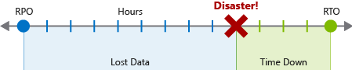
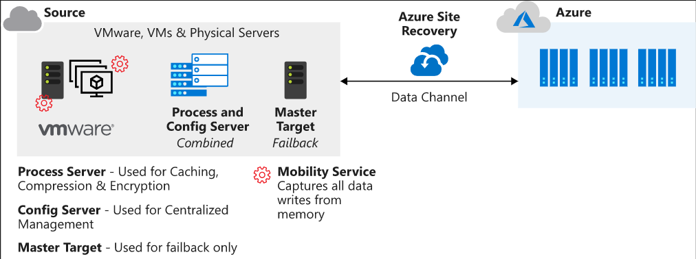
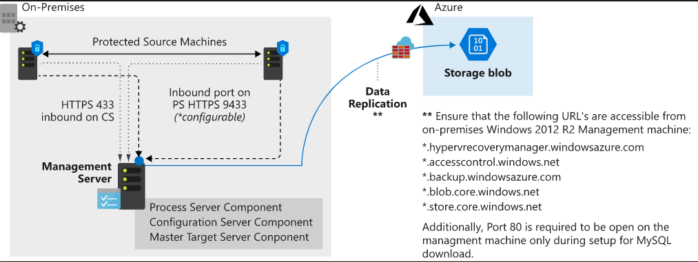
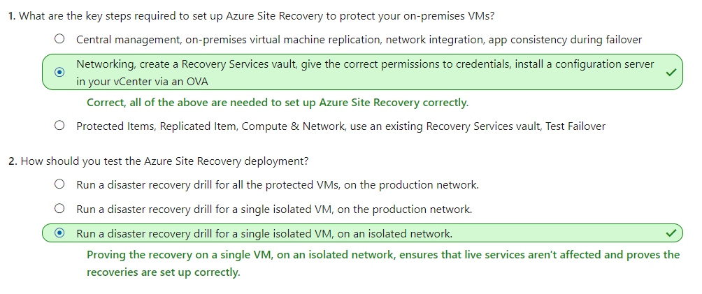
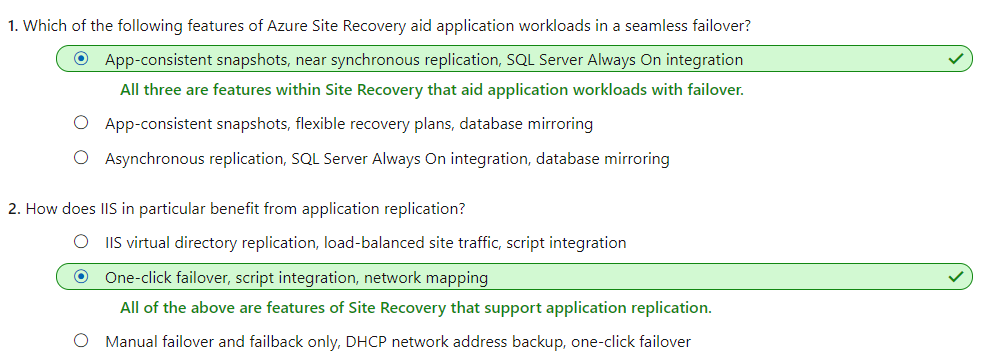
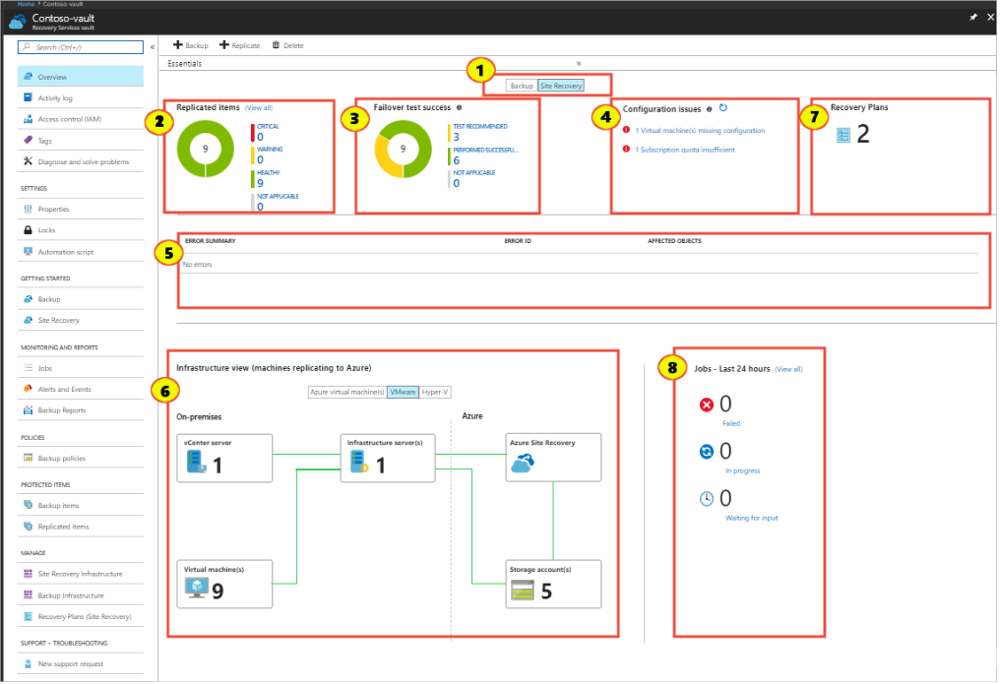
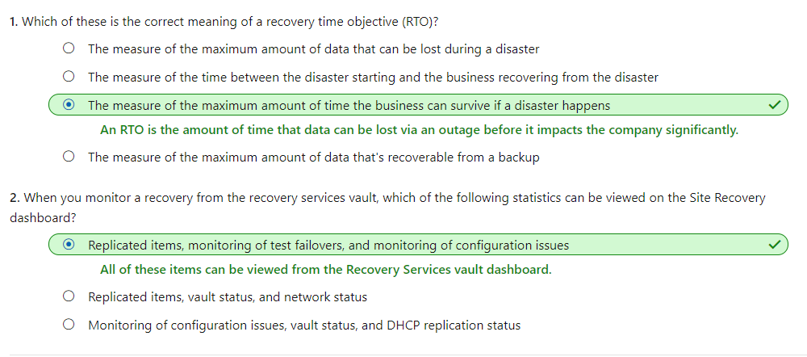
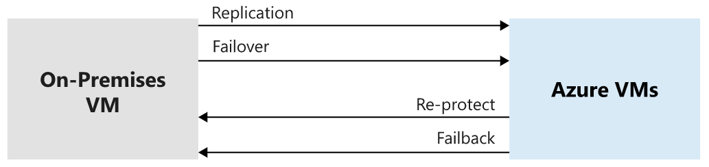
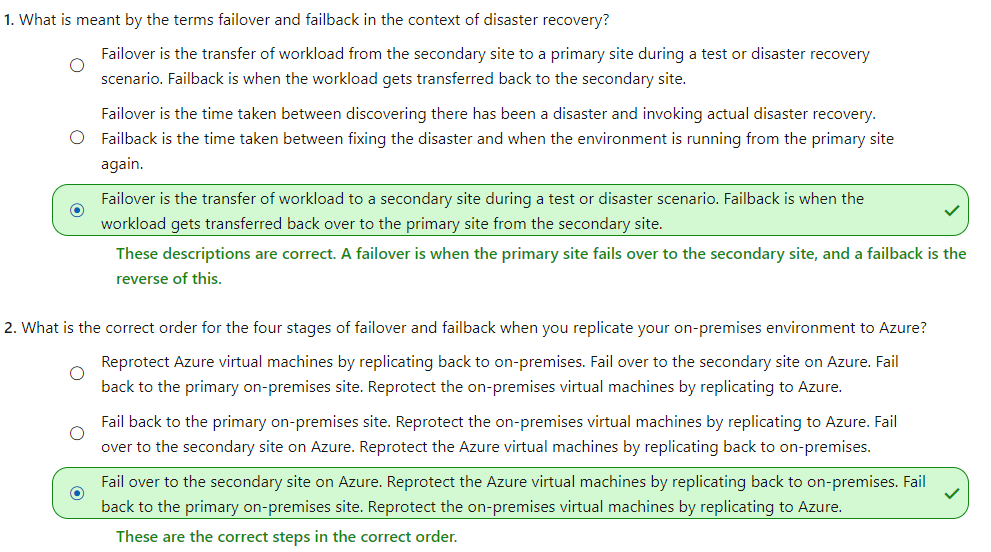

# [Protect your on-premises infrastructure from disasters with Azure Site Recovery](https://docs.microsoft.com/en-au/learn/modules/protect-on-premises-infrastructure-with-azure-site-recovery/index)
- [Introduction](https://docs.microsoft.com/en-au/learn/modules/protect-on-premises-infrastructure-with-azure-site-recovery/1-introduction/)
- [Azure Site Recovery overview](https://docs.microsoft.com/en-au/learn/modules/protect-on-premises-infrastructure-with-azure-site-recovery/2-azure-site-recovery-overview/)
  - Business continuity and disaster recovery
    - As part of your BCDR plan, identify the recovery time objectives (RTOs) and recovery point objectives (RPOs) for your applications. Both objectives help to realize the maximum tolerable hours that your business can be without specified services, and what the data recovery process should be. Let's look closer at each one.
    - 
    - **Recovery time objective**
      - A recovery time objective is a measure of the **maximum amount of time your business can survive** after a disaster before normal service is restored. Let's assume your RTO is 12 hours, which means that operations can continue for 12 hours without the business's core services functioning. If the downtime is 24 hours, your business would be seriously harmed.

    - **Recovery point objective**
      - A recovery point objective is a measure of the **maximum amount of data loss that's acceptable** during a disaster. A business can typically decide to do a backup every 24 hours, 12 hours, or even in real time. If a disaster occurs, there's always some data loss.

    - **Azure Site Recovery** can contribute to your disaster recovery plan because it can replicate workloads from a primary site to a secondary site. If an issue occurs at the primary site. Site Recovery can be automatically invoked to replicate the protected virtual machines to another location. The failover could be **from on-premises to Azure**, or it could be **from one Azure region to another**.
  - Some notable features of Azure Site Recovery are:
    - **Central management**: Replication can be set up and managed and failover and failback can be invoked all from within the Azure portal.
    - **On-premises virtual machine replication**: On-premises virtual machines can be replicated to Azure or to a secondary on-premises datacenter, if necessary.
    - **Azure virtual machine replication**: Azure virtual machines can be replicated from one region to another.
    - **App consistency during failover**: By using recovery points and application-consistent snapshots, virtual machines are kept in a consistent state at all times during replication.
    - **Flexible failover**: Failovers can be run on demand as a test or triggered during an actual disaster. Tests can be run to simulate a disaster recovery scenario without interruption to your live service.
    - **Network integration**: Site Recovery can manage network management during a replication and disaster recovery scenario. Reserved IP addresses and load balancers are included so that the virtual machines can work in the new location.
  - Set up Azure Site Recovery
    - **Networking**: A valid Azure virtual network is required for the replicated virtual machines to use.
    - **Recovery Services vault**: A vault in your Azure subscription stores the migrated VMs when a failover is run. The vault also contains the replication policy and the source and target locations for replication and failover.
    - **Credentials**: The credentials you use for Azure must have the Virtual Machine Contributor and Site Recovery Contributor roles to allow permission to modify both the VM and the storage that Site Recovery is connected to.
    - **Configuration server**: An on-premises VMware server fulfills several roles during the failover and replication process. It's obtained from the Azure portal as an open virtual machine appliance (OVA) for easy deployment. The configuration server includes a:
      - **Process server**: This server acts as a gateway for the replication traffic. It caches, compresses, and encrypts the traffic before sending it over the WAN to Azure. The process server also installs the mobility service onto all the physical and virtual machines targeted for failover and replication.
      - **Master target server**: This machine handles the replication process during a failback from Azure.
    - 
  - The replication process
    - 
    - After the prerequisite tasks are set up, replication of the machines can begin. They're replicated according to the created replication policy. During the initial stages of the first copy, the server data is replicated to Azure Storage. After the initial replication finishes, a second replication occurs. This time, the delta changes to the virtual machine are replicated to Azure.
  - Test and monitor a failover
    - After your environment is set up for disaster recovery, test it to make sure it's configured correctly and that everything works as you expect. Test the configuration by doing a disaster recovery drill on **an isolated VM**. It's a best practice to use **an isolated network** for the test so that live services aren't disrupted.
    - 
    - 
- [Workloads supported for protection with Azure Site Recovery](https://docs.microsoft.com/en-au/learn/modules/protect-on-premises-infrastructure-with-azure-site-recovery/3-workloads-supported-azure-site-recovery/)
  - Azure Site Recovery supported workloads
    - **Azure VM**: Replication is available for any workload that runs on a supported Azure virtual machine.
    - **Hyper-V VM**: Protection is available for any workload that runs on a Hyper-V virtual machine.
    - **Physical servers**: Protection is available for Windows and Linux operating systems.
    - **VMware VM**: Protection is available for any workload that runs in a VMware virtual machine
  - Features
    - **Near synchronous replication**
    - **App-consistent snapshots**
      - Snapshots taken for recovery purposes can view information in memory and pending I/O operations,
    - **Integration with SQL Always On**
    - **Flexible recovery plans**
      - **Network management**
        - The automated ability to simplify the reservation of IP addresses, configure load balancers, and integrate with Azure Traffic Manager.
      - **Automation library**
        -  Production-ready scripts that can be downloaded and integrated with the recovery plan to provide a fully automated recovery, if needed.
   -  
- [Run a disaster recovery drill](https://docs.microsoft.com/en-au/learn/modules/protect-on-premises-infrastructure-with-azure-site-recovery/4-run-disaster-recovery-drill/)
  - Disaster recovery drill
    - With Azure Site Recovery, you can do a full disaster recovery test without affecting your existing live environment.
    - Monitor a test recovery
      - 
      - Backup or Site Recovery
      - Replicated items: Healthy? Warning? Critical?
      - Failover test success:Test recommended? Performed successfully? Not applicable 
      - Configuration issues 
      - Error summary
      - Infrastructure view
      - Recovery Plans
      - Jobs - Last 24 hours
    -  
- [Failover and failback](https://docs.microsoft.com/en-au/learn/modules/protect-on-premises-infrastructure-with-azure-site-recovery/5-failover-failback/)
  - Failover and failback
    - A failover is the process that takes place when the decision is made to invoke the disaster recovery plan for the business.
      - This target replica environment takes the place of the live environment and becomes the primary infrastructure.
    - A failback is the reverse of a failover. 
      - The previous live environment (which is now the replica environment because a failover took place) takes back its original role and becomes the live environment again.
      - After the failover has happened in the first instance, a **reprotection** phase needs to occur. In this phase, you **bring the original environment back into sync with the new live** environment. 
    - The four stages of failover and failback actions are:
      - **Fail over to Azure**: If the on-premises primary site goes down, the decision to fail over to Azure (or your secondary site) is made, which creates virtual machines from the primary replicated data.
      - **Reprotect Azure virtual machines**: After the failover occurs, the Azure virtual machines must be reprotected so that they can replicate changes back to the on-premises environment after the disaster is averted. Virtual machines are powered off to ensure data consistency.
      - **Fail back to on-premises**: When the on-premises site is back up and running, it's possible to fail over back to that environment. It then becomes the live environment again. You can't fail back to physical servers. All systems must fail back to virtual machines.
      - **Reprotect on-premises virtual machines**: Reprotection of the on-premises virtual machines takes place so that they start replicating to Azure after the failback has happened successfully.
      - 
  - **Failback policies**
    - When you create an on-premises replication policy to copy your on-premises machines to Azure, an associated failback policy is automatically created for you. The policy has some fixed attributes that can't be changed. These attributes are:
      - Can only replicate back to your on-premises configuration server.
      - The recovery point objective is set at 15 minutes.
      - The recovery point retention is set to 24 hours.
      - App-consistent snapshots are set to every hour.
    - Running the failback stops the Azure VMs. After the replication has finished, start your on-premises VM to take over the workloads. Service will be disrupted, so schedule the failback at a time that won't affect your business.
    - 
- [Summary](https://docs.microsoft.com/en-au/learn/modules/protect-on-premises-infrastructure-with-azure-site-recovery/6-summary/)
  - [Azure Site Recovery overview](https://docs.microsoft.com/azure/site-recovery/site-recovery-overview)
  - [VMware disaster recovery overview](https://docs.microsoft.com/azure/site-recovery/vmware-azure-about-disaster-recovery)
  - [Hyper-V to Azure disaster recovery architecture](https://docs.microsoft.com/azure/site-recovery/hyper-v-azure-architecture)
  - [Physical server to Azure disaster recovery architecture](https://docs.microsoft.com/azure/site-recovery/physical-azure-architecture)