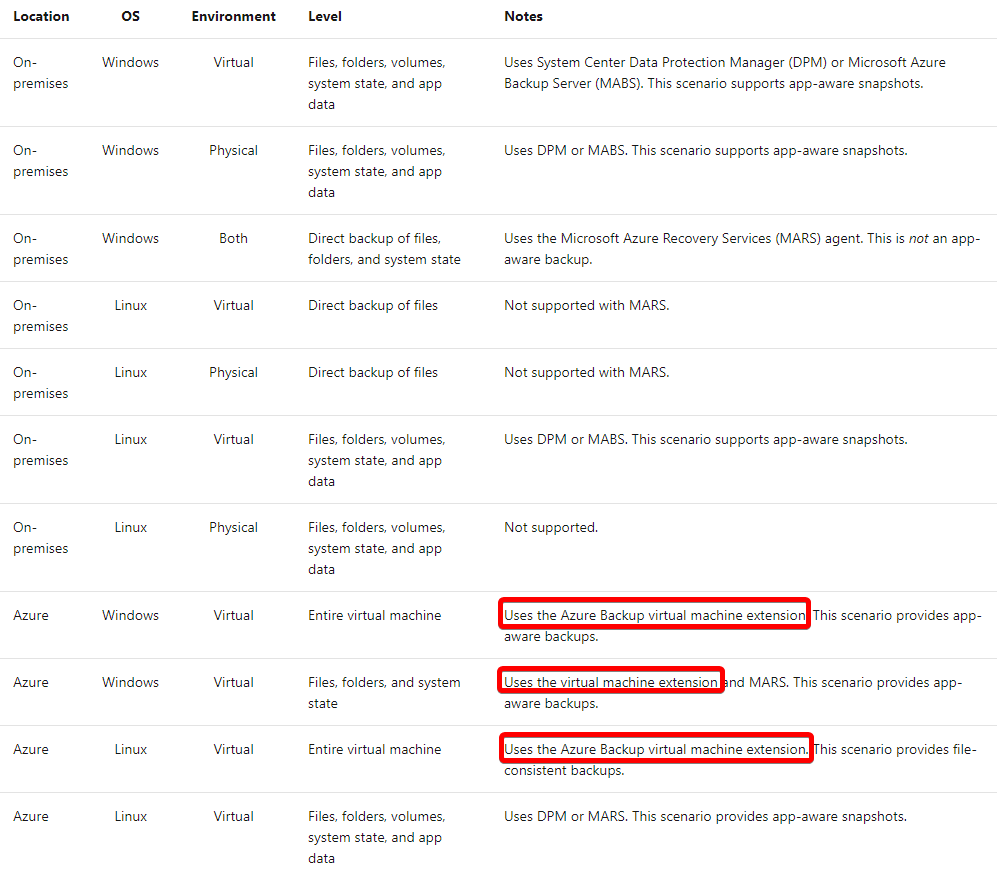
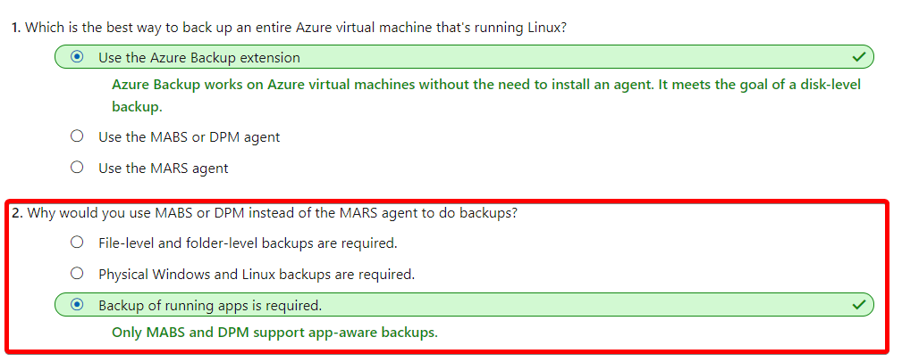
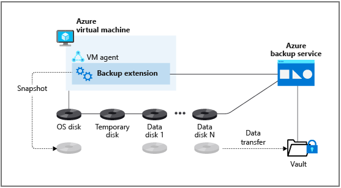
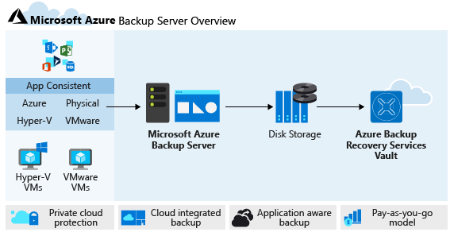
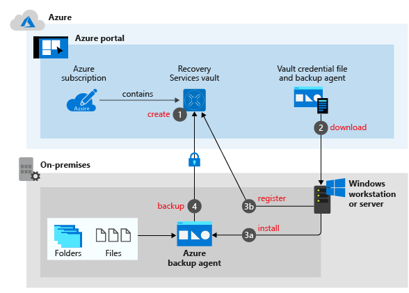
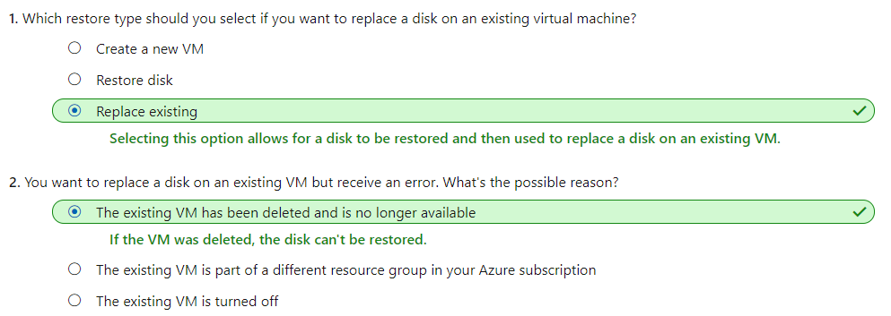
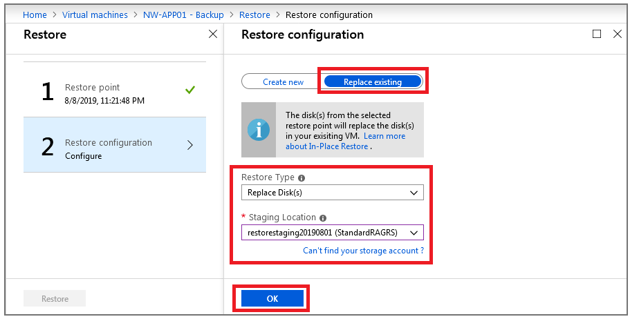

# [Protect your virtual machines by using Azure Backup](https://docs.microsoft.com/en-au/learn/modules/protect-virtual-machines-with-azure-backup/index)
- [Introduction](https://docs.microsoft.com/en-au/learn/modules/protect-virtual-machines-with-azure-backup/1-introduction/)
- [Azure Backup features and scenarios](https://docs.microsoft.com/en-au/learn/modules/protect-virtual-machines-with-azure-backup/2-azure-backup-features-scenarios/)
  - Azure Backup provides cloud-based backup and restore services for both **Azure** and **on-premises** virtual machines. 
    - **Data, workloads, and machine state** can all be backed up automatically at a **granular level**. 
    - Azure Backup offers integration with **Microsoft-specific applications** such as SQL Server, SharePoint, and Exchange.
    - Backups are stored in an **Azure Recovery Services vault** after you set up the appropriate component on the target machine.
  - **Azure Backup** versus **Azure Site Recovery**
    - **Azure Site Recovery**: Replicates virtual machine workloads to secondary locations for **failover** if a disaster affects a whole site.
    - **Azure Backup**: Recovers data more **granularly**. For example, it recovers virtual machine **disks**, or **files** and **folders** that became corrupted or were accidentally deleted by users.
  - Why use **Azure Backup**?
    - **Automatic storage management**: You can maintain a fully Azure-based backup solution, or a heterogeneous solution where **data is backed up and stored both on-premises and in Azure**. Using on-premises storage devices is free, and storing within Azure uses a pay-as-you-go model.
    - **High availability**: Because the service is cloud based, it's redundant and highly available by nature. The service doesn't need to be maintained, upgraded, or patched as a traditional solution would be.
    - **Unlimited data transfer**: Inbound and outbound backup traffic to your Azure subscription is unlimited.
    - **Data security**: The service uses AES 256-bit encryption for on-premises virtual machines and Storage Service Encryption for Azure virtual machines. Data is secured at rest on the Azure platform, and then decrypted when an authorized person or service accesses it.
    - **No-limit retention times**: Long-term and short-term options are available to keep your data, depending on your data retention policy.
    - **Highly available storage**: Two types of storage help ensure that data is always available:
      - **Locally redundant storage (LRS)**: Replicates data three times within the same region.
      - **Geo-redundant storage (GRS)**: Replicates data to another region within the geography. This is the default. We recommend this option in most cases, because it uses LRS in a primary region and a secondary region.
    - Azure Backup types
      - Only **MABS and DPM support app-aware backups**.
    - Tools/agents:
      - Microsoft Azure Backup Server (MABS)
        - app-aware
      - System Center Data Protection Manager (DPM)
        - app-aware
      - Microsoft Azure Recovery Services (MARS) agent
        - not app-aware
      - Azure Backup virtual machine extension
        - app-aware on Windows
    - Processes:
      - DPM/MABS backup
        - Backup using DPM/MABS and Azure Backup works as follows:
          1. DPM/MABS protection agent is installed on each machine that will be backed up.
          2. Machines and apps are backed up to local storage on DPM/MABS.
          3. The Microsoft Azure Recovery Services (MARS) agent is installed on the DPM server/MABS.
          4. The MARS agent backs up the DPM/MABS disks to a backup Recovery Services vault in Azure by using Azure Backup.
  
  **Location**|**OS**|**Environment**|**Level**|**Notes**
  :-----:|:-----:|:-----:|:-----:|:-----:
  On-premises|Windows|Virtual|Files, folders, volumes, system state, and app data|DPM or MABS, app-aware
  On-premises|Windows|Physical|Files, folders, volumes, system state, and app data|DPM or MABS, app-aware
  On-premises|Windows|Both|Direct backup of files, folders, and system state|MARS, not app-aware
  On-premises|Linux|Virtual|Direct backup of files|Not supported with MARS.
  On-premises|Linux|Physical|Direct backup of files|Not supported with MARS.
  On-premises|Linux|Virtual|Files, folders, volumes, system state, and app data|DPM or MABS, app-aware
  On-premises|Linux|Physical|Files, folders, volumes, system state, and app data|Not supported.
  Azure|Windows|Virtual|Entire virtual machine|Azure Backup VM extension, app-aware
  Azure|Windows|Virtual|Files, folders, and system state|Azure Backup VM extension and MARS, app-aware
  Azure|Linux|Virtual|Entire virtual machine|Azure Backup VM extension, file-consistent
  Azure|Linux|Virtual|Files, folders, volumes, system state, and app data|DPM or MARS, app-aware

      - 
  - SQL Server backups
    - If you need to back up SQL Server workloads, other options are available. Azure Backup can install a **workload backup extension** on **a SQL Server instance on Windows** to support the following options:
      - **Full**: Backs up the entire database and file groups. It also contains enough logs to do a restore. Transaction logs hold records of the most recent additions or removals of records in the database. Recent transaction logs are needed to perform an up-to-date restore of a database.
      - **Differential**: Based on the last full backup that was performed, and captures only blocks of data that changed since the last full backup.
      - **Transaction log**: Allows a point-in-time restoration of a database.
    - SQL Server on Linux does not currently integrate with Azure Backup.
    - 
- [Back up an Azure virtual machine by using Azure Backup](https://docs.microsoft.com/en-au/learn/modules/protect-virtual-machines-with-azure-backup/3-back-up-azure-virtual-machine/)
  - Snapshots
    |Extension|	OS|	Description|
    |---|---|---|
    |VMSnapshot|	Windows|	The extension works with Volume Shadow Copy Service (VSS) to take a copy of the data on disk and in memory.|
    |VMSnapshotLinux|	Linux|	The snapshot is a copy of the disk.|
  - different levels of consistency
    - **Application consistent**
      - The snapshot captures the virtual machine as a whole. It uses VSS writers to capture the content of the **machine memory** and any **pending I/O operations**.
      - For **Linux** machines, you'll need to **write custom pre or post scripts** per app to capture the application state.
      - You can get complete consistency for the virtual machine and all running applications.
    - **File system consistent**
      - If VSS fails on Windows, or the pre and post scripts fail on Linux, Azure Backup will still create a **file-system-consistent** snapshot.
      - During a recovery, no **corruption occurs** within the machine. But installed applications need to do their own cleanup during startup to become consistent.
    - **Crash consistent**
      - This level of consistency typically occurs if the virtual machine is shut down at the time of the backup.
      - No I/O operations or memory contents are captured during this type of backup. This method doesn't guarantee data consistency for the OS or app.
  - Recovery Services vault
    - Monitor Azure virtual machine backups.Hybrid scenarios are also supported.
    - Manage backup jobs and their properties.
    - Take advantage of access management contro
    - Quickly restore **files or folders within virtual machines** instead of recovering the whole machine.
    - Be assured that all data located in a Recovery Services vault is secured while at rest.
  - Backup agents
    - **Azure Backup virtual machine extension**
      - The Azure Backup extension is the default backup choice, because it's the most simple and straightforward method to quickly back up an Azure virtual machine. 
      - During the first backup, a **VMSnapshot** (for Windows) or **VMSnapshotLinux** (for Linux) extension is installed. 
      - they **don't enable file-level or folder-level restores.**
      - The snapshots are created and stored in a Recovery Services vault.
      - If your company's virtual machines are in **Azure**, and you** don't require file-level restores**, your company should use the Azure Backup extension.
      - 
    - **Microsoft Azure Backup Server protection agent**
      - The Microsoft Azure Backup Server (MABS) agent installed on an **Azure or on-premises** virtual machine allows that machine to back up to an Azure Backup server.
      -  The MABS agent can back up and restore **SQL** and other application services. You can also support workloads like **Exchange** and **SharePoint** by using the **AzureBackupWindowsWorkload** extension.
      -  Machines and workloads are backed up to an Azure Backup server, although this **doesn't move these backups to a Recovery Services vault**. If you need to move your backups to a Recovery Services vault, install the Microsoft Azure Recovery Services (MARS) agent.
      -  
    - **Microsoft Azure Recovery Services agent**
      - Azure Backup uses the MARS agent to back up **Windows files, folders, and system state data** to a Recovery Services vault. The agent is installed manually on the machines that you're backing up.
      - The MARS agent enhances the levels of backup if it's installed alongside the Azure Backup extension on an Azure virtual machine. MARS enables on-premises Windows machines to be backed up directly to a Recovery Services vault.
      - When the MARS agent is used in conjunction with an Azure Backup server, it will copy the snapshots from the server into a vault.
      - 
  - Backup process for an Azure virtual machine
    1. The first stage of the backup job is installing the extension automatically. The `VMSnapshot` extension is for Windows machines, and the `VMSnapshotLinux` extension is for Linux virtual machines.
       1. In a **Windows** environment, Azure Backup uses the **Volume Shadow Copy Service** to take **app-consistent** snapshots of the virtual machine that's used for the backup procedure.
       2. In a **Linux** environment, Azure Backup takes **file-consistent** snapshots that are used for the backup procedure.
    2. The snapshot is transferred to your Recovery Services vault in Azure.
       1. Each disk for the selected virtual machine is backed up in parallel for optimization purposes.
       2. After the first full backup, Azure Backup will identify the blocks of data that have changed. It will back up only that information, rather than the whole virtual machine a second time.
    3. Snapshots can take up to 24 hours to transfer to the Recovery Services vault in Azure. When the transfer finishes, the service will remove the snapshot and create a recovery point for the machine.
- [Exercise - Back up an Azure virtual machine](https://docs.microsoft.com/en-au/learn/modules/protect-virtual-machines-with-azure-backup/4-exercise-back-up-azure-virtual-machine/)
- [Restore virtual machine data](https://docs.microsoft.com/en-au/learn/modules/protect-virtual-machines-with-azure-backup/5-restore-virtual-machine-data/)
  - Restore options
    - **Create a new VM**
      - This is the quickest method to get a virtual machine up and running with default settings from a restore point.
      - You can choose the name, resource group, virtual network, and storage type before doing the restore.
      - can be used to quickly create a development server from the live version's backup.
    - **Restore disk**
      - Restore the backed-up disk so that it can be used to create a new virtual machine. The portal provides a template to help you customize the new machine.
      - The restore copies the virtual hard disk (VHD) to your chosen storage account. The VHD should be in the same location as the Recovery Services vault you're using. You can also attach the restored disk to an existing virtual machine.
      - can be used to quickly create a development server from the live version's backup. You can add configuration settings, like extra network adapters or an increased memory size.
    - **Replace existing**
      - Restore a disk and use it to replace the disk on an existing virtual machine.
      - Azure Backup takes a snapshot of the virtual machine before the recovered disk is attached. It stores the snapshot in a staging location that you specify. The Recovery Services vault stores the snapshot according to your retention policy.
      - This option supports only **unencrypted managed virtual machines.**
      - allows a disk to be restored and replaced on an existing virtual machine. This option can be useful if an operating system disk has failed during an update operation and can be recovered only with a restore.
  - Recover files from a backup
    - Files and folders are available for recovery from Azure virtual machines if the backup was created with the **Microsoft Azure Recovery Services (MARS)** agent. 
  - Restore an encrypted virtual machine
    - Azure Backup supports the backup and restore of machines encrypted through Azure Disk Encryption. Disk Encryption works with Azure Key Vault to manage the relevant secrets that are associated with the encrypted disk. For an additional layer of security, you can use key vault encryption keys (KEKs) to encrypt the secrets before they're written to the key vault.
    - File-level or folder-level restores are not supported with encrypted virtual machines. To restore to that level of granularity, the whole virtual machine has to be restored. You can then manually copy the file or folders.
    - The **Replace existing VM** option **isn't available for encrypted** virtual machines.
    - 
- [Exercise - Restore Azure virtual machine data](https://docs.microsoft.com/en-au/learn/modules/protect-virtual-machines-with-azure-backup/6-exercise-restore-virtual-machine-data/)
  - Stop the VM to allow for the restore
    - **A backup can't be restored if the VM is allocated and running**. If you forget to stop the VM, you'll see an error that's similar to the following example.
  - 
- [Summary](https://docs.microsoft.com/en-au/learn/modules/protect-virtual-machines-with-azure-backup/7-summary/)
  - [Latest Azure Backup pricing and availability](https://azure.microsoft.com/pricing/details/backup)
  - [Documentation for the Azure Backup service](https://docs.microsoft.com/azure/backup/)
  - [Azure Backup Server protection matrix](https://docs.microsoft.com/azure/backup/backup-mabs-protection-matrix)
  - [System Center Data Protection Manager](https://docs.microsoft.com/system-center/dpm/dpm-overview)
  - [Recovery Services vaults overview](https://docs.microsoft.com/azure/backup/backup-azure-recovery-services-vault-overview)