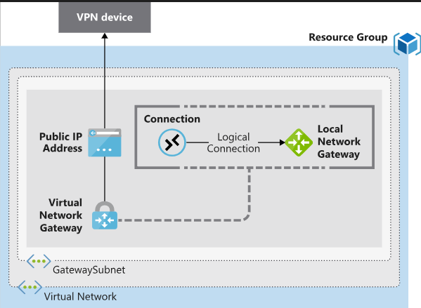
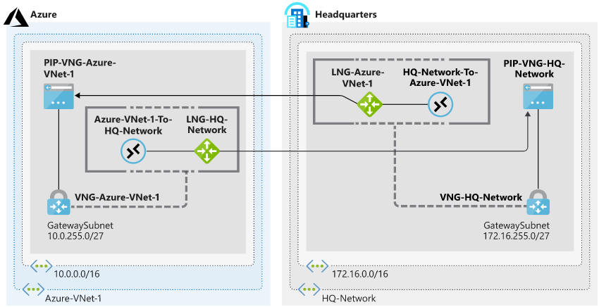
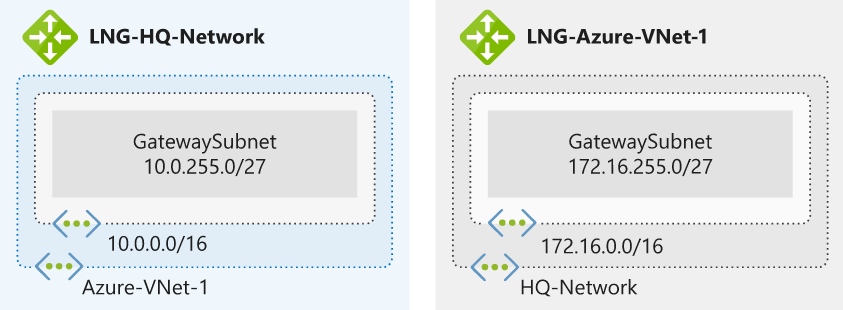

## [Connect your on-premises network to Azure with VPN Gateway](https://docs.microsoft.com/en-au/learn/modules/connect-on-premises-network-with-vpn-gateway/index)
- revisited 2020 May
- [Introduction](https://docs.microsoft.com/en-au/learn/modules/connect-on-premises-network-with-vpn-gateway/1-introduction)
- [Connect on-premises networks to Azure by using site-to-site VPN gateways](https://docs.microsoft.com/en-au/learn/modules/connect-on-premises-network-with-vpn-gateway/2-connect-on-premises-networks-to-azure-using-site-to-site-vpn-gateways)
  - **Azure VPN gateways**
    - A VPN gateway is a type of Virtual Network Gateway. VPN gateways are deployed in Azure virtual networks and enable the following connectivity:
  	  - Connect on-premises datacenters to Azure virtual networks through a **site-to-site** connection.
  	  - Connect individual devices to Azure virtual networks through a **point-to-site** connection.
  	  - Connect Azure virtual networks to other Azure virtual networks through a **network-to-network** connection.
	  - You can deploy only **one VPN gateway** in each virtual network, but you can use **one gateway to connect to multiple locations**.
   - **VPN type**
     - Policy-based VPNs
       - Support for IKEv1 only.
       - Internet Key Exchange (IKE)
       - For compatibility with legacy on-premises VPN devices.
       - *Static routing*
     - Route-based VPNs
       - Supports IKEv2.
       - *dynamic routing*
         - Instead, data packets are encrypted based on network routing tables that are created dynamically using routing protocols such as *BGP (Border Gateway Protocol)*.
     - Both types of VPN gateways (route-based and policy-based) in Azure use **pre-shared key** as the only method of authentication. 
  - Deploying VPN gateways
    - Required Azure resources
      - **Virtual network**. Deploy an Azure virtual network with enough address space for the additional subnet that you'll need for the VPN gateway. The address space for this virtual network **must not overlap** with the on-premises network that you'll be connecting to. Remember that you can deploy only one VPN gateway within a virtual network.
      - **GatewaySubnet**. Deploy a subnet called GatewaySubnet for the VPN gateway. Use at least a /27 address mask to make sure you have enough IP addresses in the subnet for future growth. You can't use this subnet for any other services.
      - **Public IP address**. 
      - **Local network gateway**. Create a local network gateway to define the on-premises network's configuration: where the VPN gateway will connect and what it will connect to. This configuration includes the on-premises VPN device's public IPv4 address and the on-premises routable networks. This information is used by the VPN gateway to route packets that are destined for on-premises networks through the IPSec tunnel.
      - **Virtual network gateway**. Create the virtual network gateway to route traffic between the virtual network and the on-premises datacenter or other virtual networks. The virtual network gateway can be either a VPN or ExpressRoute gateway, but this module deals only with VPN virtual network gateways.
      - **Connection**. Create a Connection resource to create a logical connection between the VPN gateway and the local network gateway.
        - The **connection** is made to the on-premises VPN device's IPv4 address as defined by the local network gateway.
        - The **connection** is made from the virtual network gateway and its associated public IP address.
    - Required on-premises resources
      - A **VPN device** that supports policy-based or route-based VPN gateways
      - A **public-facing** (internet-routable) IPv4 address
    
- High availability scenarios
  - **Active/standby**
    - By default, VPN gateways are deployed as two instances in an active/standby configuration, even if you only see one VPN gateway resource in Azure. 
    - When planned maintenance or unplanned disruption affects the active instance, the standby instance automatically assumes responsibility for connections without any user intervention.
  - **Active/active**
    - With the introduction of support for the BGP routing protocol, you can also deploy VPN gateways in an active/active configuration. In this configuration, you assign a unique public IP address to each instance.
  - **ExpressRoute failover**
    - Another high availability option is to configure a VPN gateway as a secure failover path for ExpressRoute connections.
  - **Zone-redundant gateways**
    - In regions that support availability zones, VPN and ExpressRoute gateways can be deployed in a zone-redundant configuration.

- [Exercise - Prepare Azure and on-premises virtual networks by using Azure CLI commands](https://docs.microsoft.com/en-au/learn/modules/connect-on-premises-network-with-vpn-gateway/3-exercise-prepare-azure-and-on-premises-vnets-using-azure-cli-commands)
  - 
  - Create the Azure-side resources
    - Add **Vnet** as Azure Vnet
        ```
        az network vnet create \
            --resource-group [sandbox resource group name] \
            --name Azure-VNet-1 \
            --address-prefix 10.0.0.0/16 \
            --subnet-name Services \
            --subnet-prefix 10.0.0.0/24
        ```
    - Add **GatewaySubnet** for in the Vnet
        ```
        az network vnet subnet create \
          --resource-group [sandbox resource group name] \
          --vnet-name Azure-VNet-1 \
          --address-prefix 10.0.255.0/27 \
          --name GatewaySubnet
        ```
    - Add **gateway** represents the on premises network
        ```
          az network local-gateway create \
          --resource-group [sandbox resource group name] \
          --gateway-ip-address 94.0.252.160 \
          --name LNG-HQ-Network \
          --local-address-prefixes 172.16.0.0/16
        ```
  - Create the simulated on-premises network and supporting resources
    - Add Vnet
      ```
      az network vnet create \
        --resource-group [sandbox resource group name] \
        --name HQ-Network \
        --address-prefix 172.16.0.0/16 \
        --subnet-name Applications \
        --subnet-prefix 172.16.0.0/24
      ```
    - Add Gatewaysubnet 
      ```
        az network vnet subnet create \
          --resource-group [sandbox resource group name] \
          --address-prefix 172.16.255.0/27 \
          --name GatewaySubnet \
          --vnet-name HQ-Network
      ```
    - Add gateway represents the Azure Vnet
      ```
        az network local-gateway create \
          --resource-group [sandbox resource group name] \
          --gateway-ip-address 94.0.252.160 \
          --name LNG-Azure-VNet-1 \
          --local-address-prefixes 10.0.0.0/16
      ```
    - At the end we would have
      - 

- [Exercise - Create a site-to-site VPN gateway by using Azure CLI commands](https://docs.microsoft.com/en-au/learn/modules/connect-on-premises-network-with-vpn-gateway/4-exercise-create-a-site-to-site-vpn-gateway-using-azure-cli-commands)
  - Create the VPN gateway and PIP
    - Create PIP for Azure 
    - Crate VPN gateway for Azure vnet
      ```
      az network vnet-gateway create \
        --resource-group [sandbox resource group name] \
        --name VNG-Azure-VNet-1 \
        --public-ip-address PIP-VNG-Azure-VNet-1 \
        --vnet Azure-VNet-1 \
        --gateway-type Vpn \
        --vpn-type RouteBased \
        --sku VpnGw1 \
        --no-wait
      ```
    - Create PIP for on-premises Vnet 
    - Crate VPN gateway for on-premises vnet
      ```
      az network vnet-gateway create \
          --resource-group [sandbox resource group name] \
          --name VNG-HQ-Network \
          --public-ip-address PIP-VNG-HQ-Network \
          --vnet HQ-Network \
          --gateway-type Vpn \
          --vpn-type RouteBased \
          --sku VpnGw1 \
          --no-wait
      ```
    - Update the LNG-HQ-Network local network gateway so that it points to the public IP address attached to the VNG-HQ-Network virtual network gateway. Because we are using placholders when creating the local gateway
      ```
      az network local-gateway update \
        --resource-group [sandbox resource group name] \
        --name LNG-HQ-Network \
        --gateway-ip-address $PIPVNGHQNETWORK
      ```
  - Create the connections
    - Create the shared key to use for the connections. In the following command, replace <shared key> with a text string to use for the IPSec pre-shared key. The pre-shared key is a string of printable ASCII characters no longer than 128 characters. You'll use this pre-shared key on both connections.
      ```
      SHAREDKEY=<shared key>
      ```
    - Run this command in Cloud Shell to create a connection from **VNG-Azure-VNet-1** to **LNG-HQ-Network**.
      ```
        az network vpn-connection create \
        --resource-group [sandbox resource group name] \
        --name Azure-VNet-1-To-HQ-Network \
        --vnet-gateway1 VNG-Azure-VNet-1 \
        --shared-key $SHAREDKEY \
        --local-gateway2 LNG-HQ-Network
      ```
    - Run this command in Cloud Shell to create a connection from **VNG-HQ-Network** to **LNG-Azure-VNet-1**.This connection would normally be created from your on-premises device.
      ```
        az network vpn-connection create \
          --resource-group [sandbox resource group name] \
          --name HQ-Network-To-Azure-VNet-1  \
          --vnet-gateway1 VNG-HQ-Network \
          --shared-key $SHAREDKEY \
          --local-gateway2 LNG-Azure-VNet-1
      ```
  - Verification steps
    - using `az network vpn-connection show`
  - The final structure
    - 
- [Summary](https://docs.microsoft.com/en-au/learn/modules/connect-on-premises-network-with-vpn-gateway/5-summary)
