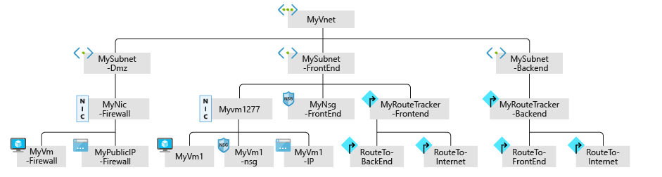
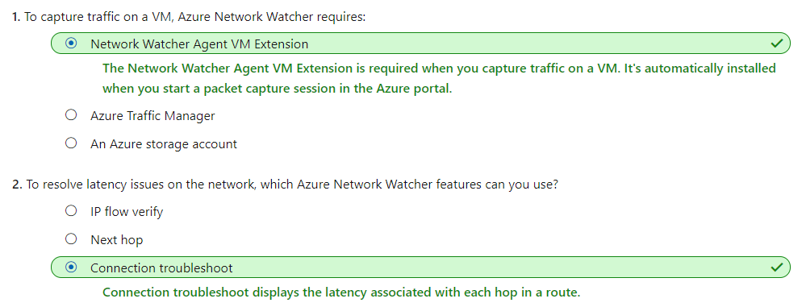
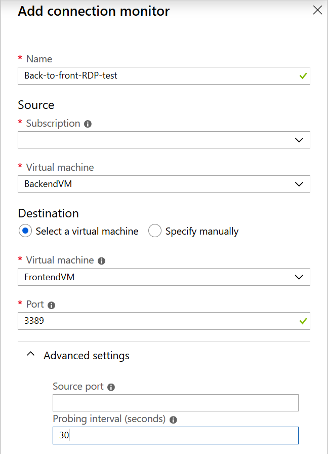
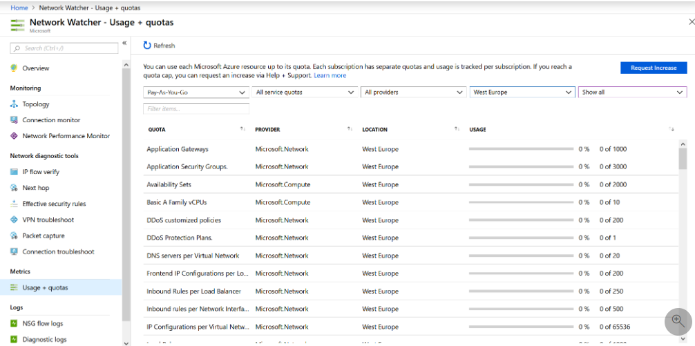
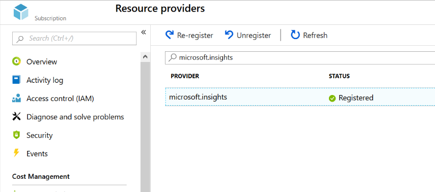

## [Monitor and troubleshoot your end-to-end Azure network infrastructure by using network monitoring tools](https://docs.microsoft.com/en-au/learn/modules/troubleshoot-azure-network-infrastructure/index)
- Revisited 2020 May
- [Introduction](https://docs.microsoft.com/en-au/learn/modules/troubleshoot-azure-network-infrastructure/1-introduction)
- [Troubleshoot a network by using Network Watcher monitoring and diagnostic tools](https://docs.microsoft.com/en-au/learn/modules/troubleshoot-azure-network-infrastructure/2-troubleshoot-networking-with-network-watcher)
  - **What is Network Watcher?**
    - Network Watcher is an Azure service that combines tools in a central place to diagnose the health of Azure networks. The Network Watcher tools are divided into two categories:
      - **Monitoring tools**
      - **Diagnostic tools**
  - **Network Watcher monitoring tools**
    - Network Watchers provides three monitoring tools:
    - **Topology**
      - The topology tool generates **a graphical display** of your Azure virtual network, its resources, its interconnections, and their relationships with each other.
      - You can use the topology tool to **visualize** and understand the infrastructure you're dealing with before you start troubleshooting.
      - Here's an example of a topology generated for a virtual network named MyVNet:
        - 
    - **Connection Monitor**
      - The Connection Monitor tool provides a way to **check** that **connections** work between Azure resources. 
      - This tool also measures the latency between resources.
      - It can probe VMs at regular intervals to look for failures or changes.
    - **Network Performance Monitor**
      - The Network Performance Monitor tool enables you to **track and alert on latency and packet drops over time**. It gives you a centralized view of your network.
      - You can use Network Performance Monitor to monitor endpoint-to-endpoint connectivity:
        - Between branches and datacenters.
        - Between virtual networks.
        - For your connections between on-premises and the cloud.
        - For Azure ExpressRoute circuits.
  - **Network Watcher diagnostic tools**
    - **IP flow verify**
      - The IP flow verify tool tells you if packets are allowed or denied for a specific virtual machine. If a network security group denies a packet, the tool tells you the name of that group so that you can fix the problem.
      - If a network security group denies a packet, the tool tells you the name of that group so that you can fix the problem.
    - **Next hop**
      - With the next hop tool, you can determine how a packet gets from a VM to any destination. 
      - You specify the source VM, source network adapter, source IP address, and destination IP address. The tool then determines the packet's destination. 
      - You can use this tool to diagnose problems caused by incorrect routing tables.
    - **Security group view**
      - The security group view tool in Network Watcher displays all the effective NSG rules applied to a network interface.
    - **Packet capture**
      - You use the packet capture tool to record all of the packets sent to and from a VM. You'll then review the captured to gather statistics about network traffic or diagnose anomalies, such as unexpected network traffic on a private virtual network.
      - The packet capture tool is a **virtual machine extension** that is remotely started through Network Watcher and happens automatically when you start a packet capture session.
    - **Connection troubleshoot**
      - You use the connection troubleshoot tool to check TCP connectivity between a source and destination VM. You can specify the destination VM by using an FQDN, a URI, or an IP address.
      - If the connection is unsuccessful, you'll see details of the fault. Fault types include:
        - CPU. The connection failed because of high CPU utilization.
        - Memory. The connection failed because of high memory utilization.
        - GuestFirewall. The connection was blocked by a firewall outside Azure.
        - DNSResolution. The destination IP address couldn't be resolved.
        - NetworkSecurityRule. The connection was blocked by an NSG.
        - UserDefinedRoute. There's an incorrect user route in a routing table.
    - **VPN troubleshoot**
      - You can use the VPN troubleshoot tool to diagnose problems with virtual network gateway connections. This tool runs diagnostics on a virtual network gateway connection and returns a health diagnosis.
      - The following table shows examples of different fault types.
        - NoFault
        - GatewayNotFound
        - PlannedMaintenance
        - UserDrivenUpdate
        - VipUnResponsive
        - PlatformInActive
  - Azure Network Watcher use case scenarios
    - There are connectivity issues in a single-VM network
      - Cannot connect with RDP
        - use IP flow verify to specify the VM's IP address and the RDP port 3389. Then specify the remote VM's IP address and port.
      - A VPN connection isn't working
        - When you run the tool, it checks the gateway for common issues and returns the health diagnosis.
      - No servers are listening on designated destination ports
        - Your colleagues have deployed VMs in a single virtual network and can't connect between them.
        - Use the connection troubleshoot tool to troubleshoot this issue. In this tool, you specify the local and remote VMs. In the probe setting, you can choose a specific port.
  - Quiz
    - 
- [Exercise - Troubleshoot a network by using Network Watcher monitoring and diagnostic tools](https://docs.microsoft.com/en-au/learn/modules/troubleshoot-azure-network-infrastructure/3-exercise-troubleshoot-networking-with-network-watcher)
  - Configure a virtual network and VMs
  - Enable Network Watcher for your region
    ```
    az network watcher configure \
    --resource-group $rg \
    --locations EastUS \
    --enabled
    ```
  - Use Connection Monitor to run tests from the back end to the front end
    - Test RDP from backendVM to frontendVM
      - 
- [Troubleshoot a network by using Network Watcher metrics and logs](https://docs.microsoft.com/en-au/learn/modules/troubleshoot-azure-network-infrastructure/4-troubleshoot-networking-with-network-watcher-metrics-logs)
  - Usage and quotas
    - Only one instance of Network Watcher is required per subscription per region. This instance gives you a view of usage and quotas so that you can see if you're at risk of hitting a quota.
      - 
  - Logs
    - Flow logs
      - In flow logs, you can view information about ingress and egress IP traffic on network security groups. Flow logs show outbound and inbound flows on a per-rule basis, based on the network adapter that the flow applies.
      - Flow logs store data in a JSON file.
    - Diagnostic logs
      - diagnostic logs are a central place to enable and disable logs for Azure network resources.
    - Traffic analytics
      - The tool gives insights into network activity across subscriptions. You can diagnose security threats such as open ports, VMs communicating with known bad networks, and traffic flow patterns. Traffic analytics analyzes NSG flow logs across Azure regions and subscriptions. You can use the data to optimize network performance.
    - Use case scenarios
      - CPU bottlenecks
        - You might see different types of patterns on the monitoring graphs
          - Isolated spikes. A spike might be related to a scheduled task or an expected event. 
          - Spike up and constant. A new workload might cause this trend. 
          - Constant. You should identify the processes that consume most resources and consider adding capacity.
          - Steadily increasing. This trend might indicate inefficient code or a process taking on more user workload.
      - Memory bottlenecks
        - Spike up and constant consumption. 
        - Steadily increasing consumption.
        - Page or swap file usage. 
      - Disk bottlenecks
        - If you see **AverageServerLatency** increase at the same time as **TimeOutErrors**, it might be a platform issue. Raise a case with Microsoft technical support.
        - If you see **ThrottlingError**, you're hitting the IOPS limit of the account.
      - Virtual machine firewall rules that block traffic   
        - Run IP flow verify, and specify the local VM and the remote VM.
      - Inability of the front-end and back-end subnets to communicate
        - Run the IP flow verify tool from the front-end VM to the back-end VM. 
- [Exercise - Troubleshoot a network by using Network Watcher metrics and logs](https://docs.microsoft.com/en-au/learn/modules/troubleshoot-azure-network-infrastructure/5-exercise-troubleshoot-networking-with-network-watcher-metrics-logs)
  - Register the Microsoft.Insights provider
    - 
  - Create a storage account
  - Create a Log Analytics workspace
  - Enable flow logs
    - To set up flow logs, you must configure the NSG to connect to the storage account, and add traffic analytics for the NSG.
- [Summary](https://docs.microsoft.com/en-au/learn/modules/troubleshoot-azure-network-infrastructure/6-summary)
  - Learn more
    - Azure Network Watcher Agent virtual machine extension for Windows
    - Network Watcher Agent virtual machine extension for Linux
    - Visualizing network security group flow logs with Power BI
    - Visualize Azure Network Watcher NSG flow logs using open-source tools
    - Network Performance Monitor supported regions