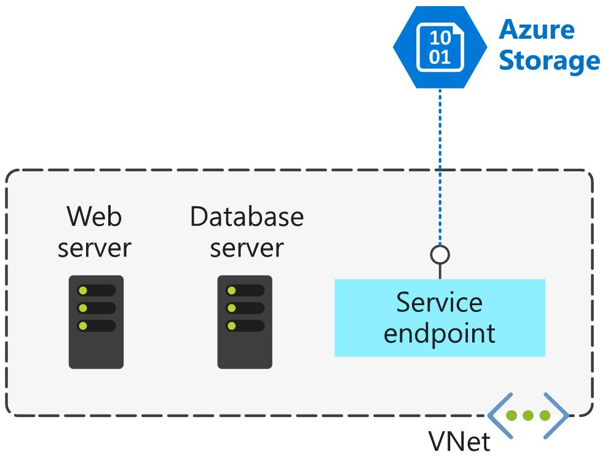

## [Secure and isolate access to Azure resources by using network security groups and service endpoints](https://docs.microsoft.com/en-au/learn/modules/secure-and-isolate-with-nsg-and-service-endpoints/index)
- Revisited 2020 May
- [Introduction](https://docs.microsoft.com/en-au/learn/modules/secure-and-isolate-with-nsg-and-service-endpoints/1-introduction)
- [Use network security groups to control network access](https://docs.microsoft.com/en-au/learn/modules/secure-and-isolate-with-nsg-and-service-endpoints/2-network-security-groups)
  - Network security groups
    - Network security groups filter network traffic to and from Azure resources. 
    - Network security groups contain **security rules** that you configure to allow or deny inbound and outbound traffic. 
    - You can use network security groups to filter traffic between virtual machines or subnets, both within a virtual network and from the internet.
  - Network security group assignment and evaluation
    - Network security groups are assigned to 
      - a **network** interface or a **subnet**. 
      - **VMs**
    - When you assign a network security group to a subnet, the rules apply to **all network interfaces** in that subnet. 
    - Each network security group is evaluated independently.
      - Inbound traffic is 
        - first evaluated by the NSG applied to the subnet 
        - then by the NSG applied to the network interface. 
      - Outbound traffic from a virtual machine is 
        - first evaluated by the NSG applied to the network interface
        - and then by the NSG applied to the subnet.
      - 
    - Each subnet and network interface can have one network security group applied to it. 
    - Network security groups support TCP, UDP, and ICMP, and operate at Layer 4 of the OSI model.
  - Security rules
    - properties
      - Name:	A unique name within the network security group.
      - Priority:	A number between 100 and 4096.
      - Source or destination:	Any, or an individual IP address, classless inter-domain routing (CIDR) block (10.0.0.0/24, for example), service tag, or application security group.
      - Protocol:	TCP, UDP, or Any.
      - Direction:	Whether the rule applies to inbound, or outbound traffic.
      - Port range:	An individual port or range of ports.
      - Action:	Allow or deny the traffic.
    - priority
      - Network security group security rules are evaluated by priority **from small to large number**, using the 5-tuple information (source, source port, destination, destination port, and protocol) to allow or deny the traffic. 
      - **When the conditions for a rule match the device configuration, rule processing stops.** 
    - Stateful connections
      - Return traffic is automatically allowed for the same TCP/UDP session. For example, an inbound rule allowing traffic on port 80 also allows the virtual machine to respond to the request (typically on an ephemeral port). You don't need a corresponding outbound rule.
    - **Default security rules**
      - T**hese default rules allow connectivity within a virtual network and from Azure load balancers**. 
      - **They also allow outbound communication to the internet, and deny inbound traffic from the internet**.
    - Augmented security rules
      - **multiple IP addresses**
      - **multiple ports**
      - **service tags**
        - Service tags represent a group of IP addresses, and help simplify the configuration of your security rules. 
        - Service tags simplify security for virtual machines and Azure virtual networks, by allowing you to restrict access by resources or services. 
        - **Microsoft manages the service tags (you can't create your own)**
          - VirtualNetwork - This tag represents all virtual network addresses anywhere in Azure, and in your on-premises network if you're using hybrid connectivity.
          - AzureLoadBalancer - This tag denotes Azure's infrastructure load balancer. The tag translates to the virtual IP address of the host (168.63.129.16) where Azure health probes originate.
          - Internet - This tag represents anything outside the virtual network address that is publicly reachable, including resources that have public IP addresses. One such resource is the Web Apps feature of Azure App Service.
          - AzureTrafficManager - This tag represents the IP address for Azure Traffic Manager.
          - Storage - This tag represents the IP address space for Azure Storage. You can specify whether traffic is allowed or denied. You can also specify if access is allowed only to a specific region, but you can't select individual storage accounts.
          - SQL - This tag represents the address for Azure SQL Database, Azure Database for MySQL, Azure Database for PostgreSQL, and Azure SQL Data Warehouse services. You can specify whether traffic is allowed or denied, and you can limit to a specific region.
          - AppService - This tag represents address prefixes for Azure App Service.
      - **application security groups**
        - ASGs are a way to define your own groups of resources So that they cane be used in the Source or destinations of the rules
        - An application security group allows you to group network interfaces together. You can then use that application security group as a source or destination rule within a network security group.

- [Exercise - Create and manage network security groups](https://docs.microsoft.com/en-au/learn/modules/secure-and-isolate-with-nsg-and-service-endpoints/3-exercise-network-security-groups)
  - Create a virtual network and network security group
    - Create resource group
      ````
      rg = <resource group name>
      az group create --name $rg --location <location>
      ```
    - Create Vnet with subnet
      ```
      az network vnet create \
        --resource-group $rg \
        --name ERP-servers
        --address-prefix 10.0.0.0/16 \
        --subnet-name applications\
        --subnet-prefix 10.0.0.0/24
      ```
    - Create database vnet
      ```
      az network vnet subnet create \
        --resource-group $rg
        --vnet-name ERP-servers
        --name databases
        --address-prefix 10.0.1.0/24
      ```    
    - Create nsg
      ```
      az network nsg create \
        --resource-group $rg
        --name ERP-SERVERS-NSG
      ```
  - Create VMs running Ubuntu
      ```
      az vm create \
      --resource-group $rg
      --name AppServer
      --vnet-name ERP-servers
      --subnet Applications
      --nsg ERP-SERVERS-NSG
      --image UbuntuLTS
      --size Standard_B1Ls
      --admin-username azureuser
      -no-wait
      -admin-password
      ```
  - all ssh attempts will fail at this stage because the default rule is blocking all inbound traffic
  - Create a security rule for SSH
    ```
      az network nsg rule create \
        --resource-group
        --nsg-name
        --name
        --direction Inbound
        --priority 100
        --source-address-prefixes '*'
        --source-port-ranges '*'
        --destination-address-prefixes '*'
        --destination-port-ranges 22
        --access Allow
        --protocal TCP
        --description "Allow inbound SSH"
    ```
  - Create a security rule to prevent web access
    - add a rule so that AppServer can communicate with DataServer over HTTP, but DataServer can't communicate with AppServer over HTTP
    ```
      az network nsg rule create \
      --resource-group $rg \
      --nsg-name ERP-SERVERS-NSG \
      --name httpRule \
      --direction Inbound \
      --priority 150 \
      --source-address-prefixes 10.0.1.4 \
      --source-port-ranges '*' \
      --destination-address-prefixes 10.0.0.4 \
      --destination-port-ranges 80 \
      --access Deny \
      --protocol Tcp \
      --description "Deny from DataServer to AppServer on port 80"
    ```
  - Deploy an application security group
    - create asg
      ```
        az network asg create \
        --resource-group $rg \
        --name ERP-DB-SERVERS-ASG
      ```
    - **associate Nic/VM with ASG**
      - **In the portal, the UI is in VM -> Networking rather than Nic related.**
      ```
        az network nic ip-config update \
        --resource-group $rg \
        --application-security-groups ERP-DB-SERVERS-ASG \
        --name ipconfigDataServer \
        --nic-name DataServerVMNic \
        --vnet-name ERP-servers \
        --subnet Databases
      ```
    - update nsg rule to use the asg
      ```
      az network nsg rule update \
        --resource-group $rg \
        --nsg-name ERP-SERVERS-NSG \
        --name httpRule \
        --direction Inbound \
        --priority 150 \
        --source-address-prefixes "" \
        --source-port-ranges '*' \
        --source-asgs ERP-DB-SERVERS-ASG \
        --destination-address-prefixes 10.0.0.4 \
        --destination-port-ranges 80 \
        --access Deny \
        --protocol Tcp \
        --description "Deny from DataServer to AppServer on port 80 using application security group"
      ```
- [Secure network access to PaaS services with virtual network service endpoints](https://docs.microsoft.com/en-au/learn/modules/secure-and-isolate-with-nsg-and-service-endpoints/4-vnet-service-endpoints)
  - **Virtual network service endpoints**
    - 
    - Use virtual network **service endpoints** to **extend your private address space** in Azure by providing a **direct connection** to your Azure services. Service endpoints let you secure your Azure resources to **only your virtual network**. Service traffic will remain on the Azure backbone, and doesn't go out to the internet.
    - **Service endpoints** can connect certain PaaS Services directly to your private address space in Azure, so they act like they’re on the same virtual network. You use your private address space to access the PaaS services directly. **Adding service endpoints doesn't remove the public endpoint.**
    - This feature is available for the following Azure services and regions, and you will also find the Microsoft.* resource in parenthesis that needs to be enabled from the Subnet side while configuring service endpoints for your service :
      - Azure Storage (Microsoft.Storage)
      * Azure SQL Database (Microsoft.Sql)
      * Azure SQL Data Warehouse (Microsoft.Sql)
      * Azure Database for PostgreSQL server (Microsoft.Sql)
      * Azure Database for MySQL server (Microsoft.Sql)
      * Azure Database for MariaDB (Microsoft.Sql)
      * Azure Cosmos DB (Microsoft.AzureCosmosDB) 
      * Azure Key Vault (Microsoft.KeyVault)
      * Azure Service Bus (Microsoft.ServiceBus)
      * Azure Event Hubs (Microsoft.EventHub)
      * Azure Data Lake Store Gen 1 (Microsoft.AzureActiveDirectory)
      * Azure App Service
    - To enable a service endpoint, you must do two things:
      1. Turn off public access to the service.
      2. Add the service endpoint to a virtual network.
    - **When you enable a service endpoint, you restrict the flow of traffic, and allow your Azure virtual machines to access the service directly from your private address space. Devices cannot access the service from a public network.** 
    - On a deployed virtual machine vNIC, if you look at Effective routes, you'll notice the service endpoint as the Next Hop Type.
    - All traffic for the service now is routed to the **VirtualNetworkServiceEndpoint**, and remains internal to Azure.
  - Service endpoints and hybrid networks
    - Service resources that you've secured by using virtual network service endpoints are not, by default, accessible from on-premises networks through **ExpressRoute**. To access resources from an on-premises network, use **NAT IPs**

- [Exercise - Restrict access to Azure Storage by using service endpoints](https://docs.microsoft.com/en-au/learn/modules/secure-and-isolate-with-nsg-and-service-endpoints/5-exercise-vnet-service-endpoints)
  - Add rules to the network security group
    - an outbound rule to deny all internet access.
      ```
        az network nsg rule create \
        --resource-group $rg \
        --nsg-name ERP-SERVERS-NSG \
        --name Deny_Internet \
        --priority 200 \
        --direction Outbound \
        --source-address-prefixes "VirtualNetwork" \
        --source-port-ranges '*' \
        --destination-address-prefixes "Internet" \
        --destination-port-ranges '*' \
        --access Deny \
        --protocol '*' \
        --description "Deny access to Internet."
      ```
    - an outbound rule to allow access to Storage.
      ```
      az network nsg rule create \
        --resource-group $rg \
        --nsg-name ERP-SERVERS-NSG \
        --name Allow_Storage \
        --priority 190 \
        --direction Outbound \
        --source-address-prefixes "VirtualNetwork" \
        --source-port-ranges '*' \
        --destination-address-prefixes "Storage" \
        --destination-port-ranges '*' \
        --access Allow \
        --protocol '*' \
        --description "Allow access to Azure Storage"
      ```
    - Configure storage account and file share
    - Enable the service endpoint
      - assign the **Microsoft.Storage** endpoint to the subnet.
        ```
        az network vnet subnet update \
          --vnet-name ERP-servers \
          --resource-group $rg \
          --name Databases \
          --service-endpoints Microsoft.Storage
        ```
      - deny all access to change the default action to **Deny**
        ```
        az storage account update \
          --resource-group $rg \
          --name $STORAGEACCT \
          --default-action Deny
        ``` 
      - restrict access to the storage account to only the **database** subnet
        ```
          az storage account network-rule add \
          --resource-group $rg \
          --account-name $STORAGEACCT \
          --vnet ERP-servers \
          --subnet Databases
        ```
- [Summary](https://docs.microsoft.com/en-au/learn/modules/secure-and-isolate-with-nsg-and-service-endpoints/6-summary)