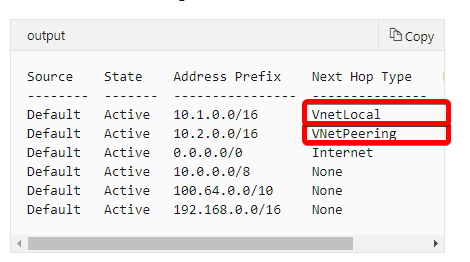
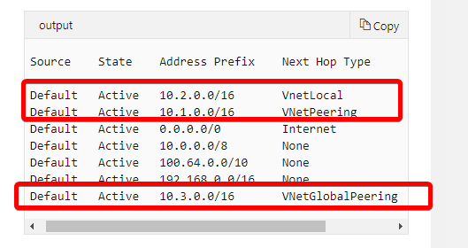

## [Distribute your services across Azure virtual networks and integrate them by using virtual network peering](https://docs.microsoft.com/en-au/learn/modules/integrate-vnets-with-vnet-peering/index)
- revisited 2020 May
- [Introduction](https://docs.microsoft.com/en-au/learn/modules/integrate-vnets-with-vnet-peering/1-introduction)
- [Connect services by using virtual network peering](https://docs.microsoft.com/en-au/learn/modules/integrate-vnets-with-vnet-peering/2-connect-services-using-vnet-peering)
  - You can use virtual network peering to directly connect Azure virtual networks. When you use peering to connect virtual networks, virtual machines (VMs) in these networks can communicate with each other as if they were in the same network.
  - In peered virtual networks, traffic between virtual machines is routed through the Azure network. 
  - The traffic is always private, and it takes advantage of the high bandwidth and low latency of the Azure backbone network.
  - types of peering
    - **Virtual network peering** connects virtual networks in the same Azure region, such as two virtual networks in North Europe.
    - **Global virtual network peering** connects virtual networks that are in different Azure regions, such as a virtual network in North Europe and a virtual network in West Europe.
  - **Properties**
    - **Reciprocal connections**
      - To connect the networks by using virtual network peering, you have to **create connections in each** virtual network.
    - **Cross-subscription virtual network peering**
      - Virtual networks can be in different subscriptions, and the subscriptions can use the same or different Azure Active Directory tenants.
    - **No Transitivity**
      - Virtual network peering is nontransitive. Only virtual networks that are directly peered can communicate with each other. **The virtual networks can't communicate with the peers of their peers**.
    - **Gateway transit**
      - You can configure **transitive** connections on-premises if you use virtual network gateways as **transit points**.
      - By using gateway peering, you can configure a single virtual network as a hub network. Connect this hub network to your on-premises datacenter and share its virtual network gateway with peers.
      - Using gateway transit, you can enable on-premises connectivity without deploying virtual network gateways to all your virtual networks.
      - **How to configure**
        - To enable gateway transit, configure the **Allow gateway transit** option in the **hub** virtual network where you deployed the gateway connection to your on-premises network. 
        - Also configure the **Use remote gateways** option in any spoke virtual networks.
        - _If you want to enable the Use remote gateways option in a spoke network peering, you can't deploy a virtual network gateway in the spoke virtual network._
    - Overlapping address spaces
      - IP address spaces of connected networks within Azure and between Azure and your on-premises system can't overlap. 
  - Alternative connectivity methods
    - Network peering
      - easy to implement and deploy
    - ExpressRoute circuit
    - site-to-site VPN
      - VPN gateways have higher latency than virtual network peering setups. They're more complex to manage, and they can cost more.
    - When virtual networks are connected through both a VPN gateway and virtual network peering, traffic flows through the peering configuration.
- [Exercise - Prepare virtual networks for peering by using Azure CLI commands](https://docs.microsoft.com/en-au/learn/modules/integrate-vnets-with-vnet-peering/3-exercise-prepare-vnets-for-peering-using-azure-cli-commands)
- [Exercise - Configure virtual network peering connections by using Azure CLI commands](https://docs.microsoft.com/en-au/learn/modules/integrate-vnets-with-vnet-peering/4-exercise-configure-vnet-peering-connections-using-azure-cli-commands)
  - Create virtual network peering connections
    - create peering from SalesVnet to MarketingVnet
        ```
            az network vnet peering create \
            --name SalesVNet-To-MarketingVNet \
            --remote-vnet MarketingVNet \
            --resource-group [sandbox resource group name] \
            --vnet-name SalesVNet \
            --allow-vnet-access
        ```
    - create peering from MarketingVnet to SalesVnet
        ``` 
            az network vnet peering create \
            --name MarketingVNet-To-SalesVNet \
            --remote-vnet SalesVNet \
            --resource-group [sandbox resource group name] \
            --vnet-name MarketingVNet \
            --allow-vnet-access
        ```
  - Check the virtual network peering connections
    ```
        az network vnet peering list \
        --resource-group [sandbox resource group name] \
        --vnet-name SalesVNet \
        --output table
    ```
  - Check effective routes
    - You can further check the peering connection by looking at the routes that apply to the network interfaces of the VMs.
    - Run the following command to look at the routes that apply to the SalesVM network interface.
        ```
        az network nic show-effective-route-table \
            --resource-group [sandbox resource group name] \
            --name SalesVMVMNic \
            --output table
        ```
    - The output table shows the effective routes for the VM's network interface. For **SalesVMVMNic**, you should see a route to **10.2.0.0/16** with a next hop type of **VNetPeering**. This is the network route for the peering connection from **SalesVNet** to **MarketingVNet**.
      - 
    - Look at the routes for MarketingVM with a global peering
      - 

- [Exercise - Verify virtual network peering by using SSH between Azure virtual machines](https://docs.microsoft.com/en-au/learn/modules/integrate-vnets-with-vnet-peering/5-exercise-verify-vnet-peering)
  - In Cloud Shell, run the following command, using SSH to connect to the public IP address of SalesVM. 
    - `ssh -o StrictHostKeyChecking=no azureuser@<SalesVM public IP>`
  - To test the connectivities between each other, try `ssh` using private IP from the Sales VMs
    - `ssh -o StrictHostKeyChecking=no azureuser@<MarketingVM private IP>`
- [Summary](https://docs.microsoft.com/en-au/learn/modules/integrate-vnets-with-vnet-peering/6-summary)


Powershell section:

```powershell
#To get help
Get-azcommand vm

dir -force

Get-AzPublicIpAddress `
  -Name myVm1 `
  -ResourceGroupName myResourceGroup `
  | Select IpAddress

New-AzVm `
  -ResourceGroupName "myResourceGroup" `
  -Location "East US" `
  -VirtualNetworkName "myVirtualNetwork" `
  -SubnetName "default" `
  -Name "myVm1" `
  -AsJob

#That command lets ICMP inbound through the Windows firewall.
New-NetFirewallRule –DisplayName "Allow ICMPv4-In" –Protocol ICMPv4

```