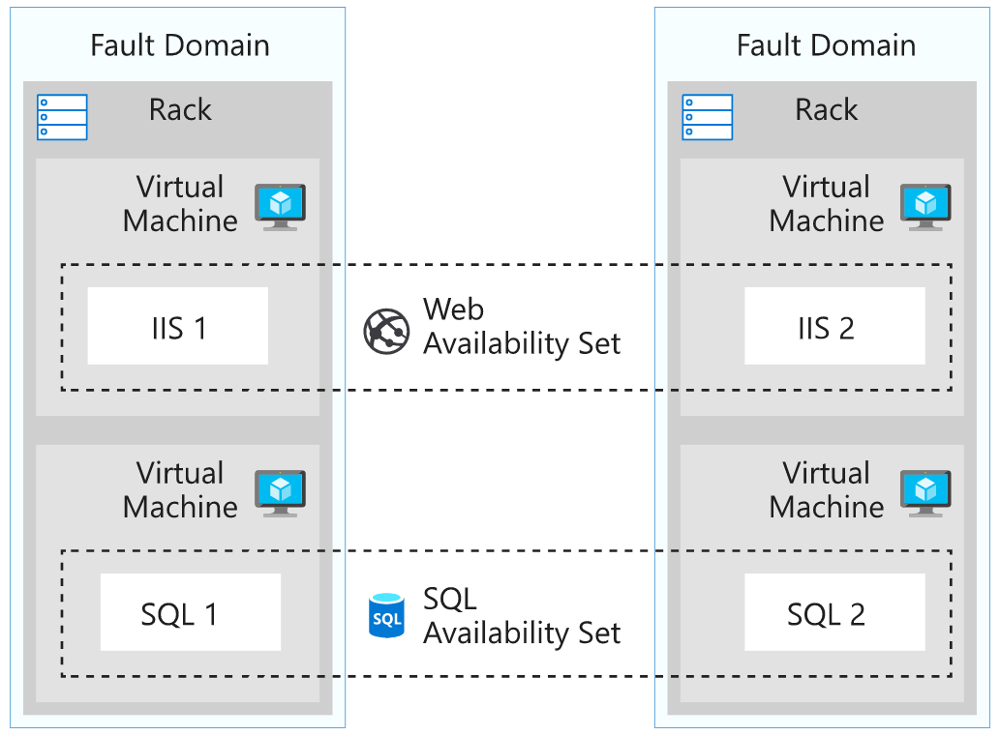
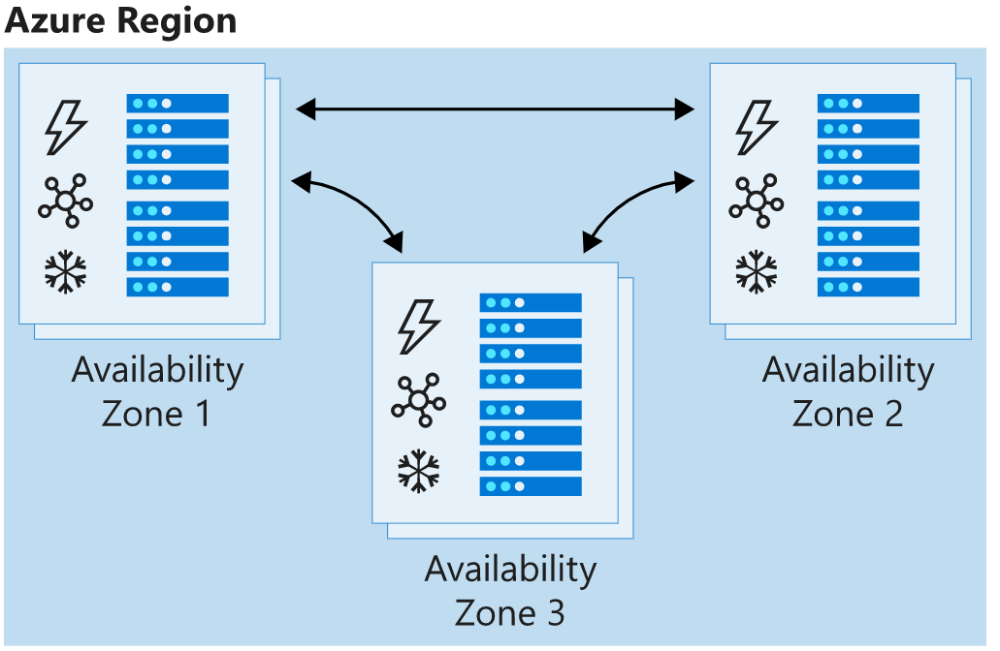
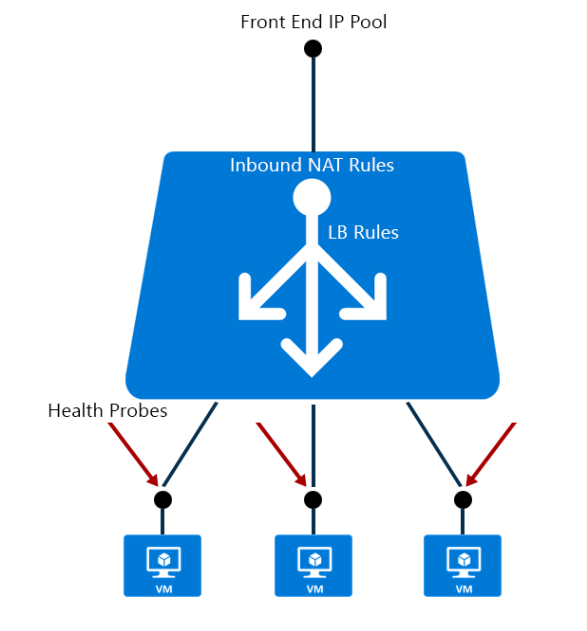
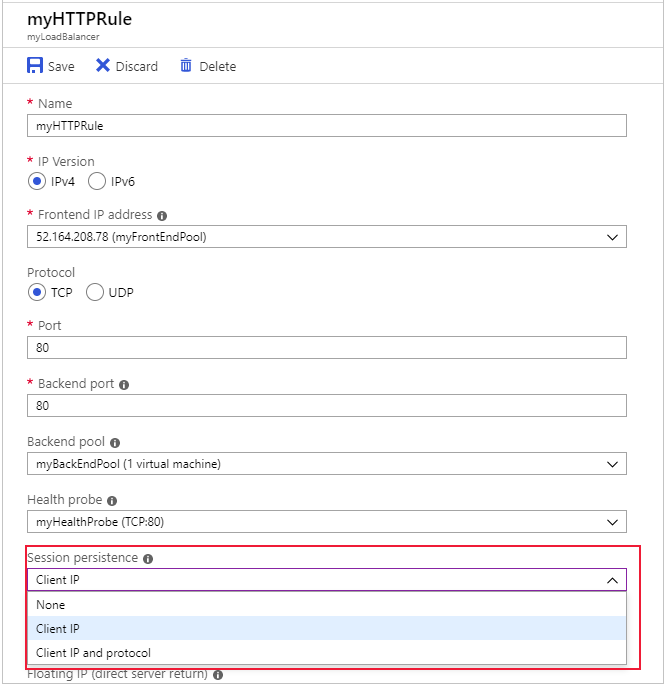

## [Improve application scalability and resiliency by using Azure Load Balancer](https://docs.microsoft.com/en-au/learn/modules/improve-app-scalability-resiliency-with-load-balancer/index)
- revisited 2020 May
- [Introduction](https://docs.microsoft.com/en-au/learn/modules/improve-app-scalability-resiliency-with-load-balancer/1-introduction)
- [Azure Load Balancer features and capabilities](https://docs.microsoft.com/en-au/learn/modules/improve-app-scalability-resiliency-with-load-balancer/2-load-balancer-features)
  - Distribute traffic with Azure Load Balancer
    - Azure Load Balancer is a service you can use to distribute traffic across multiple virtual machines. Use Load Balancer to scale applications and create high availability for your virtual machines and services. 
    - Load balancers use a hash-based distribution algorithm. 
      - The hash is made from the following elements:
        - **Source IP**: The IP address of the requesting client.
        - **Source port**: The port of the requesting client.
        - **Destination IP**: The destination IP of the request.
        - **Destination port**: The destination port of the request.
        - **Protocol type**: The specified protocol type. For example, HTTP, HTTPS, HTTP/2.
    - High availability with Load Balancer, you can choose to use a**vailability sets** and **availability zones** to ensure that virtual machines are always available:
      - **Availability set**
        - SLA 	99.95%
        - Protection from hardware failures within datacenters
        - 
      - **Availability zone**
        - SLA 99.99%
        - Protection from entire datacenter failure
        - 
    - [Child resources](https://docs.microsoft.com/en-au/azure/load-balancer/load-balancer-arm)
      - **Front-end IP configuration**
        - a Load balancer can include one or more frontend IP addresses, otherwise known as a virtual IPs (VIPs). These IP addresses serve as ingress for the traffic.
      - **Back-end address pool**
        - these are IP addresses associated with the virtual machine Network Interface Card (NIC) to which load is distributed.
      - **Load balancing rules**
        - a rule property maps a given frontend IP and port combination to a set of back-end IP addresses and port combination. A single load balancer can have multiple load balancing rules. Each rule is a combination of a frontend IP and port and back-end IP and port associated with VMs.
      - **Probes** 
        - probes enable you to keep track of the health of VM instances. If a health probe fails, the VM instance is taken out of rotation automatically.
      - **Inbound NAT rules** 
        - NAT rules defining the inbound traffic flowing through the frontend IP and distributed to the back-end IP.
      - 
    - Pricing tier
      - **Basic** load balancers allow:
        - Port forwarding
        - Automatic reconfiguration
        - Health probes
        - Outbound connections through source network address translation (SNAT)
        - Diagnostics through Azure Log Analytics for public-facing load balancers
        - **can be used only with availability sets.**
      - Standard load balancers support all of the basic features. They also allow:
        - HTTPS health probes
        - **Availability zones**
        - Diagnostics through Azure Monitor, for multidimensional metrics
        - High availability (HA) ports
        - Outbound rules
        - A guaranteed SLA (99.99% for two or more virtual machines)
    - Types of load balancers
      - An **external** load balancer permits traffic from the internet.
      - An **internal** load balancer distributes a load from internal Azure resources to other Azure resources. 
- [Configure a public load balancer](https://docs.microsoft.com/en-au/learn/modules/improve-app-scalability-resiliency-with-load-balancer/3-public-load-balancer)
  - Distribution modes
    - **Five-tuple hash**
      - Hash
        - Source IP
        - Source Port
        - Desti IP
        - Desti Port
        - Protocol
      - Because the source port is included in the hash and the source port changes for each session, clients might be directed to a different virtual machine for each session.
    - **Source IP affinity**
      - Hash
        - Source IP
        - Desti IP
      - This distribution mode is also known as **session affinity** or **client IP affinity**
      - the mode uses a two-tuple hash (from the source IP address and destination IP address) or three-tuple hash (from the source IP address, destination IP address, and protocol type)
      - The hash ensures that requests from a specific client are always sent to the same virtual machine behind the load balancer.
  - Choose a distribution mode
    - Powershell
      ```powershell
        $lb = Get-AzLoadBalancer -Name MyLb -ResourceGroupName MyResourceGroup
        $lb.LoadBalancingRules[0].LoadDistribution = 'sourceIp'
        Set-AzLoadBalancer -LoadBalancer $lb
      ```
    - Portal
      - 
  - Important use cases for **session affinity**
    - Imagine that a developer requirement of the presentation tier is to use **in-memory sessions** to store the logged user's profile as the user interacts with the portal.
    - **Remote Desktop Protocol (RDP)**
      - The default five-tuple hash in Load Balancer is incompatible with this service.
    - **Media upload**
      - In many implementations, a client initiates a session through a TCP protocol and connects to a destination IP address. This connection remains open throughout the upload to monitor progress, but the file is uploaded through a separate UDP protocol.
- [Exercise - Configure a public load balancer](https://docs.microsoft.com/en-au/learn/modules/improve-app-scalability-resiliency-with-load-balancer/4-exercise-configure-public-load-balancer)
  - Deploy the patient portal web application
  - Create a load balancer
    - Create PIP
      - `az network public-ip create`
    - Create load balancer
      ```bash
      az network lb create \
        --resource-group <> \
        --name myLoadBalancer \
        --public-ip-addresses myPublicIP \
        --frontend-ip-name myFrontEndPool \
        --backend-ip-name myBackEndPool
      ```
    - Create health probe to allow monitoring.  The health probe dynamically adds or removes virtual machines from the load balancer rotation based on their response to health checks.
      ```
      az network lb probe create \
        --resource-group <> \
        --lb-name myLoadBalancer \
        --name myHealthProbe \
        --protocol tcp \
        --port 80
      ```
    - create load balancer rule with **ports**
      ```
        az network lb rule create \
            --resource-group [sandbox resource group name] \
            --lb-name myLoadBalancer \
            --name myHTTPRule \
            --protocol tcp \
            --frontend-port 80 \
            --backend-port 80 \
            --frontend-ip-name myFrontEndPool \
            --backend-pool-name myBackEndPool \
            --probe-name myHealthProbe
      ```
    - Connect VMs to the back-end pool by updating their NIC
      ```
        az network nic ip-config update \
        --resource-group [sandbox resource group name] \
        --nic-name webNic1 \
        --name ipconfig1 \
        --lb-name myLoadBalancer \
        --lb-address-pools myBackEndPool
      ```

- [Internal load balancer](https://docs.microsoft.com/en-au/learn/modules/improve-app-scalability-resiliency-with-load-balancer/5-internal-load-balancer)
  - Configure an internal load balancer
    - You can configure an internal load balancer in almost the same way as an external load balancer, but with these differences:
      - When you create the load balancer, for the Type value, select **Internal**. When you select this setting, the front-end IP address of the load balancer isn't exposed to the internet.
      - Assign a private IP address instead of a public IP address for the front end of the load balancer.
      - Place the load balancer in the protected virtual network that contains the virtual machines you want to handle the requests.
- [Summary](https://docs.microsoft.com/en-au/learn/modules/improve-app-scalability-resiliency-with-load-balancer/6-summary)
  - Learn more
    - Azure Load Balancer
    - What is Azure Load Balancer?
    - Tutorial: Load-balance internet traffic to VMs by using the Azure portal
    - Tutorial: Balance internal traffic load with a basic load balancer in the Azure portal
    - What are availability zones in Azure?