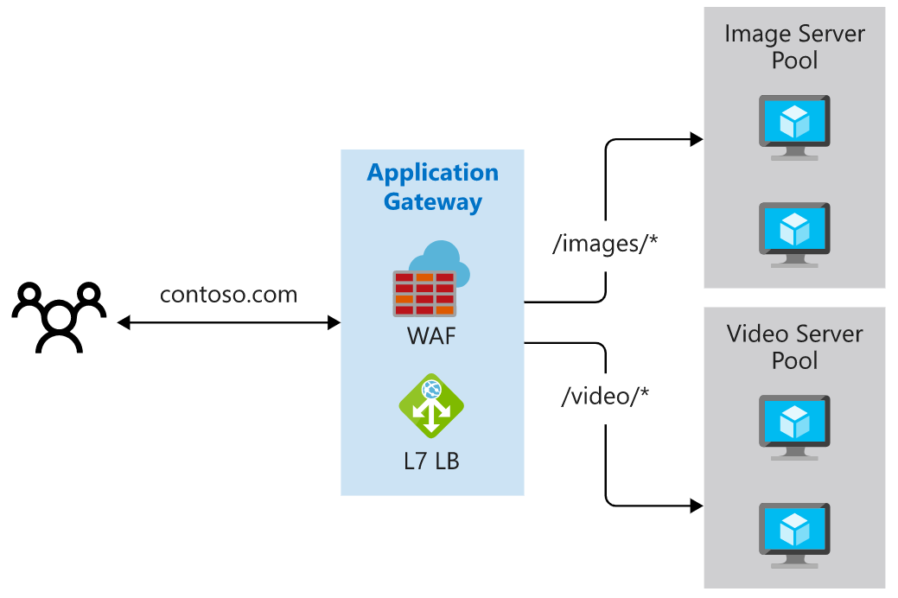
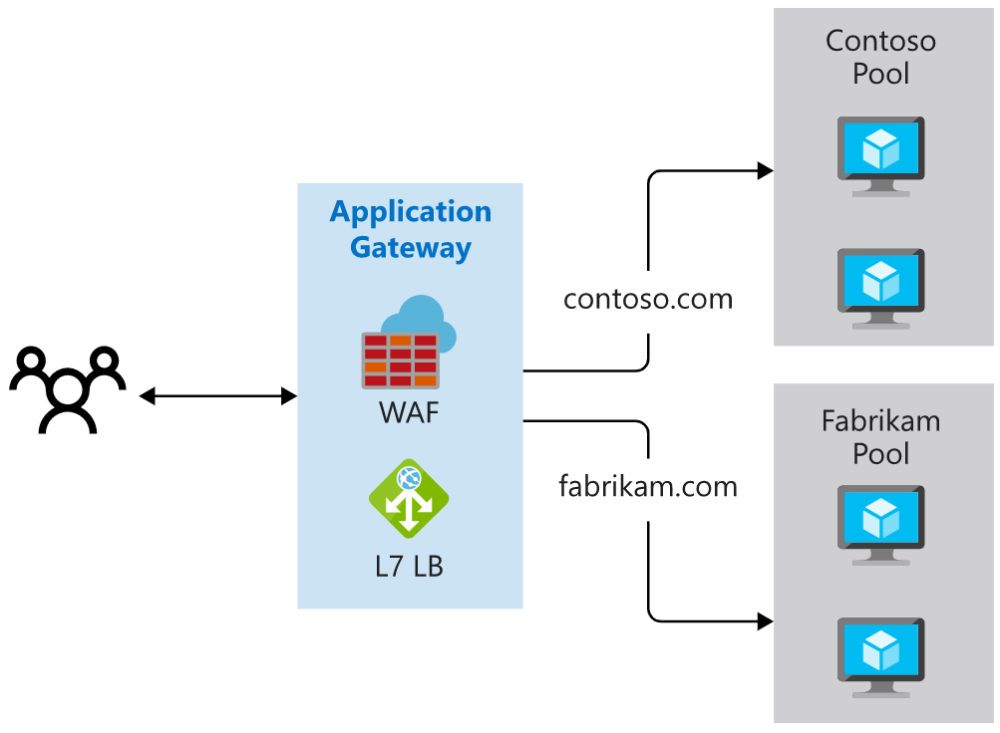
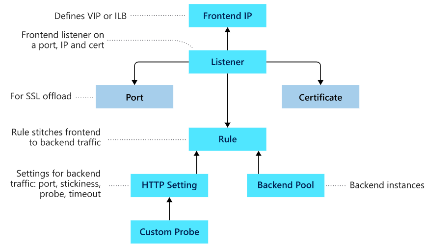

## [Load balance your web service traffic with Application Gateway](https://docs.microsoft.com/en-au/learn/modules/load-balance-web-traffic-with-application-gateway/index)
- revisited 2020 May
OneNote Link

    ```
    https://onedrive.live.com/view.aspx?resid=471B297280878A61%21153&id=documents&wd=target%28Pluralsight.one%7C14086A26-95B0-46E7-B98C-1F6B3B36C424%2FAPI%20Gateway%7CF1A82383-8C0C-4AF1-9876-3B30E828C130%2F%29
    onenote:https://d.docs.live.net/471b297280878a61/Documents/Kaiqi%20的笔记本/Pluralsight.one#API%20Gateway&section-id={14086A26-95B0-46E7-B98C-1F6B3B36C424}&page-id={F1A82383-8C0C-4AF1-9876-3B30E828C130}&end
    ```
- [Introduction](https://docs.microsoft.com/en-au/learn/modules/load-balance-web-traffic-with-application-gateway/1-introduction)
- [Route traffic with Application Gateway](https://docs.microsoft.com/en-au/learn/modules/load-balance-web-traffic-with-application-gateway/2-routing-traffic-with-application-gateway)
  - Application Gateway manages the requests that client applications can send to a web app. Application Gateway routes traffic to a pool of web servers based on the URL of a request. This is known as **application layer routing**. 
  - primary methods of routing traffic
    - **Path-based routing**
      - Path-based routing enables you to send requests with different paths in the URL to a different pool of back-end servers.
        - 
    - **Multiple site hosting**
      - Multiple site hosting enables you to configure more than one web application on the same application gateway instance. In a multi-site configuration, you register multiple DNS names (CNAMEs) for the IP address of the Application Gateway, specifying the name of each site. Application Gateway uses separate listeners to wait for requests for each site. Each listener passes the request to a different rule, which can route the requests to servers in a different back-end pool.
      - 
    - **Other routing capabilities**
      - **Redirection** - Redirection can be used to another site, or from HTTP to HTTPS.
      - **Rewrite HTTP headers** - HTTP headers allow the client and server to pass additional information with the request or the response.
      - **Custom error pages** - Application Gateway allows you to create custom error pages instead of displaying default error pages. You can use your own branding and layout using a custom error page.
    - Load balancing in Application Gateway
      - Application Gateway follows a **round-robin approach**, distributing requests to each available server in a backend pool in turn.
      -  However, you can configure session stickiness.
   -  Comparision with other load balancer
        | Routing | Application Gateway | Azure Load balancer | Traffic Manager |
        | ----------- | ----------- | ----------- | ----------- |
        | Happens in| OSI layer 7: Application Layer | OSI layer 4: Transport layer | OSI Layer 7  |
        | Based on | Routing parameters(host names and paths) |	IP addresses | DNS-level, geographical load balancing  |
- [Exercise - Create web sites](https://docs.microsoft.com/en-au/learn/modules/load-balance-web-traffic-with-application-gateway/3-exercise-create-web-sites)
  
- [Application Gateway creation and configuration](https://docs.microsoft.com/en-au/learn/modules/load-balance-web-traffic-with-application-gateway/4-create-configure-application-gateway)
  - Components
    - 
    - **Front-end IP address**
      - You can configure Application Gateway to have a **public IP address**, a **private IP address**, or **both**.
      - Application Gateway can't have more than one public and one private IP address.
    - **Listeners**
      - **one or more listeners** to receive incoming requests
      - A listener accepts traffic arriving on **a specified combination** of protocol, port, host, and IP address. **Each listener routes requests to a back-end pool** of servers following routing rules that you specify.
      - A listener can be **Basic** or **Multi-site**.
      - Listeners also handle **SSL certificates** for securing your application between the user and Application Gateway.
      - **Understanding**
        - Listener is the only component that is not in Load balancer
        - Because in load balancer rule is mapping from a port to the backend pool, and in gateway there are more ways to do it, using port, path, protocal, I guess that's why this is introduced to the gateway. So that those settings are a standalong component as "listener". And the rule will have less stuff in it. 
    - **Routing rules**
      - A routing rule binds **hostname and path elements** to the **back-end pools**
      - A routing rule also has an associated set of HTTP settings including
        - Http or Https
        - Session stickiness
        - Health probes
        - Connection draining, to enable the graceful removal of servers from a back-end pool.
    - **Back-end pools**
      - A back-end pool references a collection of web servers, a virtual machine scale-set, on-premises servers.
    - **Web application firewall**
      - The web application firewall (WAF) is an optional component that handles incoming requests **before they reach a listener**. 
      - WAF is enabled on your Application Gateway by selecting the **WAF** tier when you create a gateway.
    - **Health probes**
      - to determine which servers are available for load balancing in a back-end pool.
      - If you don't configure a health probe, Application Gateway creates a **default probe** that waits for 30 seconds before deciding that a server is unavailable.
  - Application Gateway options
    - You can create an Application Gateway on the **Standard** tier or the **WAF** tier. 
    - You also have a choice of three sizes with varying performance, pricing, and scalability: **Small**, **Medium**, and **Large**.
- [Exercise - Create and configure an Application Gateway](https://docs.microsoft.com/en-au/learn/modules/load-balance-web-traffic-with-application-gateway/5-exercise-create-configure-application-gateway)
  - Create an application gateway
    ```
    az network application-gateway create \
        --resource-group $rg \
        --name vehicleAppGateway \
        --sku WAF_v2 \
        --capacity 2 \
        --vnet-name vehicleAppVnet \
        --subnet appGatewaySubnet \
        --public-ip-address appGatewayPublicIp \
        --http-settings-protocol Http \
        --http-settings-port 8080 \
        --frontend-port 8080
    ```
    - Create back-end pool
        ```
        az network application-gateway address-pool create \
            --gateway-name vehicleAppGateway \
            --resource-group $rg \
            --name vmPool \
            --servers $WEBSERVER1IP $WEBSERVER2IP
        ```
    - Create front end port
        ```
        az network application-gateway frontend-port create \
        --resource-group $rg \
        --gateway-name vehicleAppGateway \
        --name port80 \
        --port 80
        ```
    - create listener to handle port 80
        ```
        az network application-gateway http-listener create \
        --resource-group $rg \
        --name vehicleListener \
        --frontend-port port80 \
        --gateway-name vehicleAppGateway
        ```
  - Add a health probe
    - create a probe
      - The health probe runs every 15 seconds (`--interval 15`) and sends an HTTP GET request to the root path of the web app. If the web app doesn't respond within 10 seconds (`--timeout 10`), the probe times out. The web server is marked as unhealthy if the probe fails three times in succession (`--threshold 3`).
      ```
        az network application-gateway probe create \
        --resource-group $rg \
        --gateway-name vehicleAppGateway \
        --name customProbe \
        --path / \
        --interval 15 \
        --threshold 3 \
        --timeout 10 \
        --protocol Http \
        --host-name-from-http-settings true
      ```
    - create the HTTP Settings for the gateway to use the health probe we created.
      ```
      az network application-gateway http-settings update \
      --resource-group $rg \
      --gateway-name vehicleAppGateway \
      --name appGatewayBackendHttpSettings \
      --host-name-from-backend-pool true \
      --port 80 \
      --probe customProbe
      ```
    - Configure path-based routing
      - create path map with a rule for vmPool
        ```
        az network application-gateway url-path-map create \
        --resource-group $rg \
        --gateway-name vehicleAppGateway \
        --name urlPathMap \
        --paths /VehicleRegistration/* \
        --http-settings appGatewayBackendHttpSettings \
        --address-pool vmPool
        ```
      - update url-path-map with another rule for appServicePool
          ```
          az network application-gateway url-path-map rule create \
            --resource-group $rg \
            --gateway-name vehicleAppGateway \
            --name appServiceUrlPathMap \
            --paths /LicenseRenewal/* \
            --http-settings appGatewayBackendHttpSettings \
            --address-pool appServicePool \
            --path-map-name urlPathMap
          ```
      - create a new routing rule using the path map we created.
        ```
            az network application-gateway rule create \
            --resource-group $rg \
            --gateway-name vehicleAppGateway \
            --name appServiceRule \
            --http-listener vehicleListener \
            --rule-type PathBasedRouting \
            --address-pool appServicePool \
            --url-path-map urlPathMap
        ```
      - 

- [Exercise - Test your Application Gateway](https://docs.microsoft.com/en-au/learn/modules/load-balance-web-traffic-with-application-gateway/6-exercise-test-application-gateway)
- [Summary](https://docs.microsoft.com/en-au/learn/modules/load-balance-web-traffic-with-application-gateway/7-summary)
  - https://docs.microsoft.com/en-au/azure/application-gateway/application-gateway-components