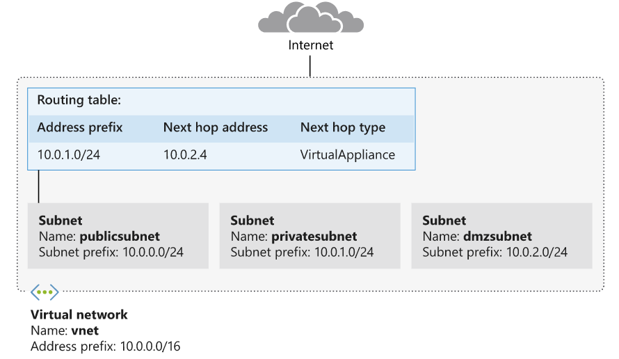
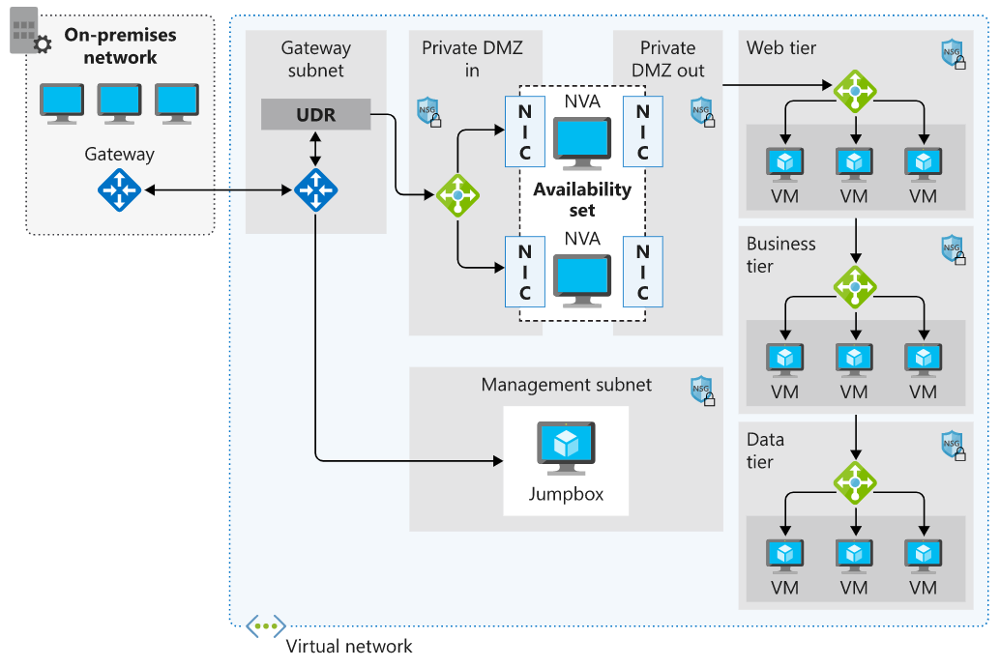
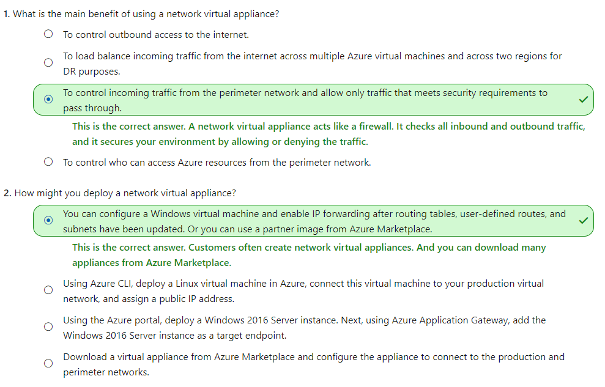
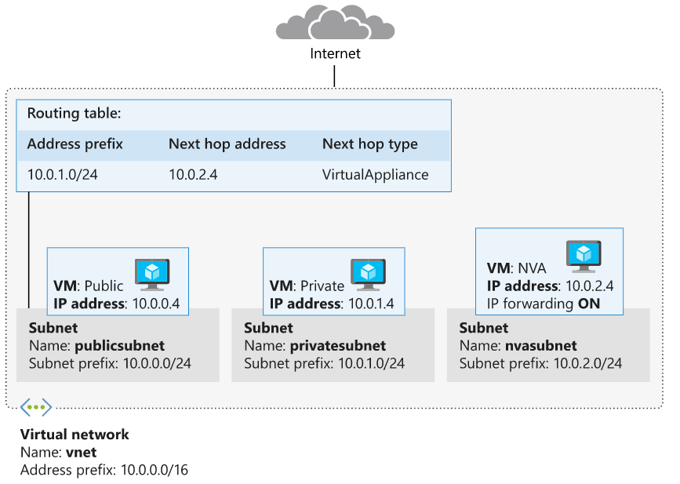
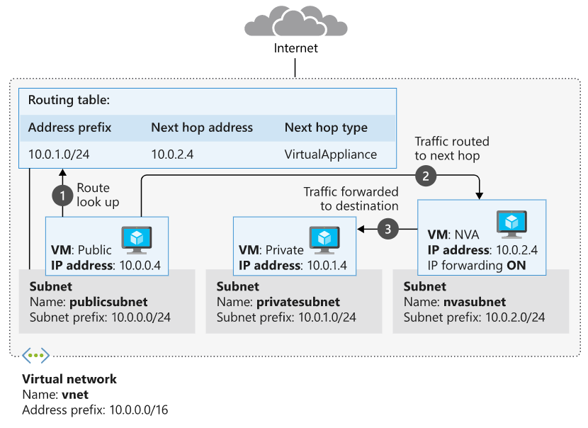

## [Manage and control traffic flow in your Azure deployment with routes](https://docs.microsoft.com/en-au/learn/modules/control-network-traffic-flow-with-routes/index)
- Revisited 2020 May
- [Introduction](https://docs.microsoft.com/en-au/learn/modules/control-network-traffic-flow-with-routes/1-introduction)
- [Identify routing capabilities of an Azure virtual network](https://docs.microsoft.com/en-au/learn/modules/control-network-traffic-flow-with-routes/2-azure-virtual-network-route)
  - Azure routing
    - Network traffic in Azure is automatically routed across Azure subnets, virtual networks, and on-premises networks. 
    - This routing is controlled by system routes, which are assigned by default to each subnet in a virtual network.
  - You can't create or delete system routes. But you can override the system routes by adding custom routes to control traffic flow to the next hop.
  - Every subnet has the following default system routes:
    |Address prefix	|Next hop type|
    |---|---|
    |Unique to the virtual network	|Virtual network|
    |0.0.0.0/0	|Internet|
    |10.0.0.0/8	|None|
    |172.16.0.0/12	|None|
    |192.168.0.0/16	|None|
    |100.64.0.0/10	|None|
      - The **Next hop type** column shows the network path taken by traffic sent to each address prefix
        - **Virtual network**: 
          - With in the Vnet
          - A route is created in the address prefix. The prefix represents each address range created at the virtual-network level. If multiple address ranges are specified, multiple routes are created for each address range.
        - **Internet**: 
          - Any other route
          - The default system route 0.0.0.0/0 routes any address range to the internet, unless you override Azure's default route with a custom route.
        - **None**: 
          - Any traffic routed to this hop type is dropped and doesn't get routed outside the subnet. 
          - By default, the following IPv4 private-address prefixes are created: 10.0.0.0/8, 172.16.0.0/12, and 192.168.0.0/16. The prefix 100.64.0.0/10 for a shared address space is also added. **None of these address ranges are globally routable.**
  - Within Azure, there are additional system routes. Azure will create these routes if the following capabilities are enabled:
    - Virtual network peering
    - Service chaining
      - Virtual network peering and service chaining let virtual networks within Azure be connected to one another. 
      - This communication in turn creates additional routes within the default route table. 
      - Service chaining lets you override these routes by creating user-defined routes between peered networks.
    - Virtual network gateway
      - Use a virtual network gateway to send encrypted traffic between Azure and on-premises over the internet and to send encrypted traffic between Azure networks. A virtual network gateway contains routing tables and gateway services.
    - Virtual network service endpoint
      - Your Azure virtual machines can access your storage account directly from the private address space and deny access from a public virtual machine. As you enable service endpoints, Azure creates routes in the route table to direct this traffic.
  - Custom routes
    - You have two options for implementing custom routes: create a user-defined route or use Border Gateway Protocol (BGP) to exchange routes between Azure and on-premises networks.
    - **User-defined routes**
      - You use a user-defined route to override the default system routes so that traffic can be routed through firewalls or NVAs.
      - For example, you might have a network with two subnets and want to add a virtual machine in the perimeter network to be used as a firewall. You create a user-defined route so that traffic passes through the firewall and doesn't go directly between the subnets.
      - With user-defined routes, you can't specify the next hop type **VirtualNetworkServiceEndpoint**, which indicates virtual network peering.
      - When creating user-defined routes, you can specify these next hop types:
        - **Virtual appliance**: A virtual appliance is typically a firewall device used to analyze or filter traffic that is entering or leaving your network. You can specify the private IP address of a NIC attached to a virtual machine so that IP forwarding can be enabled. Or you can provide the private IP address of an internal load balancer.
        - **Virtual network gateway**: Use to indicate when you want routes for a specific address to be routed to a virtual network gateway. The virtual network gateway is specified as a VPN for the next hop type.
        - **Virtual network**: Use to override the default system route within a virtual network.
        - **Internet**: Use to route traffic to a specified address prefix that is routed to the internet.
        - **None**: Use to drop traffic sent to a specified address prefix.
    - **Border gateway protocol**
      - A network gateway in your on-premises network can exchange routes with a virtual network gateway in Azure by using BGP. BGP is the standard routing protocol that is normally used to exchange routing and information among two or more networks.
      - BGP offers **network stability** because routers can quickly change connections to send packets if a connection path goes down.
      - You typically use BGP to 
        - **advertise** on-premises routes to Azure when you're connected to an Azure datacenter through Azure **ExpressRoute**. 
        - **configure** BGP if you connect to an Azure virtual network by using a **VPN site-to-site connection**.
  - Route selection and priority
    - If multiple routes are available in a route table, Azure uses the route with the **longest prefix match** because it's more **specific**.
      - 10.0.0.0/16 and 10.0.0.0/24 prefixes, Azure selects the route with the 10.0.0.0/24 prefix
    - can't configure multiple user-defined routes with the same address prefix.
    - If multiple routes share the same address prefix, Azure selects the route based on its type in the following order of priority:
      - User-defined routes
      - BGP routes
      - System routes
  - Check your knowledge
    - 
- [Exercise - Create custom routes](https://docs.microsoft.com/en-au/learn/modules/control-network-traffic-flow-with-routes/3-exercise-create-custom-routes)
  - Exercise: You'll want to ensure communication between front-end public servers and internal private servers is always routed through the appliance.
    - You'll configure the network so that all traffic flowing from a public subnet to a private subnet will be routed through the NVA. To make this flow happen, you'll create a custom route for the public subnet to route this traffic to a perimeter-network subnet. Later, you'll deploy an NVA to the perimeter-network subnet.
    - 
  - Create a route table and custom route
    - create a route table
      ```
      az network route-table create \
      --name publictable
      --resource-group <>
      --disable-bgp-route-propagation false
      ```
    - create a custom route in the route-table
      ```
        az network route-table route create \
            --route-table-name publictable \
            --resource-group [sandbox resource group name] \
            --name productionsubnet \
            --address-prefix 10.0.1.0/24 \
            --next-hop-type VirtualAppliance \
            --next-hop-ip-address 10.0.2.4
      ```
    - Create a virtual network and subnets
    - Associate the route table with the public subnet
      ```
      az network vnet subnet update \
        --name publicsubnet \
        --vnet-name vnet \
        --resource-group [sandbox resource group name] \
        --route-table publictable
      ```

- [What is an NVA?](https://docs.microsoft.com/en-au/learn/modules/control-network-traffic-flow-with-routes/4-network-virtual-appliances)
  - A **network virtual appliance (NVA)** is a virtual appliance that consists of various layers like:
    - a firewall
    - a WAN optimizer
    - application-delivery controllers
    - routers
    - load balancers
    - IDS/IPS
    - proxies
  - You can deploy NVAs chosen from **providers** in **Azure** **Marketplace**. Such providers include Check Point, Barracuda, Sophos, WatchGuard, and SonicWall. You can use an NVA to filter traffic inbound to a virtual network, to block malicious requests, and to block requests made from unexpected resources.
  - **Network virtual appliance**
    - Network virtual appliances or NVAs are **virtual machines** that control the flow of **network traffic** by **controlling routing**. 
    - You typically use them to manage traffic flowing from a perimeter-network environment **to other networks or subnets**.
    - 
  - **Microsegmentation** 
    - With the microsegmentation approach, you can create **dedicated subnets** for the firewall and then deploy web applications and other services in other subnets. 
    - All traffic is routed through the firewall and inspected by the NVAs. 
    - You **enable IP forwarding** on the **virtual-appliance network interfaces** to pass traffic that is accepted by the appropriate subnet.
    - **Microsegmentation** lets the firewall inspect all packets at OSI Layer 4 and, for application-aware appliances, Layer 7. When you deploy an NVA to Azure, it acts as a router that forwards requests between subnets on the virtual network.
  - Check your knowledge
    - 
- [Exercise - Create an NVA and virtual machines](https://docs.microsoft.com/en-au/learn/modules/control-network-traffic-flow-with-routes/5-exercise-create-nva-vm)
  - 
  - Create a VM
  - Enable **IP forwarding** for the Azure network interface
    - You'll configure the appliance to forward IP traffic. 
    - If IP forwarding isn't enabled, traffic that is routed through your appliance will never be received by its intended destination servers.
    ```bash
    az network nic update --name $NICNAME \
      --resource-group [sandbox resource group name] \
      --ip-forwarding true
    ```
  - Run the following command to enable IP forwarding within the NVA.
    ```bash
    ssh -t -o StrictHostKeyChecking=no azureuser@$NVAIP 'sudo sysctl -w net.ipv4.ip_forward=1; exit;'
    ```
- [Exercise - Route traffic through the NVA](https://docs.microsoft.com/en-au/learn/modules/control-network-traffic-flow-with-routes/6-exercise-route-traffic-through-nva)
  - Create public and private virtual machines
  - Test traffic routing through the network virtual appliance
    - Run the following command to trace the route from **public** to **private**. 
      ```bash
      ssh -t -o StrictHostKeyChecking=no azureuser@$PUBLICIP 'traceroute private --type=icmp; exit'
      ```
      - output:
      ```
      traceroute to private.kzffavtrkpeulburui2lgywxwg.gx.internal.cloudapp.net (10.0.1.4), 64 hops max
      1   10.0.2.4  0.710ms  0.410ms  0.536ms
      2   10.0.1.4  0.966ms  0.981ms  1.268ms
      Connection to 52.165.151.216 closed.
      ```
      - Notice that the first hop is to 10.0.2.4. This address is the private IP address of nva. The second hop is to 10.0.1.4, the address of private. In the first exercise, you added this route to the route table and linked the table to the **publicsubnet** **subnet**. So now all traffic from **public to private** is routed through the network virtual appliance.
      - Requests from **private** to **public** will still go directly to **public**
    - 
- [Summary](https://docs.microsoft.com/en-au/learn/modules/control-network-traffic-flow-with-routes/7-summary)