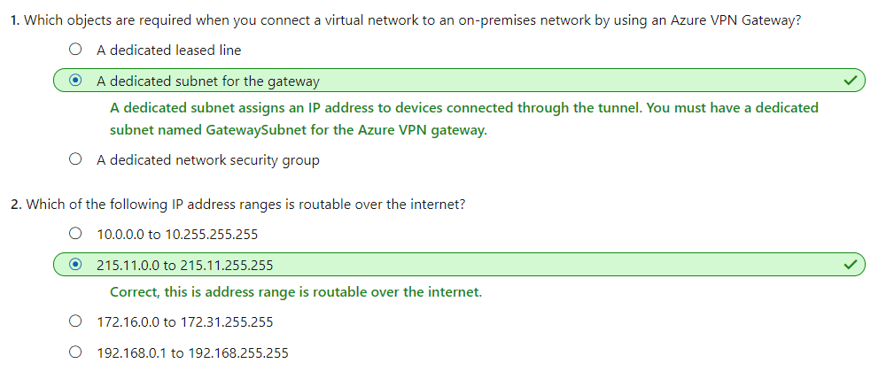
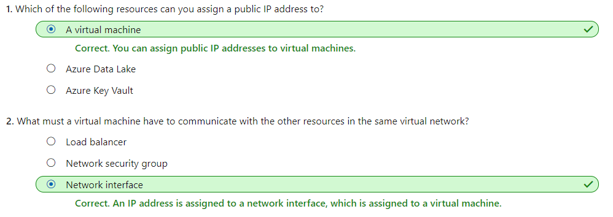

## [Design an IP addressing schema for your Azure deployment](https://docs.microsoft.com/en-au/learn/modules/design-ip-addressing-for-azure/index)
- Revisited 2020 May
- [Introduction](https://docs.microsoft.com/en-au/learn/modules/design-ip-addressing-for-azure/1-introduction)
- [Network IP addressing and integration](https://docs.microsoft.com/en-au/learn/modules/design-ip-addressing-for-azure/2-network-ip-addressing-integration)
  - There are three ranges of non-routable IP addresses specifically designed for internal networks that will not be sent over internet routers. These are the following:
    - 10.0.0.0 to 10.255.255.255
    - 172.16.0.0 to 172.31.255.255
    - 192.168.0.1 to 192.168.255.255
  - Integrate Azure with on-premises networks
    - There can be no IP address overlap for interconnected networks.
  - Check your knowledge
    - 
- [Public and private IP addressing in Azure](https://docs.microsoft.com/en-au/learn/modules/design-ip-addressing-for-azure/3-azure-public-private-ip-addressing)
  - IP address types
    - There are two types of IP address that you can use within Azure:
      - **Public IP addresses**
        - **Dynamic public IP addresses** are assigned addresses that can change over the lifespan of the Azure resource. The dynamic IP address is allocated when you create or start a VM.
        - **Static public IP addresses** are assigned addresses that will not change over the lifespan of the Azure resource. To ensure the IP address for the resource remains the same, you can set the allocation method explicitly to static. 
      - **Private IP addresses**
        - **Dynamic private IP addresses** are assigned through a DHCP lease and can change over the lifespan of the Azure resource.
        - **Static public IP addresses** are assigned through a DHCP reservation, and do not change through the lifespan of the Azure resource. They will persist if a resource is stopped or deallocated.
  - **Basic** and **Standard** SKU
    - **Basic** public IPs can be assigned with the **static** or **dynamic** allocation method. 
    - **Standard** SKU public IP addresses always use **static** allocation method.
  - **Public IP address prefix**
    - Can be used to **ensure a static range** of public IP addresses
    - Because
      - You **cannot** bring your own public IP addresses **from on-premises** networks into Azure. 
      - Public IP addresses **cannot** be **moved between regions**, all addresses are **region-specific**.
    - Cannot specify the addresses at time of creation, but after creation the addresses will be fixed. The IP addresses will be a contiguous range. 
    - The advantage of a public IP address prefix is that you can specify firewall rules for these IP addresses with the knowledge that they will not change. 
    - You can assign the addresses from a public IP address prefix to any resource in Azure that supports public IP addresses.
  - IP addressing for Azure virtual networks
    -  You choose the private IP addresses reserved by Internet Assigned Numbers Authority (IANA) based on your network requirements:
       -  10.0.0.0/8
       -  172.16.0.0/12
       -  192.168.0.0/16
   -  The **first three IP addresses** are reserved for all subnets by default in Azure. For protocol conformance, **first and last IP addresses** of all subnets are also reserved. 
  - In Azure virtual networks, IP addresses can be allocated to the following types of resources:
     - Virtual machine network interfaces
     - Load balancers
     - Application gateways
   - Check your knowledge
     - 
- [Planning the IP addressing for your networks](https://docs.microsoft.com/en-au/learn/modules/design-ip-addressing-for-azure/4-plan-design-ip-addressing)
  - Gather your requirements
    - How many devices do you have on the network?
    - How many devices are you planning to add to the network in future?
  - Remember that Azure uses the **first three** addresses on each subnet. The **first and last IP addresses** of the subnets are also reserved for protocol conformance. Therefore, the number of possible addresses on an Azure subnet is **2^(n-5)**, where n represents the number of host bits.
- [Exercise - Design and implement IP addressing for Azure virtual networks](https://docs.microsoft.com/en-au/learn/modules/design-ip-addressing-for-azure/5-exercise-implement-vnets)
- [Summary](https://docs.microsoft.com/en-au/learn/modules/design-ip-addressing-for-azure/6-summary)
- Learn more
  - For more information on IP addressing in Azure, visit the following articles:
    - [IP address types and allocation methods in Azure](https://docs.microsoft.com/azure/virtual-network/virtual-network-ip-addresses-overview-arm)
    - [Public IP address prefix](https://docs.microsoft.com/azure/virtual-network/public-ip-address-prefix)