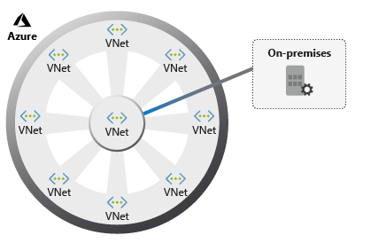
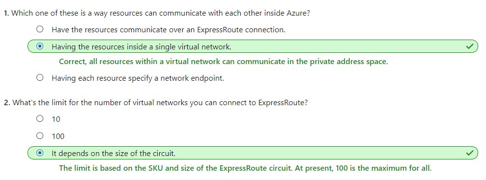
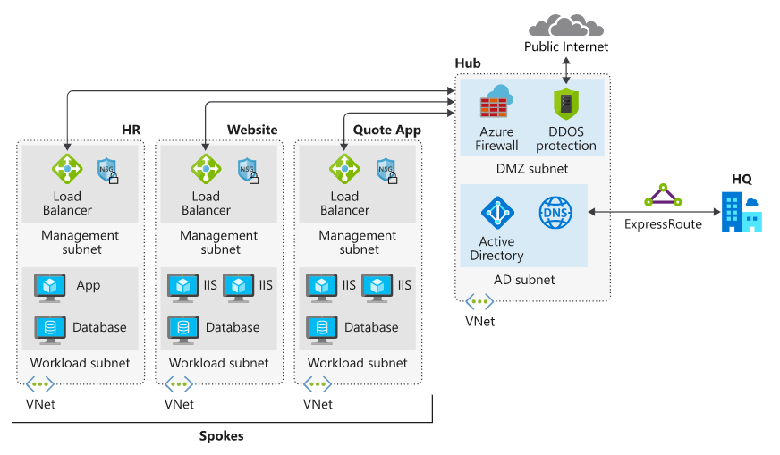
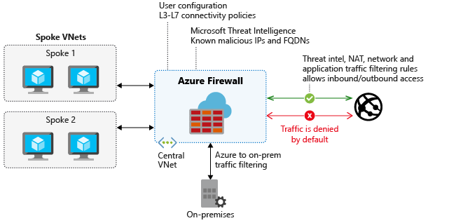
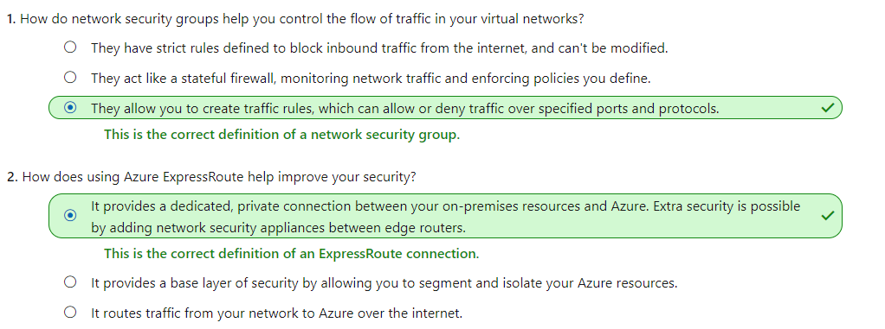

## [Centralize your core services by using hub and spoke Azure virtual network architecture](https://docs.microsoft.com/en-au/learn/modules/hub-and-spoke-network-architecture/index)
- Revisited 2020 May
- [Introduction](https://docs.microsoft.com/en-au/learn/modules/hub-and-spoke-network-architecture/1-introduction)
- [Implement a hub-spoke network topology on Azure](https://docs.microsoft.com/en-au/learn/modules/hub-and-spoke-network-architecture/2-implement-hub-spoke)
  - Hub and spoke architecture foundations
    - A hub and spoke consists of a centralized architecture (a **hub**) connecting to multiple points (**spokes**). When drawn, it looks similar to a wheel, with a hub at the center and spokes connected to it. This model in Azure organizes your network infrastructure into multiple connected virtual networks. 
    - 
  - Benefits:
    - A centrally managed connection to your on-premises environment.
    - Integration of separate working environments into a central location for shared services.
    - Traffic routing through the central hub, so workloads can be managed centrally.
  - Introduction to the hub-spoke topology
    - commonly used for **hybrid cloud** architectures
    - simpler to implement and maintain in the long term
    - The **hub** is a virtual network that acts as a central location for managing external connectivity, and hosting services used by multiple workloads. The hub coordinates all communications to and from the spokes.
    - The **spokes** are virtual networks that host workloads, and connect to the central hub through virtual network peering.
- [Plan virtual networks on Azure](https://docs.microsoft.com/en-au/learn/modules/hub-and-spoke-network-architecture/3-plan-virtual-networks)
  - Connect your on-premises network
    - A **VPN gateway** sends encrypted traffic between the two networks over the internet. 
      - Gateways support multiple connections that route the VPN tunnels through the available bandwidth, although a virtual network can only have one gateway assigned. 
      - You can also use a VPN gateway for network-to-network connections in Azure.
  - Use **ExpressRoute** in a hub-spoke topology
    - here are limits to the number of virtual networks per ExpressRoute circuit. 
      - For the standard tier, the limit is currently 10 networks. 
      - If you use the premium add-on, the limit is increased based on the circuit size. The lowest number is 20 virtual networks on a 50-Mbps circuit, up to 100 for circuits that are 10-Gbps or bigger.
  - Check your knowledge
    - 
- [Exercise - Implement a hub-spoke network topology on Azure](https://docs.microsoft.com/en-au/learn/modules/hub-and-spoke-network-architecture/4-exercise-implement-hub-spoke)
  - 

- [Secure your hub and spoke network](https://docs.microsoft.com/en-au/learn/modules/hub-and-spoke-network-architecture/5-secure-hub-spoke)
  - Secure network design on Azure
    - There are several features to consider as part of securing a network design:
      - **Azure Virtual Network**: Provides a base layer of security by logically isolating your environments in Azure, to prevent unauthorized or unwanted access.
      - **Azure DNS**: A hosting service for your domain names. Azure DNS is a secure service that manages and resolves domain names in your virtual network.
      - **Azure Application Gateway**: A dedicated virtual appliance that provides an application delivery controller as a service, including a web application firewall (WAF).
      - **Azure Traffic Manager**: A service to control the distribution of user traffic in Azure.
      - **Azure Load Balancer**: Provides high availability and network performance to your Azure applications.
      - **Perimeter network**: Segments assets between your Azure virtual network and the internet.

  - Base components of Azure security for hub-spoke topologies
    - **Network security group**
      - Each subnet within the topology has a network security group configured. The network security groups implement security rules to allow or deny network traffic to and from each resource in the topology.
    - **Perimeter network**
      - Configure a perimeter network in its own subnet in the hub virtual network for routing external traffic. The perimeter network is designed to host network virtual appliances to provide security functionality, such as firewalls and packet inspection. You can route the outbound traffic from the perimeter network through virtual appliances, so the traffic is monitored, secured, and audited.
    - **Network virtual appliance**
      - Network virtual appliances (NVAs) provide a secure network boundary by checking all inbound and outbound network traffic. Then the NVA passes only the traffic that meets network security rules, essentially acting as a firewall.
      - Azure Firewall can replace some components discussed in this article, to control access to Azure network resources.
    - **Azure ExpressRoute**
      - ExpressRoute creates a dedicated private WAN link between on-premises resources and an Azure gateway subnet in the hub virtual network. You add a network security appliance between the on-premises network and the ExpressRoute provider edge routers. This restricts the flow of unauthorized traffic from the virtual network.
  - **Azure Firewall**
    - Microsoft **manages** this network security service. It protects Azure virtual networks and their resources by letting you manage and enforce connectivity policies centrally. 
    - Azure Firewall enables central control of all network communications through policy enforcement. 
    - Azure Firewall is typically provisioned in the hub for complete control of traffic through the network.
    - 
  - **Network security groups (NSGs)**
    - Network security groups (NSGs) enforce and control network traffic rules. 
    - NSGs are rules-based, and evaluate rules by priority. 
    - NSGs determine priority by using **source, source port, destination, destination port, and protocol**, to either allow or deny traffic.
    - The default rules are:
      - **Traffic** originating from, and ending in, a **virtual network** is **allowed**.
      - **Outbound** traffic to the **internet** is **allowed**, but **inbound** traffic is **blocked**.
      - **Azure Load Balancer** is **allowed** to probe the health of virtual machines, or role instances.
  - Check your knowledge
    - 
- [Summary](https://docs.microsoft.com/en-au/learn/modules/hub-and-spoke-network-architecture/6-summary)
  - More information
    - [Hub and spoke topology](https://docs.microsoft.com/azure/architecture/reference-architectures/hybrid-networking/shared-services)
    - [Connect to Azure by using ExpressRoute](https://docs.microsoft.com/azure/architecture/reference-architectures/hybrid-networking/expressroute)
    - [Azure DDoS protection](https://docs.microsoft.com/azure/virtual-network/ddos-protection-overview)