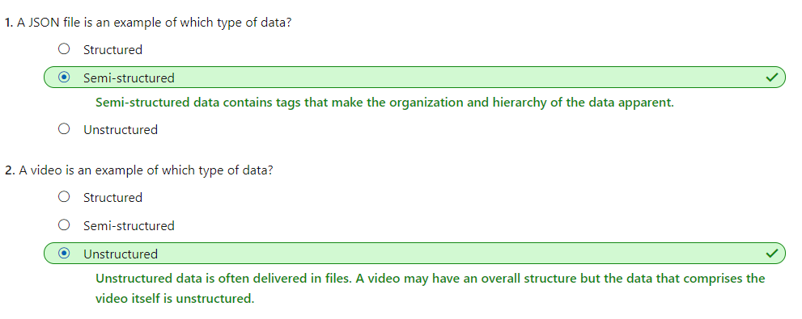
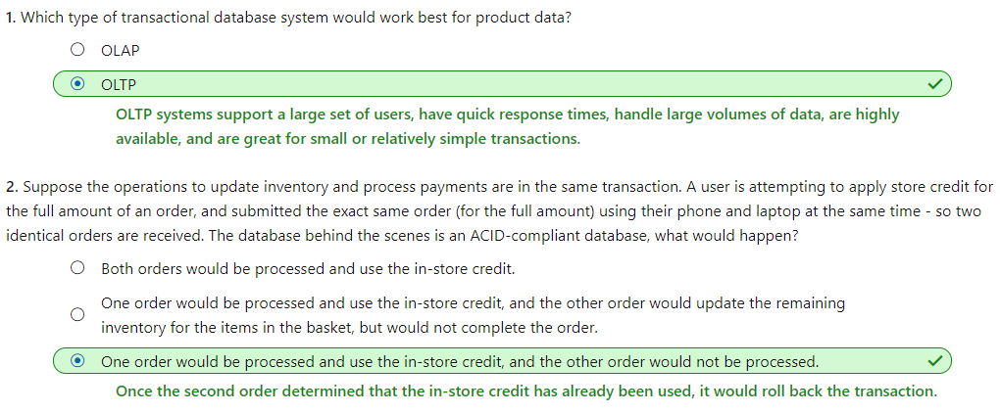

# [Choose a data storage approach in Azure](https://docs.microsoft.com/en-au/learn/modules/choose-storage-approach-in-azure/index)
- [Introduction](https://docs.microsoft.com/en-au/learn/modules/choose-storage-approach-in-azure/1-introduction)
- [Classify your data](https://docs.microsoft.com/en-au/learn/modules/choose-storage-approach-in-azure/2-classify-data)
  - Structured data
    - Structured data is data that adheres to a schema, so all of the data has the same fields or properties. 
    - Examples of structured data include:
      - Sensor data
      - Financial data
  - Semi-structured data
    - Semi-structured data is less organized than structured data, and is not stored in a relational format, as the fields do not neatly fit into tables, rows, and columns.
      - Key / Value pairs
      - Graph data
      - JSON files
      - XML files
  - Unstructured data
    - Unstructured data is often delivered in files, such as photos or videos.
      - Media files, such as photos, videos, and audio files
      - Office files, such as Word documents
      - Text files
      - Log files 
  - 
- [Determine operational needs](https://docs.microsoft.com/en-au/learn/modules/choose-storage-approach-in-azure/3-operations-and-latency)
- [Group multiple operations in a transaction](https://docs.microsoft.com/en-au/learn/modules/choose-storage-approach-in-azure/4-transactions)
  - What is a transaction?
    - A transaction is a logical group of database operations that execute together.
    - Transactions are often defined by a set of four requirements, referred to as ACID guarantees. ACID stands for :
      - **Atomicity** means a transaction must execute exactly once and must be atomic; either all of the work is done, or none of it is. 
      - **Consistency** ensures that the there is consistent data before the transaction, and data is consistent after the transaction.
      - **Isolation** ensures that one transaction is not impacted by another transaction.
      - **Durability** means that the changes made due to the transaction are permanently saved in the system. 
    - When a database offers ACID guarantees, these principles are applied to any transactions in a consistent manner.
  - OLTP vs OLAP
    -  OLTP (Online Transaction Processing)
       -  Transactional databases
       -  Support lots of users
       -  have quick response times
       -  and handle large volumes of data
       -  typically handle small or relatively simple transactions
    -  OLAP (Online Analytical Processing)
       -  Support fewer users, 
       -  have longer response times
       -  can be less available
       -  typically handle large and complex transactions
 -  
- [Choose a storage solution on Azure](https://docs.microsoft.com/en-au/learn/modules/choose-storage-approach-in-azure/5-choose-the-right-azure-service-for-your-data)
  - Product catalog data
    - Data classification: Semi-structured because of the need to extend or modify the schema for new products
    - Operations:
      - Customers require a high number of read operations, with the ability to query on many fields within the database.
      - The business requires a high number of write operations to track the constantly changing inventory.
    - Latency & throughput: High throughput and low latency
    - Transactional support: Required
    - Recommended service: Azure Cosmos DB
  - Business data
    - Data classification: Structured
    - Operations: Read-only, complex analytical queries across multiple databases
    - Latency & throughput: Some latency in the results is expected based on the complex nature of the queries.
    - Transactional support: Required
    - Recommended service: Azure SQL Database
- [Summary](https://docs.microsoft.com/en-au/learn/modules/choose-storage-approach-in-azure/6-summary)