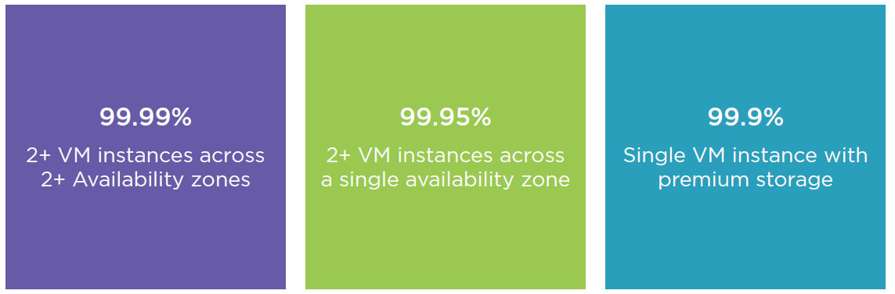
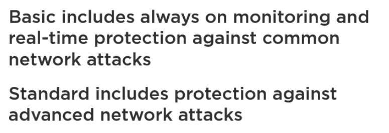
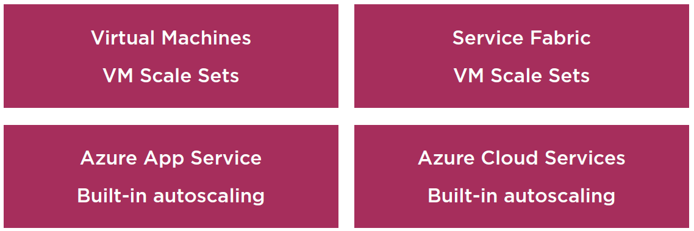
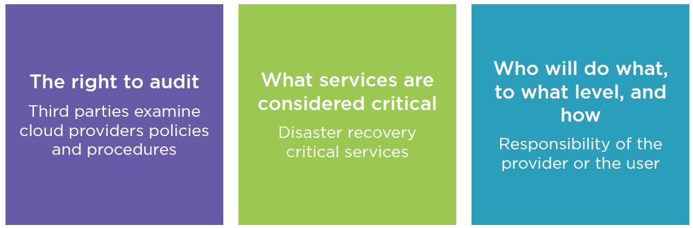

# Identifying Minimum Performance Thresholds
9m 41s

## Performance Anti-patterns
2m 13s

- Performance Anti-patterns
  - Cause availability, scalability, and capacity problems under pressure
  - Difficult to identify during testing 
  - Identify the minimum performance threshold
- Eight anti-patterns
  - Busy database
  - Busy front end
  - Chatty I/O
  - Extraneous fetching
    - Retrieving data more than needed
  - Improper instantiation
    - Keeps instantiating and disposing sharable objects
  - Monolithic persistence
  - No caching
  - Synchronous I/O

## Busy Database, Busy Front End, Chatty I/O, and Extraneous Fetching
2m 58s

- Busy database
  - Database is processing too much data
  - Bottleneck during high usage
  - Increased runtime costs
  - To identify it:
    - Monitor performance and examine database operations
  - Potential solution:
    - Move the tasks to an compute resource which is easily scalable. 
- Busy Front End
  - Increased response times by doing resource-intensive tasks or I/O
  - Potential solution:
    - Offloading too many resource-intensive tasks to background threads
    - Move processes to a separate backend
    - Use a message queue for asynchronous processing
- Chatty I/O
  - Impacts performance and responsiveness
  - To identify it:
    - Reading and writing distinct requests
  - Solution:
    - Combine queries, follow REST design principles and write once
    - Combine many smaller query into one
    - Buffer the data and then write it at the end
- Improper Instantiation
  - Applies only to thread-safe classes
  - Hurts performance and could result in unnecessary exceptions
  - Drop in throughput, increased memory use and network activity
  - Solution:
    - Shared singleton instance of the class
- Extraneous Fetching
  - Retrieve all data to minimize I/O requests
  - Overcompensate for the Chatty I/O antipattern
  - Causes high latency and low throughput
  - Avoid fetching large volumes of data by filtering
- Monolithic Persistence
  - Putting all data into a single data store can hurt performance
  - Storing and retrieving unrelated data can cause slow response times
  - Unoptimized data for the application
  - Identify:
    - Dramatic slowdown with eventual failure
  - Solution:
    - Separate data according to usage
- No Caching
  - Repeatedly fetching the same data reduces performance and scalability
  - Expensive to access data
  - Solution:
    - On-demand or cache-aside strategies
      - Read and retrieve cache
      - Write and remove cache
- Synchronous I/O
  - Locks the calling the thread while the thread completes
  - Reduces performance and affects vertical scalability
  - Wastes processing resources
  - Solution:
    - Synchronous to asynchronous operations
    - Use asynchronous operations where possible

## Improper Instantiation, Monolithic Persistence, no Caching, and Synchronous I/O

4m 2s

## Summary

0m 26s

# Identifying Availability Requirements

4m 33s

## High Availability

1m 46s
- Availability Zones
  - High availability offering
  - Unique physical locations within an Azure region
  - Protects data from datacenter failures
  - Industry best 99.99% VM uptime SLA
- Microsoft Azure Services that Support Availability Zones
  - Zonal services
    - Virtual machines, managed
    - disks, IP addresses
  - Zone-redundant services
    - Zone-redundant storage, SQL
    - Database

## Availability in Microsoft Azure
2m 21s
- SLA and OLA for Virtual Machines
  - 
## Summary
0m 25s

# Identifying Security Requirements
5m 56s

## Cloud App Security
2m 30s
- Microsoft Azure Security
  - Cloud App Security
    - Azure Active Directory
      - Provides identity as a service
      - Supports industry-standard protocols such as OAuth 2.0 and OpenID Connect
      - Azure AD programming model
        - OAuth 2.0 authorization grant flow
        - Resource access by the client
    - Azure Security Center
      - 
  - Attack Protection
    - Azure DDoS Protection
      - 
    - Azure Front Door
      - Optimizes traffic routing for best performance
      - Author custom web application firewall rules
      - Create rate limiting rules to battle malicious bot traffic

## Azure Security Center
2m 51s

## Summary
0m 34s

# Identifying Capacity Planning and Scalability Requirements
5m 18s

## Overview
0m 40s

## Design Patterns for Autoscaling
1m 58s

- Autoscaling
  - Dynamically allocating resources to match performance requirements
  - Reduces the need for an operator to continually monitor the performance of a system  
  - Not an instant solution
- Throttling Pattern
  - Control the consumption of resources used by an instance of an application 
  - Prevents a system from being overwhelmed while scaling out automatically
- Competing Consumers Pattern
  - Multiple concurrent consumers processing messages on the same channel
  - Processes multiple messages concurrently to improve scalability and availability

## Microsoft Azure Compute Autoscaling
2m 9s

- Virtual Machine Scale Set
  - Easy to create and manage multiple virtual machines
  - Automatically scale as resource demand changes 
  - Provides high availability and application resiliency
- Azure Compute Autoscaling
  - 

- Azure Monitor Autoscale
  - Provides common set of autoscaling
functionality
  - Schedule or metric based scaling
- Example
  - Scale out 10 instances on weekdays
  - Scale out by 1 instance if CPU usage is over 70%

## Summary
0m 30s

# Identifying Maintainability Requirements
5m 14s

## Azure Site Recovery
1m 49s
- Azure Site Recovery
  - Business continuity and disaster recovery (BCDR) strategy
  - Azure Site Recovery service
  - Azure Backup service

- Failover
  - Planned failover
    - Zero data loss
    - Upcoming datacenter downtime
  - Unplanned failover
    - Minimal data loss
    - Unexpected downtime
- Failback
  - Fail back to on-premise original or alternative location
  - Original location recovery
  - Alternative location recovery

## Failover and Failback
1m 42s

## Logging and Monitoring
1m 42s

# Identifying Accessibility Requirements
3m 42s

## Accessibility Standards
1m 0s
- Accessibility Standards
  - Ensuring content is more accessible to the widest range of users
  - Target market will identify accessibility requirements for different types of users

## Standards for Web Content and Web Applications
2m 13s
- Standards for Web Content
  - Section 508
  - Web Content Accessibility Guidelines (WCAG)
  - Accessible Rich Internet Applications (WAIARIA)
  - User Agent Accessibility Guidelines (UAAG)
- Standards for Web Applications
  - IndieUI
  - Authoring Tool Accessibility Guidelines (ATAG) 2.0
  - Mobile Accessibility
  - The Evaluation and Report Language(EARL)

## Summary
0m 29s

# Identifying Deployability Requirements
4m 7s

## Deployability Requirements
1m 13s

## Deployment Slots
2m 24s

- Deploy to separate staging and production slots
- Ensure all instances of the slot are warm to eliminate downtime
- Automate the process using Auto Swap
- Swap back during unexpected changes
- Auto Swap Deployments
  - Streamlines DevOps scenarios
  - Zero downtime for end users
  - Automatically swap the application into production

## Summary
0m 29s
9
# Identifying Extensibility Requirements
5m 1s
- Design principle focusing on future growth
- Difficult to identify due to lack of knowledge about future features
- Design patterns help with modification

## Extensibility Design Patterns
0m 46s
- Extensible Design Patterns
  - Changes can be made to existing functionality with minimum impact
  - Select proper patterns during application design
  - Three patterns that support extensibility:
    - Decorator
      - Attach responsibilities to an object at runtime
      - More flexible than class inheritance
      - Easily allows future addition of different behaviours
      - Compose complex objects from smaller simple objects
    - Visitor
      - Define new operations without changing the classes of the elements on which it operates
      - Encourages extensibility by simplifying addition of new operations
      - Groups related behaviours
    - Iterator
      - Access elements of an aggregate object without exposing underlying representation 
      - Create new iterator class without touching collection code
      - Used with visitor design pattern to traverse complex data structures

## Decorator, Visitor, and Iterator
3m 45s

## Summary
0m 30s

# Identifying Governance Requirements
5m 30s

## Audits and Compliance
2m 34s

- Corporate policies, regulations, and customer service level agreements
- Implement processes and systems to satisfy compliance requirements
- Monitor procedures to ensure satisfaction

## Service Level Agreements
2m 23s
- Service Level Agreements
  - SLA is key to identifying how well your application meets governance requirements
  - Perform audit or compliance check against benchmark
  - SLA contains clauses and terms
    - 
- Legal Compliance
  - Check the laws of your country, industry, and infrastructure
  - Payment Card Industry Data Security Standard’ PCI DSS

## Summary
0m 31s

# Identifying Quality Requirements
6m 2s

## Measuring Software Quality
1m 36s
- Contractual software quality standards
- Functional requirements
- Good software engineering practices

## Five Pillars of Software Quality
4m 1s

- Scalability
  - The ability of a system to handle increased load 
  - Horizontal scaling has advantages over
vertical scaling
    - Run on thousands of nodes
    - Add or remove instances based on
    varying load
    - Triggered automatically
    - Cost effective
    - Adds redundancy
- Availability
  - The proportion of time that a system is functional and working
  - Service Level Objective (SLO) to define expected availability
- Resiliency
  - The ability of a system to recover from failures and continue to function
- Management
  - Operations processes that keep a system running in production
  - Deployments must be reliable and predictable
  - Automate deployments to reduce human error
  - Able to quickly roll back or roll forward if an update has problems
- Security
  - Protecting applications and data from threats

## Summary
0m 23s

# Identifying Stakeholder Priorities and Requirements
6m 4s

## Identifying Stakeholders
2m 24s
- Critical to identify key stakeholders
- Decision making powers to define the course of the project
- Define what success means for the project
- Decisions affect larger groups
- Level of satisfaction affects future business

## Managing Stakeholders
3m 1s
- Managing Stakeholders
  - Prioritise stakeholders to identify value
  - Focus on meeting each stakeholders needs according to the project expectations
- Stakeholders Best Practices
  - Document all communication
  - Share processes
  - Provide frequent status reports
  - Communicate issues

## Summary
0m 37s