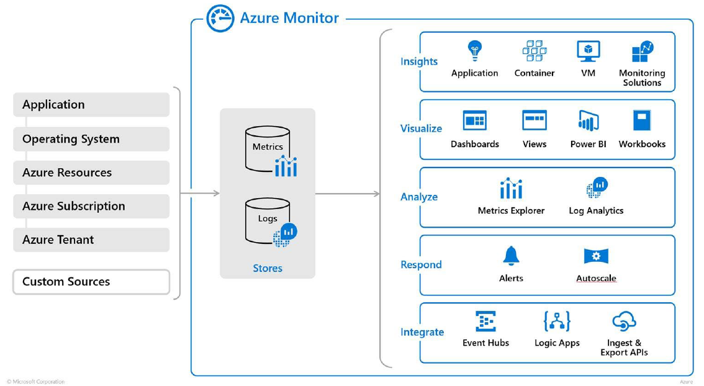

# Course Overview
1m 26s

## Course Overview
1m 26s

# Recommending Appropriate Monitoring Tool(s) for a Solution
94m 23s

## Course Agenda and Introduction to Azure Monitoring
15m 33s
- Understanding what Data you are Collecting
  - Application monitoring data
  - Guest OS monitoring data
  - Azure resource monitoring data
  - Azure subscription monitoring data
  - Azure tenant monitoring data
  - Custom Sources
- Azure Monitor
  - 
- Azure Metrics
  - Metrics are specific values of a system at a particular time and are capable of supporting near real-time scenarios Collected at 1 minute frequency 
  - Stored for 93 days
  - Each metric has the following data:
    - Time the value was collected
    - Type of measurement
    - The Azure resource
    - The Value

## Activity Logs
8m 55s
- Log showing subscription level events
- Events show the ’what, who, and when’ for any write operations taken on resources
- Does not include GET or Read operations
- Categories of Events:
  - Administrative
  - Service & Resource Health
  - Auto Scaling
  - Alerts
  - Security
  - Recommendations
  - Policy

## Diagnostic Logs
7m 30s

## Application and VM Insights
11m 42s

## Network Watcher and Real-time Networking
6m 39s
- Network Watcher
  - Set of tools for the monitoring, diagnosing, logging, and viewing of metrics for Azure Networking
    - Endpoint Connection monitoring
    - Network Topology
    - Diagnose Network Traffic & Connections
    - Packet Capture
    - Enable Network Logs
  - Real-Time Network Monitoring
    - IP Flow
      - Yes or No Availability
      - Point to Point for IP and Port
    - Next Hop
    - Packet Capture

## Network Diagnostics
6m 17s
- Network Diagnostics
  - VPN Diagnostics
  - NSG Flow Logs

## Connection Monitoring and Troubleshooting
5m 21s
- Connection Monitoring & Troubleshooting
  - Between two Azure VMs
  - Between Azure VM and FQDN
  - Between Azure VM and URI
  - Between Azure VM and IPv4
  - One-Time Troubleshooting
  - Long-term Monitoring

## Log Analytics
11m 21s
- Log Analytics
  - Log Collection
    - Virtual Machines
    - Containers
    - App Services
    - Customer Sources
    - Storage Accounts
    - Hybrid Capable
  - Log Analysis & Reporting
  - Recommendations & Suggestions
  - Extremely Strong Query Language

## Log Analytics Continued
9m 9s

## Security Center
11m 52s
- Security Center
  - Continuous Security Assessment
  - Actionable Recommendations
  - Prioritized Alerts and Incidents
    - Most attacked resources
    - Most prevalent alerts
  - Integrated Security Solutions
  - Policy Compliance Reporting
- Additional Information
  - 

# Planning for Integration with Monitoring Tools: On-premises & 3rd Party
40m 35s

## Diag-Storage-Integration
10m 2s
- Third-Party Monitoring & Logging Solutions
  - Splunk Enterprise
  - Elastic Stack
  - Alert Logic
  - NewRelic
- Diagnostic Integration
  - Log Ingestion
    - Azure Storage Account
    - Azure Event Hub
    - Azure Log Analytics
  - Use Cases
    - 3rdParty Product Ingestion
    - Feeds into Business Intelligence
    - Custom Data Collection
    - Custom Search

## Diag-Event Hub-Integration
5m 39s

## Diag-Log Analytics-Integration
5m 50s

## Storage-API
5m 59s

## Event Hub-API
5m 55s

## Log Analytics Search-API
7m 8s

# Defining Logical Groupings (Tags) for Resources to Be Monitored
25m 36s

- Groupings from a Monitoring Perspective
  - Resource Groups (Azure Tool)
    - Logical Container for Multiple Resources
    - Resources Exist in One and Only One Resource Group
    - Resource Groups can span Regions
    - Resource Groups can Span Services or Resource Types
  - Computer Groups (Log Analytics Tool)
    - Logical Grouping of Machines
    - Log Analytics Only
    - Processed as a Function
  - Action Groups (Alerting Tool)
    - Set of Actions to be performed when an Alert Criteria is is triggered
    - Multiple Actions Supported
    - No Logic Available when Triggered
    - Action Types:
      - Email/SMS/Push/Voice
      - Azure Functions
      - Automation Runbook
      - Logic App
      - Webhook
      - ITSM

## Resource Groups
9m 2s

## Computer Groups
5m 39s

## Action Groups
10m 54s

# Specifying Mechanism for Event Routing and Escalation
37m 41s

## Alert Definition
13m 52s

## Alert Signal Types
6m 57s

## Alert Actions
4m 36s

## Log Analytic Alerts
12m 15s