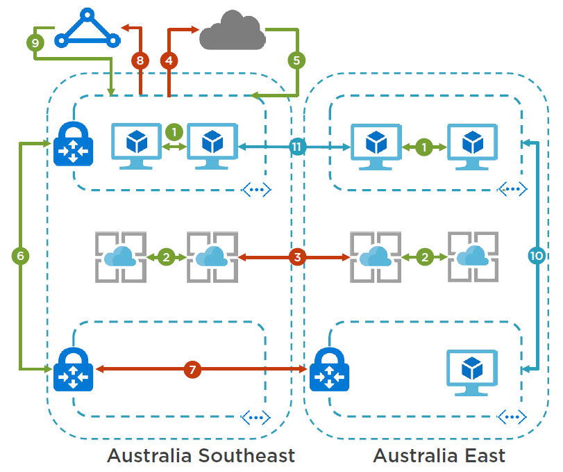

# Course Overview
2m 0s

## Course Overview
2m 0s

# Introducing Microsoft Azure Cost Management
24m 45s

## Course Introduction and Context
2m 15s

## Principles of Consumption Optimization
9m 1s
- Consumption Optimization: Guiding Principles
    - "**Cost optimization**" does not equate to "**cost minimization**"
    - Success is measured against business requirements
    - Requirements are both technical & non-technical
    - Architecture, monitoring & visibility
    - In-depth Azure solution knowledge is needed
    - Regular reassessment as services evolve
- Consumption Optimization: Tools
    - to forcast and understand the cost
        - Azure Portal
        - Azure Cost Management
        - Azure Billing APIs ?
        - Azure Pricing Calculator
    - to monitor
        - Azure Monitor
        - Application Insights
        - Log Analytics
        - Power BI

## Introducing Woodgrove Bank
5m 8s
- Woodgrove Bank
    - Multi-national organization
    - Cloud-first mentality
    - Many customer-facing products
    - Data-driven approach
    - Many stakeholders
- Stakeholder: Application Development
    - Responsible for customer-facing applications
    - Requires insights, alerting and reporting
    - Not responsible for underlying Azure services
    - Requires rapid, on-demand platform scaling
- Stakeholder: Infrastructure and Operations
    - Overall responsibility for Azure platform
    - Requires all solutions to be actively monitored
    - Requires proactive alerting and insights
    - Responsible for providing data reports
- Stakeholder: Data and Business Intelligence
    - Overall responsibility for business data
    - Responsible for data regulatory compliance
    - Uses structured and non-structured data
    - Provides data visibility to business stakeholders
- Stakeholder: Finance
    - Responsible for internal finance including invoicing
    - Requires full reporting on all aspects of Azure costs
    - Provides executive reporting to business
    - Requires full visibility over data platforms
- Demo
    - Native billing in the Azure Portal
        - 
    - What you get out of the box
    - Navigating options
    - Azure Cost Management
        - 
    - Why you should be using it
    - Exploring in-depth consumption data
    - Azure Billing APIs
    - Extracting your own data programmatically
    - PowerShell samples

## Azure Billing, Cost Management, and APIs
8m 20s

# Optimizing Storage Costs
30m 32s

## Understanding Business Data
3m 31s
- The ubiquity of cloud storage
    - Virtual Machines
        - Disks, OS logs & diagnostics logs
    - Big Data
        - Massive scale for analytics, ML and AI
    - PaaS Solutions
        - Code, databases & session state
    - Everything else!
        - Files, NoSQL, archives and more

## Business Data: Types and Use Cases
4m 18s
- Structured vs. Unstructured Data
    - 
- Relational vs. Non-relational Data Storage
    - 

## Understanding Azure Storage Services
6m 2s

- Types of Azure Storage
    - General Purpose
        - Blobs, Files, Tables & Queues
    - Blob
        - Blobs & Access Tiers
    - Disk
        - Managed & Unmanaged VM Disks
    - Data Lake Storage
        - Big Data Analytics
- Storage Account Replication & Redundancy
    - Locally Redundant (LRS)
    - Zone Redundant (ZRS)
    - Geo Redundant (GRS)
    - Read Access Geo Redundant (RA-GRS)
- Azure Blob Storage Access Tiers(**For GPv2 and Blob type**)
    - Hot
        - Highest storage costs
        - Lowest access costs
        - Optimized for **regular access**
    - Cool
        - Lower storage costs
        - Higher access costs
        - Optimized for **less frequent access**
            - no access for 30 days
    - Archive
        - Lowest storage costs
        - Highest access costs
        - Optimized for **long-term storage**
            - no access for 180 days
## Big Data and Azure Data Lake
3m 42s
- Big Data Storage Requirements
    - Massively scalable
    - Performant for unstructured data
    - Optimized for analytics
    - Cost-effective
- Azure Blob Storage vs. **Azure Data Lake Store**
    - Azure Blob Storage
        - General purpose data store
        - Container-based object store
        - Limits on scale
        - Available in every Azure region
        - Local and global redundancy
    - **Azure Data Lake Store**
        - Optimized for big data analytics
        - Folder-based hierarchical file system
        - **Unlimited scale**
        - **Not available in every Azure region**
        - **Local redundancy**

## Woodgrove Bank Storage: Business Requirements
3m 41s
- Problem Statement: Data & Storage
    - Woodgrove Bank has deployed a number of Azure Storage Accounts for general purpose storage (GPv1). Over time, business requirements have evolved:
        1. Same storage type has been used for all scenarios
        2. Ongoing storage costs are too high
        3. Business analysts need access to data for analytics
        4. New regulatory frameworks around data retention
- Business Requirements: Infrastructure and Operations
    - Data must be able to be archived
    - Storage costs must be able to be viewed
    - Correct storage services to be used
- Business Requirements : Data and Business Intelligence
    - To perform analytics against massive data stores
    - Requires potential for unlimited data growth
    - Separate data storage from analytics processing
- Business Requirements: Finance
    - Access to overall storage costs
    - Ensure that data retention regulations are met
    - Access financial data even if an Azure region is down
- **Solution Overview: Data & Storage**
    - Migrate Storage Accounts to GPv2
    - Implement tiering for data retention
    - Implement RA-GRS for Finance data
    - Implement Data Lake Storage
    - Cost Management Dashboards
    - Cost Management Reports
## Implementing Blob Tiering and Geo-redundancy
3m 54s
- Solution
    - Migrate storage accounts from GPv1 to GPv2
        - 
    - Implement blob tiering 
        - 
    - Migrate Finance data to RA-GRS account
        - 
        - two endpoints means that it's replicated
    - Verify Finance data
## Migrating Data to Azure Data Lake Store
2m 27s
- Solution
    - Implement Azure Data Lake Storage
    - Migrate data to Data Lake Storage
        - AdlCopy
    - Verify access to Data Lake Storage

## Creating a Custom Azure Cost Management Dashboard for Storage
2m 54s
- Solution
    - View storage costs in Azure Cost Management
    - Create Cost Management dashboard for storage
    - Create Cost Management report for storage

# Optimizing Compute Costs
33m 57s

## Infrastructure-as-a-Service: Use Cases and Scenarios
2m 41s
- IaaS Scenarios
    - Long-lived virtual machine instances
    - Scalable, immutable infrastructure
    - High performance computing
    - Sandboxed development environments

## Choosing the Right Azure Compute Services
7m 46s
- Azure Compute Services
    - Azure Virtual Machines
        - Discrete compute instances with dedicated operating systems, including Scale Sets
    - Azure App Services
        - Managed compute instances designed to run applications from source code
    - Azure Service Fabric
        - Managed compute platform designed to run high-density microservice applications
    - Azure Kubernetes Services & Azure Container Instances
        - Managed services to run container-driven applications at on demand and at scale
    - Azure Functions
        - Serverless compute instances designed to run on-demand code at scale
    - Azure Batch
        - High-performance, on-demand computing clusters for intensive parallel processing
- Choosing the Right Service
    - Workload type
    - Stateful/Stateless
    - Control
    - Scalability
    - Usage Model
    - CI/CD Support

## Optimizing Azure Compute
4m 31s
- Optimizing Azure Compute
    - Right-sizing
        - not copying the size of the on-premises VM
        - size it so that it work well
    - Performance monitoring
        - make data driven decision using he metrics
    - Auto-scaling
    - Application analysis
    - Move up the stack
        - move it to server-less so that it can be charged by sec
    - Turn it off!
        - when not used
        - use Azure automation

## Optimizing with Azure Monitor and Log Analytics
3m 24s
- Using **Azure Monitor** for Optimization
    - Host & Guest VM metrics
        - Historical performance and resource utilization enable informed decision-making
    - Alerts and automation
        - Real-time performance monitoring enables automated actions and remediation
    - Data routing
        - Send data to upstream sources for collation, analysis and visualization
- Using **Azure Log Analytics** for Optimization
    - Combination & correlation
        - Combine data from multiple sources to build a rich view of the whole environment
    - Applied analytics
        - Data analytics performed through machine learning to enable diagnosis and remediation
    - Data visualization
        - Visual data representation enables trend analysis and information dissemination
- Visualizing with **Power BI**
    - Combination & correlation
        - Query multiple sources and aggregate the data to show holistic correlation
    - Shareable dashboards
        - Distributable dashboards enable data sharing and collaboration throughout the company
    - Enhanced decision-making
        - Visual data representation enables rapid trend analysis and informed decision-making

## Right-sizing Virtual Machines with Azure Monitor
8m 6s
- Woodgrove Bank Scenario: Compute
- Problem Statement: Compute Woodgrove Bank migrated a number of
    - workloads in to Azure using Virtual Machines which were sized like-for-like. New workloads such as BI analytics and application hosting were performed using new Azure Virtual Machines. As a result:
        - It is felt that operating costs are too high
        - There is a push to use workload-appropriate services
        - Developers require dedicated compute environments
        - Finance needs visual oversight to verify ROI
- Business **Requirements**: Application Development
    - Requires dedicated compute instances for testing
    - Does not have time to provision all supporting services
    - Does not want to have to constantly manage budget
- Business **Requirements**: Infrastructure and Operations
    - Needs to verify that services are right-sized
    - Does not want to scale services manually
    - Does not want developers to need platform access
    - Needs to aggregate data for visualization
- Business **Requirements**: Data and Business Intelligence
Needs on
    - demand compute for analytics processing
- ### Solution Overview: Compute
    - Use Azure Monitor metrics for right-sizing
    - Aggregate metrics in Log Analytics
    - Implement VMSS and auto-scaling
    - Implement Azure DevTest Labs
        - for testing
    - Implement Azure Batch for analytics
    - Publish Power BI dashboards
- Solution(Demo)
    - Configure Azure Monitor and VM Diagnostics
    - Analyze Azure Monitor performance metrics
    - Right-size Azure VM from Azure Monitor metrics
    - Route Azure Monitor metrics to Log Analytics
    - Create dashboard in Log Analytics
## Implementing Performance-driven Autoscaling
3m 2s
- Solution
    - Implement VM Scale Sets
    - Use Azure Monitor to configure VMSS auto-scaling
    - Implement Azure Batch
    - Run an Azure Batch analytics task
## Implementing Azure DevTest Labs
4m 24s
- Solution
    - Implement Azure DevTest Labs
    - Configure Azure DevTest Labs
    - Verify developers can provision resources

# Optimizing Network Costs
26m 32s

## Core Microsoft Azure Networking Services
4m 15s
- Core Azure Network Services
    - Virtual Network
    - Load Balancer
    - ExpressRoute
    - Traffic Manager
    - Core Azure Network Services
    - Content Delivery Network
    - Application Gateway
    - Firewall
## Understanding Azure Networking Cost Drivers
5m 48s
- Azure Networking Cost Drivers
    - Bandwidth
        - **Outbound** data transfer varies by zone
    - Virtual Network Peering
        - Inbound & outbound are charged
    - VPN Gateway
        - Pricing depends on service SKU
    - ExpressRoute
        - Pricing depends on region and plan
- Azure Networking Cost Drivers
    - 
        1. Within the same VNet= Free
        2. Service to service in the same region = Free
        3. **Cross-region service to service = Charged**
            - outbound traffic is charged
            - inbound traffic is not
        4. **Outbound to internet from Azure = Charged**
        5. Inbound to Azure from internet = Free
        6. VNetto VNetVPN in the same region = Free
        7. **VNetto VNetVPN across regions = Charged**
        8. **ExpressRoute outbound = Charged***
            - outbound fee is based on the plan
        9.  ExpressRoute inbound = Free
        10. **Inter-region VNetPeering = Charged**
            - charged in both directions
        11. **Global VNetPeering = Charged**
            - charged in both directions
- Azure Networking Global Zones
    - Zone 1
        - US, Canada, Europe, UK & France
    - Zone 2
        - Asia, Australia, India, Japan, Korea, South Africa
    - Zone 3
        - Brazil
    - DE Trustee
        - Germany
    - US Gov
        - US Gov, US DoD
    - For example:
        - for a vNet peering between Zone1 and Zone2
        - outbound traffic is charged at Zone1 rate
        - inbound traffic is charged at Zone2 rate
## Considerations for Optimizing Connectivity
7m 15s

## Woodgrove Bank Networking: Business Requirements
2m 0s

## Implementing Azure Network Watcher and Traffic Analytics
4m 32s

## Creating a Custom Azure Cost Management Dashboard for Networking
2m 40s

# Optimizing App Service Costs
31m 3s

## Microsoft Azure App Services Overview
5m 5s

## Understanding and Optimizing App Service Scaling
6m 30s

## Application Architecture Considerations and Going Serverless on Azure
6m 33s

## Monitoring App Services and Woodgrove Bank App Services: Business Requirements
4m 35s

## Configure App Service Autoscaling with Azure Monitor
3m 31s

## Configure and Test App Service Monitoring with Application Insights
4m 47s

# Optimizing Identity Costs
24m 43s

## Azure Identity Overview and Licensing
5m 14s

## Optimizing Azure Identity Security
4m 33s

## Connecting with External Users and Identity Federation
6m 50s

## Woodgrove Bank: Implementing and Enabling Multi-factor Authentication
8m 5s