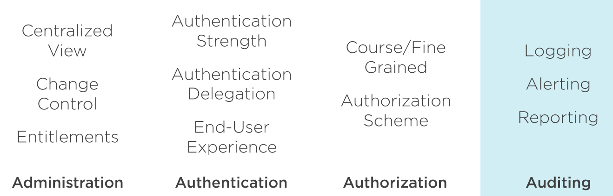
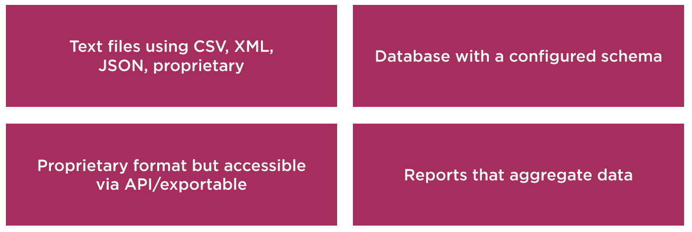
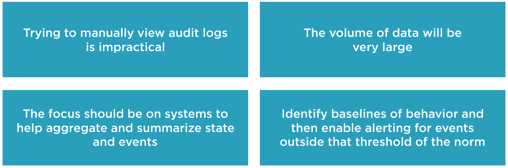

# Course Overview
0m 55s

## Course Overview
0m 55s

# Auditing Foundation
35m 29s

## Module Introduction
1m 12s

## Why Is This important?
1m 7s

## Four Pillars of Identity Review
1m 45s
- 

## What Is Auditing?
3m 20s

## Common Types of Log Data
6m 14s
- 
- Log should include:
    - Timestamp
    - Principal
    - Device/IP
    - Event
        - codes
        - commands
        - return codes
        - errors
        - category
        - and more

## Common Sources of Log Data
4m 38s

## Remember the Complete Picture
3m 10s

## Making Sense of Audit Logs
2m 1s
- 

## Using Audit Policies
3m 19s

## Types of Cloud Service - A Refresher
2m 47s

## Auditing for Compliance
5m 13s

## Module Summary
0m 38s

# Auditing in Azure
80m 33s

## Module Introduction
1m 7s

## Azure Monitor Overview
4m 6s

## Activity and Diagnostic Logs
9m 14s

## Using Action Groups and Alerts
9m 1s

## Using Log Analytics
6m 32s

## Leveraging Azure Security Center
6m 31s

## Using Azure Advisor
3m 35s

## Gaining Insight with Identity Protection
7m 16s

## Privileged Identity Management Auditing
4m 22s

## Using Access Reviews
5m 31s

## Auditing Cloud Service Usage
5m 46s

## Services for Compliance Auditing
0m 52s

## Using Azure Policies
8m 44s

## Azure Declarative Configuration Options
6m 58s

## Module Summary
0m 51s

# Auditing Azure Data Plane
37m 11s

## Module Introduction
0m 50s

## The Importance of the Data Plane
2m 22s

## Data Services in Azure
2m 32s

## Azure Backup Overview
2m 28s

## Azure Storage Basics
6m 34s

## Using Blob Snapshots
2m 43s

## Utilizing Storage Tiers
4m 10s

## Soft Delete and Immutable Blob Storage
2m 46s

## Storing Blob Data in an Alternate Location
2m 50s

## Azure SQL Database
3m 30s

## Azure Cosmos DB
1m 58s

## The Opposite of Retention
3m 31s

## Module Summary
0m 53s