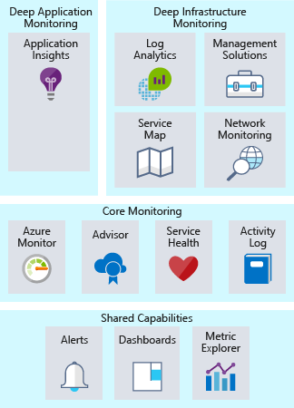

# [Pillars of a great Azure architecture](https://docs.microsoft.com/en-au/learn/modules/pillars-of-a-great-azure-architecture/)
- [Introduction](https://docs.microsoft.com/en-au/learn/modules/pillars-of-a-great-azure-architecture/1-introduction/)
- [Pillars of a great Azure Architecture](https://docs.microsoft.com/en-au/learn/modules/pillars-of-a-great-azure-architecture/2-pillars-of-a-great-azure-architecture/)
- [Design for security](https://docs.microsoft.com/en-au/learn/modules/pillars-of-a-great-azure-architecture/3-design-for-security/)
- [Design for performance and scalability](https://docs.microsoft.com/en-au/learn/modules/pillars-of-a-great-azure-architecture/4-design-for-performance-and-scalability/)
- [Design for availability and recoverability](https://docs.microsoft.com/en-au/learn/modules/pillars-of-a-great-azure-architecture/5-design-for-availability-and-recoverability/)
- [Design for efficiency and operations](https://docs.microsoft.com/en-au/learn/modules/pillars-of-a-great-azure-architecture/6-design-for-efficiency-and-operations/)
- [Summary](https://docs.microsoft.com/en-au/learn/modules/pillars-of-a-great-azure-architecture/7-summary/)
# [Design for security in Azure](https://docs.microsoft.com/en-au/learn/modules/design-for-security-in-azure/)
- [Introduction](https://docs.microsoft.com/en-au/learn/modules/design-for-security-in-azure/1-introduction/)
- [Defense in depth](https://docs.microsoft.com/en-au/learn/modules/design-for-security-in-azure/2-defense-in-depth/)
- [Identity management](https://docs.microsoft.com/en-au/learn/modules/design-for-security-in-azure/3-identity-management/)
- [Infrastructure protection](https://docs.microsoft.com/en-au/learn/modules/design-for-security-in-azure/4-infrastructure-protection/)
- [Encryption](https://docs.microsoft.com/en-au/learn/modules/design-for-security-in-azure/5-encryption/)
- [Network security](https://docs.microsoft.com/en-au/learn/modules/design-for-security-in-azure/6-network-security/)
- [Application security](https://docs.microsoft.com/en-au/learn/modules/design-for-security-in-azure/7-application-security/)
- [Summary](https://docs.microsoft.com/en-au/learn/modules/design-for-security-in-azure/8-summary/)
  
# [Design for performance and scalability in Azure](https://docs.microsoft.com/en-au/learn/modules/design-for-performance-and-scalability-in-azure/)
- [Introduction](https://docs.microsoft.com/en-au/learn/modules/design-for-performance-and-scalability-in-azure/1-introduction/)
- [Leverage scaling up and scaling out in your architecture](https://docs.microsoft.com/en-au/learn/modules/design-for-performance-and-scalability-in-azure/2-scaling-up-and-scaling-out/)
  - Scaling up/down
    - By size
      - for VMs
    - By DTU
      - for sql servers
    - By plan
      - for app services
  - Throttling
  - Severless
- [Optimize network performance](https://docs.microsoft.com/en-au/learn/modules/design-for-performance-and-scalability-in-azure/3-optimize-network-performance/)
  - Latency between **Azure resources**
    - following a example in this page
    - There are a few ways we could reduce the remaining latency:
      - Create a **read-replica of the database** in Australia East. This would allow reads to perform well, but writes would still incur latency. Azure SQL Database geo-replication allows for read-replicas.
      - Sync your data between regions with **Azure SQL Data Sync.**
      - Use a **globally distributed database** such as Azure Cosmos DB. This would allow both reads and writes to occur regardless of location, but may require changes to the way your application stores and references data.
      - Use caching technology such as **Azure Cache for Redis** to minimize high-latency calls to remote databases for frequently accessed data.
  - Latency between **users and Azure resources**
    - Use a DNS load balancer for endpoint path optimization
      - **Azure Traffic Manager**
    - Use CDN to cache content close to users
      - **Azure CDN**
    - Use ExpressRoute for connectivity from on-premises to Azure
      - **Azure ExpressRoute**

- [Optimize storage performance](https://docs.microsoft.com/en-au/learn/modules/design-for-performance-and-scalability-in-azure/4-optimize-storage-performance/)
  - Optimize **virtual machine** storage performance
    - When building an IaaS workload, which type of disk should you use? There are four options:
    - **Local SSD storage**
      - Each VM has a temporary disk
      - High performance
      - data could be lost during a maintenance event or a redeployment of the VM. 
      - There is no charge for this storage. It's included in the cost of the VM.
      - Workload: **temporary storage**
    - **Standard storage HDD**
      - This is spindle disk storage and may fit well where your application is not bound by inconsistent latency or lower levels of throughput. 
      - Workload: **dev/test workload**
    - **Standard storage SSD**
      - This is SSD backed storage and has the low latency of SSD but lower levels of throughput. 
      - Workload: **non-production web servers**
    - **Premium storage SSD**
      - This SSD backed storage is well-suited for those workloads that are going into production, require the greatest reliability and demand consistent low latency, or need high levels of throughput and IOPS. 
      - Workload: **production workloads**.
      - Premium storage can attach only to VM sizes with an "s" in the name, for example D2s_v3 or Standard_F2s_v2. Any virtual machine type (with or without an "s" in the name) can attach standard storage HDD or SSD drives.
  - Optimize storage performance for your application
    - Caching
    - Polyglot persistence
      - Polyglot persistence is the usage of different data storage technologies to handle your storage requirements.
- [Identify performance bottlenecks in your application](https://docs.microsoft.com/en-au/learn/modules/design-for-performance-and-scalability-in-azure/5-identify-performance-bottlenecks-in-your-application/)
  - Importance of requirements
  - Performance monitoring options in Azure
    - **Azure Monitor**
      - Azure Monitor provides a single management point for infrastructure-level logs and monitoring for most of your Azure services.
    - **Log Analytics**
      - **For infrastructure monitoring**
      - Log Analytics acts as a central hub for monitoring data. 
      - Log Analytics receives monitoring data from your Azure resources and makes it available to consumers for analysis or visualization.
  - Application performance management
    - This is where integrating telemetry into an application by using an application performance management solution (APM) to track down **low-level application performance** and behavior can be beneficial. 
      - **Application Insights**
        - **For Application monitoring**
        - Application Insights stores its data in a common repository, and metrics are shared with Azure Monitor.
- [Summary](https://docs.microsoft.com/en-au/learn/modules/design-for-performance-and-scalability-in-azure/6-summary/)
# [Design for efficiency and operations in Azure](https://docs.microsoft.com/en-au/learn/modules/design-for-efficiency-and-operations-in-azure/)
- [Introduction](https://docs.microsoft.com/en-au/learn/modules/design-for-efficiency-and-operations-in-azure/1-introduction/)
- [Maximize efficiency of cloud spend](https://docs.microsoft.com/en-au/learn/modules/design-for-efficiency-and-operations-in-azure/2-maximize-efficiency-of-cloud-spend/)
  - Track your cloud spend
    - **Azure Cost Management** gives you insights where your spend is going, as well as underutilized resources. 
    - **Azure Advisor** also has a cost component. It recommends VM resizing, buying reserved instances when more cost effective than pay-as-you-go instances.
  - Organize to optimize
  - Optimizing IaaS costs
    - Compute
      - Right size virtual machines
        - **Azure Advisor** identifies which virtual machines are underutilized.
      - Implement shutdown schedules for virtual machines
        - **Azure Automation** to run your VMs only during those times that your workloads require.
      - Apply compute cost discounts
        - **The Azure Hybrid Benefit** allows you to further optimize your costs for both Windows Server and SQL Server.
      - Virtual machine disk storage cost optimization
  - Optimizing PaaS costs
    - Optimizing Azure SQL Database costs
      - **SQL Database elastic pools** are a simple, cost-effective solution for managing and scaling several databases that have varying and unpredictable usage demands.
    - Optimizing Blob storage costs
      - Azure Storage offers three storage tiers for blob object storage.
        - **Hot access tier** - Highest storage costs but the lowest access costs.
        - **Cool access tier** - Lower storage costs and higher access costs compared to hot storage. This tier is intended for data that will stay in the cool tier for at least 30 days.
        - **Archive access tier** - Lowest storage cost and highest data retrieval costs compared to hot and cool storage. This tier is intended for data that can tolerate several hours of retrieval latency and will stay in the archive tier for at least 180 days.
    - Leverage consumption pricing models
      - Azure Functions have the ability to use Consumption plans.
    - 
- [Use monitoring and analytics to gain operational insights](https://docs.microsoft.com/en-au/learn/modules/design-for-efficiency-and-operations-in-azure/3-use-monitoring-and-analytics-to-gain-operational-insights/)
  - Monitoring
    - 
  - Core monitoring
    - Activity logging
    - Health of cloud services
    - Metrics and diagnostics
    - Recommendations on best practices
  - Deep infrastructure monitoring
  - Deep application monitoring
- [Use automation to reduce effort and error](https://docs.microsoft.com/en-au/learn/modules/design-for-efficiency-and-operations-in-azure/4-use-automation-to-reduce-effort-and-error/)
  - Infrastructure as code
      - Infrastructure as code is the management of infrastructure (networks, virtual machines, load balancers, and connection topology) in a descriptive model, using a versioning system similar to what is used for source code. 
      - Infrastructure as code evolved to solve the problem of environment drift.
          - a unique configuration that cannot be reproduced automatically.
      - When automating the deployment of services and infrastructure, there are two different approaches you can take: 
      - **imperative** 
        - With imperative automation, we're specifying how things are to be done.
        - Azure CLI or Azure PowerShell
        ```
        az group create --name storage-resource-group \
        --location eastus

        az storage account create --name mystorageaccount \
        --resource-group storage-resource-group \
        --kind BlobStorage \
        --access-tier hot
        ```
      - **declarative**
        - With declarative automation, we're specifying what we want our result to be, leaving the details of how it's done to the system we're using.
        - Resource Manager templates
  - VM customization: images vs. post-deployment configuration
    - There are two common strategies applied for the configuration work considered to be part the configuration of the VM itself, both of which have advantages and disadvantages:
      - **Custom images**
        - Custom images are generated by deploying a virtual machine and then configuring or installing software on that running instance.
        - Pro: quick build time
        - Cons: need to do the security patches
      - **Post-deployment scripting**
        - Post-deployment scripting typically leverages a basic base image, then relies on scripting or a configuration management platform to do configuration after the VM is deployed.
        - Pro: don't need to do the security patches
        - Cons: slower build time, need to execute scripts
  - Automation of operational tasks
    - Automating these tasks with Azure Automation reduces manual workloads
      - Periodically searching for orphaned disks.
      - Installing the latest security patches on VMs.
      - Searching for and shutting down virtual machines in off-hours.
      - Running daily reports and producing a dashboard to report to senior management.
  - Automating development environments
- [Summary](https://docs.microsoft.com/en-au/learn/modules/design-for-efficiency-and-operations-in-azure/5-summary/)
# [Design for availability and recoverability in Azure](https://docs.microsoft.com/en-au/learn/modules/design-for-availability-and-recoverability-in-azure/)
- [Introduction](https://docs.microsoft.com/en-au/learn/modules/design-for-availability-and-recoverability-in-azure/1-introduction/)
- [Build a highly available architecture](https://docs.microsoft.com/en-au/learn/modules/design-for-availability-and-recoverability-in-azure/2-high-availability/)
  - Evaluate high availability for your architecture
    - There are three steps to evaluate an application for high availability:
      - Determine the service-level agreement of your application
      - Evaluate the HA capabilities of the application
      - Evaluate the HA capabilities of dependent applications
  - Determine the service-level agreement of your application
    - A service-level agreement (SLA) is an agreement between a service provider and a service consumer in which the service provider commits to a standard of service based on measurable metrics and defined responsibilities.
    - Here are some other considerations when defining an SLA:
      - To achieve four 9's (99.99%), you probably can't rely on manual intervention to recover from failures. The application must be self-diagnosing and self-healing.
      - Beyond four 9's, it is challenging to detect outages quickly enough to meet the SLA.
      - Think about the time window that your SLA is measured against. The smaller the window, the tighter the tolerances. It probably doesn't make sense to define your SLA in terms of hourly or daily uptime.
  - Evaluate the HA capabilities of the application
    - Focus on **single points of failure** and **critical components** that would have a large impact on the application if they were unreachable, misconfigured, or started behaving unexpectedly.
  - Evaluate the HA capabilities of dependent applications
    - You'll need to understand not only your application's SLA requirements to your consumer, but also the provided SLAs of any resource that your application may depend on.
  - Azure's highly available platform
    - There are several core concepts when considering HA for your architecture on Azure:
      - **Availability sets**
        - Availability sets are a way for you to inform Azure that VMs that belong to the same application workload should be **distributed** to prevent **simultaneous impact** from hardware failure and scheduled maintenance. Availability sets are made up of **update domains** and **fault domains**.
      - **Availability zones**
        - Availability zones are independent physical datacenter locations within a region that include their own power, cooling, and networking.
        - Services like virtual machines are **zonal** services and allow you to deploy them to specific zones within a region. 
        - Other services are **zone-redundant** services and will replicate across the availability zones in the specific Azure region.
        - **Availability zones are mutually exclusive with availability sets**.
          - You'll have diversity at the data center level, and updates will never be performed to multiple availability zones at the same time.
      - **Load balancing**
        - Load balancers manage how network traffic is distributed across an application.
        - **Azure Traffic Manager**
          - provides global DNS load balancing. 
          - You would consider using Traffic Manager to provide load balancing of DNS endpoints within or across Azure regions.
        - **Azure Application Gateway**
          - provides Layer 7 load-balancing capabilities
        - **Azure Load Balancer**
          - is a layer 4 load balancer.
        - 
      - **Platform as a service (PaaS) HA capabilities**
        - PaaS services come with high availability built in.
- [Develop a disaster recovery strategy](https://docs.microsoft.com/en-au/learn/modules/design-for-availability-and-recoverability-in-azure/3-disaster-recovery/)
  - A disaster recovery plan is a single document that details the procedures that are required to recover from data loss and downtime caused by a disaster, and identifies who's in charge of directing those procedures.
  - How to create a disaster recovery plan
    - **Risk assessment and process inventory**
    - **Recovery objectives**
      - **Recovery Point Objective (RPO)**: The maximum duration of acceptable data loss. RPO is measured in units of time, not volume: "30 minutes of data", "four hours of data", and so on. RPO is about limiting and recovering from data loss, not data theft.
      - **Recovery Time Objective (RTO)**: The maximum duration of acceptable downtime, where "downtime" needs to be defined by your specification. For example, if the acceptable downtime duration is eight hours in the event of a disaster, then your RTO is eight hours.
      - RPO and RTO
        - 
    - **Detailing recovery steps**
      - The final plan should go into detail about exactly what steps should be taken to restore lost data and application connectivity.
        - Backups
        - Data replicas
        - Deployments
        - Infrastructure
        - Dependencies
        - Configuration and notification
  - Designing for disaster recovery
    - Data recovery and replication
      - Replication duplicates stored data between multiple data store replicas. 
      - Azure Storage
      - Azure SQL Database
      - Azure Cosmos DB
    - Process recovery
      - Azure Site Recovery
        - Azure Site Recovery is a service that's dedicated to managing process recovery for workloads running on VMs deployed to Azure, VMs running on physical servers, and workloads running directly on physical servers
        - Site Recovery replicates workloads to alternate locations and helps you to failover when an outage occurs and supports testing of a disaster recovery plan.
      - Service-specific features
        - Region pairs
  - Testing a disaster recovery plan
- [Protect your data with backup and restore](https://docs.microsoft.com/en-au/learn/modules/design-for-availability-and-recoverability-in-azure/4-backup-and-restore/)
- [Summary](https://docs.microsoft.com/en-au/learn/modules/design-for-availability-and-recoverability-in-azure/5-summary/)