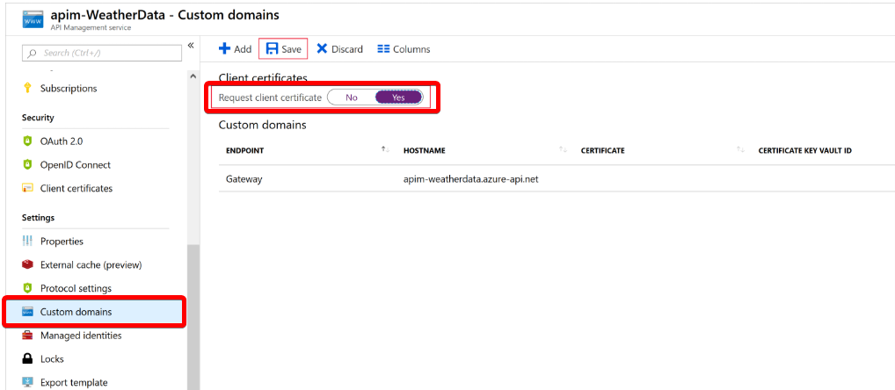

# [Control authentication for your APIs with Azure API Management](https://docs.microsoft.com/en-au/learn/modules/control-authentication-with-apim/index)
- [Introduction](https://docs.microsoft.com/en-au/learn/modules/control-authentication-with-apim/1-introduction/)
- [What is API Management?](https://docs.microsoft.com/en-au/learn/modules/control-authentication-with-apim/1a-understand-apim/)
  - For your meteorological app, you want to ensure that only customers who have subscribed to your service can access the API and use your forecast data, by issuing subscription keys.
  - Important
    - **Subscriptions** in this context are completely **different to Azure subscriptions** used for managing your Azure account
  - You can control access to your APIs by using a subscription. Subscriptions are used to segment the access levels to an API.
  - Subscription keys form the authorization to enable access to these subscriptions.
  - A subscription key is a unique auto-generated key that can be passed through in the headers of the client request or as a query string parameter. The key is directly related to a subscription, which can be scoped to different areas. Subscriptions give you granular control over permissions and policies.
    - All APIs
    - Single API
    - Product
- [Create subscriptions in Azure API Management](https://docs.microsoft.com/en-au/learn/modules/control-authentication-with-apim/2-create-subscriptions-in-apim/)
- [Exercise - Create subscriptions in Azure API Management](https://docs.microsoft.com/en-au/learn/modules/control-authentication-with-apim/3-exercise-create-subscriptions-in-apim/)
- [Use client certificates to secure access to an API](https://docs.microsoft.com/en-au/learn/modules/control-authentication-with-apim/4-secure-access-client-certs/)
  - TLS client authentication
    - With TLS client authentication, the API Management gateway can inspect the certificate contained within the client request and check for properties like:
        |Property|	Reason|
        |---|---|
        |Certificate Authority (CA)|	Only allow certificates signed by a particular CA|
        |Thumbprint|	Allow certificates containing a specified thumbprint|
        |Subject|	Only allow certificates with a specified subject|
        |Expiration Date|	Only allow certificates that have not expired|
    
  - Enable client certificates in the Consumption tier
    - In the Consumption tier, you must explicitly enable the use of client certificates, which you can do on the Custom domains page. This step is not necessary in other tiers.
    - 
  - Certificate Authorization Policies
    - 
    - Check the thumbprint of a client certificate
      - Substituting the thumbprint you copied earlier for desired-thumbprint:
      ```xml
        <choose>
            <when condition="@(context.Request.Certificate == null || context.Request.Certificate.Thumbprint != "desired-thumbprint")" >
                <return-response>
                    <set-status code="403" reason="Invalid client certificate" />
                </return-response>
            </when>
        </choose>
      ```
    - Check the thumbprint against certificates uploaded to API Management
      ```xml
        <choose>
            <when condition="@(context.Request.Certificate == null || !context.Request.Certificate.Verify()  || !context.Deployment.Certificates.Any(c => c.Value.Thumbprint == context.Request.Certificate.Thumbprint))" >
                <return-response>
                    <set-status code="403" reason="Invalid client certificate" />
                </return-response>
            </when>
        </choose>
      ```
    - Check the issuer and subject of a client certificate
        ```xml
        <choose>
            <when condition="@(context.Request.Certificate == null || context.Request.Certificate.Issuer != "trusted-issuer" || context.Request.Certificate.SubjectName.Name != "expected-subject-name")" >
                <return-response>
                    <set-status code="403" reason="Invalid client certificate" />
                </return-response>
            </when>
        </choose>
        ```
    - Check the connection
      - request with only the subscription will fail.
        ```powershell
        curl -X GET https://[gateway-name].azure-api.net/api/Weather/53/-1 \
        -H 'Ocp-Apim-Subscription-Key: [subscription-key]' \
        --cert-type pem \
        --cert selfsigncert.pem
        ```
- [Exercise - Use client certificates to secure access to an API](https://docs.microsoft.com/en-au/learn/modules/control-authentication-with-apim/5-exercise-secure-access-client-certs/)
- [Summary](https://docs.microsoft.com/en-au/learn/modules/control-authentication-with-apim/6-summary/)
  - [API Management documentation](https://docs.microsoft.com/azure/api-management/)
  - [Subscriptions in Azure API Management](https://docs.microsoft.com/azure/api-management/api-management-subscriptions)
  - [How to secure back-end services using client certificate authentication in Azure API Management](https://docs.microsoft.com/azure/api-management/api-management-howto-mutual-certificates)