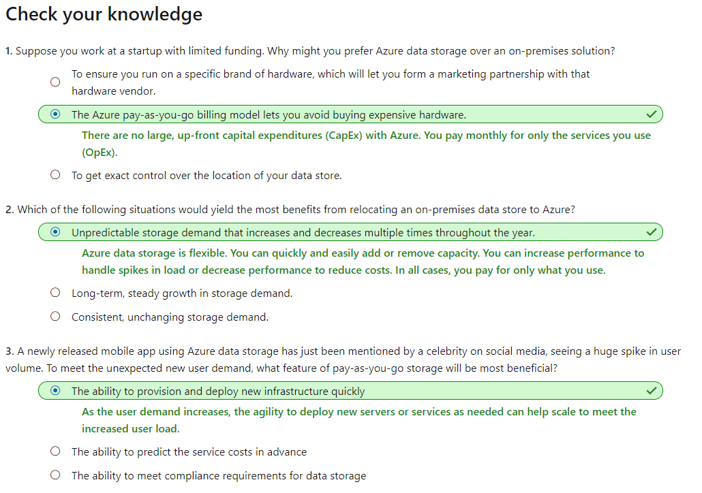

# [Core Cloud Services - Azure data storage options](https://docs.microsoft.com/en-au/learn/modules/intro-to-data-in-azure/index)
- [Introduction](https://docs.microsoft.com/en-au/learn/modules/intro-to-data-in-azure/1-introduction)
- [Benefits of using Azure to store data](https://docs.microsoft.com/en-au/learn/modules/intro-to-data-in-azure/2-benefits-of-using-azure-to-store-data)
- [How Azure data storage can meet your business storage needs](https://docs.microsoft.com/en-au/learn/modules/intro-to-data-in-azure/3-how-azure-storage-meets-your-business-storage-needs)
  - Storage tiers
    - Azure offers three storage tiers for blob object storage:
      - **Hot storage tier**: optimized for storing data that is accessed **frequently**.
      - **Cool storage tier**: optimized for data that are infrequently accessed and stored for at least **30 days**.
      - **Archive storage tier**: for data that are rarely accessed and stored for at least **180 days** with flexible latency requirements.
- [Comparison between Azure data storage and on-premises storage](https://docs.microsoft.com/en-au/learn/modules/intro-to-data-in-azure/4-comparison-azure-and-on-prem-storage)
- [Knowledge check](https://docs.microsoft.com/en-au/learn/modules/intro-to-data-in-azure/5-knowledge-check)
  - 
- [Summary](https://docs.microsoft.com/en-au/learn/modules/intro-to-data-in-azure/6-summary)    