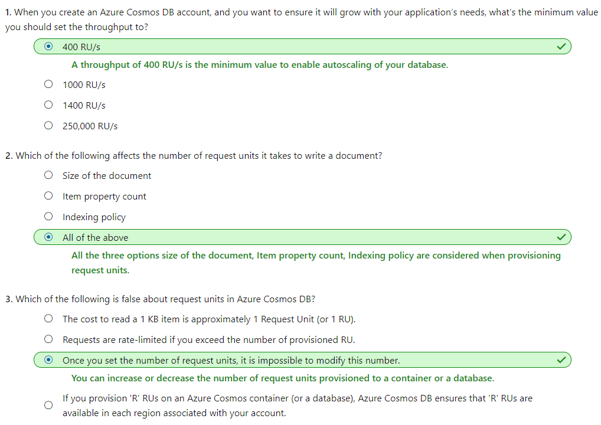
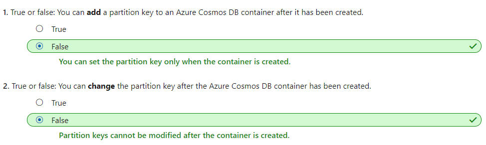

# [Create an Azure Cosmos DB database built to scale](https://docs.microsoft.com/en-au/learn/modules/create-cosmos-db-for-scale/index)
- [Introduction](https://docs.microsoft.com/en-au/learn/modules/create-cosmos-db-for-scale/1-introduction)
- [Exercise - Create an Azure Cosmos DB account in the Azure portal](https://docs.microsoft.com/en-au/learn/modules/create-cosmos-db-for-scale/2-create-an-account)
  - **Azure Cosmos DB account**
    - An **Azure Cosmos DB account** is an Azure resource that acts as an organizational entity for your databases. It connects your usage to your Azure subscription for billing purposes.
    - Each Azure Cosmos DB account is associated with **one of the several data models** Azure Cosmos DB supports, and you can create as many accounts as you need.
  - 
    - Azure Cosmos DB account
      - Databases
        - Containers
          - Partitions
            - Items
  - Provisioning throughput for containers
    - If your requests consume all of the provisioned throughput, Azure Cosmos DB will **rate-limit** your requests. 
    - You can 
      - provision throughput **for an entire database** and have it shared among containers within the database. 
      - provision throughput **dedicated to specific containers**.
  - **Request unit**
    - Azure Cosmos DB measures throughput using something called a **request unit (RU)**. Request unit usage is measured per second, so the unit of measure is **request units per second (RU/s)**. You must reserve the number of RU/s you want Azure Cosmos DB to provision in advance, so it can handle the load you've estimated, and you can scale your RU/s up or down at any time to meet current demand.
    - **A single request unit, 1 RU, is equal to the approximate cost of performing a single GET request on a 1-KB document using a document's ID.**
    - When provisioning throughput you should understand how many RU's your most common operations consume. **You can obtain the request unit charge for any operation on your Azure Cosmos DB containers**. 
    - **Request Unit considerations**
      - Item size
      - Item indexing: By default, each item is automatically indexed. Fewer RUs are consumed if you choose not to index some of your items in a container.
      - Item property count
      - Indexed properties: An index policy on each container determines which properties are indexed by default. To reduce the RU consumption for write operations, limit the number of indexed properties.
      - Data consistency: The strong and bounded staleness consistency levels consume approximately two times more RUs while performing read operations when compared to that of other relaxed consistency levels.
      - Query patterns: The complexity of a query affects how many RUs are consumed for an operation. Factors that affect the cost of query operations include:
        - The number of query results
        - The number of predicates
        - The nature of the predicates
        - The number of user-defined functions
        - The size of the source data
        - The size of the result set
        - Projections
    - When you create an account, you can provision **a minimum of 400 RU/s**, or a maximum of 250,000 RU/s in the portal.**(Soft limit)**
      - 

- [What is a request unit?](https://docs.microsoft.com/en-au/learn/modules/create-cosmos-db-for-scale/3-what-is-a-request-unit)
- [Choose a partition key in Azure Cosmos DB](https://docs.microsoft.com/en-au/learn/modules/create-cosmos-db-for-scale/4-how-to-choose-a-partition-key)
  - Partition strategy
    - The partition and scale-out strategy in Azure Cosmos DB is driven by the partition key, which is **a value set when you create a container**. Once the partition key is set, it cannot be changed without recreating the container, so selecting the right partition key is an important decision to make early in your development process.
  - **Partition key**
    - A partition key is the value by which Azure organizes your data into logical divisions.
    - A partition key should aim to distribute operations across the database. You want to distribute requests to **avoid hot partitions**.
      - A **hot partition** is a single partition that receives many more requests than the others, which can create a throughput bottleneck. 
    - The storage space for the data associated with each partition key cannot exceed 10 GB, which is the size of one physical partition in Azure Cosmos DB. So, if your single userID or productId record is going to be larger than 10 GB, think about using a composite key instead so that each record is smaller.
  - Best practices
    - Don’t be afraid of choosing a partition key that has a large number of values. The more values your partition key has, the more scalability you have.
    - To determine the best partition key for a read-heavy workload, review the top three to five queries you plan on using. The value most frequently included in the WHERE clause is a good candidate for the partition key.
    - For write-heavy workloads, you'll need to understand the transactional needs of your workload, because the partition key is the scope of multi-document transactions.
  - 
- [Exercise - Create a database and container in Azure Cosmos DB](https://docs.microsoft.com/en-au/learn/modules/create-cosmos-db-for-scale/5-create-a-database-and-collection)
- [Summary and cleanup](https://docs.microsoft.com/en-au/learn/modules/create-cosmos-db-for-scale/6-summary-cleanup)