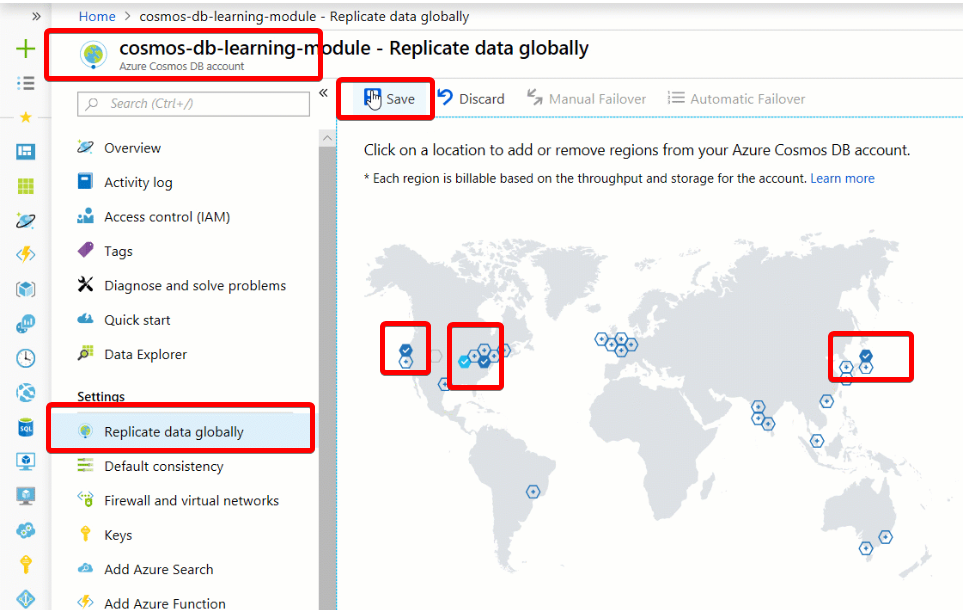
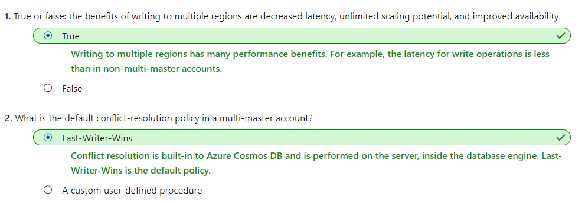
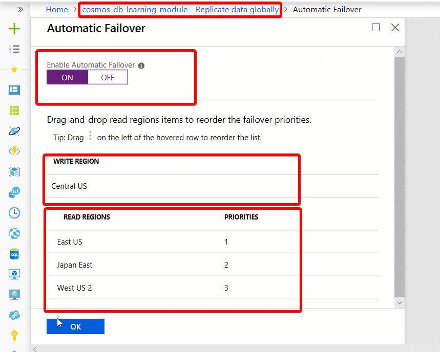
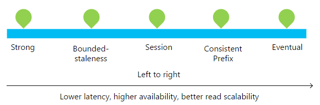
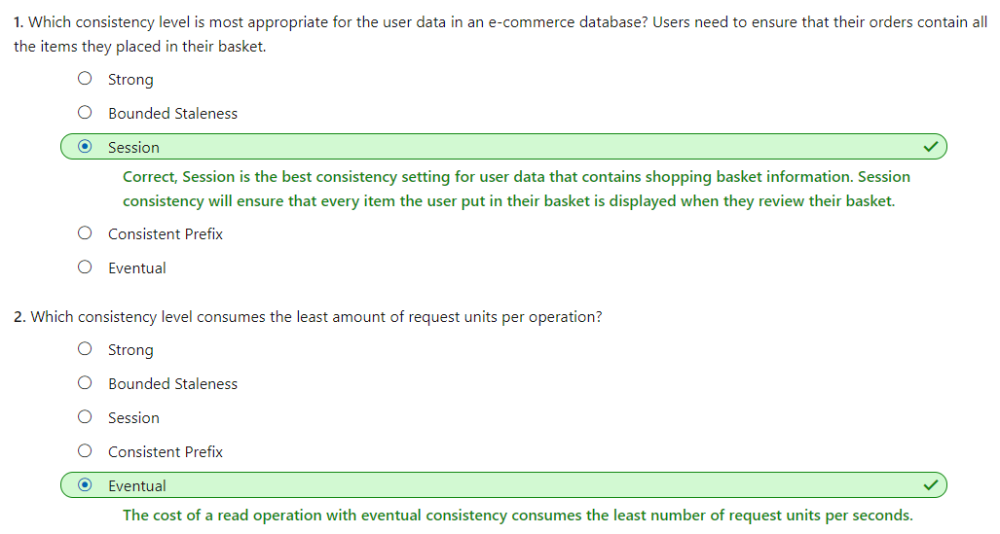

# [Distribute your data globally with Azure Cosmos DB](https://docs.microsoft.com/en-au/learn/modules/distribute-data-globally-with-cosmos-db/index)
- [Introduction](https://docs.microsoft.com/en-au/learn/modules/distribute-data-globally-with-cosmos-db/1-introduction)
- [Exercise - Distribute data globally](https://docs.microsoft.com/en-au/learn/modules/distribute-data-globally-with-cosmos-db/2-global-distribution)
  - **Global distribution basics**
    - Global distribution enables you to replicate data from one region into multiple Azure regions. You can add or remove regions in which your database is replicated at any time, and Azure Cosmos DB ensures that when you add an additional region, your data is available for operations within 30 minutes, assuming your data is 100 TBs or less.
    - When a database is replicated, the throughput and storage are replicated equally as well. So if your original database had 10GB of storage, and throughput of 1,000 RU/s, and if you replicated that to three additional regions, each region would have 10GB of data and 1,000 RU/s of throughput. Because the storage and throughput is replicated in each region, **the cost of replicating to a region is the same as the original region, so replicating to 3 additional regions, would cost approximately four times the original non-replicated database.**
    - Replicate data in multiple regions
      - 
- [Write to multiple regions](https://docs.microsoft.com/en-au/learn/modules/distribute-data-globally-with-cosmos-db/3-multi-region-write)
- **Multi-master**
  - Multi-master support is an option that can be enabled on new Azure Cosmos DB accounts. Once the account is replicated in multiple regions, each region is a master region that equally participates in a write-anywhere model, also known as an **active-active** pattern.
  - Azure Cosmos DB regions operating as master regions in a multi-master configuration automatically work to converge data written to all replicas and ensure global consistency and data integrity.
  - With Azure Cosmos DB multi-master support, you can **perform writes** on any container in a write-enabled regioBn world-wide. Written data is propagated to all other regions immediately.
    - Benefits
      - Single-digit write latency
      - 99.999% read-write availability
      - Unlimited write scalability and throughput 
      - Built-in conflict resolution
        - **Last-Writer-Wins (LWW)**, in which conflicts are resolved based on the value of a **user-defined integer property** in the document. By default _ts is used to determine the last written document. **Last-Writer-Wins is the default conflict handling mechanism.**
        - **Custom - User-defined function**, in which you can fully control conflict resolution by registering a User-defined function to the collection. **A User-defined function is a special type of stored procedure with a specific signature**. If the User-defined function fails or does not exist, Azure Cosmos DB will add all conflicts into the read-only conflicts feed they can be processed asynchronously.
        - **Custom - Async**, in which Azure Cosmos DB excludes all conflicts from being committed and registers them in the read-only conflicts feed for deferred resolution by the user’s application. The application can perform conflict resolution asynchronously and use any logic or refer to any external source, application, or service to resolve the conflict.
    - Knowledge check
      - 
- [Exercise - Change global read and write priorities](https://docs.microsoft.com/en-au/learn/modules/distribute-data-globally-with-cosmos-db/4-change-priorities)
  - If you enable multi-region writes when creating the Azure Cosmos DB account, every region is both read and write. So if a regional failure happens the SDK will redirect to the next closest region and this region supports both read and write requests. So the concept of automatic and manual failover is applicable to single-region write account only.
  - Failover basics
    - What happens if a read region has an outage?
      - Azure Cosmos DB accounts with a read region in one of the affected regions are automatically **disconnected from their write region** and marked offline. 
      - The Azure Cosmos DB SDKs implement a regional discovery protocol that allows them to automatically detect when a region is available and redirect read calls to the next available region in the preferred region list.
      - Once the affected region recovers from the outage, all the affected Azure Cosmos DB accounts in the region are automatically recovered by the service. Azure Cosmos DB accounts that had a read region in the affected region will then automatically sync with current write region and turn online.
    - What happens if a write region has an outage?
      - The Azure Cosmos DB SDKs implement a regional discovery protocol that allows them to automatically detect when a region is available and redirect read calls to the next available region in the preferred region list.
      - During automatic failovers, Azure Cosmos DB automatically chooses the next write region for a given Azure Cosmos DB account based on the specified priority order. 
      - 
- [Choose a consistency level](https://docs.microsoft.com/en-au/learn/modules/distribute-data-globally-with-cosmos-db/5-data-consistency-levels)
  - Consistency basics
    - 
  - **Consistency levels and guarantees**
    |Consistency Level	|Guarantees|
    |---|---|
    |Strong	|Linearizability. Reads are guaranteed to return the most recent version of an item.|
    |Bounded Staleness	|Consistent Prefix. Reads lag behind writes by at most k prefixes or t interval.|
    |Session	|Consistent Prefix. Monotonic reads, monotonic writes, read-your-writes, write-follows-reads.|
    |Consistent Prefix	|Updates returned are some prefix of all the updates, with no gaps.|
    |Eventual	|Out of order reads.|
  - Strong consistency
    - Strong consistency offers a **linearizability** guarantee with the reads guaranteed to **return the most recent version of an item**.
    - Strong consistency guarantees that a write is only visible after it is committed durably by the majority quorum of replicas. A write is either synchronously committed durably by both the primary and the quorum of secondaries, or it is aborted. A read is always acknowledged by the majority read quorum, a client can never see an uncommitted or partial write and is always guaranteed to read the latest acknowledged write.
    - You can have an Azure Cosmos account with strong consistency and multiple write regions. However, the benefits such as low write latency, high write availability that are available to multiple write regions are not applicable to Cosmos accounts configured with strong consistency, because of synchronous replication across regions. For more information, see Consistency and Data Durability in Azure Cosmos DB article.
    - **The cost of a read operation** (in terms of request units consumed) with strong consistency **is higher than session and eventual**, but the same as bounded staleness.
  - Bounded staleness consistency
    - Bounded staleness consistency guarantees that the **reads may lag behind writes by at most K versions** or prefixes of an item or t time-interval.
    - Therefore, when choosing bounded staleness, the "staleness" can be configured in two ways: number of versions K of the item by which the reads lag behind the writes, and the time interval t.
    - Bounded staleness **offers total global order except within the "staleness window."** The monotonic read guarantees exist within a region both inside and outside the "staleness window."
    - Bounded staleness provides a stronger consistency guarantee than session, consistent-prefix, or eventual consistency. For globally distributed applications, we recommend you use bounded staleness for scenarios where you would like to have strong consistency but also want 99.99% availability and low latency.
    - Azure Cosmos DB accounts that are configured with bounded staleness consistency can associate any number of Azure regions with their Azure Cosmos DB account.
    - The cost of a read operation (in terms of RUs consumed) with bounded staleness is higher than session and eventual consistency, but the same as strong consistency.
  - **Session consistency**
    - Unlike the global consistency models offered by strong and bounded staleness consistency levels, **session consistency is scoped to a client session**.
    - **Session consistency is ideal for all scenarios where a device or user session is involved** since it guarantees monotonic reads, monotonic writes, and read your own writes (RYW) guarantees.
    - Session consistency provides predictable consistency for a session, and maximum read throughput while offering the lowest latency writes and reads.
    - Azure Cosmos DB accounts that are configured with session consistency can associate any number of Azure regions with their Azure Cosmos DB account.
    - The cost of a read operation (in terms of RUs consumed) with session consistency level is less than strong and bounded staleness, but more than eventual consistency.
  - **Consistent prefix consistency**
    - **Consistent prefix guarantees that in absence of any further writes, the replicas within the group eventually converge**.
    - Consistent prefix guarantees that reads **never see out of order writes**. If writes were performed in the order A, B, C, then a client sees either A, A,B, or A,B,C, but never out of order like A,C or B,A,C.
    - Azure Cosmos DB accounts that are configured with consistent prefix consistency can associate any number of Azure regions with their Azure Cosmos DB account.
- **Eventual consistency**
    - Eventual consistency guarantees that in absence of any further writes, the replicas within the group eventually converge.
    - Eventual consistency is the weakest form of consistency where a client may get the values that are older than the ones it had seen before.
    - Eventual consistency provides the weakest read consistency but offers the lowest latency for both reads and writes.
    - Azure Cosmos DB accounts that are configured with eventual consistency can associate any number of Azure regions with their Azure Cosmos DB account.
    - **The cost of a read operation** (in terms of RUs consumed) with the eventual consistency level **is the lowest** of all the Azure Cosmos DB consistency levels.
  - 
- [Summary and cleanup](https://docs.microsoft.com/en-au/learn/modules/distribute-data-globally-with-cosmos-db/6-summary-cleanup)