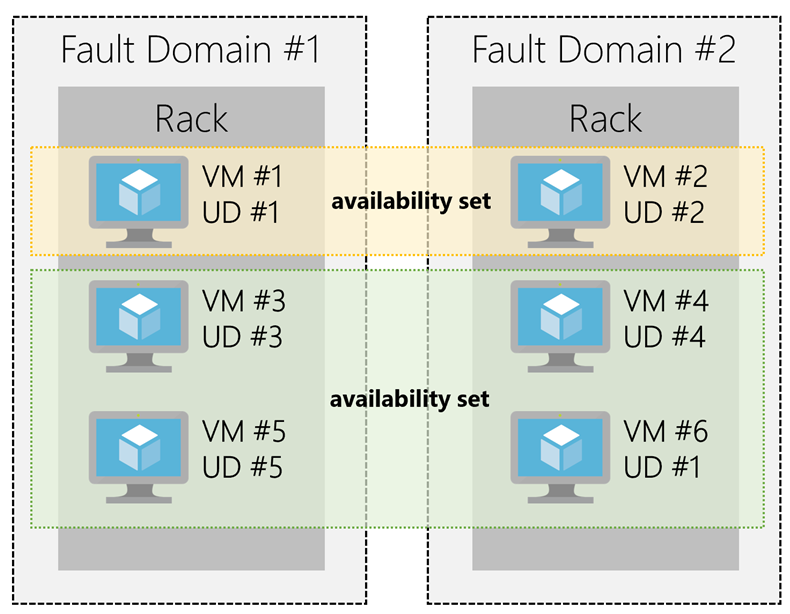
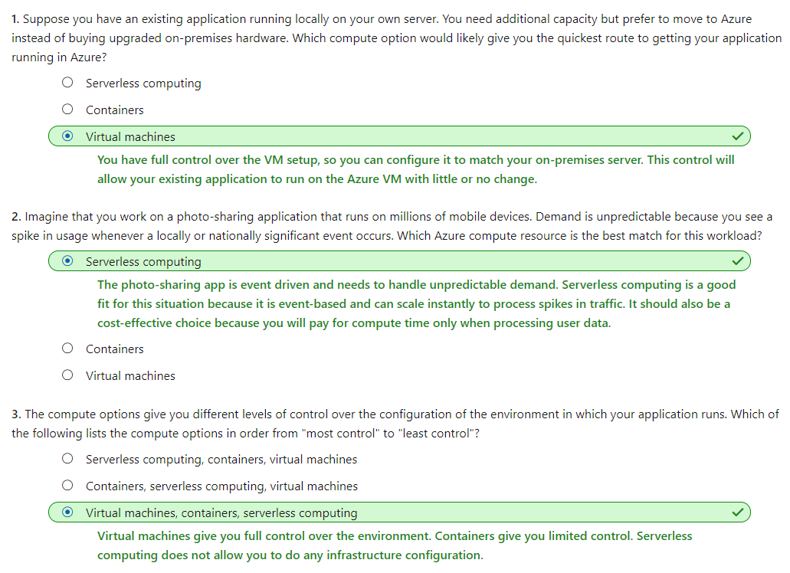

# [Core Cloud Services - Azure compute options](https://docs.microsoft.com/en-au/learn/modules/intro-to-azure-compute/index)

```
https://onedrive.live.com/view.aspx?resid=471B297280878A61%21153&id=documents&wd=target%28Azure%20Fundation.one%7C624656DE-5C0A-499E-9100-1E511484EE77%2FCore%20Cloud%20Services%20-%20Azure%20compute%20options%7C907F63D1-5DED-4121-BD53-3923A07C2652%2F%29
onenote:https://d.docs.live.net/471b297280878a61/Documents/Kaiqi%20的笔记本/Azure%20Fundation.one#Core%20Cloud%20Services%20-%20Azure%20compute%20options&section-id={624656DE-5C0A-499E-9100-1E511484EE77}&page-id={907F63D1-5DED-4121-BD53-3923A07C2652}&end
```

- [Introduction](https://docs.microsoft.com/en-au/learn/modules/intro-to-azure-compute/1-introduction)
- [Essential Azure compute concepts](https://docs.microsoft.com/en-au/learn/modules/intro-to-azure-compute/2-essential-azure-compute-concepts)
  - Azure compute is an on-demand computing service for running cloud-based applications. There are four common techniques for performing compute in Azure:
    - **Virtual machines**
    	- Virtual machines, or VMs, are software emulations of physical computers. They include a virtual processor, memory, storage, and networking resources.
  	- **Containers**
    	- Containers are a virtualization environment for running applications.
  	- **Azure App Service**
    	- Azure App Service is a platform-as-a-service (PaaS) offering in Azure that is designed to host enterprise-grade web-oriented applications.
  	- **Serverless computing**
    	- Serverless computing is a cloud-hosted execution environment that runs your code but completely abstracts the underlying hosting environment. 
      - You create an instance of the service, and you add your code; no infrastructure configuration or maintenance is required, or even allowed.
- [Explore Azure Virtual Machines](https://docs.microsoft.com/en-au/learn/modules/intro-to-azure-compute/3-virtual-machines)
  - Moving to the cloud with VMs
    - VMs are also an excellent choice when moving from a physical server to the cloud **("lift and shift")**. You can create an image of the physical server and host it within a VM with little or no changes. Just like a physical on-premises server, you must maintain the VM. Update the OS and the software it runs.
  - Scaling VMs in Azure
	- **Availability sets**
      - For Availability
	- Virtual Machine **Scale Sets**
      - For auto scaling
	- **Azure Batch**
      - For big computing power
  - What are availability sets?
    - There's **no cost** for an availability set. 
    - An **availability set** is a logical grouping of two or more VMs that help keep your application available during **planned or unplanned maintenance.**
    - A **planned maintenance** event is when the underlying Azure fabric that hosts VMs is updated by Microsoft. 
      - VMs are put into different **update domains**. Update domains indicate groups of VMs and underlying physical hardware that can be rebooted at the same time. 
      - Update domains are a logical part of each data center and are implemented with software and logic.
      - Which means the VMs will be in different **update domain**
    - **Unplanned maintenance events** involve a hardware failure in the data center, such as a power outage or disk failure. 
      - The group of virtual machines that share common hardware are in the same fault domain. A **fault domain** is essentially a rack of servers.
      - Which means the VMs will be in different **fault domain**
    - With an availability set, you get:
      - Up to three **fault domains** that each have a server rack with dedicated power and network resources
      - Five logical **update domains** which then can be increased to a maximum of 20
    - Your VMs are then sequentially placed across **the fault and update domains**. The following diagram shows an example where you have six VMs in an availability set distributed across the two fault domains and five update domains. 
      - 
  - What are virtual machine scale sets?
    - Azure Virtual Machine Scale Sets let you create and manage a group of identical, load balanced VMs.
    - The number of VM instances can automatically increase or decrease in response to demand or a defined schedule. 
  - What is Azure Batch?
    - Azure Batch enables large-scale job scheduling and compute management with the ability to scale to tens, hundreds, or thousands of VMs.

- [Explore Containers in Azure](https://docs.microsoft.com/en-au/learn/modules/intro-to-azure-compute/4-containers)
  - Containers in Azure
    - Azure supports Docker containers, and there are several ways to manage containers in Azure.
      - Azure Container Instances
        - Azure Container Instances (ACI) offers the fastest and simplest way to run a container in Azure. You don't have to manage any virtual machines or configure any additional services. It is a **PaaS** offering that allows you to **upload your containers** and execute them directly.
      - Azure Kubernetes Service
        - The task of automating and managing and interacting with a large number of containers is known as **orchestration**. Azure Kubernetes Service (AKS) is a complete orchestration service for containers with distributed architectures with multiple containers.
- [Explore Azure App Service](https://docs.microsoft.com/en-au/learn/modules/intro-to-azure-compute/5-appservice)
  - **Azure App Service** enables you to build and host web apps, background jobs, mobile backends, and RESTful APIs in the programming language of your choice without managing infrastructure. 
    - It offers auto-scaling and high availability, 
    - supports both Windows and Linux, 
    - and enables automated deployments from GitHub, Azure DevOps, or any Git repo to support a continuous deployment model.
  - This platform as a service (PaaS) allows you to focus on the website and API logic while Azure takes care of the infrastructure to run and scale your web applications.
  - You pay for the Azure compute resources your app uses **while it processes requests** based on the App Service Plan you choose.
  - Types of web apps
    - Web Apps
      - App Service includes full support for hosting web apps using ASP.NET, ASP.NET Core, Java, Ruby, Node.js, PHP, or Python. You can choose either Windows or Linux as the host operating system.
    - API Apps
      - Much like hosting a website, you can build REST-based Web APIs using your choice of language and framework. You get full Swagger support, and the ability to package and publish your API in the Azure Marketplace. The produced apps can be consumed from any HTTP(s) based client.
    - WebJobs
      - WebJobs allows you to run a program (.exe, Java, PHP, Python or Node.js) or script (.cmd, .bat, PowerShell, or Bash) in the same context as a web app, API app, or mobile app. They can be scheduled, or run by a trigger. This is often used to run background tasks as part of your application logic.
    - Mobile Apps
      - Use the Mobile Apps feature of Azure App Service to quickly build a back-end for iOS and Android apps.


- [Explore Serverless computing in Azure](https://docs.microsoft.com/en-au/learn/modules/intro-to-azure-compute/6-serverless-computing)
  - With serverless computing, Azure takes care of managing the server infrastructure and allocation/deallocation of resources based on demand. Infrastructure isn't your responsibility. Scaling and performance are handled automatically, and you are billed only for the exact resources you use. There's no need to even reserve capacity.
  - You focus solely on the **logic** you need to execute and the **trigger** that is used to run your code. You configure your serverless apps to respond to events. 
    - This could be a REST endpoint, a periodic timer, or even a message received from another Azure service. 
  - The serverless app runs only when it's triggered by an event.
  - Azure has two implementations of serverless compute:
    - **Azure Functions** which can execute code in almost any modern language.
      - They're commonly used 
        - when need to perform work in response to an event, often via a REST request, timer, or message from another Azure service
        - when that work can be completed quickly, within seconds or less.
      - **scale automatically** based on demand
      - **charged for the CPU time** used while your function runs.
      - Azure Functions can be either 
        - **stateless (the default)** where they behave as if they're restarted every time they respond to an event), 
        - **stateful (called "Durable Functions")** where a context is passed through the function to track prior activity.
    - **Azure Logic Apps** which are designed in a web-based designer and can execute logic triggered by Azure services without writing any code.
      - Azure Logic Apps are similar to Functions - both enable you to trigger logic based on an event. Where Functions execute code, Logic Apps execute workflows built from predefined logic blocks. They are specifically designed to automate your business processes.
      - You create Logic App workflows using a visual designer on the Azure Portal or in Visual Studio. The workflows are persisted as a JSON file with a known workflow schema.
- [Summary](https://docs.microsoft.com/en-au/learn/modules/intro-to-azure-compute/7-summary)
  - Check your knowledge
    - 