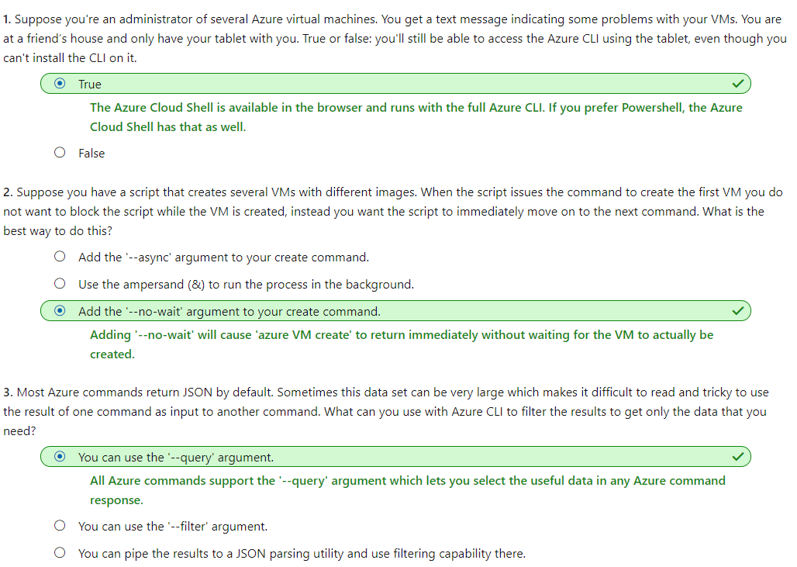

# [Manage virtual machines with the Azure CLI](https://docs.microsoft.com/en-au/learn/modules/manage-virtual-machines-with-azure-cli/index)
- [What is the Azure CLI?](https://docs.microsoft.com/en-au/learn/modules/manage-virtual-machines-with-azure-cli/1-what-is-the-cli)
  - The Azure CLI is Microsoft's cross-platform command-line tool for managing Azure resources. It's available for macOS, Linux, and Windows, or in the browser using Azure Cloud Shell.
- [Exercise - Create a virtual machine](https://docs.microsoft.com/en-au/learn/modules/manage-virtual-machines-with-azure-cli/2-create-a-vm)
  - create a VM
    ```
    az vm create \
        --resource-group [sandbox resource group name] \
        --name SampleVM \
        --image UbuntuLTS \
        --admin-username azureuser \
        --generate-ssh-keys \
        --verbose
    ```
    - We are specifying the `administrator` account name through the `--admin-username` flag to be azureuser
      - Common names such as "root" and "admin" are not allowed for most images.
    - We are also using the `generate-ssh-keys` flag. This parameter is used for Linux distributions and creates a pair of security keys so we can use the `ssh` tool to access the virtual machine remotely.

- [Exercise - Test your new virtual machine](https://docs.microsoft.com/en-au/learn/modules/manage-virtual-machines-with-azure-cli/3-testing-the-vm)
- [Exercise - Explore other VM images](https://docs.microsoft.com/en-au/learn/modules/manage-virtual-machines-with-azure-cli/4-other-vm-images)
- [Exercise - Sizing VMs properly](https://docs.microsoft.com/en-au/learn/modules/manage-virtual-machines-with-azure-cli/5-sizing-vms)
  - Get all sizes
    - `az vm list-sizes --location eastus --output table`
  - Resize an existing VM
    ```
    az vm resize \
        --resource-group learn-01765db9-ebc5-4644-b905-3140107d37f9 \
        --name SampleVM \
        --size Standard_D2s_v3
    ```
- [Exercise - Query system and runtime information about the VM](https://docs.microsoft.com/en-au/learn/modules/manage-virtual-machines-with-azure-cli/6-querying-vms)
  - Adding filters to queries with JMESPath
    ```
    az vm show \
        --resource-group learn-01765db9-ebc5-4644-b905-3140107d37f9 \
        --name SampleVM \
        --query "osProfile.adminUsername"
    ```
- [Exercise - Start and stop your VM with the Azure CLI](https://docs.microsoft.com/en-au/learn/modules/manage-virtual-machines-with-azure-cli/7-managing-vms)
- [Exercise - Install software on your VM](https://docs.microsoft.com/en-au/learn/modules/manage-virtual-machines-with-azure-cli/8-installing-software)
- [Summary and cleanup](https://docs.microsoft.com/en-au/learn/modules/manage-virtual-machines-with-azure-cli/9-cleanup)
  - Check your knowledge
    - 