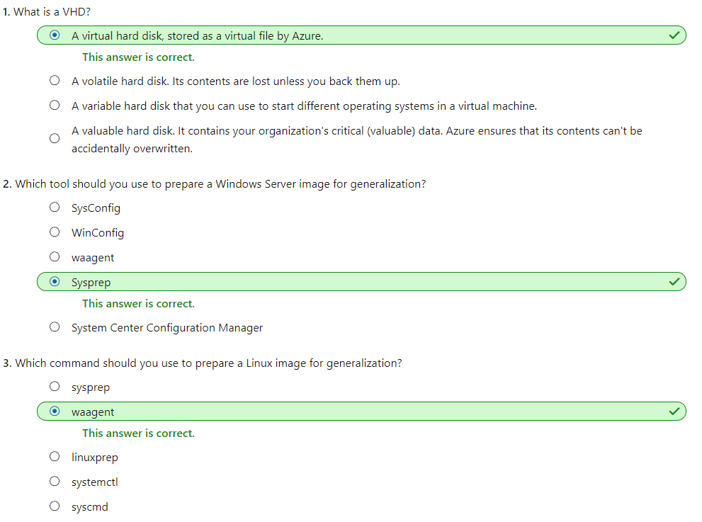

# [Deploy Azure virtual machines from VHD templates](https://docs.microsoft.com/en-au/learn/modules/deploy-vms-from-vhd-templates/index)
- [Introduction](https://docs.microsoft.com/en-au/learn/modules/deploy-vms-from-vhd-templates/1-introduction)
- [Disk image capabilities for Azure virtual machines](https://docs.microsoft.com/en-au/learn/modules/deploy-vms-from-vhd-templates/2-azure-vm-disk-imaging-capabilities)
  - Azure virtual hard disk
    - A **virtual hard disk** is conceptually similar to a physical hard disk. You can use a VHD to host the operating system and run a virtual machine. A VHD can also hold databases and other user-defined folders, files, and data. 
    - A virtual machine can contain multiple VHDs. Typically, a virtual machine has an **operating system VHD** on which the operating system is installed. It also has one or more data VHDs that contain the **applications** and other **user-specific** data used by the virtual machine.
  - Compared to physical disks, VHDs have several advantages, including:
    - **High availability**: You can store a VHD as an Azure-managed disk. Managed disks are replicated across three datacenters. If one datacenter has connectivity issues, your VHD is still available in two other locations.
    - **Physical security**
    - **Durability**: Because a VHD isn't a physical piece of hardware, it won't wear out or suffer from some form of media failure.
    - **Scalability**: You can create many virtual machines from the same VHDs simultaneously with minimal contention. (Contrast this with trying to set up 100 machines from the same DVD mounted as a shared device on your on-premises network.)
    - **Cost and performance**: Azure provides several different types of VHDs. They range from those stored on high-performance, dedicated SSDs, to lower-performance, lower-cost VHDs stored on shared hard disk drives. You can select the type of VHD that meets your throughput and cost requirements.
  - virtual machine image
    - a virtual machine image is a template from which you can create the VHDs to run a virtual machine
    - The VHDs for a typical virtual machine image contain a **preconfigured version of an operating system**
    - Azure Marketplace supplies many virtual machine images
    - You can also build your own virtual machine images and VHDs from scratch by using Microsoft Hyper-V
  - generalized image
    - After you build and customize a virtual machine, you can save the new image as **a set of VHDs**.
    - You must reset these items back to a default state before you use the image to create more virtual machines. Otherwise, you might end up with multiple virtual machines that have the same identities. The process of resetting this data is called **generalization**, and the result is a **generalized image**.
      - The host name of your virtual machine.
      - The username and credentials that you provided when you installed the operating system on the virtual machine.
      - Log files.
      - Security identifiers for various operating system services.
    - For **Windows**, use the Microsoft System Preparation (**Sysprep**) tool. For **Linux**, use the Windows Azure Linux Agent (**waagent**) tool.
  - specialized virtual image
    - A specialized virtual image is a copy of a live virtual machine after it has reached a specific state.
  - Check your knowledge
    - 
- [Generalize a server and create an image of a VM](https://docs.microsoft.com/en-au/learn/modules/deploy-vms-from-vhd-templates/3-generalize-server-create-image)
  - Generalize a Windows virtual machine
    - Sign in to the Windows virtual machine.
    - Run sysprep.exe.
    - After the virtual machine has been shut down, you must deallocate it while it's in this clean state.
      ```powershell
      Stop-AzVM -ResourceGroupName <resource group> `
          -Name <virtual machine name> `
          -Force
      ```
  - Generalize a Linux virtual machine
    - sign in to the machine, and run the following command:
      - `waagent -deprovision+user`
    - You should then disconnect from the virtual machine.
    - Finally, you must deallocate and generalize the virtual machine while it's in this clean state. 
  - Create an image from a generalized virtual machine
    - After you have generalized the virtual machine, you can create an image. 
    - The image will include **all of the disks** associated with the virtual machine. 
      ```bash
      az image create \
        --name <image name> \
        --resource-group <resource group> \
        --source <generalized virtual machine>
      ```
  - Create a new virtual machine from a generalized image
    ```bash
        az vm create \
            --resource-group <resource group> \
            --name <new virtual machine name> \
            --image <image name> \
            --location <location of image>
    ```
  - Create a snapshot of a VHD
    - A **snapshot** is a **read-only copy** of a VHD. You can use a snapshot to restore a VHD to the state it was in when the snapshot was taken.
    - If you're taking an image of a virtual machine that **spans several VHDs**, you must ensure that all disk activity has stopped, and that you take a snapshot of every VHD. Failure to do this can result in inconsistencies if you need to restore the virtual machine from these snapshots. By stopping the virtual machine, you can ensure that there is no disk activity and that a successful snapshot is taken.
    - Unlike creating an image of a virtual machine, capturing a snapshot of a VHD is a **non-destructive** process. You can continue running virtual machines by using the VHD afterward.
- [Exercise - Create an image of an Azure VM from the Azure CLI and provision a new VM](https://docs.microsoft.com/en-au/learn/modules/deploy-vms-from-vhd-templates/4-exercise-create-image-provision-vm)
- [Summary](https://docs.microsoft.com/en-au/learn/modules/deploy-vms-from-vhd-templates/5-summary)