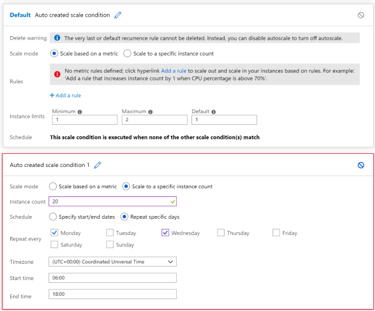

# [Build a scalable application with virtual machine scale sets](https://docs.microsoft.com/en-au/learn/modules/build-app-with-scale-sets/index)
- [Introduction](https://docs.microsoft.com/en-au/learn/modules/build-app-with-scale-sets/1-introduction)
- [Features and benefits of virtual machine scale sets](https://docs.microsoft.com/en-au/learn/modules/build-app-with-scale-sets/2-features-benefits-virtual-machine-scale-sets)
  - virtual machine scale set
    - Virtual machine scale sets in Azure are designed to allow you to deploy and manage many load-balanced, identical VMs. These machines run with the same configurations. 
  - Scaling options for scale sets
    - A scale set can scale VMs either horizontally or vertically.
      - Horizontal scaling is the process of adding or removing several VMs in a scale set.
      - Vertical scaling is the process of adding resources such as memory, CPU power, or disk space to VMs.
  - Two types of scaling for a scale set:
    - **Scheduled scaling**: You can proactively schedule the scale set to deploy one or N number of additional instances to accommodate a spike in traffic and then scale back down when the spike ends.
    - **Autoscaling**: If the workload is variable and can't always be scheduled, you can use metric-based threshold scaling. Autoscaling horizontally scales out based on node usage. It then scales back in when the resources return to a baseline.
  - Reducing costs by using low-priority scale sets
    - A low-priority virtual machine scale set allows you to use Azure compute resources at cost savings of up to 80 percent. The global Azure infrastructure frequently has underused compute resources available. 
    - When Azure needs the computing power again, you'll receive a notification about the VM that will be removed from your scale set.
    - Low-priority scale sets are useful for workloads that run with interruptions or when you need larger VMs at a much-reduced cost. 
    - In a low-priority scale set, you specify two kinds of removal:
      - **Delete**: The entire VM is removed, including all of the underlying disks.
      - **Deallocate**: The VM is stopped. Disks are left intact and data is kept.
- [Exercise - Deploy a scale set in the Azure portal](https://docs.microsoft.com/en-au/learn/modules/build-app-with-scale-sets/3-exercise-deploy-scale-set-azure-portal)
  - Run the following command to create the virtual machine scale set:
    ```bash
    az vmss create \
      --resource-group scalesetrg \
      --name webServerScaleSet \
      --image UbuntuLTS \
      --upgrade-policy-mode automatic \
      --custom-data cloud-init.yaml \
      --admin-username azureuser \
      --generate-ssh-keys
    ```
      - This file `cloud-init.yaml` contains configuration information to install nginx on the VMs in the scale set.
      - By default, the new virtual machine scale set has **two instances** and a **load balancer**.
- [Configure a virtual machine scale set](https://docs.microsoft.com/en-au/learn/modules/build-app-with-scale-sets/4-configure-virtual-machine-scale-set)
  - Manually scale virtual machine scale sets
    ```bash
    az vmss scale \
    --name MyVMScaleSet \
    --resource-group MyResourceGroup \
    --new-capacity 6
    ```
  - Autoscale virtual machine scale sets
    - You can base the autoscale on:
      - **Schedule**
      - **Metrics**
  - Define autoscale conditions, rules, and limits
    - A scale set can also contain a default scale condition that's used if no other scale conditions match the current time and performance metrics. The default scale condition is always active. 
  - Use schedule-based autoscaling
    - The following screenshot shows an example in the Azure portal. The number of instances is scaled out to 20 between 6 AM and 6 PM each Monday and Wednesday. Outside of these times, if there are no other scale conditions, the default scale condition is applied.
    - In this case, the default rule scales the system back down to **two** instances. This value is the **Maximum** in this default scale condition.
    - 
  - Use metrics-based autoscaling
    - These metrics are commonly used to monitor a virtual machine scale set:
      - **Percentage CPU**: This metric indicates the CPU usage across all instances. A high value shows that instances are becoming CPU-bound, which could delay the processing of client requests.
      - **Inbound flows and outbound flows**: These metrics show how fast network traffic is flowing into and out of virtual machines in the scale set.
      - **Disks read operations/sec and disk write operations/sec**: These metrics show the volume of disk I/O across the scale set.
      - **Data disk queue depth**: This metric shows how many I/O requests to only the data disks on the virtual machines are waiting to be serviced.
    - How the rule works
      - A scale rule aggregates the values retrieved for a metric for all instances. It aggregates the values across a period known as the **time grain**. Each metric has an intrinsic time grain, but usually this period is one minute. The aggregated value is known as the **time aggregation**. The time-aggregation options are **average, minimum, maximum, total, last, and count.**
      - A one-minute interval is too short to determine whether any change in the metric is long-lasting enough to make autoscaling worthwhile. A scale rule takes a second step, further aggregating the time aggregation's value over a longer, user-specified period. This period is called the **duration**. The minimum duration is five minutes. For example, if the duration is set to 10 minutes, the scale rule aggregates the 10 values calculated for the time grain.
      - **The duration's aggregation calculation can differ from the time grain's aggregation calculation.** For example, let's say the time aggregation is average and the statistic gathered is percentage CPU across a one-minute time grain. So for every minute, the average CPU percentage usage across all instances during that minute will be calculated. If the time-grain statistic is set to maximum and the rule's duration is set to 10 minutes, the maximum of the 10 average values for the CPU usage percentage determines whether the rule threshold has been crossed.
      - A scale action has a **cool down period**, specified in minutes. During this period, the scale rule isn't triggered again.      - The minimum cool-down period is five minutes.
- [Exercise - Configure a virtual machine scale set](https://docs.microsoft.com/en-au/learn/modules/build-app-with-scale-sets/5-exercise-configure-virtual-machine-scale-set)
  - Create a scale-out rule
    - On the Scale rule page, specify the following settings, and then select Add:
        |Property|	Value|
        |---|---|
        |Metric source	|Current resource (webServerScaleSet)|
        |**Time aggregation**|	**Average**|
        |Metric name|	Percentage CPU|
        |**Time grain statistic**|	**Average**|
        |Operator|	Greater than|
        |Threshold|	75|
        |Duration|	10|
        |Operation|	Increase count by|
        |Instance| count	1|
        |Cool down (minutes)|	5|
  - Create a scale-in rule
    - On the Scale rule page, specify the following settings, and then select Add:
        |Property|	Value|
        |---|---|
        |Metric source|	Current resource (webServerScaleSet)|
        |**Time aggregation**|	Average|
        |Metric name|	Percentage CPU|
        |**Time grain statistic**|	Average|
        |Operator|	Less than|
        |Threshold|	50|
        |Duration|	10|
        |Operation|	Decrease count by|
        |Instance| count	1|
        |Cool down (minutes)|	5|
- [Install and update applications in virtual machine scale sets](https://docs.microsoft.com/en-au/learn/modules/build-app-with-scale-sets/6-install-update-applications-virtual-machine-scale-sets)
  - Azure custom script extension
    - An Azure custom script extension downloads and runs a script on an Azure VM. It can automate the same tasks on all the VMs in a scale set.
  - Install an application across a scale set by using a custom script extension
    ```json
    # yourConfigV1.json 
    {
        "fileUris": ["https://raw.githubusercontent.com/yourrepo/master/custom_application_v1.sh"],
        "commandToExecute": "./custom_application_v1.sh"
    }
    ```
  - This command installs the new app on the VMs across the scale set:
    ```
    az vmss extension set \
    --publisher Microsoft.Azure.Extensions \
    --version 2.0 \
    --name CustomScript \
    --resource-group myResourceGroup \
    --vmss-name yourScaleSet \
    --settings @yourConfigV1.json
    ```
  - Update an application across a scale set by using a custom script extension
    ```json
    # yourConfigV2.json
    {
        "fileUris": ["https://raw.githubusercontent.com/yourrepo/master/custom_application_v2.sh"],
        "commandToExecute": "./custom_application_v2.sh"
    }
    ```
  - reference the new configuration file
    ```
    az vmss extension set \
        --publisher Microsoft.Azure.Extensions \
        --version 2.0 \
        --name CustomScript \
        --resource-group yourResourceGroup \
        --vmss-name yourScaleSet \
        --settings @yourConfigV2.json
    ```
    - The VMs are updated according to the upgrade policy for the scale set.You specify this policy when you first create the scale set.
      - **Automatic**: The scale set doesn't define when the VMs are upgraded. They could all update at the same time, causing a service outage.
      - **Rolling**: The scale set rolls out the update in batches across the VMs in the scale set. An optional pause can minimize or eliminate a service outage. In this mode, machines in the scale set might run different versions of the app for a short time. This mode requires that you either add a health probe to the scale set or apply the application health extension to the scale set.
      - **Manual**: Existing VMs in the scale set aren't updated. All changes must be done manually. This mode is the default.
- [Exercise - Update applications in virtual machine scale sets](https://docs.microsoft.com/en-au/learn/modules/build-app-with-scale-sets/7-exercise-update-applications-virtual-machine-scale-sets)
  - Deploy the update by using a custom script extension
    - Run the following command to apply the update script:
      ```
        az vmss extension set \
            --publisher Microsoft.Azure.Extensions \
            --version 2.0 \
            --name CustomScript \
            --vmss-name webServerScaleSet \
            --resource-group scalesetrg \
            --settings "{\"commandToExecute\": \"echo This is the updated app installed on the Virtual Machine Scale Set ! > /var/www/html/index.html\"}"
      ```
- [Summary](https://docs.microsoft.com/en-au/learn/modules/build-app-with-scale-sets/8-summary)
    - [Overview of autoscale with Azure virtual machine scale sets](https://docs.microsoft.com/azure/virtual-machine-scale-sets/virtual-machine-scale-sets-autoscale-overview)
    - [Deploy your application on virtual machine scale sets](https://docs.microsoft.com/azure/virtual-machine-scale-sets/virtual-machine-scale-sets-deploy-app)
    - [Work with large virtual machine scale sets](https://docs.microsoft.com/azure/virtual-machine-scale-sets/virtual-machine-scale-sets-placement-groups)
    - [Use the custom script extension for Windows](https://docs.microsoft.com/azure/virtual-machines/extensions/custom-script-windows)
    - [Use the Azure custom script extension version 2 with Linux VMs](https://docs.microsoft.com/azure/virtual-machines/extensions/custom-script-linux)
    - [Use the application health extension with virtual machine scale sets](https://docs.microsoft.com/azure/virtual-machine-scale-sets/virtual-machine-scale-sets-health-extension)