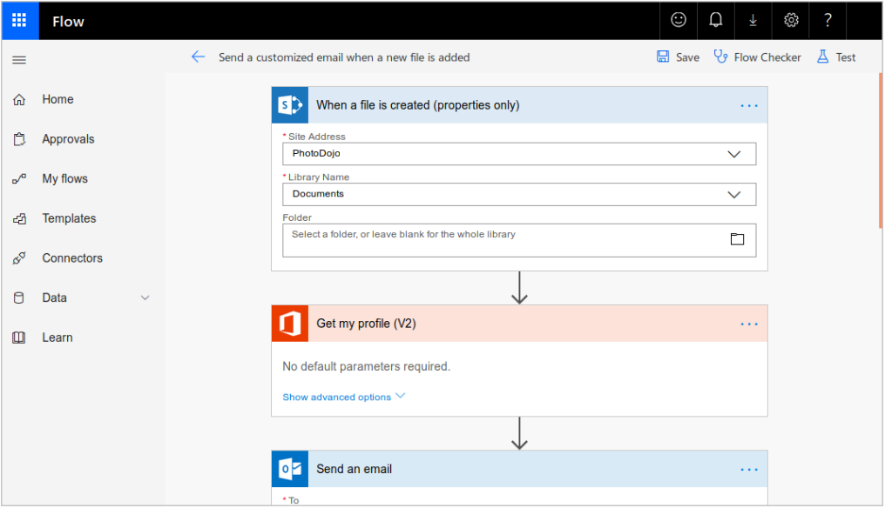
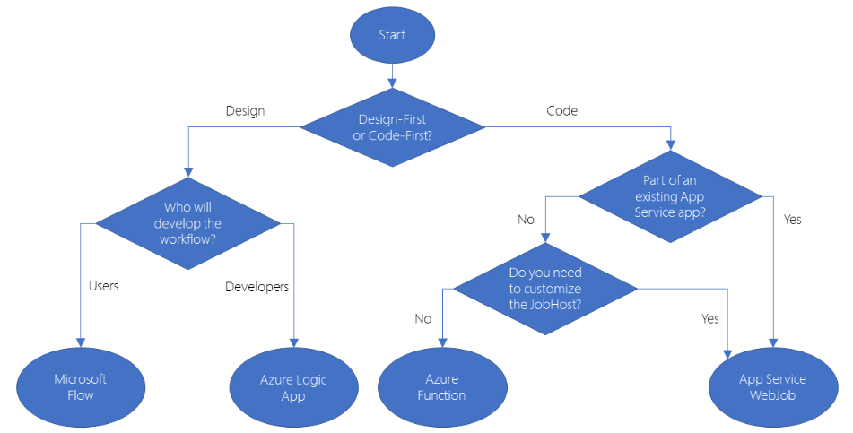
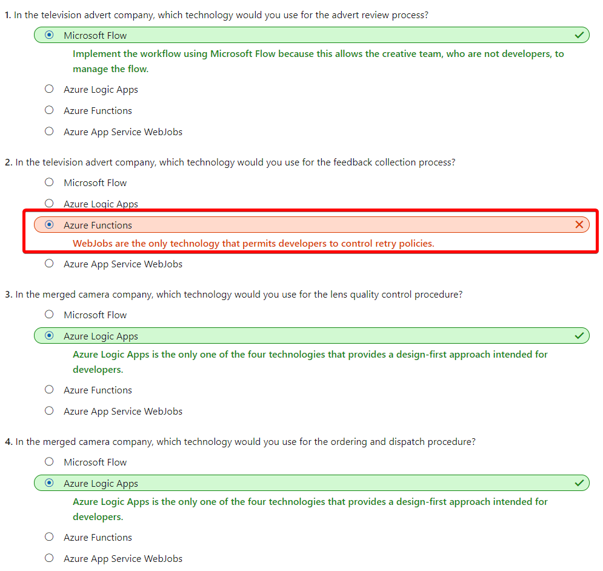

# [Choose the best Azure service to automate your business processes](https://docs.microsoft.com/en-au/learn/modules/choose-azure-service-to-integrate-and-automate-business-processes/index)
- [Introduction](https://docs.microsoft.com/en-au/learn/modules/choose-azure-service-to-integrate-and-automate-business-processes/1-introduction)
- [Identify the technology options](https://docs.microsoft.com/en-au/learn/modules/choose-azure-service-to-integrate-and-automate-business-processes/2-identify-technology-options)
  - Business processes modeled in software are often called **workflows**. They all have inputs, actions, conditions and outputs. 
    - **Logic Apps**
      - One reason why Logic Apps is so good at integration is that over 200 **connectors** are included. A **connector** is a Logic Apps component that provides an interface to an external service. 
    - **Microsoft Flow**
      - Microsoft Flow is a service that you can use to create workflows even when you have no development or IT Pro experience. 
      - four different types
        - **Automated**: A flow that is started by a trigger from some event. For example, the event could be the arrival of a new tweet or a new file being uploaded.
        - **Button**: Use a button flow to run a repetitive task with a single click from your mobile device.
        - **Scheduled**: A flow that executes on a regular basis such as once a week, on a specific date, or after 10 hours.
        - **Business process**: A flow that models a business process such as the stock ordering process or the complaints procedure.
        - 
    - **WebJobs**
      - There are two kinds of WebJob:
        - **Continuous**. These WebJobs run in a continuous loop. For example, you could use a continuous WebJob to check a shared folder for a new photo.
        - **Triggered**. These WebJobs run when you manually start them or on a schedule.
    - **Azure Functions**
      - To create an Azure Function, choose from the range of templates. The following list is an example of some of the templates available to you.
        - **HTTPTrigger**. Use this template when you want the code to execute in response to a request sent through the HTTP protocol.
        - **TimerTrigger**. Use this template when you want the code to execute according to a schedule.
        - **BlobTrigger**. Use this template when you want the code to execute when a new blob is added to an Azure Storage account.
        - **CosmosDBTrigger**. Use this template when you want the code to execute in response to new or updated documents in a NoSQL database.

  - Design-first technologies
    - With Logic Apps and Microsoft Flow, you can take a similar approach to designing a workflow. They both include user interfaces in which you can draw out the workflow. 
    - Logic Apps
    - Microsoft Flow
    - Design-first technologies compared
        |      	| Microsoft Flow|	Logic Apps|
        |---|---|---|
        |Intended users|	Office workers and business analysts	|Developers and IT pros|
        |Intended scenarios|	Self-service workflow creation|	Advanced integration projects|
        |Design tools|	GUI only. Browser and mobile app|	Browser and Visual Studio designer. Code editing is possible|
        |Application Lifecycle Management|	Flow includes testing and production environments	|Logic Apps source code can be included in Azure DevOps and source code management systems|
  - Code-first technologies
    - WebJobs and the WebJobs SDK
    - Azure Functions
    - Code-first technologies compared
        |	|Azure WebJobs|	Azure Functions|
        |---|---|---|
        |Supported languages|	C# if you are using the WebJobs SDK|	C#, F#, JavaScript, Java|
        |Automatic scaling|	No|	Yes|
        |Development and testing in a browser|	No|	Yes|
        |Pay-per-use pricing|	No|	Yes|
        |Integration with Logic Apps|	No|	Yes|
        |Package managers|	NuGet if you are using the WebJobs SDK|	Nuget and NPM|
        |Can be part of an App Service application|	Yes|	No|
        |Provides close control of JobHost|	Yes|	No|
- [Analyze the decision criteria](https://docs.microsoft.com/en-au/learn/modules/choose-azure-service-to-integrate-and-automate-business-processes/3-analyze-the-decision-criteria)
  - How to choose a service
    - 
    - There are two situations in which WebJobs might be a better choice:
      - You have an existing Azure App Service application, and you want to model the workflow within the application. This requirement means that the workflow can also be managed as part of the application, for example in an Azure DevOps environment.
      - You have specific customizations that you want to make to the `JobHost` that are not supported by Azure Functions. For example, in a WebJob, you can create a custom retry policy for calls to external systems. This kind of policy can't be configured in an Azure Function.
- [Choose the best design-first technology to automate your business process](https://docs.microsoft.com/en-au/learn/modules/choose-azure-service-to-integrate-and-automate-business-processes/4-logic-apps-and-flow)
- [When to choose Azure Functions to run your business logic](https://docs.microsoft.com/en-au/learn/modules/choose-azure-service-to-integrate-and-automate-business-processes/5-web-jobs-and-functions)
- [Knowledge check](https://docs.microsoft.com/en-au/learn/modules/choose-azure-service-to-integrate-and-automate-business-processes/6-knowledge-check)
- [Summary](https://docs.microsoft.com/en-au/learn/modules/choose-azure-service-to-integrate-and-automate-business-processes/7-summary)
  - Scenario 1 - TV Adverts
    - You work for a company that makes TV adverts. You want to formalize two business processes:
      - The advert review process. A completed advert is put through this editorial process to ensure that it meets the standards of taste, decency, grammar, style, and legal requirements in the jurisdiction where it will be broadcast.
      - The feedback collection process. A completed advert is also put through this process in which customers, the director, and members of the board of directors, can give feedback.
    - The advert review process should be managed by members of the creative team, because it will need to change regularly. The creative team would prefer not to have to wait for a developer to become available whenever a change is needed.
    - The feedback collection process calls an on-premises SharePoint server. Because this server is not as reliable as a cloud-based server would be, developers want to carefully control the way the workflow retries this connection, if there is a failure.
  - Scenario 2 - Camera Company Merger
    - You work for a company that makes digital cameras. The company has recently acquired a smaller company that makes lenses. You want to ensure that the same procedures are in use throughout the company for the following processes:
      - Lens quality control. The company you acquired has a good reputation for lens reliability because of its quality control procedure. You want to implement this procedure across the merged company and integrate it with your parts ordering system, which includes a REST API.
      - Ordering and dispatch. The company you acquired had no formal order and dispatch procedure, so you want to ensure its employees use your original business procedure. The ordering system has a user interface that is built as an Azure App service web app but you want to manage the order and dispatch workflow as a separate project.
    - You have hired a small team of developers to do the work and you prefer a design-first approach.
  - Check your knowledge
    - 