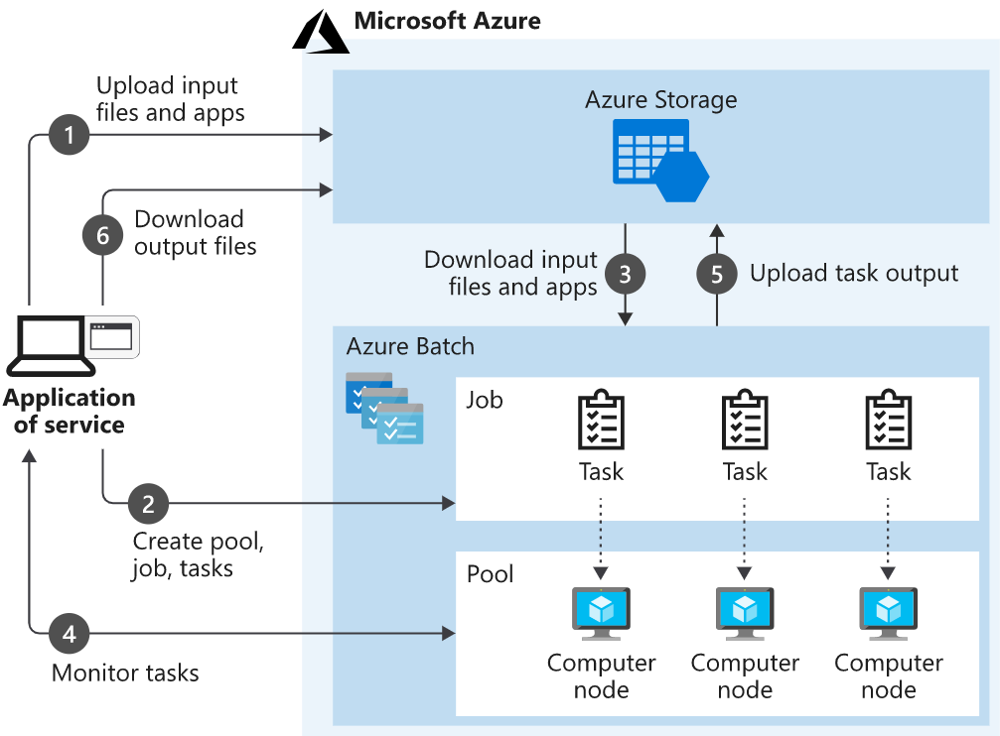
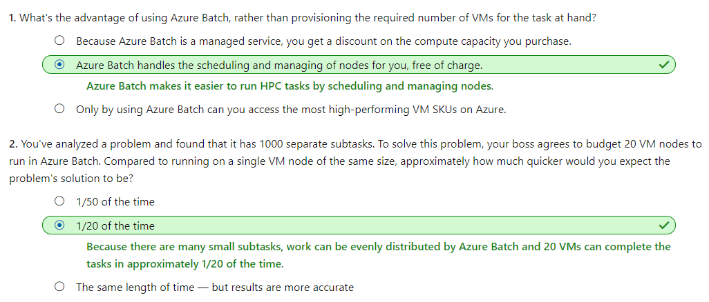
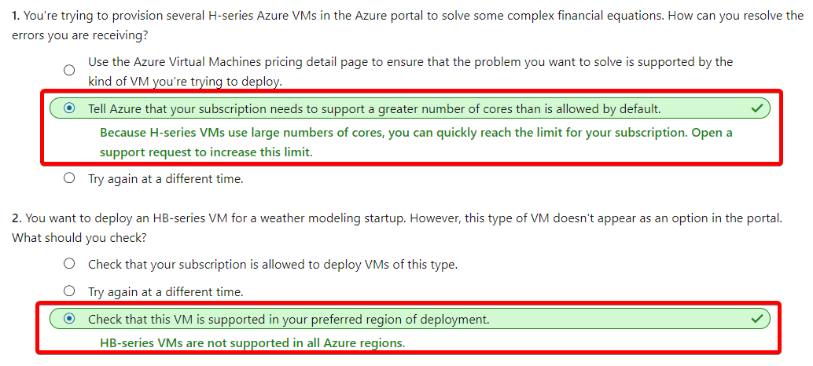
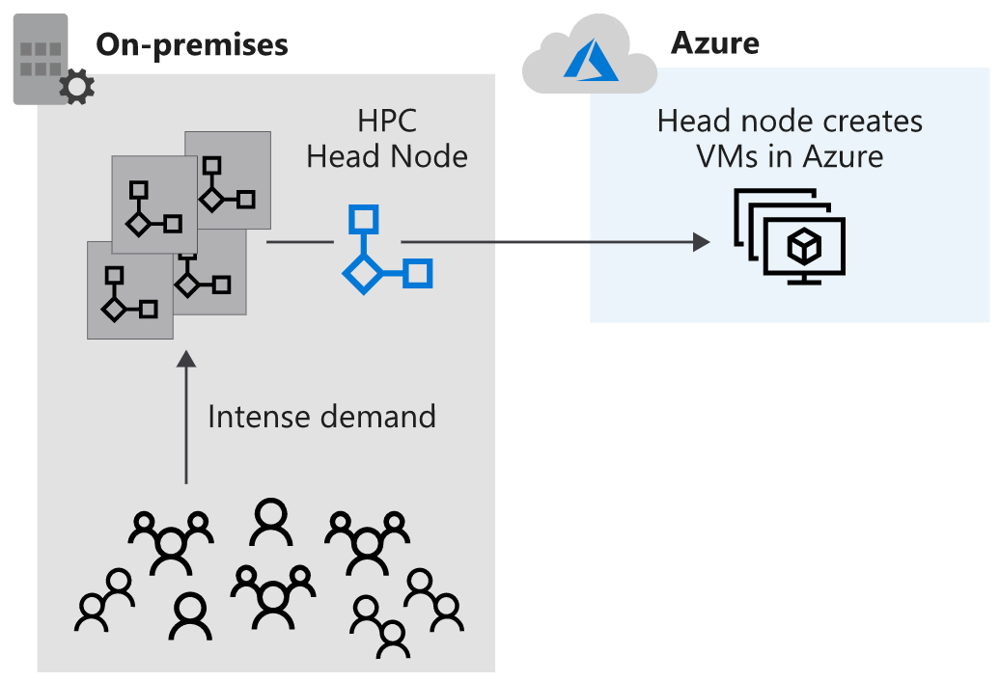
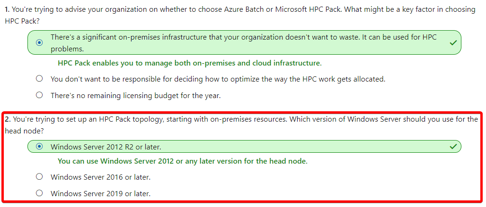
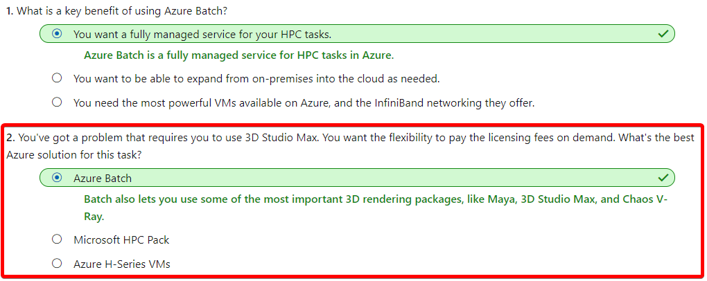

# [Introduction to high-performance computing (HPC) on Azure](https://docs.microsoft.com/en-au/learn/modules/intro-to-hpc/index)
- [Introduction](https://docs.microsoft.com/en-au/learn/modules/intro-to-hpc/1-introduction)
- [Azure Batch](https://docs.microsoft.com/en-au/learn/modules/intro-to-hpc/2-azure-batch)
  - There are several HPC and batch processing choices available on Azure. 
    - Azure Batch
    - Azure VM HPC Instances
    - Microsoft HPC Pack
  - **Azure Batch**
    - Azure Batch is a service for working with large-scale parallel and computationally intensive tasks on Azure. 
    - Unlike the other options you'll see in this module, **Batch is a managed service**. 
    - You provide data and applications, and you specify whether to run on Windows or Linux, how many machines to use, and what rules apply to autoscaling. 
    - Batch handles provisioning of the compute capacity and optimizes the way the work is done in parallel. 
    - You only pay for the underlying compute, networking, and storage you use. The Batch scheduling and management service is free.
    - Components of Azure Batch
      - An **Azure Batch Account** forms a container for all of the main Batch elements. 
      - Within the Batch account, you typically create Batch **pools** of VMs, which are often called **nodes**, running either Windows or Linux. 
      - You set up **Batch jobs** that work like logical containers with configurable settings for the real unit of work in Batch, known as Batch **tasks**. 
      - This unit of work is highly flexible and can run either command-line instructions or entire applications. Optionally, you might associate an Azure Storage account with the Azure Batch account. You then upload and download data inputs and outputs. 
      - 
  - Check your knowledge
    - 
- [Azure VM HPC instances](https://docs.microsoft.com/en-au/learn/modules/intro-to-hpc/3-azure-vm-hpc-instances)
  - HPC Instances is a series of Azure VMs expressly designed for challenging HPC scenarios.
  - **H-series VMs**
    - Azure H-series VMs are a family of the most powerful and fastest CPU-based VMs on Azure. These VMs are optimized for applications that require high CPU frequencies or large amounts of memory per core. The basic H-series is well suited to genomic research, seismic and reservoir simulation, financial risk modeling, and molecular modeling.
    - You can use all of these **HPC instances** with **Azure Batch**. When you set up a Batch pool, you can specify that **H-series** VMs should be used.
    - **HB-series VMs**
      - HB-series VMs specifically target applications requiring extreme **memory bandwidth**, particularly fluid dynamics, explicit finite element analysis, and weather modeling. 
    - **HC-series VMs**
      - HC-series VMs are optimized for applications driven by **dense computation**, such as implicit finite element analysis, reservoir simulation, and computational chemistry.
  - **Remote Direct Memory Access**
    - The H16r and H16mr SKUs of the H-series, and both the HB- and HC-series VMs, use a second, low-latency, high-throughput network interface. It's called **Remote Direct Memory Access (RDMA)**. RDMA enables **direct memory access** between systems without the involvement of the operating system. On Azure, network connections over an InfiniBand network enable this high-speed access.
    - **Message Passing Interface (MPI)** is a protocol for communication between computers as they run complex HPC tasks in parallel.
  - **InfiniBand interconnects**
    - InfiniBand is a data interconnect hardware standard for HPC. It's often used to accelerate communications between components, both within a single server and between servers.
  - **N-series VMs**
    - Some HPC tasks are both compute-intensive and graphics-intensive.
    - **NC-series VMs**
      - NC-series VMs use the NVIDIA Tesla K80 GPU card and Intel Xeon E5-2690 v3 processors. This series is the lowest cost of the N-series tiers, but VMs in this tier are capable of graphics-intensive applications. 
    - **ND-series VMs**
      - ND-series VMs are optimized for AI and deep learning workloads. 
  - Check your knowledge
    - 
- [Microsoft HPC Pack](https://docs.microsoft.com/en-au/learn/modules/intro-to-hpc/4-microsoft-hpc-pack)
  - Microsoft HPC Pack
    - If you need **more flexible control of your high-performance** infrastructure, or you want to manage both **cloud** and **on-premises** VMs, consider using the Microsoft HPC Pack.
    - HPC Pack offers a series of installers for Windows that allows you to configure your own control and management plane, and highly flexible deployments of on-premises and cloud nodes. 
    - By contrast with the exclusively cloud-based Batch, HPC Pack has the flexibility to deploy to on-premises and the cloud. It uses a hybrid of both to expand to the cloud when your on-premises reserves are insufficient.
    - **Think of Microsoft HPC Pack as a version of the Batch management and scheduling control layer, over which you have full control,** and for which you have responsibility.
    -  Deployment of HPC Pack requires **Windows Server 2012 or later**, and takes careful consideration to implement.
      - 
 - 
- [Scenarios for HPC and Batch technologies](https://docs.microsoft.com/en-au/learn/modules/intro-to-hpc/5-scenarios-for-hpc-and-batch)
  - Common HPC use cases
    - Finite element analysis
    - 3D model rendering
    - DNA analysis
    - Computer-aided design
    - Computational fluid dynamics
  - Check your knowledge
    - 
- [Summary](https://docs.microsoft.com/en-au/learn/modules/intro-to-hpc/6-summary)