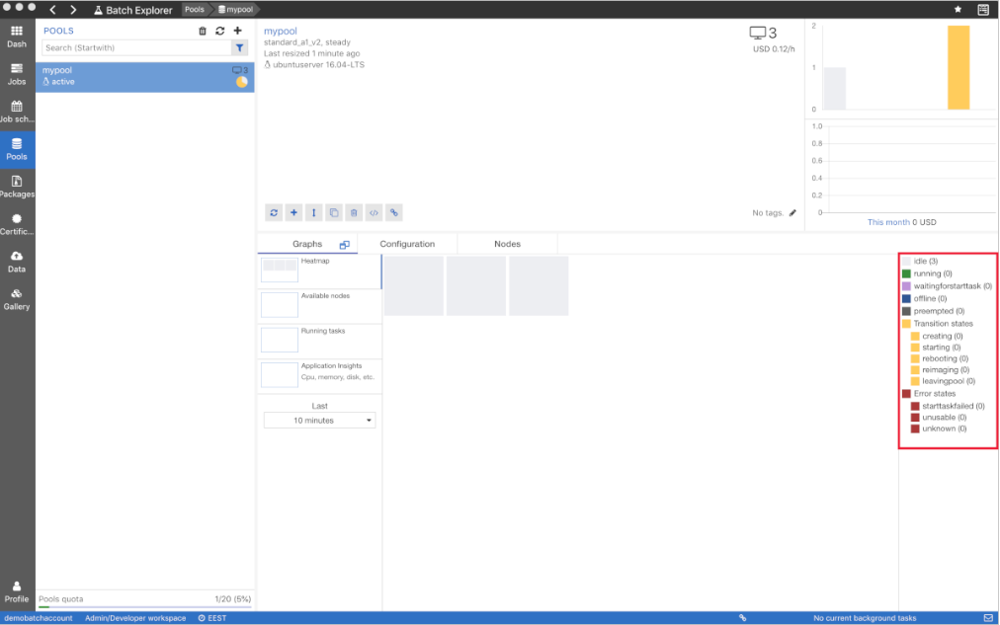
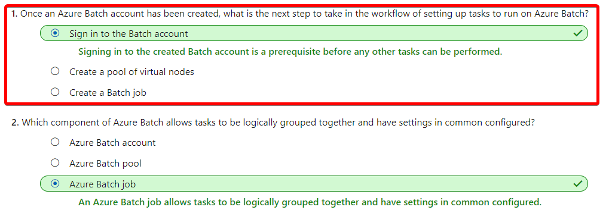

# [Run parallel tasks in Azure Batch with the Azure CLI](https://docs.microsoft.com/en-au/learn/modules/run-parallel-tasks-in-azure-batch-with-the-azure-cli/index)
- [Introduction](https://docs.microsoft.com/en-au/learn/modules/run-parallel-tasks-in-azure-batch-with-the-azure-cli/1-introduction)
- [What is Azure Batch?](https://docs.microsoft.com/en-au/learn/modules/run-parallel-tasks-in-azure-batch-with-the-azure-cli/2-what-is-azure-batch)
  - The components of Azure Batch
    - Azure Batch Account
      - Pools
        - VM nodes
      - Jobs
        - tasks
      - !Azure storage account
- [Design an Azure Batch job to run your parallel task](https://docs.microsoft.com/en-au/learn/modules/run-parallel-tasks-in-azure-batch-with-the-azure-cli/3-design-an-azure-batch-job-to-run-parallel-task)
  - Advantages of using Azure Batch
    - Azure Batch is especially well-suited to running large-scale parallel and high-performance computing (HPC) batch jobs. The service handles everything for you -- managing and scheduling all the nodes and applications required to run your scenarios. And it's a free service, so you only pay for the underlying compute, storage, and networking resources that you use.
- [Exercise - Create an Azure Batch job in the CLI to run your parallel task](https://docs.microsoft.com/en-au/learn/modules/run-parallel-tasks-in-azure-batch-with-the-azure-cli/4-exercise-create-azure-batch-job-in-cli-to-run-parallel-task)
  - Create the Azure Batch resources
    ```bash
    az batch account create \
    --name $BATCH_ACCOUNT \
    --resource-group $RESOURCE_GROUP \
    --location <choose a location from the list above>
    ```
  - **Sign in to your Azure batch account**
    ```bash
    az batch account login \
        --name $BATCH_ACCOUNT \
        --resource-group $RESOURCE_GROUP \
        --shared-key-auth
    ```
  - Create a pool of three Standard A1 v2 VMs running Ubuntu 16.04:
    ```
      az batch pool create \
      --id mypool --vm-size Standard_A1_v2 \
      --target-dedicated-nodes 3 \
      --image canonical:ubuntuserver:16.04-LTS \
      --node-agent-sku-id "batch.node.ubuntu 16.04"
    ```
  - Create a batch job and assign to a pool
    ```bash
    az batch job create \
      --id myjob \
      --pool-id mypool
    ```
  - Create Batch tasks for the job
    ```bash
    for i in {1..10}
    do
    az batch task create \
        --task-id mytask$i \
        --job-id myjob \
        --command-line "/bin/bash -c 'echo \$(printenv | grep \AZ_BATCH_TASK_ID) processed by; echo \$(printenv | grep \AZ_BATCH_NODE_ID)'"
    done
    ```

- [Exercise - Monitor your Azure Batch job in the CLI](https://docs.microsoft.com/en-au/learn/modules/run-parallel-tasks-in-azure-batch-with-the-azure-cli/5-exercise-monitor-azure-batch-job-in-cli)
  - Show the status
    ```
    az batch task show \
    --job-id myjob2 \
    --task-id mytask1
    ```
  - show all the fiels generated
    ```bash
    az batch task file list \
    --job-id myjob2 \
    --task-id mytask5 \
    --output table
    ```
  - download all of them
    ```
    for i in {1..10}
    do
    az batch task file download \
        --job-id myjob2 \
        --task-id mytask$i \
        --file-path stdout.txt \
        --destination ./stdout$i.txt
    done
    ```

- [Visualize batch jobs with the Batch Explorer](https://docs.microsoft.com/en-au/learn/modules/run-parallel-tasks-in-azure-batch-with-the-azure-cli/6-introducing-batch-explorer)
  - you can use the Azure Batch Explorer to graphically analyze the status of your batch jobs.
    - 
- [Exercise - Monitor and visualize your batch job in Batch Explorer](https://docs.microsoft.com/en-au/learn/modules/run-parallel-tasks-in-azure-batch-with-the-azure-cli/7-exercise-monitor-and-visualize-batch-job-in-batch-explorer)
- [Knowledge check](https://docs.microsoft.com/en-au/learn/modules/run-parallel-tasks-in-azure-batch-with-the-azure-cli/8-knowledge-check)
  - Check your knowledge
    - 
- [Introduction](https://docs.microsoft.com/en-au/learn/modules/run-parallel-tasks-in-azure-batch-with-the-azure-cli/9-summary)