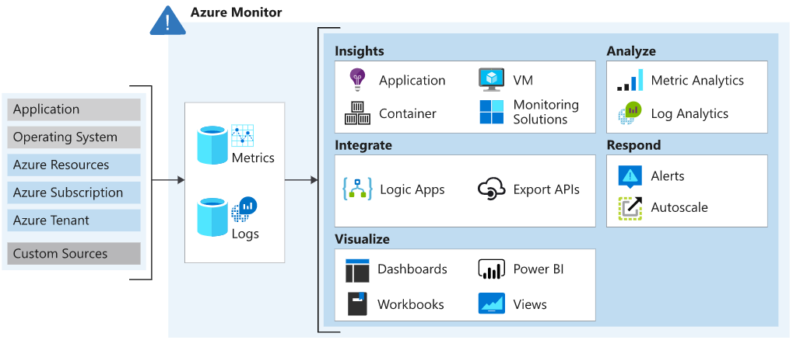
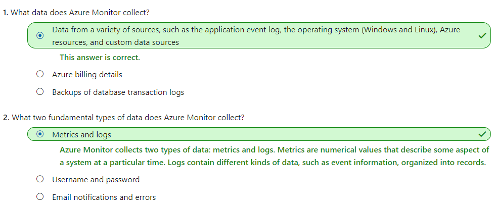

# [Analyze your Azure infrastructure by using Azure Monitor logs](https://docs.microsoft.com/en-au/learn/modules/analyze-infrastructure-with-azure-monitor-logs/index)
- [Introduction](https://docs.microsoft.com/en-au/learn/modules/analyze-infrastructure-with-azure-monitor-logs/1-introduction/)
- [Features of Azure Monitor logs](https://docs.microsoft.com/en-au/learn/modules/analyze-infrastructure-with-azure-monitor-logs/2-features-azure-monitor-log/)
  - Azure Monitor is a service for collecting and analyzing telemetry. It helps you get maximum performance and availability for your cloud applications, and for your on-premises resources and applications. It shows how your applications are performing and identifies any issues with them.
  - 
  - Azure Monitor collects data automatically from a range of components. For example:
    - **Application data**: Data that relates to your custom application code.
    - **Operating system data**: Data from the Windows or Linux virtual machines that host your application.
    - **Azure resource data**: Data that relates to the operations of an Azure resource, such as a web app or a load balancer.
    - **Azure subscription data**: Data that relates to your subscription. It includes data about Azure health and availability.
    - **Azure tenant data**: Data about your Azure organization-level services, such as Azure Active Directory.
  - Because Azure Monitor is an automatic system, it begins to collect data from these sources as soon as you create Azure resources such as virtual machines and web apps. You can extend the data that Azure Monitor collects by:
    - **Enabling diagnostics**: For some resources, such as Azure SQL Database, you receive full information about a resource only after you have enabled diagnostic logging for it. You can use the Azure portal, the Azure CLI, or PowerShell to enable diagnostics.
    - **Adding an agent**: For virtual machines, you can install the Log Analytics agent and configure it to send data to a Log Analytics workspace. This agent increases the amount of information that's sent to Azure Monitor.
  - Logs
    - Logs contain time-stamped information about changes made to resources. 
    - The log data is organized into records, with different sets of properties for each type of record. 
    - The logs can include numeric values such as Azure Monitor metrics, but most include text data rather than numeric values.
  - Metrics
    - Metrics are numerical values that describe some aspect of a system at a point in time. Azure Monitor can capture metrics in near real time. 
  - 
- [Create basic Azure Monitor log queries to extract information from log data](https://docs.microsoft.com/en-au/learn/modules/analyze-infrastructure-with-azure-monitor-logs/3-create-log-queries/)
- Write queries by using the Kusto language
  - A Kusto query is a read-only request to process data and return results.
  - A Kusto query consists of a sequence of query statements, delimited by a semicolon (`;`). At least one statement is a tabular expression statement. A tabular expression statement formats the data arranged in a table-like mesh of columns and rows.
  - The syntax of a tabular expression statement has a tabular data flow from one tabular query operator to another, starting with a data source. A data source might be a table in a database, or an operator that produces data. The data then flows through a set of data transformation operators that are bound together with the pipe (`|`) delimiter.
  - The Kusto query language that Azure Monitor uses is **case-sensitive**.
  - The following example retrieves the most recent heartbeat record for each computer. The computer is identified by its IP address. In this example, the summarize aggregation with the arg_max function returns the record with the most recent value for each IP address.
    ```
    Heartbeat
    | summarize arg_max(TimeGenerated, *) by ComputerIP
    ```
- [Exercise - Create basic Azure Monitor log queries to extract information from log data](https://docs.microsoft.com/en-au/learn/modules/analyze-infrastructure-with-azure-monitor-logs/4-exercise-create-log-queries/)
- [Summary](https://docs.microsoft.com/en-au/learn/modules/analyze-infrastructure-with-azure-monitor-logs/5-summary/)