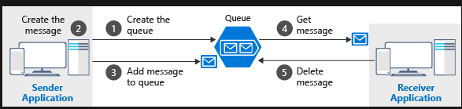
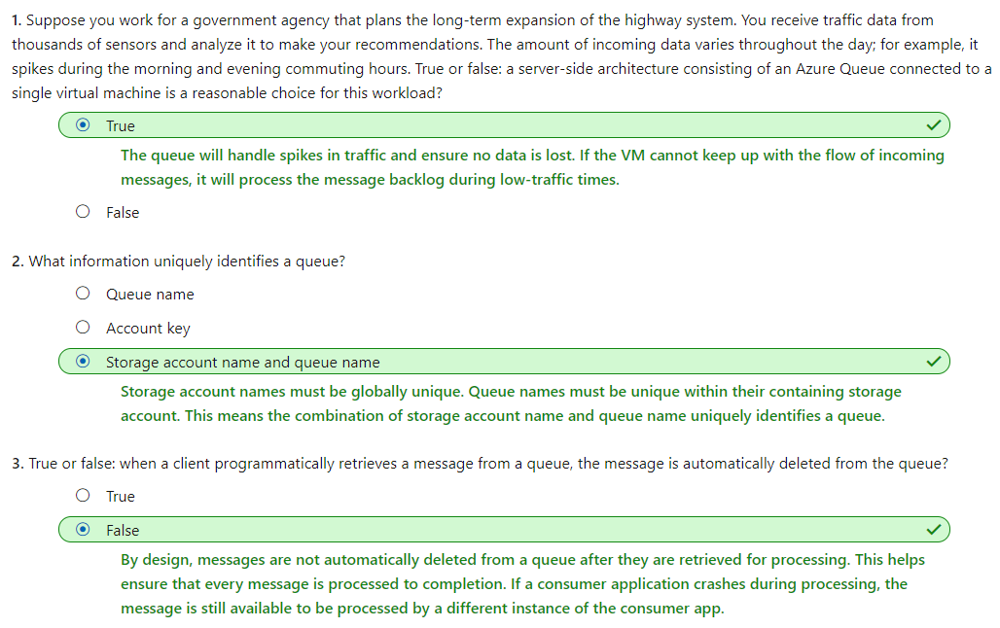

# [Communicate between applications with Azure Queue storage](https://docs.microsoft.com/en-au/learn/modules/communicate-between-apps-with-azure-queue-storage/index)
- [Introduction](https://docs.microsoft.com/en-au/learn/modules/communicate-between-apps-with-azure-queue-storage/1-introduction)
- [Create the Azure storage infrastructure](https://docs.microsoft.com/en-au/learn/modules/communicate-between-apps-with-azure-queue-storage/2-create-the-azure-storage-infrastructure)
  - Azure Queue storage is an Azure service that implements cloud-based queues. 
  - A queue increases resiliency by temporarily storing waiting messages.
  - A single queue can be up to **500 TB in size**, so it can potentially store millions of messages. The target throughput for a single queue is **2000 messages per second**, allowing it to handle high-volume scenarios.
  - A message in a queue is a byte array of **up to 64 KB**.
- [Exercise - Create a storage account](https://docs.microsoft.com/en-au/learn/modules/communicate-between-apps-with-azure-queue-storage/3-exercise-create-the-azure-storage-infrastructure)
- [Identify a queue](https://docs.microsoft.com/en-au/learn/modules/communicate-between-apps-with-azure-queue-storage/4-identify-a-queue)
  - To access a queue, you need three pieces of information:
    - Storage account name
    - Queue name
    - Authorization token
- [Exercise - Identify a queue](https://docs.microsoft.com/en-au/learn/modules/communicate-between-apps-with-azure-queue-storage/5-exercise-identify-a-queue)
- [Programmatically access a queue](https://docs.microsoft.com/en-au/learn/modules/communicate-between-apps-with-azure-queue-storage/6-how-to-programmatically-access-a-queue)
  - 
    - Notice that get and delete are separate operations. 
    - This arrangement handles potential failures in the receiver and implements a concept called **at-least-once** delivery. After the receiver gets a message, that message remains in the queue but is **invisible for 30 seconds**. If the receiver crashes or experiences a power failure during processing, then it will never delete the message from the queue. After 30 seconds, **the message will reappear in the queue** and another instance of the receiver can process it to completion.
- [Exercise - Add a message to the queue](https://docs.microsoft.com/en-au/learn/modules/communicate-between-apps-with-azure-queue-storage/7-exercise-implement-enqueue)
- [Exercise - Retrieve a message from the queue](https://docs.microsoft.com/en-au/learn/modules/communicate-between-apps-with-azure-queue-storage/8-exercise-implement-dequeue)
- [Summary](https://docs.microsoft.com/en-au/learn/modules/communicate-between-apps-with-azure-queue-storage/9-summary)
  - 
