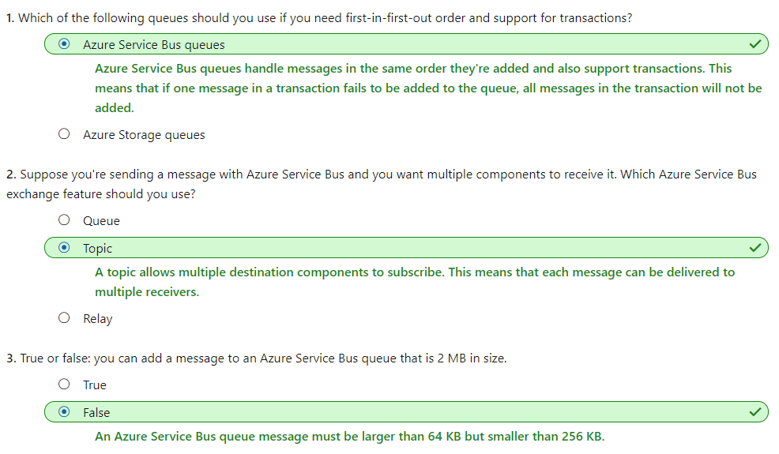

# [Implement message-based communication workflows with Azure Service Bus](https://docs.microsoft.com/en-au/learn/modules/implement-message-workflows-with-service-bus/index)
- [Introduction](https://docs.microsoft.com/en-au/learn/modules/implement-message-workflows-with-service-bus/1-introduction)
- [Choose a messaging platform](https://docs.microsoft.com/en-au/learn/modules/implement-message-workflows-with-service-bus/2-choose-a-messaging-platform)
  - Messages
    - In the terminology of distributed applications, the defining characteristic of a message is that the overall integrity of the application may rely on messages being received.
    - A message generally contains the data itself, not just a reference (like an ID or URL) to data.
  - Events
    - An event triggers a notification that something has occurred. Events are "lighter" than messages and are most often used for broadcast communications.
    - The event may be sent to multiple receivers, or to none at all
    - Events are often intended to "fan out," or have a large number of subscribers for each publisher
    - The publisher of the event has no expectation about the action a receiving component takes
  - Service Bus topics, queues, and relays
    - A **queue** is a simple temporary storage location for messages. A sending component adds a message to the queue. A destination component picks up the message at the front of the queue. Under ordinary circumstances, each message is received by **only one receiver**
    - A **topic** is similar to a queue but can have multiple subscriptions. This means that multiple destination components can subscribe to a single topic, so each message is delivered to multiple receivers.
    - A **relay** is an object that performs synchronous, two-way communication between applications. Unlike queues and topics, it is not a temporary storage location for messages. Instead, it provides bidirectional, unbuffered connections across network boundaries such as firewalls. Use a relay when you want direct communications between components as if they were located on the same network segment but separated by network security devices.
  - Service Bus vs Queue
    - Choose Service Bus queues if: 
      - You need an **at-most-once/at-least-once** delivery guarantee
      - You need a **FIFO** guarantee
      - You need to group messages into **transactions**
      - You want to receive messages without polling the queue
      - You need to provide role-based access to the queues
      - You need to handle messages larger than **64 KB but smaller than 256 KB**
      - Your queue size will **not grow larger than 80 GB**
      - You would like to be able to publish and consume batches of messages
    - Choose queue storage if:
      - You need a simple queue with no particular additional requirements
      - You need an audit trail of all messages that pass through the queue
      - You expect the queue to **exceed 80 GB in size**
      - You want to track progress for processing a message inside of the queue
- [Exercise - Implement a Service Bus topic and queue](https://docs.microsoft.com/en-au/learn/modules/implement-message-workflows-with-service-bus/3-exercise-implement-a-service-bus-topic-and-queue)
- [Write code that uses Service Bus queues](https://docs.microsoft.com/en-au/learn/modules/implement-message-workflows-with-service-bus/4-write-code-that-uses-service-bus-queues)
- [Exercise - Write code that uses Service Bus queues](https://docs.microsoft.com/en-au/learn/modules/implement-message-workflows-with-service-bus/5-exercise-write-code-that-uses-service-bus-queues)
- [Write code that uses Service Bus topics](https://docs.microsoft.com/en-au/learn/modules/implement-message-workflows-with-service-bus/6-write-code-that-uses-service-bus-topics)
  - Setting filters on subscriptions
    - Filters can be one of three types:
      - **Boolean Filters**. The TrueFilter ensures that all messages sent to the topic are delivered to the current subscription. The FalseFilter ensures that none of the messages are delivered to the current subscription. (This effectively blocks or switches off the subscription.)
      - **SQL Filters**. A SQL filter specifies a condition by using the same syntax as a WHERE clause in a SQL query. Only messages that return True when evaluated against this subscription will be delivered to the subscribers.
      - **Correlation Filters**. A correlation filter holds a set of conditions that are matched against the properties of each message. If the property in the filter and the property on the message have the same value, it is considered a match.
- [Exercise - Write code that uses Service Bus topics](https://docs.microsoft.com/en-au/learn/modules/implement-message-workflows-with-service-bus/7-exercise-write-code-that-uses-service-bus-topics)
- [Summary](https://docs.microsoft.com/en-au/learn/modules/implement-message-workflows-with-service-bus/8-summary)
  - 