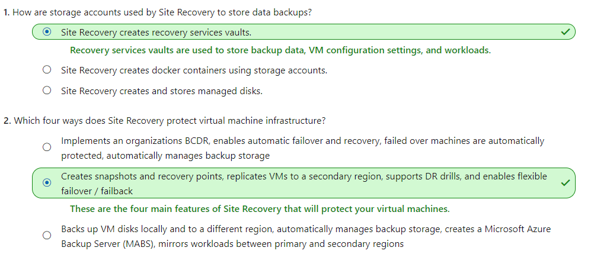

# [Protect your Azure infrastructure with Azure Site Recovery](https://docs.microsoft.com/en-au/learn/modules/protect-infrastructure-with-site-recovery/index)
- [Introduction](https://docs.microsoft.com/en-au/learn/modules/protect-infrastructure-with-site-recovery/1-introduction/)
- [What is Azure Site Recovery](https://docs.microsoft.com/en-au/learn/modules/protect-infrastructure-with-site-recovery/2-what-is-site-recovery/)
  - Snapshots and recovery points
    - **Crash-consistent recovery** represents the data **on-disk** at the time the snapshot is taken. The default for capturing snapshots is **every five minutes**.
    - **App-consistent recovery** captures the same data as crash-consistent but also includes **all in-memory data and in-process transactions**. Including the in-memory data means Site Recovery can restore a VM and any running apps without any data loss. The default for capturing snapshots is **every 60 minutes**.
    - All recovery points are kept for 24 hours by default, although you can extend this period to 72 hours.
  - Replication to a secondary region
    - Installing the Site **Recovery mobility service** happens when you enable replication for an **Azure VM**. 
      - The installed extension **registers the VM** with Site Recovery. 
      - **Continuous replication** of the VM then begins, with any writes to the disk immediately transferred to a local storage account. Site Recovery uses this account, replicating the cache to a storage account in the destination environment.
  - What is a Recovery Services vault?
    - A **Recovery Services vault** enables Azure Site Recovery to complete disaster recovery replication. These vaults use storage accounts to **store data backups, VM configuration settings, and workloads**.
  - What are the target resources?
    - Target resources are all the Azure services that are created once our existing resources replicate. There are a few considerations:
      - The **target resources** for Azure Site Recovery replication have to be in a **different Azure region**.
      - The **storage account** that stores the backed-up data must also be in a **different region** to the resources being protected.
      - The **target region** allows the creation of virtual machines and has enough resources to **match the size** of the existing VMs.
  - Configure **Outbound network connectivity** & URLs
    - Azure Site Recovery requires outbound connectivity on the virtual machines that we wish to replicate.
  - Update Azure VM root certificates
    - Every Azure VM we wish to replicate has to register with Azure Site Recovery.
    - For a VM to register, Azure Site Recovery requires the latest root certificates installed on the VM.
  - Configure Account permissions
    - **Site Recovery Contributor**:	A contributor has **full permissions**
    - **Site Recovery Operator**:	An operator has Permissions to run Recovery **failover and failback operations**
    - **Site Recovery Reader**
  - Azure Mobility Service
    - The mobility service works in partnership with Azure Site Recovery to keep an up-to-date cache of the VMs' data. The cache is replicated to the target environment's storage account. The replicated data will be used if Azure Site Recovery fails over the environment.
  - 
- [Prepare for disaster recovery with Azure Site Recovery](https://docs.microsoft.com/en-au/learn/modules/protect-infrastructure-with-site-recovery/3-site-recovery-setup/)
- [Exercise - Set up disaster recovery with Azure Site Recovery](https://docs.microsoft.com/en-au/learn/modules/protect-infrastructure-with-site-recovery/4-exercise-site-recovery-setup/)
- [Run a disaster recovery drill](https://docs.microsoft.com/en-au/learn/modules/protect-infrastructure-with-site-recovery/5-run-disaster-recovery-drill/)
  - A DR drill is vital to ensure the solution implemented meets the business continuity and disaster recovery (BCDR) requirements, and to check the replication works appropriately.
  - **Recovery time objective (RTO)** that indicates how long it takes to recover infrastructure.
  - **Recovery point objective (RPO)** The RPO defines the amount of data loss that is acceptable as a function of time.
  - **Why should you run a DR drill?**
    - A DR drill is vital to ensure the solution implemented meets the business continuity and disaster recovery (BCDR) requirements, and to check the replication works appropriately. Our DR drill, combined with RTO and RPO, needs to be tested thoroughly to ensure replication, failover, and recovery happen in the required timeframe.
    - For example, assume our RTO is an hour, and RPO is six hours. Our systems backed up every hour, that's an hour of lost data plus the additional hour to recover our systems.
    - Imagine our actual recovery time is five hours. Our systems are now close to being over six hours out of date, which means we'll be in breach of the BCDR RPO objective. Testing the actual time it takes to recover from failures can give us confidence that our systems follow our BCDR plans.
  - 
- [Exercise - Run a disaster recovery drill](https://docs.microsoft.com/en-au/learn/modules/protect-infrastructure-with-site-recovery/6-exercise-run-disaster-recovery-drill/)
- [Failover and failback using Azure Site Recovery](https://docs.microsoft.com/en-au/learn/modules/protect-infrastructure-with-site-recovery/7-failover-and-failback/)
  - 
- [Exercise - Failover and failback using Azure Site Recovery](https://docs.microsoft.com/en-au/learn/modules/protect-infrastructure-with-site-recovery/8-exercise-failover-and-failback/)
- [Summary](https://docs.microsoft.com/en-au/learn/modules/protect-infrastructure-with-site-recovery/9-summary/)
