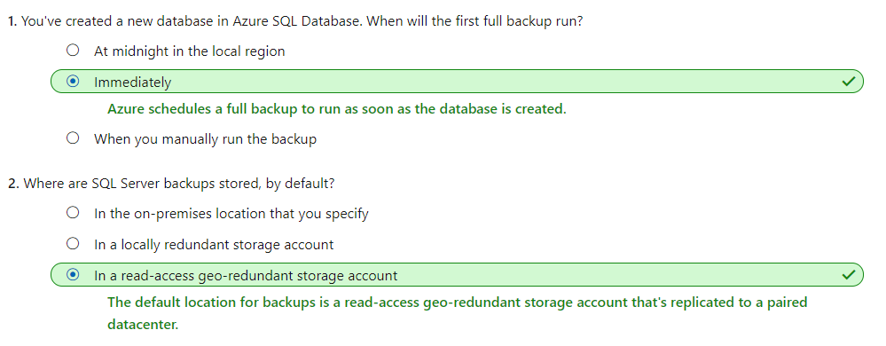
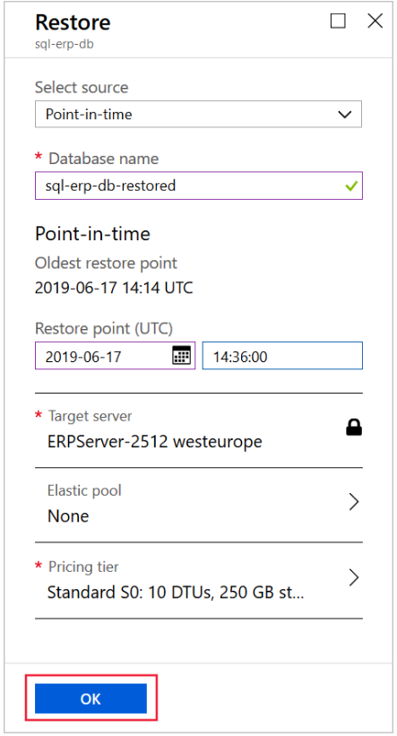

# [Back up and restore your Azure SQL database](https://docs.microsoft.com/en-au/learn/modules/backup-restore-azure-sql/index)
- [Introduction](https://docs.microsoft.com/en-au/learn/modules/backup-restore-azure-sql/1-introduction/)
- [Back up Azure SQL Database](https://docs.microsoft.com/en-au/learn/modules/backup-restore-azure-sql/2-protect-database-with-backup/)
  - Storage for Azure SQL Database backups
    - SQL Database automatically creates database backups. 
      - The backups are kept for 7 to 35 days. The retention time depends on the purchasing model and the service tier that you choose when you create your database. 
      - When the backups are complete, they're stored as blobs in a read-access **geo-redundant storage (RA-GRS)** account in your Azure subscription. To help protect against a datacenter outage, they're replicated to a paired datacenter.
  - Types of backups:
    - **Full backups**: In a full backup, everything in the database and the transaction logs is backed up. SQL Database makes a full backup **once a week**.
    - **Differential backups**: In a differential backup, everything that changed since the last full backup is backed up. SQL Database makes a differential backup **every 12 hours.**
    - **Transactional backups**: In a transactional backup, the contents of the transaction logs are backed up. SQL Database makes a transaction log backup **every 5 to 10 minutes**. Transactional backups enable administrators to restore up to a specific time, which includes the moment before data was mistakenly deleted.
  - Backups and service tiers
    |Service tier|	Default retention period|
    |---|---|
    |Basic|	1 week|
    |Standard|	5 weeks|
    |Premium|	5 weeks|
  - How often do backups happen?
    - There are backups for point-in-time restore, and there are backups for long-term retention.
    - SQL databases fully support point-in-time restore. They automatically create full backups, differential backups, and transaction log backups. 
    - The first full backup is **scheduled as soon as the database is created**. It usually finishes within 30 minutes, but it might take longer if the database is of significant size.
    - After the first full backup, all further backups are scheduled automatically and managed silently in the background. The SQL Database service **determines the exact timing of all database backups**, because it balances the overall system workload. You **can't change or disable** the backup jobs.
    - Full backups for LTR are **kept up to 10 years** in Azure Blob storage accounts. You can configure the LTR policy to perform automatic weekly full backups. The storage of LTR backups depends on the frequency and the retention period that you choose.
    - LTR takes the backups that are **automatically made for point-in-time** recovery and copies them to different blobs. This copy operation runs in the background at low priority to ensure that there's no impact on performance.
    - These backups **don't happen by default**. You must configure a policy to start and manage them.
    - How to write a long-term retention policy
      - `W`: Specifies that one full backup each week will be coped to long-term retention.
      - `M`: Specifies that one full backup from the first week of each month will be copied to long-term retention.
      - `Y`: Specifies that one full backup each year will be coped to long-term retention.
        - you can specify the week of the year when that backup is copied by using the `WeekOfYear` paramete
      - Example 
        - `W=0, M=0, Y=5, WeekOfYear=3`
          - This policy retains the third full backup of each year for 5 years.
        - `W=0, M=10, Y=0`
          - This policy retains the first full backup of each month for 10 months.
        - `W=12, M=0, Y=0`
          - This policy retains each weekly full backup for 12 weeks.
        - `W=4, M=12, Y=10, WeekOfYear=1`
          - This policy retains each weekly backup for 4 weeks. It also retains the first full backup of each month for 12 months. The first full backup taken in the first week of each year is retained for 10 years.
          - **W(eekly copy will be retained for)= 4(Weeks)**
          - **M(onthly copy will be retained for)=12(months)**
          - **Y(early copy of the first week of the year will be retained for)=1(year)**
    - 
- [Exercise - Configure backups for Azure SQL Database](https://docs.microsoft.com/en-au/learn/modules/backup-restore-azure-sql/3-exercise-configure-backup/)
- [Retain backup history with long-term retention policies](https://docs.microsoft.com/en-au/learn/modules/backup-restore-azure-sql/4-long-term-retention-policies/)
  - Long-term backup retention policies
    - For these requirements, use the long-term retention (LTR) feature. This way, you can store Azure SQL Database backups in read-access geo-redundant storage (RA-GRS) blobs for up to 10 years. 
- [Exercise - Configure long-term retention policies](https://docs.microsoft.com/en-au/learn/modules/backup-restore-azure-sql/5-exercise-configure-long-term-retention-policies/)
  ```powershell
  Set-AzSqlDatabaseBackupLongTermRetentionPolicy `
    -ServerName $sqlserver.ServerName `
    -DatabaseName sql-erp-db `
    -ResourceGroupName [sandbox resource group name] `
    -WeeklyRetention P8W `
    -MonthlyRetention P12M `
    -YearlyRetention P5Y `
    -WeekOfYear 1
  ```
- [Recover data by restoring an Azure SQL database](https://docs.microsoft.com/en-au/learn/modules/backup-restore-azure-sql/6-restore-database/)
  - How restore works
    - To complete a restore, Azure copies the database from the storage account to the Azure SQL Database server that you specify. In a point-in-time restore, SQL Database follows that by applying transaction logs to the restored database, up to the time you chose.
    - Perform a point-in-time restore
      - **Database replacement**. If you want to replace the original database with the restored one, make sure you specify the same compute size and service tier as the original. Then **rename the original database** and **give the restored database the original name** by using T-SQL `ALTER DATABASE` commands.
      - **Data recovery**. If you want to retrieve data from the restored database to mitigate an error, you don't need to rename the original and restored databases. Instead, use **T-SQL commands to extract the data that you need from the restored database**. Then insert the data into the original database.
- [Exercise - Recover data by restoring an Azure SQL database](https://docs.microsoft.com/en-au/learn/modules/backup-restore-azure-sql/7-exercise-restore-database/)
  - 
- [Summary](https://docs.microsoft.com/en-au/learn/modules/backup-restore-azure-sql/8-summary/)
  - [Overview of autoscale with Azure virtual machine scale sets](https://docs.microsoft.com/azure/virtual-machine-scale-sets/virtual-machine-scale-sets-autoscale-overview)
  - [Deploy your application on virtual machine scale sets](https://docs.microsoft.com/azure/virtual-machine-scale-sets/virtual-machine-scale-sets-deploy-app)
  - [Work with large virtual machine scale sets](https://docs.microsoft.com/azure/virtual-machine-scale-sets/virtual-machine-scale-sets-placement-groups)
  - [Use the custom script extension for Windows](https://docs.microsoft.com/azure/virtual-machines/extensions/custom-script-windows)
  - [Use the Azure custom script extension version 2 with Linux VMs](https://docs.microsoft.com/azure/virtual-machines/extensions/custom-script-linux)
  - [Use the application health extension with virtual machine scale sets](https://docs.microsoft.com/azure/virtual-machine-scale-sets/virtual-machine-scale-sets-health-extension)