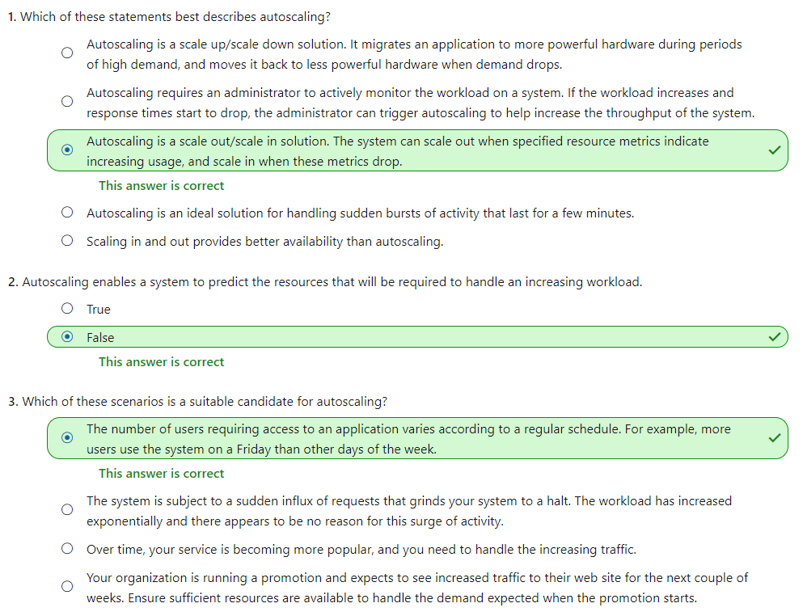
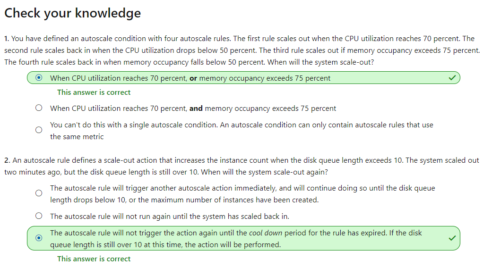

# [Dynamically meet changing web app performance requirements with autoscale rules](https://docs.microsoft.com/en-au/learn/modules/app-service-autoscale-rules/index)
- [Introduction](https://docs.microsoft.com/en-au/learn/modules/app-service-autoscale-rules/1-introduction/)
- [Identify suitable scenarios for autoscaling](https://docs.microsoft.com/en-au/learn/modules/app-service-autoscale-rules/2-identify-scenarios/)
- [Knowledge Check - Identify suitable scenarios for autoscaling](https://docs.microsoft.com/en-au/learn/modules/app-service-autoscale-rules/3-knowledge-check-identify-scenarios/)
  - 
- [Identify factors for implementing autoscaling](https://docs.microsoft.com/en-au/learn/modules/app-service-autoscale-rules/4-identify-factors/)
  - Metrics for autoscale rules
    - **CPU Percentage**. This metric is an indication of the CPU utilization across all instances. A high value shows that instances are becoming CPU-bound, which could cause delays in processing client requests.
    - **Memory Percentage**. This metric captures the memory occupancy of the application across all instances. A high value indicates that free memory could be running low, and could cause one or more instances to fail.
    - **Disk Queue Length**. This metric is a measure of the number of outstanding I/O requests across all instances. A high value means that disk contention could be occurring.
    - **Http Queue Length**. This metric shows how many client requests are waiting for processing by the web app. If this number is large, client requests might fail with HTTP 408 (Timeout) errors.
    - **Data In**. This metric is the number of bytes received across all instances.
    - **Data Out**. This metric is te number of bytes sent by all instances.
  - How an autoscale rule analyzes metric
    - In the first step, an autoscale rule aggregates the values retrieved for a metric for all instances across a period of time known as the **time grain**. Each metric has its own intrinsic time grain, but in most cases this period is 1 minute. The aggregated value is known as the **time aggregation**. The options available are **Average, Minimum, Maximum, Total, Last, and Count**.
    - An interval of one minute is a very short interval in which to determine whether any change in metric is long-lasting enough to make autoscaling worthwhile. So, an autoscale rule performs a second step that performs a further aggregation of the value calculated by the time aggregation over a longer, user-specified period, known as the **Duration**. The minimum Duration is 5 minutes. If the Duration is set to 10 minutes for example, the autoscale rule will aggregate the 10 values calculated for the time grain.
    - The **aggregation calculation** for the Duration can be **different** for that of the time grain. For example, if the time aggregation is **Average** and the statistic gathered is CPU **Percentage** across a one-minute time grain, each minute the average CPU percentage utilization across all instances for that minute will be calculated. If the **time grain** statistic is set to **Maximum**, and the **Duration** of the rule is set to 10 minutes, the **maximum** of the 10 average values for the CPU percentage utilization will be used to determine whether the rule threshold has been crossed.
  - Combining autoscale rules
    - A single autoscale condition can contain several autoscale rules (for example, a scale-out rule and the corresponding scale-in rule). However, the autoscale rules in an autoscale condition don't have to be directly related. You could define the following four rules in the same autoscale condition:
      - If the HTTP queue length exceeds 10, **scale out** by 1
      - If the CPU utilization exceeds 70%, **scale out** by 1
      - If the HTTP queue length is zero, **scale in** by 1
      - If the CPU utilization drops below 50%, **scale in** by 1
    - When determining whether to **scale out**, the autoscale action will be performed if **any** of the scale-out rules are met (HTTP queue length exceeds 10 **or** CPU utilization exceeds 70%). 
    - When **scaling in**, the autoscale action will run only if **all** of the scale-in rules are met (HTTP queue length drops to zero **and** CPU utilization falls below 50%). If you need to scale in if only one the scale-in rules are met, you **must define the rules in separate autoscale conditions**.
- [Knowledge Check - Identify factors for implementing autoscaling](https://docs.microsoft.com/en-au/learn/modules/app-service-autoscale-rules/5-knowledge-check-identify-factors/)
  - 
- [Autoscale a web app](https://docs.microsoft.com/en-au/learn/modules/app-service-autoscale-rules/6-autoscale-a-web-app/)
- [Exercise - Autoscale and monitor a web app](https://docs.microsoft.com/en-au/learn/modules/app-service-autoscale-rules/7-exercise-autoscale-a-web-app/)
- [Summary](https://docs.microsoft.com/en-au/learn/modules/app-service-autoscale-rules/8-summary/)
  - [Azure Autoscale](https://azure.microsoft.com/features/autoscale/)
  - [Best practices for Autoscale](https://docs.microsoft.com/azure/azure-monitor/platform/autoscale-best-practices)
  - [Overview of common autoscale patterns](https://docs.microsoft.com/azure/azure-monitor/platform/autoscale-common-scale-patterns)