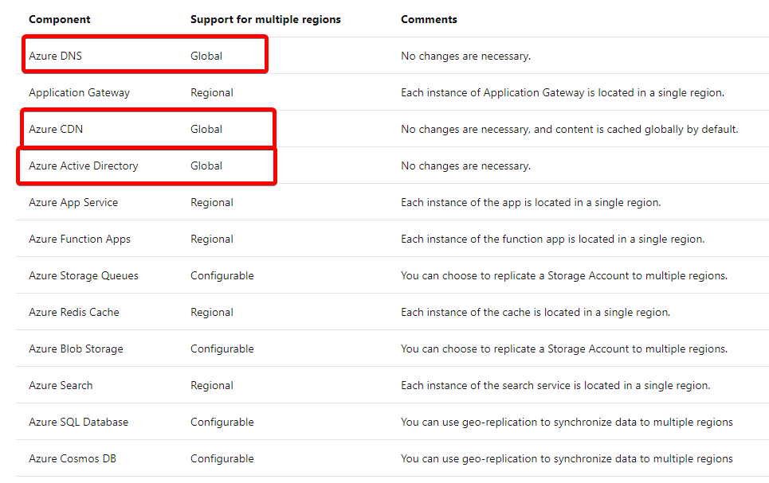
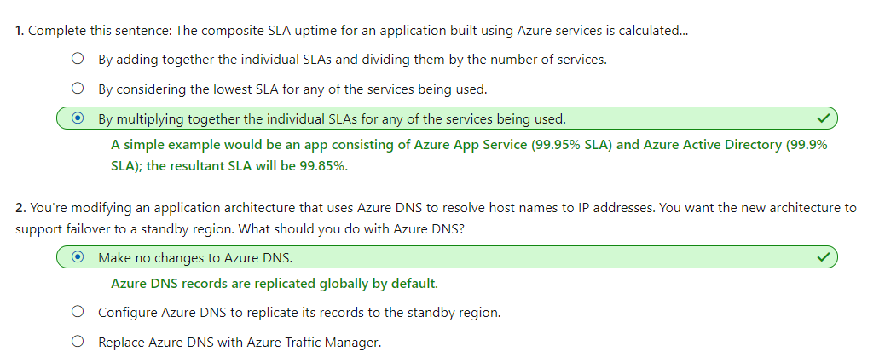
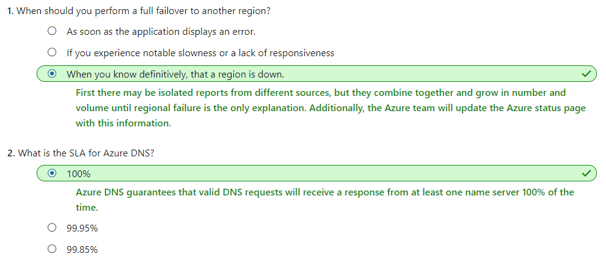
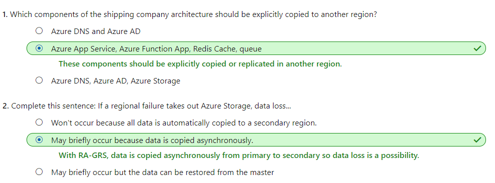
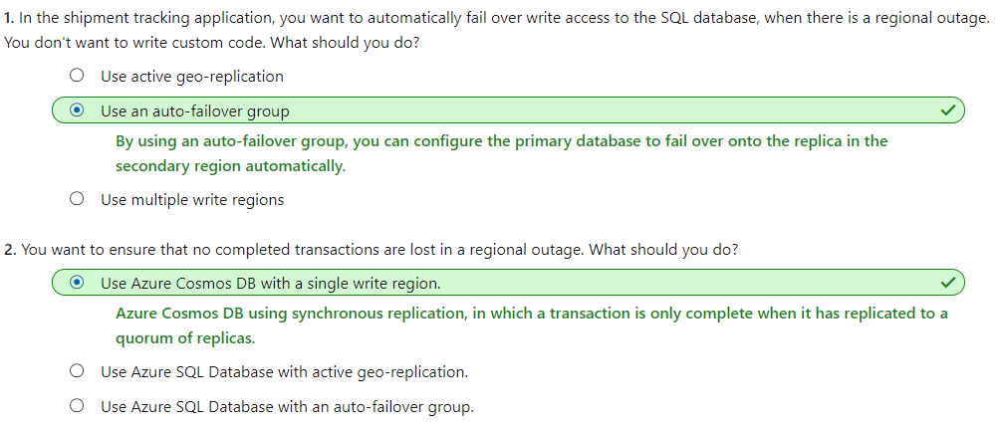

# [Design a geographically distributed application](https://docs.microsoft.com/en-au/learn/modules/design-a-geographically-distributed-application/index)
- [Introduction](https://docs.microsoft.com/en-au/learn/modules/design-a-geographically-distributed-application/1-introduction/)
- [Design a geographically distributed architecture](https://docs.microsoft.com/en-au/learn/modules/design-a-geographically-distributed-application/2-geo-distributed-architecture/)
  - Regional Pairs
    - An Azure region is an area with a single geography that contains one or more Azure datacenters. All regions pair with other regions in the same geography. Within these pairs, updates and planned maintenance are done on only one region at a time. If there's a failure that affects multiple regions, at least one region in each pair is prioritized for rapid recovery.
    - **The best practice is to place a two-region architecture for your app on the two regions in a regional pair**. As an example, East US pairs with West US. Our proposed design uses East US for its active region and West US for its standby region.
    - Networking
      - Azure DNS and Azure CDN are by default global systems and already resilient to regional failures. We'll leave them in place.
      - When we create an Azure **Application Gateway**, we assign the service to a single region. We'll remove this vulnerability by **replacing this service with Azure Front Door**. Front Door can poll multiple App Services and will handle the App Service failover from the East US region to the West US region.
    - 
    - 
- [Design a geographically distributed networking architecture](https://docs.microsoft.com/en-au/learn/modules/design-a-geographically-distributed-application/3-geo-distributed-networking/)
  - Azure DNS
    - The Azure DNS SLA also has a 100% guarantee that valid DNS requests will receive a response from at least one Azure DNS name server all the time.
  - Choose a traffic router
    - **Azure application gateway: regional**
    - **Azure Traffic Manager: global**
    - **Azure Front Door: global**
  - What is **Azure Traffic Manager**
    - Azure **Traffic Manager** is a global load balancer that uses **DNS** records to route traffic to destinations in multiple Azure regions.
    - By using **priority routing mode** it can execute the failover that ensures continuous service.
    - Because Traffic Manager uses the **DNS** system to route traffic, it routes any protocol, not just HTTP traffic. 
      - Traffic Manager **can't route or filter traffic based on HTTP** properties
        - such as client country codes or user-agent headers. 
      - It also **can't do Transport Layer Security (TLS) protocol termination**, where the router decrypts requests and encrypts responses to take that load off the App Service virtual servers. If we need either of these features, we'll have to use Azure Front Door.
  - What is **Azure Front Door**
    - Like Traffic Manager, Azure Front Door is a global load balancer. Unlike Traffic Manager, it works at the **network application layer, Layer 7**, and uses HTTP and HTTPS properties to do filtering and routing.
    - With Front Door, we can do many types of routing that Traffic Manager doesn't support. For example, we can route traffic based on the browser's country code. Front Door also supports **TLS protocol termination.**
    -  If we want to r**oute traffic for any protocol other than HTTP and HTTPS**, we'll have to use Traffic Manager.
    -  Front Door allows us to assign priorities to the various backends that make up the tracking portal. These priorities allow Front Door to route requests as needed. We'll assign our primary region services with a top priority and our secondary region service with a lower priority.
 -  
- [Design a geographically distributed application architecture](https://docs.microsoft.com/en-au/learn/modules/design-a-geographically-distributed-application/4-geo-distributed-app/)
  - 
- [Design a geographically distributed data architecture](https://docs.microsoft.com/en-au/learn/modules/design-a-geographically-distributed-application/5-geo-distributed-data/)
  - Azure SQL Database
    - To create a multi-region implementation of Azure SQL Database to store relational data, we can use either:
    - **Active geo-replication**
      - Azure SQL Database can automatically replicate a database and all its changes from one database to another with the active geo-replication feature. Only the primary logical server hosts a writable copy of the database. We can create up to four other logical servers that host **read-only copies** of the database.
      - **Managed instances** of Azure SQL Database **do not support** Active geo-replication.
    - **Auto failover groups**
      - An auto failover group is a group of databases where data replicates automatically from a primary to one or more secondary servers. This design is like active geo-replication and uses the same data replication method. However, we can automate the response to a failure by defining a **policy**.
      - If that happens, the West US replica automatically **becomes the writable primary database**, and full functionality is maintained.
      - Also, use auto failover groups if our database runs in a managed instance of Azure SQL Database.
  - Azure Cosmos DB
    - **Multi-region accounts with multiple write regions.**
      - In this mode, all copies of the database are writable at all times. If a region fails, no failover is necessary.
    - **Multi-region accounts with a single write region.**
      - In this mode, only the primary region contains writable databases. The data replicated to the secondary regions are read-only. Updates are disabled by default when the primary region fails. However, we can select enable automatic failover so that Cosmos DB automatically fails over the primary, writable copy of the database to another region.
    - In Cosmos DB, **data replication is synchronous.** When a change is applied, the transaction is not considered complete until replicated to a quorum of replicas. Then an acknowledgment is sent to the client. When a failure occurs, **no recent changes are lost** because replication has already occurred.
    - 
- [Summary](https://docs.microsoft.com/en-au/learn/modules/design-a-geographically-distributed-application/6-summary/)
  - [Improve scalability in an Azure web application](https://docs.microsoft.com/azure/architecture/reference-architectures/app-service-web-app/scalable-web-app)
  - [Run a web application in multiple Azure regions for high availability](https://docs.microsoft.com/azure/architecture/reference-architectures/app-service-web-app/multi-region)
  - [Business continuity and disaster recovery (BCDR): Azure Paired Regions](https://docs.microsoft.com/azure/best-practices-availability-paired-regions)
  - [Use auto failover groups to enable transparent and coordinated failover of multiple databases](https://docs.microsoft.com/azure/sql-database/sql-database-auto-failover-group#preventing-the-loss-of-critical-data)
  - [Global data distribution with Azure Cosmos DB - overview](https://docs.microsoft.com/azure/cosmos-db/distribute-data-globally)
  - [High availability with Azure Cosmos DB](https://docs.microsoft.com/azure/cosmos-db/high-availability)
