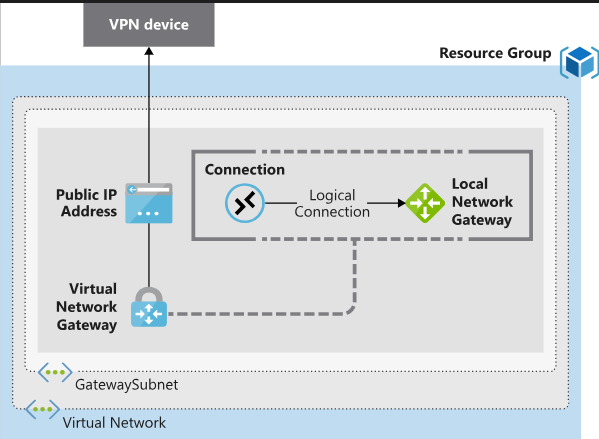
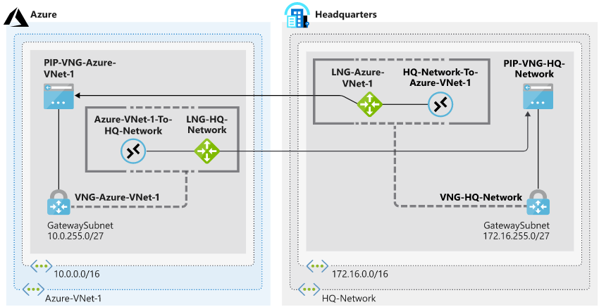

## [Connect your on-premises network to Azure with VPN Gateway](https://docs.microsoft.com/en-au/learn/modules/connect-on-premises-network-with-vpn-gateway/index)
- [Introduction](https://docs.microsoft.com/en-au/learn/modules/connect-on-premises-network-with-vpn-gateway/1-introduction)
- [Connect on-premises networks to Azure by using site-to-site VPN gateways](https://docs.microsoft.com/en-au/learn/modules/connect-on-premises-network-with-vpn-gateway/2-connect-on-premises-networks-to-azure-using-site-to-site-vpn-gateways)
  - Azure VPN gateways
    - A VPN gateway is a type of Virtual Network Gateway. VPN gateways are deployed in Azure virtual networks and enable the following connectivity:
  	  - Connect on-premises datacenters to Azure virtual networks through a **site-to-site** connection.
  	  - Connect individual devices to Azure virtual networks through a **point-to-site** connection.
  	  - Connect Azure virtual networks to other Azure virtual networks through a **network-to-network** connection.
	  - You can deploy only one VPN gateway in each virtual network, but you can use one gateway to connect to multiple locations.
   - VPN type
     - Policy-based VPNs
       - Support for IKEv1 only.
       - For compatibility with legacy on-premises VPN devices.
     - Route-based VPNs
       - Supports IKEv2.
     - Both types of VPN gateways (route-based and policy-based) in Azure use **pre-shared key** as the only method of authentication. 

  - Deploying VPN gateways
    - Required Azure resources
      - **Virtual network**. Deploy an Azure virtual network with enough address space for the additional subnet that you'll need for the VPN gateway. The address space for this virtual network must not overlap with the on-premises network that you'll be connecting to. Remember that you can deploy only one VPN gateway within a virtual network.
      
      - **GatewaySubnet**. Deploy a subnet called GatewaySubnet for the VPN gateway. Use at least a /27 address mask to make sure you have enough IP addresses in the subnet for future growth. You can't use this subnet for any other services.
      
      - **Public IP address**. 

      - **Local network gateway**. Create a local network gateway to define the on-premises network's configuration: where the VPN gateway will connect and what it will connect to. This configuration includes the on-premises VPN device's public IPv4 address and the on-premises routable networks. This information is used by the VPN gateway to route packets that are destined for on-premises networks through the IPSec tunnel.

      - **Virtual network gateway**. Create the virtual network gateway to route traffic between the virtual network and the on-premises datacenter or other virtual networks. The virtual network gateway can be either a VPN or ExpressRoute gateway, but this module deals only with VPN virtual network gateways.

      - **Connection**. Create a Connection resource to create a logical connection between the VPN gateway and the local network gateway.

        - The **connection** is made to the on-premises VPN device's IPv4 address as defined by the local network gateway.
        - The **connection** is made from the virtual network gateway and its associated public IP address.
    - Required on-premises resources
      - A **VPN device** that supports policy-based or route-based VPN gateways
      - A **public-facing** (internet-routable) IPv4 address

    
- High availability scenarios
  - Active/standby
    - By default, VPN gateways are deployed as two instances in an active/standby configuration, even if you only see one VPN gateway resource in Azure. 
  - Active/active
    - With the introduction of support for the BGP routing protocol, you can also deploy VPN gateways in an active/active configuration. In this configuration, you assign a unique public IP address to each instance.
  - ExpressRoute failover
    - Another high availability option is to configure a VPN gateway as a secure failover path for ExpressRoute connections.
  - Zone-redundant gateways
    - In regions that support availability zones, VPN and ExpressRoute gateways can be deployed in a zone-redundant configuration.

- [Exercise - Prepare Azure and on-premises virtual networks by using Azure CLI commands](https://docs.microsoft.com/en-au/learn/modules/connect-on-premises-network-with-vpn-gateway/3-exercise-prepare-azure-and-on-premises-vnets-using-azure-cli-commands)
  - 
  - Create the Azure-side resources
    - Add **Vnet** as Azure Vnet
        ```
        az network vnet create \
            --resource-group [sandbox resource group name] \
            --name Azure-VNet-1 \
            --address-prefix 10.0.0.0/16 \
            --subnet-name Services \
            --subnet-prefix 10.0.0.0/24
        ```
    - Add **GatewaySubnet** for in the Vnet
        ```
        az network vnet subnet create \
          --resource-group [sandbox resource group name] \
          --vnet-name Azure-VNet-1 \
          --address-prefix 10.0.255.0/27 \
          --name GatewaySubnet
        ```
    - Add **gateway** represents the on premises network
        ```
          az network local-gateway create \
          --resource-group [sandbox resource group name] \
          --gateway-ip-address 94.0.252.160 \
          --name LNG-HQ-Network \
          --local-address-prefixes 172.16.0.0/16
        ```
  - Create the simulated on-premises network and supporting resources
    - Add Vnet
      ```
      az network vnet create \
        --resource-group [sandbox resource group name] \
        --name HQ-Network \
        --address-prefix 172.16.0.0/16 \
        --subnet-name Applications \
        --subnet-prefix 172.16.0.0/24
      ```
    - Add Gatewaysubnet 
      ```
        az network vnet subnet create \
          --resource-group [sandbox resource group name] \
          --address-prefix 172.16.255.0/27 \
          --name GatewaySubnet \
          --vnet-name HQ-Network
      ```
    - Add gateway represents the Azure Vnet
      ```
        az network local-gateway create \
          --resource-group [sandbox resource group name] \
          --gateway-ip-address 94.0.252.160 \
          --name LNG-Azure-VNet-1 \
          --local-address-prefixes 10.0.0.0/16
      ```
    - At the end we would have
      - 

- [Exercise - Create a site-to-site VPN gateway by using Azure CLI commands](https://docs.microsoft.com/en-au/learn/modules/connect-on-premises-network-with-vpn-gateway/4-exercise-create-a-site-to-site-vpn-gateway-using-azure-cli-commands)
  - Create the VPN gateway and PIP
    - Create PIP for Azure 
    - Crate VPN gateway for Azure vnet
      ```
      az network vnet-gateway create \
        --resource-group [sandbox resource group name] \
        --name VNG-Azure-VNet-1 \
        --public-ip-address PIP-VNG-Azure-VNet-1 \
        --vnet Azure-VNet-1 \
        --gateway-type Vpn \
        --vpn-type RouteBased \
        --sku VpnGw1 \
        --no-wait
      ```
    - Create PIP for on-premises Vnet 
    - Crate VPN gateway for on-premises vnet
      ```
      az network vnet-gateway create \
          --resource-group [sandbox resource group name] \
          --name VNG-HQ-Network \
          --public-ip-address PIP-VNG-HQ-Network \
          --vnet HQ-Network \
          --gateway-type Vpn \
          --vpn-type RouteBased \
          --sku VpnGw1 \
          --no-wait
      ```
    - Update the LNG-HQ-Network local network gateway so that it points to the public IP address attached to the VNG-HQ-Network virtual network gateway. Because we are using placholders when creating the local gateway
      ```
      az network local-gateway update \
        --resource-group [sandbox resource group name] \
        --name LNG-HQ-Network \
        --gateway-ip-address $PIPVNGHQNETWORK
      ```
  - Create the connections
    - Create the shared key to use for the connections. In the following command, replace <shared key> with a text string to use for the IPSec pre-shared key. The pre-shared key is a string of printable ASCII characters no longer than 128 characters. You'll use this pre-shared key on both connections.
      ```
        az network vpn-connection create \
        --resource-group [sandbox resource group name] \
        --name Azure-VNet-1-To-HQ-Network \
        --vnet-gateway1 VNG-Azure-VNet-1 \
        --shared-key $SHAREDKEY \
        --local-gateway2 LNG-HQ-Network
      ```
    - Run this command in Cloud Shell to create a connection from VNG-Azure-VNet-1 to LNG-HQ-Network.
      ```
        az network vpn-connection create \
          --resource-group [sandbox resource group name] \
          --name HQ-Network-To-Azure-VNet-1  \
          --vnet-gateway1 VNG-HQ-Network \
          --shared-key $SHAREDKEY \
          --local-gateway2 LNG-Azure-VNet-1
      ```
    - Run this command in Cloud Shell to create a connection from VNG-HQ-Network to LNG-Azure-VNet-1.This connection would normally be created from your on-premises device.
      ```
        az network vpn-connection create \
          --resource-group [sandbox resource group name] \
          --name HQ-Network-To-Azure-VNet-1  \
          --vnet-gateway1 VNG-HQ-Network \
          --shared-key $SHAREDKEY \
          --local-gateway2 LNG-Azure-VNet-1
      ```
  - Verification steps
    - using `az network vpn-connection show`
- [Summary](https://docs.microsoft.com/en-au/learn/modules/connect-on-premises-network-with-vpn-gateway/5-summary)


``` js
var str = ""
$("a.is-block").each(function( index ) {
  if(this.innerText){
    if(!$(this).hasClass("unit-title")){
      str = str + "# [";
    }else{
      str = str + "- [";
    }
    str = str + this.innerText + "](" + this.href + ")\n";
  }
});
console.log(str)
```