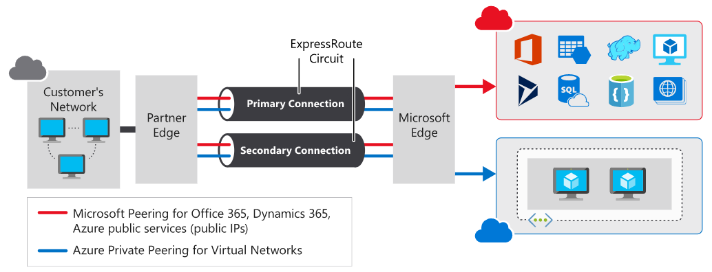
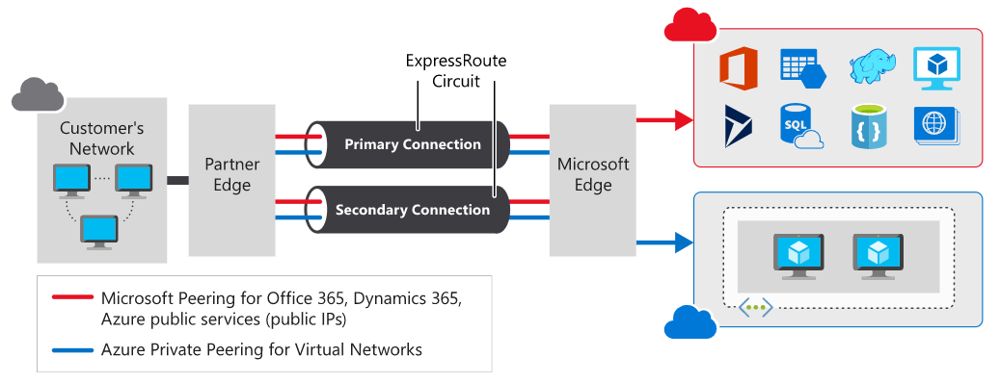
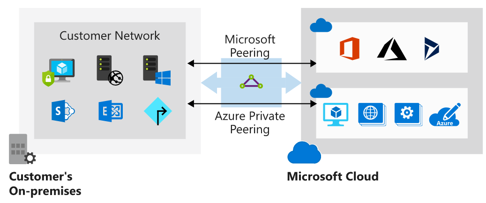
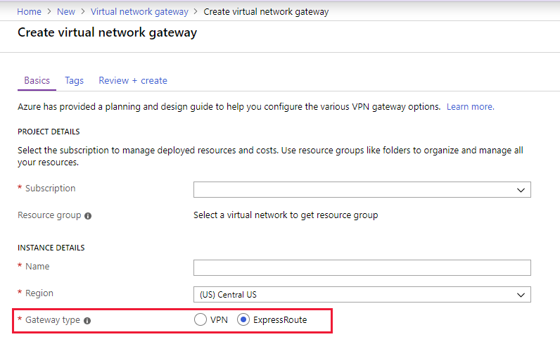

## [Connect your on-premises network to the Microsoft global network by using ExpressRoute](https://docs.microsoft.com/en-au/learn/modules/connect-on-premises-network-with-expressroute/index)

- [Introduction](https://docs.microsoft.com/en-au/learn/modules/connect-on-premises-network-with-expressroute/1-introduction)
  
- [What is the Azure ExpressRoute service?](https://docs.microsoft.com/en-au/learn/modules/connect-on-premises-network-with-expressroute/2-expressroute-service)
- ExpressRoute overview
    - Establishing an ExpressRoute connection enables you to connect to Microsoft cloud services like Azure, Office 365, and Dynamics 365. 
    - Security is enhanced, connections are more reliable, latency is minimal, and throughput is greatly increased.
    - 
  - Features and benefits of ExpressRoute
    - **Layer 3 connectivity**
      - **CloudExchange co-location/virtual cross-connections**
        - Co-located providers can normally offer both Layer 2 and Layer 3 connections between your infrastructure, which might be located in the co-location facility, and the Microsoft cloud. For example, if your datacenter is co-located at a cloud exchange such as an internet service provider (ISP), you can request a virtual cross-connection to the Microsoft cloud.
      - **Point-to-point Ethernet connection**
        - datacenter to Azure
        - Point-to-point connections provide Layer 2 and Layer 3 connectivity between your on-premises site and Microsoft Azure. You can connect your offices or datacenters to Azure by using the point-to-point links. For example, if you have an on-premises datacenter, you can use a point-to-point Ethernet link to connect to Microsoft.
      - **Any-to-any connection**
        - WAN to Azure
        - With point-to-point connectivity, you can integrate your wide area network (WAN) with Microsoft Azure by providing connections to your offices and datacenters. Azure will integrate with your WAN connection to provide a seamless connection, just like you would have between your datacenter and any branch offices.
    - **Built-in redundancy**
      - Each connectivity provider uses redundant devices to ensure that connections established with Microsoft are highly available.
    - **Connectivity to Microsoft cloud services**
      - ExpressRoute enables direct access to the following services in all regions.
    - Across on-premises connectivity with **ExpressRoute Global Reach**
      - You can enable ExpressRoute Global Reach to exchange data across your on-premises sites by connecting your ExpressRoute circuits. 
      - For example, assume that you have a private datacenter in California connected to ExpressRoute in Silicon Valley. You have another private datacenter in Texas connected to ExpressRoute in Dallas. With ExpressRoute Global Reach, you can connect your private datacenters through two ExpressRoute circuits. Your cross-datacenter traffic will travel through the Microsoft network.
    - **Dynamic routing**
      - ExpressRoute uses the Border Gateway Protocol (BGP) routing protocol.

- [How Azure ExpressRoute works](https://docs.microsoft.com/en-au/learn/modules/connect-on-premises-network-with-expressroute/3-how-expressroute-works)
  - Architecture of ExpressRoute
    - ExpressRoute works by peering your on-premises networks with networks running in the Microsoft cloud. Resources on your networks can communicate directly with resources hosted by Microsoft. 
    - ExpressRoute is supported across all regions and locations. 
    - To implement ExpressRoute, you need to work with an ExpressRoute partner. The partner provides the edge service: an authorized and authenticated connection that operates through a partner-controlled router. The edge service is responsible for extending your network to the Microsoft cloud.
    - The partner sets up connections to an endpoint in an ExpressRoute location (implemented by a Microsoft edge router). These connections enable you to peer your on-premises networks with the virtual networks available through the endpoint. These connections are called circuits.
    - A **circuit** provides a **physical connection** for transmitting data through the **ExpressRoute provider's edge routers** to the **Microsoft edge routers**. A circuit is established across a private wire rather than the public internet. Your on-premises network is connected to the ExpressRoute provider's edge routers. The Microsoft edge routers provide the entry point to the Microsoft cloud.
    - 
  - ExpressRoute supports two peering schemes:
    - Use **private peering** to connect to Azure IaaS and PaaS services deployed inside Azure virtual networks. The resources that you access must all be located in one or more Azure virtual networks with private IP addresses. You can't access resources through their public IP address over a private peering.
    - Use **Microsoft peering** to connect to Azure PaaS services, Office 365 services, and Dynamics 365.
    - 
  - Create an ExpressRoute circuit and peering
    - Create a circuit
      - When you're using the Azure portal, select Create a resource > Networking > ExpressRoute. 
          |Property	|Value|
          | ----------- | ----------- |
          |Circuit name	|A meaningful name for your circuit, without any white space or special characters.|
          |Provider	|The ExpressRoute provider with which you've registered your subscription.|
          |Peering location	|A location enabled by the ExpressRoute provider in which to create your circuit.|
          |Bandwidth	|Select your bandwidth, from 50 Mbps up to 10 Gbps. Start with a low value. You can increase it later with no interruption to service. However, you can't reduce the bandwidth if you set it too high initially.|
          |SKU	|Select **Standard** if you have up to 10 virtual networks and only need to connect to resources in the same geopolitical region. Otherwise, select **Premium**.|
          |**Billing** model	|Select **Unlimited** to pay a flat fee regardless of usage. Or select **Metered** to pay according to the volume of traffic that enters and exits the circuit.|
          |Subscription|	The subscription you've registered with your ExpressRoute provider.|
          |Resource group|	The Azure resource group in which to create the circuit.|
          |Location|	The Azure location in which to create the circuit.|
    - Create a peering configuration
      - Configure private peering
      - Configure Microsoft peering
  - Connect a virtual network to an ExpressRoute circuit
    - You must create the virtual network gateway by using the type **ExpressRoute** and not **VPN**.
    - 
  - High availability and failover with ExpressRoute
    - Consider setting up ExpressRoute circuits in different peering locations to provide high availability and help protect against a regional outage.
    - For example, you might create circuits in the US East and US Central regions and connect these circuits to your virtual network. This way, if one ExpressRoute circuit goes down, you won't lose connectivity to your resource and you can fail over the connection to another ExpressRoute circuit.
    - You can also have multiple circuits across different providers to ensure that your network stays available even if an outage affects all circuits from a single approved provider. You can set the Connection Weight property to prefer one circuit to another.

- [When to choose Azure ExpressRoute](https://docs.microsoft.com/en-au/learn/modules/connect-on-premises-network-with-expressroute/4-choose-expressroute)
  - When to use Azure ExpressRoute
    - Low-latency connectivity to services in the cloud. 
    - Accessing high-volume systems in the cloud that consume or produce massive volumes of data quickly. 
    - Consuming Microsoft Cloud Services, such as Office 365 and Dynamics 365. 
    - Organizations that have migrated large-scale on-premises systems to Azure. 
    - Situations where data should not traverse the public internet for security reasons.
    - Large datacenters, with a high number of users and systems accessing SaaS offerings.
  - Benefits of using ExpressRoute
    - Predictable performance
    - Data privacy for your traffic
    - High-throughput, low-latency connectionsAvailability and connectivity
  - Alternatives to ExpressRoute    
    - Site-to-site VPN
      - An Azure site-to-site VPN connection enables you to connect your on-premises network to Azure over an IPsec tunnel to build a hybrid network solution.
    - Point-to-site VPN
      - With point-to-site VPN, you can establish a secure connection to a network from individual computers located on-premises.
    - 
- [Summary](https://docs.microsoft.com/en-au/learn/modules/connect-on-premises-network-with-expressroute/5-summary)
- Learn more
  - For more information on ExpressRoute, see the following articles on Microsoft Docs:
    - [Azure ExpressRoute for Office 365](https://docs.microsoft.com/office365/enterprise/azure-expressroute)
    - [ExpressRoute routing requirements](https://docs.microsoft.com/azure/expressroute/expressroute-routing)
    - [ExpressRoute partners and peering locations](https://docs.microsoft.com/azure/expressroute/expressroute-locations-provider)
    - [Create and modify an ExpressRoute circuit using PowerShell](https://docs.microsoft.com/azure/expressroute/expressroute-howto-circuit-arm)
    - [Create and modify an ExpressRoute circuit using CLI](https://docs.microsoft.com/azure/expressroute/howto-circuit-cli)
    - [About ExpressRoute Direct](https://docs.microsoft.com/azure/expressroute/expressroute-erdirect-about)

