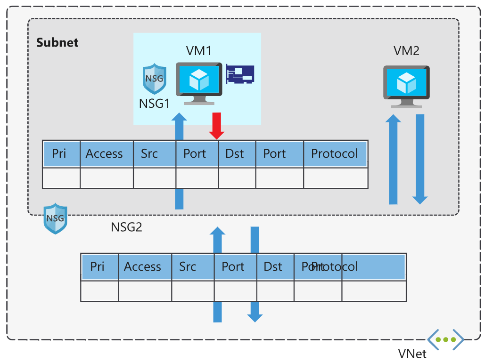

## [Secure and isolate access to Azure resources by using network security groups and service endpoints](https://docs.microsoft.com/en-au/learn/modules/secure-and-isolate-with-nsg-and-service-endpoints/index)
- [Introduction](https://docs.microsoft.com/en-au/learn/modules/secure-and-isolate-with-nsg-and-service-endpoints/1-introduction)
- [Use network security groups to control network access](https://docs.microsoft.com/en-au/learn/modules/secure-and-isolate-with-nsg-and-service-endpoints/2-network-security-groups)
  - Network security groups
    - Network security groups filter network traffic to and from Azure resources. 
    - Network security groups contain **security rules** that you configure to allow or deny inbound and outbound traffic. 
    - You can use network security groups to filter traffic between virtual machines or subnets, both within a virtual network and from the internet.
  - Network security group assignment and evaluation
    - Network security groups are assigned to a **network** interface or a **subnet**. 
    - When you assign a network security group to a subnet, the rules apply to **all network interfaces** in that subnet. 
    - Each network security group is evaluated independently.
      - Inbound traffic is 
        - first evaluated by the NSG applied to the subnet 
        - then by the NSG applied to the network interface. 
      - Outbound traffic from a virtual machine is 
        - first evaluated by the NSG applied to the network interface
        - and then by the NSG applied to the subnet.
      - 
    - Each subnet and network interface can have one network security group applied to it. 
    - Network security groups support TCP, UDP, and ICMP, and operate at Layer 4 of the OSI model.
  - Security rules
    - properties
      - Name:	A unique name within the network security group.
      - Priority:	A number between 100 and 4096.
      - Source or destination:	Any, or an individual IP address, classless inter-domain routing (CIDR) block (10.0.0.0/24, for example), service tag, or application security group.
      - Protocol:	TCP, UDP, or Any.
      - Direction:	Whether the rule applies to inbound, or outbound traffic.
      - Port range:	An individual port or range of ports.
      - Action:	Allow or deny the traffic.
    - priority
      - Network security group security rules are evaluated by priority **from small to large number**, using the 5-tuple information (source, source port, destination, destination port, and protocol) to allow or deny the traffic. 
      - **When the conditions for a rule match the device configuration, rule processing stops.** 
    - Stateful connections
      - Return traffic is automatically allowed for the same TCP/UDP session. For example, an inbound rule allowing traffic on port 80 also allows the virtual machine to respond to the request (typically on an ephemeral port). You don't need a corresponding outbound rule.
    - Default security rules
      - These default rules allow connectivity within a virtual network and from Azure load balancers. 
      - They also allow outbound communication to the internet, and deny inbound traffic from the internet.
    - Augmented security rules
      - **multiple IP addresses**
      - **multiple ports**
      - **service tags**
        - Service tags represent a group of IP addresses, and help simplify the configuration of your security rules. 
        - Service tags simplify security for virtual machines and Azure virtual networks, by allowing you to restrict access by resources or services. 
        - **Microsoft manages the service tags (you can't create your own)**
          - VirtualNetwork - This tag represents all virtual network addresses anywhere in Azure, and in your on-premises network if you're using hybrid connectivity.
          - AzureLoadBalancer - This tag denotes Azure's infrastructure load balancer. The tag translates to the virtual IP address of the host (168.63.129.16) where Azure health probes originate.
          - Internet - This tag represents anything outside the virtual network address that is publicly reachable, including resources that have public IP addresses. One such resource is the Web Apps feature of Azure App Service.
          - AzureTrafficManager - This tag represents the IP address for Azure Traffic Manager.
          - Storage - This tag represents the IP address space for Azure Storage. You can specify whether traffic is allowed or denied. You can also specify if access is allowed only to a specific region, but you can't select individual storage accounts.
          - SQL - This tag represents the address for Azure SQL Database, Azure Database for MySQL, Azure Database for PostgreSQL, and Azure SQL Data Warehouse services. You can specify whether traffic is allowed or denied, and you can limit to a specific region.
          - AppService - This tag represents address prefixes for Azure App Service.
      - **application security groups**
        - An application security group allows you to group network interfaces together. You can then use that application security group as a source or destination rule within a network security group.
        - 

- [Exercise - Create and manage network security groups](https://docs.microsoft.com/en-au/learn/modules/secure-and-isolate-with-nsg-and-service-endpoints/3-exercise-network-security-groups)
- [Secure network access to PaaS services with virtual network service endpoints](https://docs.microsoft.com/en-au/learn/modules/secure-and-isolate-with-nsg-and-service-endpoints/4-vnet-service-endpoints)
- [Exercise - Restrict access to Azure Storage by using service endpoints](https://docs.microsoft.com/en-au/learn/modules/secure-and-isolate-with-nsg-and-service-endpoints/5-exercise-vnet-service-endpoints)
- [Summary](https://docs.microsoft.com/en-au/learn/modules/secure-and-isolate-with-nsg-and-service-endpoints/6-summary)