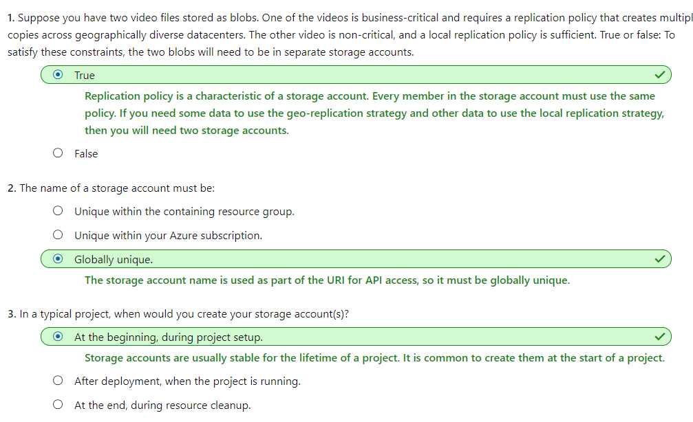

# [Create an Azure Storage account](https://docs.microsoft.com/en-au/learn/modules/create-azure-storage-account/index)
- [Introduction](https://docs.microsoft.com/en-au/learn/modules/create-azure-storage-account/1-introduction)
- [Decide how many storage accounts you need](https://docs.microsoft.com/en-au/learn/modules/create-azure-storage-account/2-decide-how-many-storage-accounts-you-need)
  - What is Azure Storage?
    - Azure Storage
      - These four were given special treatment because they are all primitive, cloud-based storage services and are often used together in the same application.
        - Azure Blobs
        - Azure Files
        - Azure Queues
        - Azure Tables
  - What is a storage account?
    - A storage account is a container that groups a set of Azure Storage services together.
  - Storage account settings
    - **Location**: The datacenter that will store the services in the account.
    - **Performance**: Determines the data services you can have in your storage account and the type of hardware disks used to store the data. 
      - **Standard** allows you to have any data service (Blob, File, Queue, Table) and uses magnetic disk drives. 
      - **Premium** limits you to one specific type of blob called a page blob and uses solid-state drives (SSD) for storage.
    - **Replication**
      - locally-redundant storage (LRS)
      - geo-redundant storage (GRS)
      - ...
    - Access tier: Hot Cool Archive
  - How many storage accounts do you need?
    - The number of storage accounts you need is typically determined by your data diversity, cost sensitivity, and tolerance for management overhead.
      - Data diversity
        - Organizations often generate data that differs in where it is consumed, how sensitive it is, which group pays the bills, etc. Diversity along any of these vectors can lead to multiple storage accounts. 
      - Cost sensitivity
        - A storage account by itself has no financial cost; however, the settings you choose for the account do influence the cost of services in the account. Geo-redundant storage costs more than locally-redundant storage. Premium performance and the Hot access tier increase the cost of blobs.
        - You can use multiple storage accounts to reduce costs. 
    - Tolerance for management overhead
      - Each storage account requires some time and attention from an administrator to create and maintain. It also increases complexity for anyone who adds data to your cloud storage; everyone in this role needs to understand the purpose of each storage account so they add new data to the correct account.

- [Choose your account settings](https://docs.microsoft.com/en-au/learn/modules/create-azure-storage-account/3-choose-your-account-settings)
  - **Name**
    - The name must be globally unique within Azure,
  - **Deployment model**
    - A deployment model is the system Azure uses to organize your resources. The model defines the API that you use to create, configure, and manage those resources. Azure provides two deployment models:
    - **Resource Manager(Recommended)**: the current model that uses the Azure Resource Manager API
	- **Classic**: a legacy offering that uses the Azure Service Management API
  - **Account kind**
    - Storage account kind is a set of policies that determine which data services you can include in the account and the pricing of those services. There are three kinds of storage accounts:
    	- **StorageV2 (general purpose v2) (Recommended)**: the current offering that supports all storage types and all of the latest features
    	- **Storage (general purpose v1)**: a legacy kind that supports all storage types but may not support all features
    	- **Blob storage**: a legacy kind that allows only block blobs and append blobs

- [Choose an account creation tool](https://docs.microsoft.com/en-au/learn/modules/create-azure-storage-account/4-choose-an-account-creation-tool)
- [Exercise - Create a storage account using the Azure portal](https://docs.microsoft.com/en-au/learn/modules/create-azure-storage-account/5-exercise-create-a-storage-account)
- [Knowledge check - Create a storage account](https://docs.microsoft.com/en-au/learn/modules/create-azure-storage-account/6-knowledge-check)
  - 
- [Summary](https://docs.microsoft.com/en-au/learn/modules/create-azure-storage-account/7-summary)
